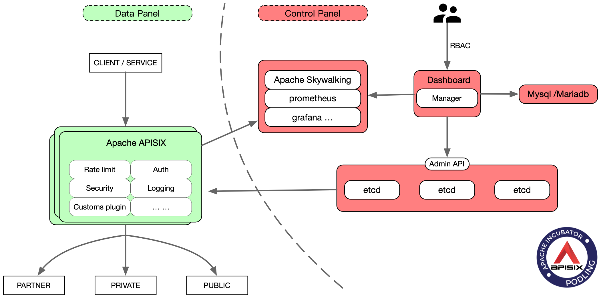
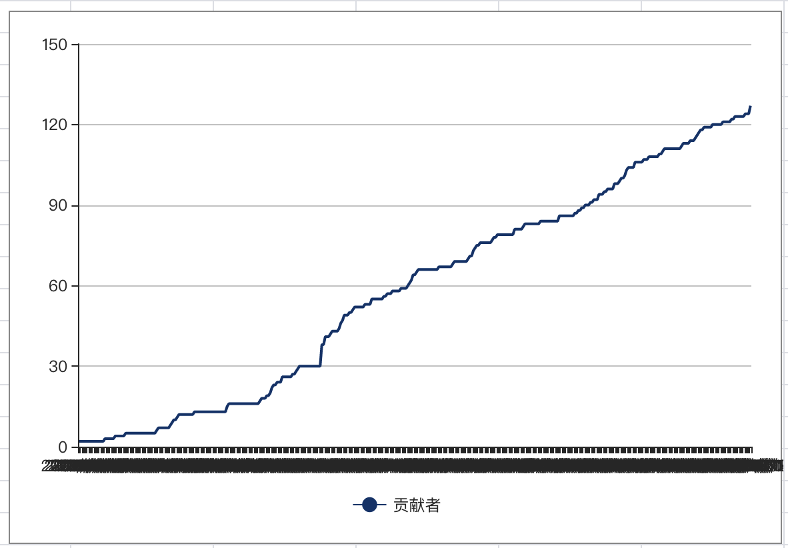

<!--
#
# Licensed to the Apache Software Foundation (ASF) under one or more
# contributor license agreements.  See the NOTICE file distributed with
# this work for additional information regarding copyright ownership.
# The ASF licenses this file to You under the Apache License, Version 2.0
# (the "License"); you may not use this file except in compliance with
# the License.  You may obtain a copy of the License at
#
#     http://www.apache.org/licenses/LICENSE-2.0
#
# Unless required by applicable law or agreed to in writing, software
# distributed under the License is distributed on an "AS IS" BASIS,
# WITHOUT WARRANTIES OR CONDITIONS OF ANY KIND, either express or implied.
# See the License for the specific language governing permissions and
# limitations under the License.
#
-->

# Apache APISIX

[](https://github.com/apache/apisix/actions)
[](https://github.com/apache/apisix/blob/master/LICENSE)

<p align="center">
  <a href="https://github.com/apache/apisix">English</a> •
  <a href="https://github.com/apache/apisix/blob/master/README_CN.md">中文</a>
</p>

<p align="center">
  <a href="https://apisix.apache.org/">Website</a> •
  <a href="https://github.com/apache/apisix/tree/master/doc">Docs</a> •
  <a href="https://github.com/apache/apisix-dashboard">Dashboard</a> •
  <a href="https://twitter.com/apacheapisix">Twitter</a>
</p>

## What's Apache APISIX?

Apache APISIX is a dynamic, real-time, high-performance API gateway, based on the Nginx library and etcd.

APISIX provides rich traffic management features such as load balancing, dynamic upstream, canary release, circuit breaking, authentication, observability, and more.

You can use Apache APISIX to handle traditional north-south traffic,
as well as east-west traffic between services.
It can also be used as a k8s ingress controller.

The technical architecture of Apache APISIX:



## Contents

- [Features](#features)
- [Documentation](#documentation)
- [Get Started](#get-started)
- [Benchmark](#benchmark)
- [Apache APISIX vs Kong](#apache-apisix-vs-kong)
- [Community](#community)
- [Videos And Articles](#videos-and-articles)
- [User Stories](#user-stories)
- [Who Uses APISIX?](#who-uses-apisix)
- [Landscape](#landscape)
- [Logos](#logos)
- [Contributing](#contributing)
- [Acknowledgments](#acknowledgments)
- [License](#license)

## Features

You can use Apache APISIX as a traffic entrance to process all business data, including dynamic routing, dynamic upstream, dynamic certificates,
A/B testing, canary release, blue-green deployment, limit rate, defense against malicious attacks, metrics, monitoring alarms, service observability, service governance, etc.

- **All platforms**

  - Cloud-Native: Platform agnostic, No vendor lock-in, APISIX can run from bare-metal to Kubernetes.
  - Run Environment: Both OpenResty and Tengine are supported.
  - Supports ARM64: Don't worry about the lock-in of the infra technology.

- **Multi protocols**

  - [TCP/UDP Proxy](doc/stream-proxy.md): Dynamic TCP/UDP proxy.
  - [Dynamic MQTT Proxy](doc/plugins/mqtt-proxy.md): Supports to load balance MQTT by `client_id`, both support MQTT [3.1.\*](http://docs.oasis-open.org/mqtt/mqtt/v3.1.1/os/mqtt-v3.1.1-os.html), [5.0](https://docs.oasis-open.org/mqtt/mqtt/v5.0/mqtt-v5.0.html).
  - [gRPC proxy](doc/grpc-proxy.md): Proxying gRPC traffic.
  - [gRPC transcoding](doc/plugins/grpc-transcode.md): Supports protocol transcoding so that clients can access your gRPC API by using HTTP/JSON.
  - Proxy Websocket
  - Proxy Protocol
  - Proxy Dubbo: Dubbo Proxy based on Tengine.
  - HTTP(S) Forward Proxy
  - [SSL](doc/https.md): Dynamically load an SSL certificate.

- **Full dynamic**

  - [Hot Updates And Hot Plugins](doc/plugins.md): Continuously updates its configurations and plugins without restarts!
  - [Proxy Rewrite](doc/plugins/proxy-rewrite.md): Support rewrite the `host`, `uri`, `schema`, `enable_websocket`, `headers` of the request before send to upstream.
  - [Response Rewrite](doc/plugins/response-rewrite.md): Set customized response status code, body and header to the client.
  - [Serverless](doc/plugins/serverless.md): Invoke functions in each phase in APISIX.
  - Dynamic Load Balancing: Round-robin load balancing with weight.
  - Hash-based Load Balancing: Load balance with consistent hashing sessions.
  - [Health Checks](doc/health-check.md): Enable health check on the upstream node, and will automatically filter unhealthy nodes during load balancing to ensure system stability.
  - Circuit-Breaker: Intelligent tracking of unhealthy upstream services.
  - [Proxy Mirror](doc/plugins/proxy-mirror.md): Provides the ability to mirror client requests.
  - [Traffic Split](doc/plugins/traffic-split.md): Allows users to incrementally direct percentages of traffic between various upstreams.

- **Fine-grained routing**

  - [Supports full path matching and prefix matching](doc/router-radixtree.md#how-to-use-libradixtree-in-apisix)
  - [Support all Nginx built-in variables as conditions for routing](/doc/router-radixtree.md#how-to-filter-route-by-nginx-builtin-variable), so you can use `cookie`, `args`, etc. as routing conditions to implement canary release, A/B testing, etc.
  - Support [various operators as judgment conditions for routing](https://github.com/iresty/lua-resty-radixtree#operator-list), for example `{"arg_age", ">", 24}`
  - Support [custom route matching function](https://github.com/iresty/lua-resty-radixtree/blob/master/t/filter-fun.t#L10)
  - IPv6: Use IPv6 to match route.
  - Support [TTL](doc/admin-api.md#route)
  - [Support priority](doc/router-radixtree.md#3-match-priority)
  - [Support Batch Http Requests](doc/plugins/batch-requests.md)

- **Security**

  - Authentications: [key-auth](doc/plugins/key-auth.md), [JWT](doc/plugins/jwt-auth.md), [basic-auth](doc/plugins/basic-auth.md), [wolf-rbac](doc/plugins/wolf-rbac.md)
  - [IP Whitelist/Blacklist](doc/plugins/ip-restriction.md)
  - [Referer Whitelist/Blacklist](doc/plugins/referer-restriction.md)
  - [IdP](doc/plugins/openid-connect.md): Support external authentication services, such as Auth0, okta, etc., users can use this to connect to OAuth 2.0 and other authentication methods.
  - [Limit-req](doc/plugins/limit-req.md)
  - [Limit-count](doc/plugins/limit-count.md)
  - [Limit-concurrency](doc/plugins/limit-conn.md)
  - Anti-ReDoS(Regular expression Denial of Service): Built-in policies to Anti ReDoS without configuration.
  - [CORS](doc/plugins/cors.md) Enable CORS(Cross-origin resource sharing) for your API.
  - [URI Blocker](doc/plugins/uri-blocker.md): Block client request by URI.
  - [Request Validator](doc/plugins/request-validation.md)

- **OPS friendly**

  - OpenTracing: support [Apache Skywalking](doc/plugins/skywalking.md) and [Zipkin](doc/plugins/zipkin.md)
  - works with external service discovery：In addition to the built-in etcd, it also supports `Consul` and `Nacos` [DNS discovery mode](https://github.com/apache/apisix/issues/1731#issuecomment-646392129), and [Eureka](doc/discovery.md)
  - Monitoring And Metrics: [Prometheus](doc/plugins/prometheus.md)
  - Clustering: APISIX nodes are stateless, creates clustering of the configuration center, please refer to [etcd Clustering Guide](https://github.com/etcd-io/etcd/blob/master/Documentation/op-guide/clustering.md).
  - High availability: support to configure multiple etcd addresses in the same cluster.
  - [Dashboard](https://github.com/apache/apisix-dashboard)
  - Version Control: Supports rollbacks of operations.
  - CLI: start\stop\reload APISIX through the command line.
  - [Stand-alone mode](doc/stand-alone.md): Supports to load route rules from local yaml file, it is more friendly such as under the kubernetes(k8s).
  - [Global Rule](doc/architecture-design.md#Global-Rule): Allows to run any plugin for all request, eg: limit rate, IP filter etc.
  - High performance: The single-core QPS reaches 18k with an average delay of less than 0.2 milliseconds.
  - [Fault Injection](doc/plugins/fault-injection.md)
  - [REST Admin API](doc/admin-api.md): Using the REST Admin API to control Apache APISIX, which only allows 127.0.0.1 access by default, you can modify the `allow_admin` field in `conf/config.yaml` to specify a list of IPs that are allowed to call the Admin API. Also note that the Admin API uses key auth to verify the identity of the caller. **The `admin_key` field in `conf/config.yaml` needs to be modified before deployment to ensure security**.
  - External Loggers: Export access logs to external log management tools. ([HTTP Logger](doc/plugins/http-logger.md), [TCP Logger](doc/plugins/tcp-logger.md), [Kafka Logger](doc/plugins/kafka-logger.md), [UDP Logger](doc/plugins/udp-logger.md))

- **Highly scalable**
  - [Custom plugins](doc/plugin-develop.md): Allows hooking of common phases, such as `rewrite`, `access`, `header filer`, `body filter` and `log`, also allows to hook the `balancer` stage.
  - Custom load balancing algorithms: You can use custom load balancing algorithms during the `balancer` phase.
  - Custom routing: Support users to implement routing algorithms themselves.

## Documentation

[Document Indexing for Apache APISIX](doc/README.md)

## Get Started

### Configure and Installation

APISIX Installed and tested in the following systems:

CentOS 7, Ubuntu 16.04, Ubuntu 18.04, Debian 9, Debian 10, macOS, **ARM64** Ubuntu 18.04

There are several ways to install the Apache Release version of APISIX:

1. Source code compilation (applicable to all systems)
   - Installation runtime dependencies: OpenResty and etcd, and compilation dependencies: luarocks. Refer to [install dependencies documentation](doc/install-dependencies.md)
   - Download the latest source code release package:

     ```shell
     $ mkdir apisix-2.1
     $ wget https://downloads.apache.org/apisix/2.1/apache-apisix-2.1-src.tgz
     $ tar zxvf apache-apisix-2.1-src.tgz -C apisix-2.1
     ```

   - Install the dependencies：

     ```shell
     $ make deps
     ```

   - check version of APISIX:

     ```shell
     $ ./bin/apisix version
     ```

   - start APISIX:

     ```shell
     $ ./bin/apisix start
     ```

2. [Docker image](https://hub.docker.com/r/apache/apisix) （applicable to all systems）

   By default, the latest Apache release package will be pulled:

   ```shell
   $ docker pull apache/apisix
   ```

   The Docker image does not include `etcd`, you can refer to [docker compose example](https://github.com/apache/apisix-docker/tree/master/example) to start a test cluster.

3. RPM package（only for CentOS 7）
   - Installation runtime dependencies: OpenResty and etcd, refer to [install dependencies documentation](doc/install-dependencies.md#centos-7)
   - install APISIX：

   ```shell
   $ sudo yum install -y https://github.com/apache/apisix/releases/download/2.2/apisix-2.2-0.x86_64.rpm
   ```

   - check version of APISIX:

     ```shell
     $ apisix version
     ```

   - start APISIX:

     ```shell
     $ apisix start
     ```

**Note**: Apache APISIX would not support the v2 protocol of etcd anymore since APISIX v2.0, and the minimum etcd version supported is v3.4.0. Please update etcd when needed. If you need to migrate your data from etcd v2 to v3, please follow [etcd migration guide](https://etcd.io/docs/v3.4.0/op-guide/v2-migration/).

### For Developer

1. For developers, you can use the latest master branch to experience more features

   - build from source code

   ```shell
   $ git clone git@github.com:apache/apisix.git
   $ cd apisix
   $ make deps
   ```

   - Docker image

   ```shell
   $ git clone https://github.com/apache/apisix-docker.git
   $ cd apisix-docker
   $ sudo docker build -f alpine-dev/Dockerfile .
   ```

2. Getting start

   The getting started guide is a great way to learn the basics of APISIX, just follow the steps in [Getting Started](doc/getting-started.md).

   Further, you can follow the documentation to try more [plugins](doc/README.md#Plugins).

3. Admin API

   Apache APISIX provides [REST Admin API](doc/admin-api.md) to dynamic control the Apache APISIX cluster.

4. Plugin development

   You can refer to [plugin development guide](doc/plugin-develop.md), and [sample plugin `echo`](doc/plugins/echo.md) documentation and code implementation.

   Please note that Apache APISIX plugins' added, updated, deleted, etc. are hot loaded, without restarting the service.

For more documents, please refer to [Apache APISIX Document Index](doc/README.md)

## Benchmark

Using AWS's 8 core server, APISIX's QPS reach to 140,000 with a latency of only 0.2 ms.

[benckmark script](benchmark/run.sh), [test method and process](https://gist.github.com/membphis/137db97a4bf64d3653aa42f3e016bd01) has been open source, welcome to try and contribute.

## Apache APISIX vs Kong

#### Both of them have been covered core features of API gateway

| **Features**         | **Apache APISIX** | **KONG** |
| :------------------- | :---------------- | :------- |
| **Dynamic upstream** | Yes               | Yes      |
| **Dynamic router**   | Yes               | Yes      |
| **Health check**     | Yes               | Yes      |
| **Dynamic SSL**      | Yes               | Yes      |
| **L4 and L7 proxy**  | Yes               | Yes      |
| **Opentracing**      | Yes               | Yes      |
| **Custom plugin**    | Yes               | Yes      |
| **REST API**         | Yes               | Yes      |
| **CLI**              | Yes               | Yes      |

#### The advantages of Apache APISIX

| **Features**                                                    | **Apache APISIX**                                 | **Kong**                |
| :-------------------------------------------------------------- | :------------------------------------------------ | :---------------------- |
| Belongs to                                                      | Apache Software Foundation                        | Kong Inc.               |
| Tech Architecture                                               | Nginx + etcd                                      | Nginx + postgres        |
| Communication channels                                          | Mail list, Wechat group, QQ group, GitHub, meetup | GitHub, freenode, forum |
| Single-core CPU, QPS(enable limit-count and prometheus plugins) | 18000                                             | 1700                    |
| Latency                                                         | 0.2 ms                                            | 2 ms                    |
| Dubbo                                                           | Yes                                               | No                      |
| Configuration rollback                                          | Yes                                               | No                      |
| Route with TTL                                                  | Yes                                               | No                      |
| Plug-in hot loading                                             | Yes                                               | No                      |
| Custom LB and route                                             | Yes                                               | No                      |
| REST API <--> gRPC transcoding                                  | Yes                                               | No                      |
| Tengine                                                         | Yes                                               | No                      |
| MQTT                                                            | Yes                                               | No                      |
| Configuration effective time                                    | Event driven, < 1ms                               | polling, 5 seconds      |
| Dashboard                                                       | Yes                                               | No                      |
| IdP                                                             | Yes                                               | No                      |
| Configuration Center HA                                         | Yes                                               | No                      |
| Speed limit for a specified time window                         | Yes                                               | No                      |
| Support any Nginx variable as routing condition                 | Yes                                               | No                      |

Benchmark comparison test [details data](https://gist.github.com/membphis/137db97a4bf64d3653aa42f3e016bd01)

## Community

- Mailing List: Mail to dev-subscribe@apisix.apache.org, follow the reply to subscribe the mailing list.
- QQ Group - 578997126, 552030619
- [Slack Workspace](http://s.apache.org/slack-invite) - join `#apisix` on our Slack to meet the team and ask questions
-  - follow and interact with us using hashtag `#ApacheAPISIX`
- [bilibili video](https://space.bilibili.com/551921247)

### Contributor Over Time



## Videos And Articles

- [Apache APISIX: How to implement plugin orchestration in API Gateway](https://www.youtube.com/watch?v=iEegNXOtEhQ)
- [Improve Apache APISIX observability with Apache Skywalking](https://www.youtube.com/watch?v=DleVJwPs4i4)
- [APISIX technology selection, testing and continuous integration](https://medium.com/@ming_wen/apache-apisixs-technology-selection-testing-and-continuous-integration-313221b02542)
- [Analysis of Excellent Performance of Apache APISIX Microservices Gateway](https://medium.com/@ming_wen/analysis-of-excellent-performance-of-apache-apisix-microservices-gateway-fc77db4090b5)

## User Stories

- [European Factory Platform: API Security Gateway – Using APISIX in the eFactory Platform](https://www.efactory-project.eu/post/api-security-gateway-using-apisix-in-the-efactory-platform)
- [ke.com: How to Build a Gateway Based on Apache APISIX(Chinese)](https://mp.weixin.qq.com/s/yZl9MWPyF1-gOyCp8plflA)
- [360: Apache APISIX Practice in OPS Platform(Chinese)](https://mp.weixin.qq.com/s/zHF_vlMaPOSoiNvqw60tVw)
- [HelloTalk: Exploring Globalization Based on OpenResty and Apache APISIX(Chinese)](https://www.upyun.com/opentalk/447.html)
- [Tencent Cloud: Why choose Apache APISIX to implement the k8s ingress controller?(Chinese)](https://www.upyun.com/opentalk/448.html)
- [aispeech: Why we create a new k8s ingress controller?(Chinese)](https://mp.weixin.qq.com/s/bmm2ibk2V7-XYneLo9XAPQ)

## Who Uses APISIX?

A wide variety of companies and organizations use APISIX for research, production and commercial product, including:


Users are encouraged to add themselves to the [Powered By](doc/powered-by.md) page.

## Landscape

<p align="left">
&nbsp;&nbsp;
<br><br>
APISIX enriches the <a href="https://landscape.cncf.io/category=api-gateway&format=card-mode&grouping=category">
CNCF API Gateway Landscape.</a>
</p>

## Logos

- [Apache APISIX logo(PNG)](logos/apache-apisix.png)
- [Apache APISIX logo source](https://apache.org/logos/#apisix)

## Contributing

We welcome all kinds of contributions from the open-source community, individuals and partners.

- [Contributing Guide](CONTRIBUTING.md)

## Acknowledgments

Inspired by Kong and Orange.

## License

[Apache 2.0 License](LICENSE)
