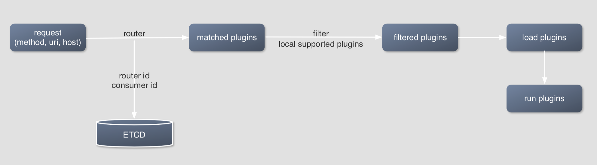
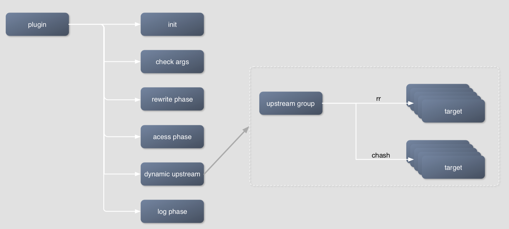

[](https://github.com/iresty/apisix/blob/master/LICENSE)

APISIX is a cloud-native microservices API gateway, delivering the ultimate performance, security, open source and scalable platform for all your APIs and microservices.

## Summary
- [**Install**](#install)
- [**Quickstart**](#quickstart)
- [**Distributions**](#distributions)
- [**Development**](#development)

## Install

### CentOS
#### Dependencies

- OpenResty
```shell
sudo yum install yum-utils
sudo yum-config-manager --add-repo https://openresty.org/package/centos/openresty.repo
sudo yum install openresty
```

- etcd
```shell
sudo yum install etcd
```

#### Install from RPM
```shell
wget http://39.97.63.215/download/apisix-0.1-2.noarch.rpm
sudo rpm -ivh apisix-0.1-2.noarch.rpm
```

If no error has occurred, APISIX is already installed in this directory: `/usr/share/lua/5.1/apisix`.

Now, you can try APISIX, go to [**Quickstart**](#quickstart).

### Source Install

> Dependent library

* [lua-resty-r3] Setups the [resty-r3#install](https://github.com/iresty/lua-resty-r3#install) library.
* [lua-resty-etcd] Setups the [resty-etcd#install](https://github.com/iresty/lua-resty-etcd#install) library.
* [lua-resty-balancer] Setups the [resty-balancer#install](https://github.com/iresty/lua-resty-balancer#installation) library.
* [lua-var-nginx-module] Setups the [lua-var-nginx-module#install](https://github.com/iresty/lua-var-nginx-module#install) library, this C module is optional, it will use `ngx.var.*` if the C module is not found.

> Install by luarocks

```shell
luarocks install lua-resty-r3 lua-resty-etcd lua-resty-balancer lua-resty-ngxvar
```

## Quickstart
1. start etcd:
```shell
systemctl start etcd
```

2. init etcd:
```shell
curl http://127.0.0.1:2379/v2/keys/apisix/routes -X PUT -d dir=true

curl http://127.0.0.1:2379/v2/keys/apisix/upstreams -X PUT -d dir=true

curl http://127.0.0.1:2379/v2/keys/apisix/services -X PUT -d dir=true
```

3. start APISIX:
```shell
sudo openresty -p /usr/share/lua/5.1/apisix -c /usr/share/lua/5.1/apisix/conf/nginx.conf
```

4. try limit count plugin

For the convenience of testing, we set up a maximum of 2 visits in 60 seconds, and return 503 if the threshold is exceeded:
```shell
curl http://127.0.0.1:2379/v2/keys/apisix/routes/1 -X PUT -d value='
{
	"methods": ["GET"],
	"uri": "/hello",
	"id": 1,
	"plugin_config": {
		"limit-count": {
			"count": 2,
			"time_window": 60,
			"rejected_code": 503,
			"key": "remote_addr"
		}
	},
	"upstream": {
		"type": "roundrobin",
		"nodes": {
			"220.181.57.215:80": 1,
			"220.181.57.216:80": 1
		}
	}
}'
```

```shell
$ curl -i -H 'Host: baidu.com' http://127.0.0.1:9080/hello
HTTP/1.1 302 Found
Content-Type: text/html; charset=iso-8859-1
Content-Length: 222
Connection: keep-alive
X-RateLimit-Limit: 2
X-RateLimit-Remaining: 0
Date: Thu, 30 May 2019 08:44:03 GMT
Server: APISIX web server
Location: http://www.baidu.com/search/error.html
Cache-Control: max-age=86400
Expires: Fri, 31 May 2019 08:44:03 GMT

...
```


## Distributions

- Docker: TODO
- CentOS: [RPM for CentOS 7](http://39.97.63.215/download/apisix-0.1-2.noarch.rpm)
- RedHat: TODO
- Ubuntu: TODO
- Homebrew:TODO
- Nightly Builds: TODO


## Development
### How to load the plugin?



### Plugin


