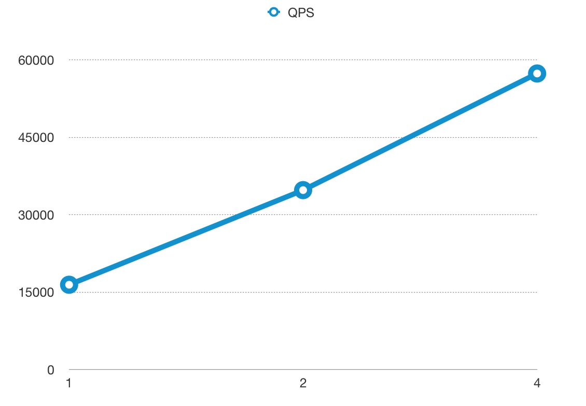
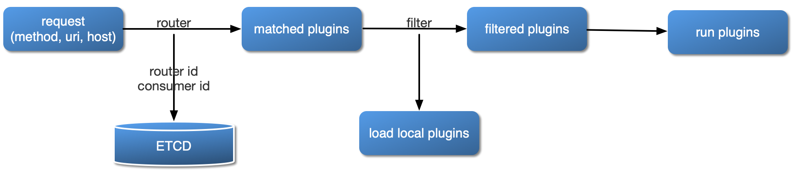
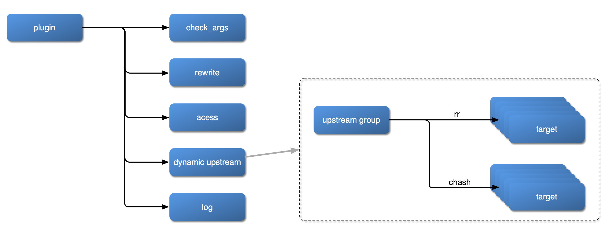

[](https://travis-ci.org/iresty/apisix)
[](https://github.com/iresty/apisix/blob/master/LICENSE)

APISIX is a cloud-native microservices API gateway, delivering the ultimate performance, security, open source and scalable platform for all your APIs and microservices.

## Summary
- [**Install**](#install)
- [**Quickstart**](#quickstart)
- [**Distributions**](#distributions)
- [**Benchmark**](#benchmark)
- [**Development**](#development)

## Install

APISIX Installed and tested in the following systems:.

|OS          |Status|
|------------|------|
|CentOS 7    |√     |
|Ubuntu 18.04|√     |
|Debian 9    |√     |
|CentOS 6    |✘     |

You now have two ways to install APISIX: if you are using CentOS 7, it is recommended to use RPM, other systems please use Luarocks.

We will add support for Docker and more OS shortly.

### Install from RPM for CentOS 7

```shell
sudo yum install yum-utils
sudo yum-config-manager --add-repo https://openresty.org/package/centos/openresty.repo
sudo yum install -y openresty etcd
sudo service etcd start

sudo yum install -y https://github.com/iresty/apisix/releases/download/v0.3/apisix-0.3-1.el7.noarch.rpm
```

You can try APISIX with the [**Quickstart**](#quickstart) now.

### Install from Luarocks

#### Dependencies

Apisix is based on [openresty](http://openresty.org/), the configures data storage and distribution via [etcd](https://github.com/etcd-io/etcd).

We recommend that you use luarocks to install APISIX, and for different operating systems have different dependencies, see more: [Install Dependencies](https://github.com/iresty/apisix/wiki/Install-Dependencies)

#### Install apisix

```shell
sudo luarocks install apisix
```

If all goes well, you will see the message like this:
> apisix is now built and installed in /usr (license: Apache License 2.0)

Congratulations, you have already installed APISIX successfully.

[Back to TOC](#summary)

## Quickstart

1. start server:
```shell
sudo apisix start
```

2. try limit count plugin

For the convenience of testing, we set up a maximum of 2 visits in 60 seconds,
and return 503 if the threshold is exceeded:

```shell
curl http://127.0.0.1:2379/v2/keys/apisix/routes/1 -X PUT -d value='
{
	"methods": ["GET"],
	"uri": "/index.html",
	"id": 1,
	"plugin_config": {
		"limit-count": {
			"count": 2,
			"time_window": 60,
			"rejected_code": 503,
			"key": "remote_addr"
		}
	},
	"upstream": {
		"type": "roundrobin",
		"nodes": {
			"39.97.63.215:80": 1
		}
	}
}'
```

```shell
$ curl -i http://127.0.0.1:9080/index.html
HTTP/1.1 200 OK
Content-Type: text/html
Content-Length: 13175
Connection: keep-alive
X-RateLimit-Limit: 2
X-RateLimit-Remaining: 1
Server: APISIX web server
Date: Mon, 03 Jun 2019 09:38:32 GMT
Last-Modified: Wed, 24 Apr 2019 00:14:17 GMT
ETag: "5cbfaa59-3377"
Accept-Ranges: bytes

...
```

[Back to TOC](#summary)

## Distributions

- Docker: TODO
- LuaRocks: luarocks install apisix
- CentOS: [RPM for CentOS 7](https://github.com/iresty/apisix/releases/download/v0.3/apisix-0.3-1.el7.noarch.rpm)
- RedHat: TODO
- Ubuntu: TODO
- Homebrew:TODO
- Nightly Builds: TODO

[Back to TOC](#summary)

## Benchmark
### Benchmark Environments
n1-highcpu-8 (8 vCPUs, 7.2 GB memory) on Google Cloud

But we **only** used 4 cores to run APISIX, and left 4 cores for system and [wrk](https://github.com/wg/wrk),
which is the HTTP benchmarking tool.

### Benchmark Test for reverse proxy
Only used APISIX as the reverse proxy server, with no logging, limit rate, or other plugins enabled,
and the response size was 1KB.

#### QPS
The x-axis means the size of CPU core, and the y-axis is QPS.


#### Latency
Note the y-axis latency in **microsecond(μs)** not millisecond.


#### Flame Graph
The result of Flame Graph:


And if you want to run the benchmark test in your machine, you should run another Nginx to listen 80 port.

```shell
curl http://127.0.0.1:2379/v2/keys/apisix/routes/1 -X PUT -d value='
{
    "methods": ["GET"],
    "uri": "/hello",
    "id": 1,
    "plugin_config": {},
    "upstream": {
        "type": "roundrobin",
        "nodes": {
            "127.0.0.1:80": 1,
            "127.0.0.2:80": 1
        }
    }
}'
```

then run wrk:
```shell
wrk -d 60 --latency http://127.0.0.1:9080/hello
```


### Benchmark Test for reverse proxy, enabled 2 plugins
Only used APISIX as the reverse proxy server, enabled the limit rate and prometheus plugins,
and the response size was 1KB.

#### QPS
The x-axis means the size of CPU core, and the y-axis is QPS.


#### Latency
Note the y-axis latency in **microsecond(μs)** not millisecond.


#### Flame Graph
The result of Flame Graph:


And if you want to run the benchmark test in your machine, you should run another Nginx to listen 80 port.

```shell
curl http://127.0.0.1:2379/v2/keys/apisix/routes/1 -X PUT -d value='
{
    "methods": ["GET"],
    "uri": "/hello",
    "id": 1,
    "plugin_config": {
        "limit-count": {
            "count": 999999999,
            "time_window": 60,
            "rejected_code": 503,
            "key": "remote_addr"
        },
        "prometheus":{}
    },
    "upstream": {
        "type": "roundrobin",
        "nodes": {
            "127.0.0.1:80": 1,
            "127.0.0.2:80": 1
        }
    }
}'
```

then run wrk:
```shell
wrk -d 60 --latency http://127.0.0.1:9080/hello
```

[Back to TOC](#summary)

## Development
### How to load the plugin?



### Plugin



inspired by Kong

[Back to TOC](#summary)
