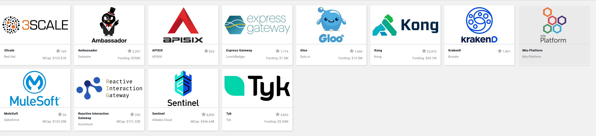

[English](README.md)
## APISIX

[](https://travis-ci.org/iresty/apisix)
[](https://github.com/iresty/apisix/blob/master/LICENSE)

- **QQ 交流群**: 552030619
- [](https://gitter.im/apisix/community?utm_source=badge&utm_medium=badge&utm_campaign=pr-badge)

## 什么是 APISIX？

APISIX 是一个云原生、高性能、可扩展的微服务 API 网关。

它是基于 OpenResty 和 etcd 来实现，和传统 API 网关相比，APISIX 具备动态路由和插件热加载，特别适合微服务体系下的 API 管理。

## 为什么选择 APISIX？

如果你正在构建网站、移动设备或 IoT（物联网）的应用，那么你可能需要使用 API 网关来处理接口流量。

APISIX 是基于云原生的微服务 API 网关，可以处理传统的南北向流量，也可以处理服务间的东西向流量。

APISIX 通过插件机制，提供动态负载平衡、身份验证、限流限速等功能，并且支持你自己开发的插件。

更多详细的信息，可以查阅[ APISIX 的白皮书](https://www.iresty.com/download/%E4%BC%81%E4%B8%9A%E7%94%A8%E6%88%B7%E5%A6%82%E4%BD%95%E9%80%89%E6%8B%A9%E5%BE%AE%E6%9C%8D%E5%8A%A1%20API%20%E7%BD%91%E5%85%B3.pdf)


## 功能

- **云原生**: 平台无关，没有供应商锁定，无论裸机还是 Kubernetes，APISIX 都可以运行。
- **热更新和热插件**: 无需重启服务，就可以持续更新配置和插件。
- **动态负载均衡**：动态支持有权重的 round-robin 负载平衡。
- **支持一致性 hash 的负载均衡**：动态支持一致性 hash 的负载均衡。
- **[SSL](doc/https-cn.md)**：动态加载 SSL 证书。
- **HTTP(S) 反向代理**
- **[健康检查](doc/health-check.md)**：启用上游节点的健康检查，将在负载均衡期间自动过滤不健康的节点，以确保系统稳定性。
- **熔断器**: 智能跟踪不健康上游服务.
- **身份认证**: [key-auth](doc/plugins/key-auth-cn.md), [JWT](doc/plugins/jwt-auth-cn.md)。
- **[限制速率](doc/plugins/limit-req-cn.md)**
- **[限制请求数](doc/plugins/limit-count-cn.md)**
- **[限制并发](doc/plugins/limit-conn-cn.md)**
- **[代理请求重写](doc/plugins/proxy-rewrite.md)**: 支持重写请求上游的`host`、`uri`、`schema`、`enable_websocket`信息。
- **OpenTracing: [支持 Apache Skywalking 和 Zipkin](doc/plugins/zipkin.md)**
- **监控和指标**: [Prometheus](doc/plugins/prometheus-cn.md)
- **[gRPC 协议转换](doc/plugins/grpc-transcoding-cn.md)**：支持协议的转换，这样客户端可以通过 HTTP/JSON 来访问你的 gRPC API。
- **[Serverless](doc/plugins/serverless-cn.md)**: 在 APISIX 的每一个阶段，你都可以添加并调用自己编写的函数。
- **自定义插件**: 允许挂载常见阶段，例如`rewrite`，`access`，`header filer`，`body filter`和`log`，还允许挂载 `balancer` 阶段。
- **控制台**: 内置控制台来操作 APISIX 集群。
- **版本控制**：支持操作的多次回滚。
- **CLI**: 使用命令行来启动、关闭和重启 APISIX。
- **REST API**
- **Websocket 代理**
- **IPv6**：支持使用 IPv6 格式匹配路由。
- **集群**：APISIX 节点是无状态的，创建配置中心集群请参考 [etcd Clustering Guide](https://github.com/etcd-io/etcd/blob/master/Documentation/v2/clustering.md)。
- **可扩展**：简单易用的插件机制方便扩展。
- **高性能**：在单核上 QPS 可以达到 24k，同时延迟只有 0.6 毫秒。
- **防御 ReDoS(正则表达式拒绝服务)**
- **IP 黑名单**
- **IdP 支持**: 支持外部的身份认证服务，比如 Auth0，okta 等，用户可以借此来对接 Oauth2.0 等认证方式。
- **[单机模式](doc/stand-alone-cn.md)**: 支持从本地配置文件中加载路由规则，在 kubernetes(k8s) 等环境下更友好。
- **全局规则**：允许对所有请求执行插件，比如黑白名单、限流限速等。
- **[TCP/UDP 代理](doc/stream-proxy-cn.md)**: 动态 TCP/UDP 代理。
- **[动态 MQTT 代理](doc/plugins/mqtt-proxy-cn.md)**: 支持用 `client_id` 对 MQTT 进行负载均衡，同时支持 MQTT [3.1.*](http://docs.oasis-open.org/mqtt/mqtt/v3.1.1/os/mqtt-v3.1.1-os.html) 和 [5.0](https://docs.oasis-open.org/mqtt/mqtt/v5.0/mqtt-v5.0.html) 两个协议标准。
- **ACL**: TODO。
- **Bot detection**: TODO。

## 在线演示版本
我们部署了一个在线的 [dashboard](http://apisix.iresty.com) ，方便您了解 APISIX。

## 安装

APISIX 在以下操作系统中做过安装和运行测试，需要注意的是，OpenResty 的版本必须 >= 1.15.8.1:

| 操作系统      |
| ------------ |
| CentOS 7     |
| Ubuntu 16.04 |
| Ubuntu 18.04 |
| Debian 9     |
| Debian 10    |
| Mac OSX      |

现在有 4 种方式来安装:
- 如果你是 CentOS 7 的系统，推荐使用 [RPM 包安装](#通过-rpm-包安装centos-7)；
- 如果是 MacOS，只支持安装开发环境，参考[开发环境](doc/dev-manual-cn.md)；
- 其他的系统推荐使用 [Luarocks 安装](#通过-luarocks-安装-不支持-macos)；
- 你也可以使用 [Docker 镜像](https://github.com/iresty/docker-apisix) 来安装.

*NOTE*: APISIX 目前仅支持 etcd 的 v2 协议存储，但最新版的 etcd (3.4 开始）已经默认关闭 v2 协议。
需要在启动参数中添加 `--enable-v2=true`，才能启用 v2 协议。支持 etcd 的 v3 协议开发工作已经开始，很快就能与大家见面。

### 通过 RPM 包安装（CentOS 7）

```shell
sudo yum install yum-utils
sudo yum-config-manager --add-repo https://openresty.org/package/centos/openresty.repo
sudo yum install -y openresty etcd
sudo service etcd start

sudo yum install -y https://github.com/iresty/apisix/releases/download/v0.8/apisix-0.8-0.el7.noarch.rpm
```

如果安装成功，就可以参考 [**快速上手**](#快速上手) 来进行体验。如果失败，欢迎反馈给我们。

### 通过 Luarocks 安装 （不支持 MacOS）

##### 依赖项

APISIX 是基于 [openresty](http://openresty.org/) 之上构建的, 配置数据的存储和分发是通过 [etcd](https://github.com/etcd-io/etcd) 来完成。

我们推荐你使用 [luarocks](https://luarocks.org/) 来安装 APISIX，不同的操作系统发行版本有不同的依赖和安装步骤，具体可以参考: [安装前的依赖](doc/install-dependencies.md)

##### 安装 APISIX

在终端中执行下面命令完成 APISIX 的安装：

> 通过 curl

```shell
sudo sh -c "$(curl -fsSL https://raw.githubusercontent.com/iresty/apisix/master/utils/install-apisix.sh)"
```

> 人工检查

对你不熟悉项目的安装脚本做检查，是个非常好的习惯。可以先下载这个脚本，确保他都是正常脚本，然后运行：

```shell
curl -Lo install.sh https://raw.githubusercontent.com/iresty/apisix/master/utils/install-apisix.sh
sudo sh install.sh
```

> 安装完成

```
    apisix 0.7-0 is now built and installed in /usr/local/apisix/deps (license: Apache License 2.0)

    + sudo rm -f /usr/local/bin/apisix
    + sudo ln -s /usr/local/apisix/deps/bin/apisix /usr/local/bin/apisix
```

恭喜，APISIX 已经安装成功。

## 开发环境

如果你是一个开发者，可以从 [开发文档](doc/dev-manual-cn.md) 中获取搭建开发环境和运行测试案例的步骤.

## 快速上手

1. 启动 APISIX

```shell
sudo apisix start
```

*注意*：如果你当前在开发环境下，应使用 `make run` 命令启动服务。

2. 测试限流插件

你可以测试限流插件，来上手体验 APISIX，按照[限流插件文档](doc/plugins/limit-count-cn.md)的步骤即可.

更进一步，你可以跟着文档来尝试更多的[插件](doc/plugins-cn.md).

## 控制台
APISIX 内置了 dashboard，使用浏览器打开 `http://127.0.0.1:9080/apisix/dashboard/` 即可使用，
不用填写用户名和密码，直接登录。

Dashboard 默认允许任何 IP 访问。你可以自行修改 `conf/config.yaml` 中的 `allow_admin` 字段，指定允许访问 dashboard 的 IP 列表。

## 性能测试

使用谷歌云的 4 核心服务器来运行 APISIX，QPS 可以达到 60000，同时延时只有 0.5 毫秒。

你可以看出[性能测试文档](doc/benchmark-cn.md)来了解更多详细内容。

## 架构设计

[详细设计文档](doc/architecture-design-cn.md)

## 视频和幻灯片

- [APISIX 的选型、测试和持续集成](https://www.upyun.com/opentalk/432.html)

- [APISIX 高性能实践](https://www.upyun.com/opentalk/429.html)

## APISIX 的用户有哪些？
有很多公司和组织把 APISIX 用户学习、研究、生产环境和商业产品中。下面是 APISIX 的用户墙：


欢迎用户把自己加入到 [Powered By](doc/powered-by.md) 页面。

## 全景图

APISIX 被纳入 [云原生软件基金会 API 网关全景图](https://landscape.cncf.io/category=api-gateway&format=card-mode&grouping=category):



## 常见问题（FAQ）
在社区中经常会有开发者问到的一些问题，我们整理在下面这份 [FAQ](FAQ_CN.md) 中：

如果你关心的问题没有在其中，欢迎提交 issue 或者加入下面的 QQ 群和我们沟通。

## 参与社区

如果你对 APISIX 的开发和使用感兴趣，欢迎加入我们的 QQ 群来交流:


## 致谢

灵感来自 Kong 和 Orange。
