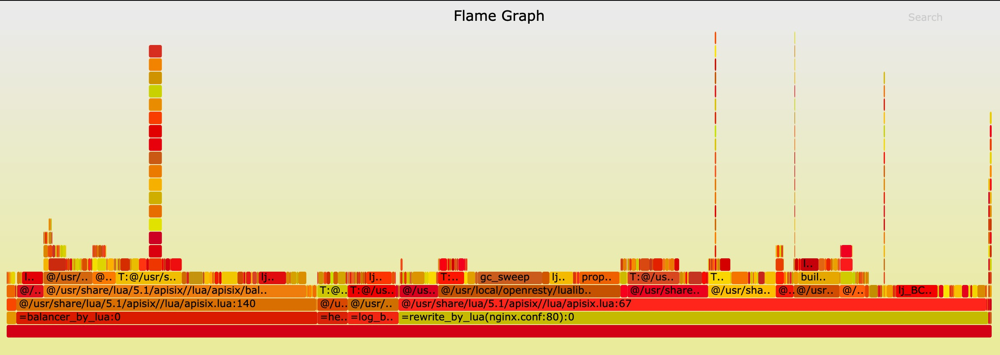

## APISIX

[](https://travis-ci.org/iresty/apisix)
[](https://github.com/iresty/apisix/blob/master/LICENSE)

APISIX 是一个基于云原生、高速可扩展的开源微服务网关节点实现，其自身主要优势是高性能和强大的扩展性。

APISIX 从 `etcd` 中订阅获取所需的配置并以热更新的方式来更改自身行为，更改 `etcd` 中的配置即可完成对 APISIX
网关节点的控制，比如：动态上游、请求限速等。

[设计文档](doc/architecture-design-cn.md)

## Summary
- [**安装**](#安装)
- [**快速上手**](#快速上手)
- [**性能测试**](#性能测试)
- [**参与社区**](#参与社区)

## 安装

APISIX 在以下操作系统中做过安装和运行测试:

|OS          |Status|
|------------|------|
|CentOS 7    |√     |
|Ubuntu 18.04|√     |
|Debian 9    |√     |

现在有两种方式来安装: 如果你是 CentOS 7 的系统，推荐使用 RPM 包安装；其他的系统推荐使用 Luarocks 安装。

我们正在增加对 docker 和更多系统的支持。

#### 通过 RPM 包安装（CentOS 7）
```shell
sudo yum install yum-utils
sudo yum-config-manager --add-repo https://openresty.org/package/centos/openresty.repo
sudo yum install -y openresty etcd
sudo service etcd start

sudo yum install -y https://github.com/iresty/apisix/releases/download/v0.4/apisix-0.4-0.el7.noarch.rpm
```

如果安装成功，就可以参考 [**快速上手**](#快速上手) 来进行体验。如果失败，欢迎反馈给我们。


### 通过 Luarocks 安装

#### 依赖项

APISIX 是基于 [openresty](http://openresty.org/) 之上构建的, 配置数据的存储和分发是通过 [etcd](https://github.com/etcd-io/etcd) 来完成。

我们推荐你使用 [luarocks](https://luarocks.org/) 来安装 APISIX，不同的操作系统发行版本有不同的依赖和安装步骤，具体可以参考: [Install Dependencies](https://github.com/iresty/apisix/wiki/Install-Dependencies)

#### 安装 APISIX

```shell
sudo luarocks install apisix
```

如果一些顺利，你会在最后看到这样的信息：
> apisix is now built and installed in /usr (license: Apache License 2.0)

恭喜你，APISIX 已经安装成功了。

[Back to TOC](#summary)

## 快速上手

1. 启动 APISIX

```shell
sudo apisix start
```

2. 测试限流插件

为了方便测试，下面的示例中设置的是 60 秒最多只能有 2 个请求，如果超过就返回 503：

```shell
curl http://127.0.0.1:2379/v2/keys/apisix/routes/1 -X PUT -d value='
{
	"methods": ["GET"],
	"uri": "/index.html",
	"id": 1,
	"plugin_config": {
		"limit-count": {
			"count": 2,
			"time_window": 60,
			"rejected_code": 503,
			"key": "remote_addr"
		}
	},
	"upstream": {
		"type": "roundrobin",
		"nodes": {
			"39.97.63.215:80": 1
		}
	}
}'
```

```shell
$ curl -i http://127.0.0.1:9080/index.html
HTTP/1.1 200 OK
Content-Type: text/html
Content-Length: 13175
Connection: keep-alive
X-RateLimit-Limit: 2
X-RateLimit-Remaining: 1
Server: APISIX web server
Date: Mon, 03 Jun 2019 09:38:32 GMT
Last-Modified: Wed, 24 Apr 2019 00:14:17 GMT
ETag: "5cbfaa59-3377"
Accept-Ranges: bytes

...
```

[Back to TOC](#summary)

## 性能测试
### 测试环境
使用谷歌云的服务器进行测试，型号为 n1-highcpu-8 (8 vCPUs, 7.2 GB memory)

我们最多只使用 4 核去运行 APISIX, 剩下的 4 核用与系统和压力测试工具 [wrk](https://github.com/wg/wrk)。

### 测试反向代理
我们把 APISIX 当做反向代理来使用，不开启任何插件，响应体的大小为 1KB。

#### QPS
下图中 x 轴为 CPU 的使用个数，y 轴为每秒处理的请求数：


#### 延时
请注意 y 轴延时的单位是**微秒(μs)**，而不是毫秒：


#### 火焰图
火焰图的采样结果:



### 测试反向代理，开启 2 个插件
我们把 APISIX 当做反向代理来使用，开启限速和 prometheus 插件，响应体的大小为 1KB。

#### QPS
下图中 x 轴为 CPU 的使用个数，y 轴为每秒处理的请求数：


#### Latency
请注意 y 轴延时的单位是**微秒(μs)**，而不是毫秒：


#### 火焰图
火焰图的采样结果:


[Back to TOC](#summary)

## 参与社区

如果你对 APISIX 的开发和使用感兴趣，欢迎加入我们的 QQ 群来交流:


[Back to TOC](#summary)
