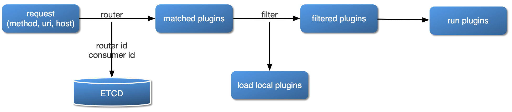

## 目录
- [**APISIX**](#apisix)
- [**APISIX Config**](#apisix-config)
- [**Route**](#route)
- [**Service**](#service)
- [**Consumer**](#consumer)
- [**Plugin**](#plugin)
- [**Upstream**](#upstream)
- [**Router**](#router)
- [**Debug mode**](#Debug-mode)

## APISIX

### 插件加载流程



### 插件内部结构


## APISIX Config

通过修改本地 `conf/config.yaml` 文件完成对 APISIX 服务本身的基本配置。

```yaml
apisix:
  node_listen: 9080             # APISIX listening port

etcd:
  host: "http://127.0.0.1:2379" # etcd address
  prefix: "apisix"              # apisix configurations prefix
  timeout: 60

plugins:                        # plugin name list
  - example-plugin
  - limit-req
  - limit-count
  - ...
```

*注意* 不要手工修改 APISIX 自身的 `conf/nginx.conf` 文件，当服务每次启动时，`apisix`
会根据 `conf/config.yaml` 配置自动生成新的 `conf/nginx.conf` 并自动启动服务。

[返回目录](#目录)

## Route

Route 字面意思就是路由，通过定义一些规则来匹配客户端的请求，然后根据匹配结果加载并执行相应的
插件，并把请求转发给到指定 Upstream。

Route 中主要包含三部分内容：匹配规则(比如 uri、host、remote_addr 等)，插件配置(限流限速等)和上游信息。
请看下图示例，是一些 Route 规则的实例，当某些属性值相同时，图中用相同颜色标识。


我们直接在 Route 中完成所有参数的配置，优点是容易设置，每个 Route 都相对独立自由度比较高。但当我们的 Route 有比较多的重复配置（比如启用相同的插件配置或上游信息），一旦我们要更新这些相同属性时，就需要遍历所有 Route 并进行修改，给后期管理维护增加不少复杂度。

上面提及重复的缺点在 APISIX 中独立抽象了 [Service](#service) 和 [Upstream](#upstream) 两个概念来解决。

下面创建的 Route 示例，是把 uri 为 "/index.html" 的请求代理到地址为 "39.97.63.215:80" 的 Upstream 服务：

```shell
$ curl http://127.0.0.1:9080/apisix/admin/routes/1 -X PUT -i -d '
{
    "uri": "/index.html",
    "upstream": {
        "type": "roundrobin",
        "nodes": {
            "39.97.63.215:80": 1
        }
    }
}'

HTTP/1.1 201 Created
Date: Sat, 31 Aug 2019 01:17:15 GMT
Content-Type: text/plain
Transfer-Encoding: chunked
Connection: keep-alive
Server: APISIX web server

{"node":{"value":{"uri":"\/index.html","upstream":{"nodes":{"39.97.63.215:80":1},"type":"roundrobin"}},"createdIndex":61925,"key":"\/apisix\/routes\/1","modifiedIndex":61925},"action":"create"}
```

当我们接受到成功应答，表示该 Route 已成功创建。

#### Route option

|name     |option   |type|description|
|---------|---------|----|-----------|
|uri      |required |匹配规则|除了如 `/foo/bar`、`/foo/gloo` 这种全量匹配外，使用不同 [Router](#router) 还允许更高级匹配，更多见 [Router](#router)。|
|host     |optional |匹配规则|当前请求域名，比如 `foo.com`；也支持泛域名，比如 `*.foo.com`|
|remote_addr|optional |匹配规则|客户端请求 IP 地址，比如 `192.168.1.101`、`192.168.1.102`，也支持 CIDR 格式如 `192.168.1.0/24`。特别的，APISIX 也支持 IPv6 匹配，比如：`::1`，`fe80::1`, `fe80::1/64` 等。|
|methods  |optional |匹配规则|如果为空或没有该选项，代表没有任何 `method` 限制，也可以是一个或多个组合：GET, POST, PUT, DELETE, PATCH, HEAD, OPTIONS。|
|plugins|optional |Plugin|详见 [Plugin](#plugin) |
|upstream|optional |Upstream|启用的 Upstream 配置，详见 [Upstream](#upstream)|
|upstream_id|optional |Upstream|启用的 upstream id，详见 [Upstream](#upstream)|
|service_id|optional |Service|绑定的 Service 配置，详见 [Service](#service)|


[返回目录](#目录)

## Service

`Service` 是某类功能的提供者，比如订单、账户服务。它通常与上游服务抽象是一对一的，`Route`
与 `Service` 之间，通常是 N:1 的关系，即多个 `Route` 规则可以对应同一个 `Service`。

多个 route 规则同时绑定到一个 service 上，这些路由将具有相同的上游和插件配置，减少冗余配置。

比如下面的例子，先创建了一个 service，并开启了限流插件，
然后把 id 为 `100`、`101` 的 route 都绑定在这个 service 上。

```shell
curl http://127.0.0.1:9080/apisix/admin/services/200 -X PUT -d '
{
    "plugins": {
        "limit-count": {
            "count": 2,
            "time_window": 60,
            "rejected_code": 503,
            "key": "remote_addr"
        }
    },
    "upstream": {
        "type": "roundrobin",
        "nodes": {
            "39.97.63.215:80": 1
        }
    }
}'

curl http://127.0.0.1:9080/apisix/admin/routes/100 -X PUT -d '
{
    "methods": ["GET"],
    "uri": "/index.html",
    "service_id": "200"
}'

curl http://127.0.0.1:9080/apisix/admin/routes/101 -X PUT -d '
{
    "methods": ["GET"],
    "uri": "/foo/index.html",
    "service_id": "200"
}'
```

你也可以为 route 单独制定不同的插件和参数，比如下面这个示例设置了不同的限流参数：

```shell
curl http://127.0.0.1:9080/apisix/admin/routes/102 -X PUT -d '
{
    "uri": "/bar/index.html",
    "id": "102",
    "service_id": "200",
    "plugins": {
        "limit-count": {
            "count": 2000,
            "time_window": 60,
            "rejected_code": 503,
            "key": "remote_addr"
        }
    }
}'
```

当 route 和 service 都开启同一个插件时，route 的优先级高于 service。

[返回目录](#目录)

## Consumer

`Consumer` 是某类具体服务的消费者，主要用来表述不同用户的概念。比如不同的客户请求同一个 API，
经过用户认证体系，网关服务需知道当前请求用户身份信息，针对不同的消费用户，会有不同的限制处理逻辑。

[返回目录](#目录)

## Plugin

`Plugin` 表示将在 `HTTP` 请求/响应生命周期期间执行的插件配置。

`Plugin` 配置可直接绑定在 `Route` 上，也可以被绑定在 `Service` 或 `Consumer`上。而对于同一
个插件的配置，只能有一份是有效的，配置选择优先级总是 `Consumer` > `Route` > `Service`。

在 `conf/config.yaml` 中，可以声明本地 APISIX 节点都支持哪些插件。这是个白名单机制，不在该
白名单的插件配置，都将会被自动忽略。这个特性可用于临时关闭或打开特定插件，应对突发情况非常有效。

插件的配置可以被直接绑定在指定 route 中，也可以被绑定在 service 中，不过 route 中的插件配置
优先级更高。

一个插件在一次请求中只会执行一次，即使被同时绑定到多个不同对象中（比如 route 或 service）。
插件运行先后顺序是根据插件自身的优先级来决定的，例如：[example-plugin](../doc/plugins/example-plugin.lua#L16)。

插件配置作为 route 或 service 的一部分提交的，放到 `plugins` 下。它内部是使用插件
名字作为哈希的 key 来保存不同插件的配置项。

```json
{
    ...
    "plugins": {
        "limit-count": {
            "count": 2,
            "time_window": 60,
            "rejected_code": 503,
            "key": "remote_addr"
        },
        "prometheus": {}
    }
}
```

并不是所有插件都有具体配置项，比如 `prometheus` 下是没有任何具体配置项，这时候用一个空的对象
标识即可。

目前 APISIX 已支持插件：

* [key-auth](../doc/plugins/key-auth-cn.md)
* [grpc-transcode](../doc/plugins/grpc-transcode-cn.md)
* ip-restriction
* [jwt-auth](../doc/plugins/jwt-auth-cn.md)
* [key-auth](../doc/plugins/key-auth-cn.md)
* [limit-conn](../doc/plugins/limit-conn-cn.md)
* [limit-count](../doc/plugins/limit-count-cn.md)
* [limit-req](../doc/plugins/limit-req-cn.md)
* openid-connect
* [prometheus](../doc/plugins/prometheus.md)
* [serverless](../doc/plugins/serverless-cn.md)
* [zipkin](../doc/plugins/zipkin.md)

[返回目录](#目录)

## Upstream

上游对象表示虚拟主机名，可用于通过多个服务（目标）对传入请求进行负载均衡。

上游的配置使用方法，与 `plugin` 非常相似，也可以同时被绑定到 `route` 或 `service` 上，并根据优先级决
定执行顺序。

APISIX 支持对上游的健康检查，你可以设置需要检查的 host、uri、失败和恢复的次数等。

#### 配置参数

* `type`：`roundrobin` 或 `chash`
    * `roundrobin`：支持权重的负载
    * `chash`：一致性 `hash`
* `nodes`: 上游机器地址列表（目前仅支持 IP+Port 方式）
* `key`: 该选项只有类型是 `chash` 才有效。根据 `key` 来查找对应的 node `id`，相同的
`key` 在同一个对象中，永远返回相同 id 。
* `retries`: APISIX 将使用底层的 Nginx 重试机制将请求传递给下一个上游。这是一个可选项，默认是不启用重试机制。
* `checks`: 配置健康检查的参数。
* `scheme`: 转发到上游的 `schema` 协议，可以是 `http` 或 `https`，默认 `http` 协议。
* `uri`: 转发到上游的新 `uri` 地址。
* `host`: 转发到上游的新 `host`。
* `enable_websocket`: 是否启用 websocket （布尔值），默认不启用。

创建上游对象用例：

```json
curl http://127.0.0.1:9080/apisix/admin/upstreams/1 -X PUT -d '
{
    "type": "roundrobin",
    "nodes": {
        "127.0.0.1:80": 1,
        "127.0.0.2:80": 1,
        "127.0.0.3:80": 1
    }
}'

curl http://127.0.0.1:9080/apisix/admin/upstreams/2 -X PUT -d '
{
    "type": "chash",
    "key": "remote_addr",
    "nodes": {
        "127.0.0.1:80": 1,
        "127.0.0.2:80": 1
    }
}'
```

上游对象创建后，均可以被具体 `route` 或 `service` 引用，例如：

```shell
curl http://127.0.0.1:9080/apisix/admin/routes/1 -X PUT -d '
{
    "uri": "/index.html",
    "upstream_id": 2
}'
```

为了方便使用，也可以直接把上游地址直接绑到某个 `route` 或 `service` ，例如：

```shell
curl http://127.0.0.1:9080/apisix/admin/routes/1 -X PUT -d '
{
    "uri": "/index.html",
    "plugins": {
        "limit-count": {
            "count": 2,
            "time_window": 60,
            "rejected_code": 503,
            "key": "remote_addr"
        }
    },
    "upstream": {
        "type": "roundrobin",
        "nodes": {
            "39.97.63.215:80": 1
        }
    }
}'
```

下面是一个配置了健康检查的示例：
```shell
curl http://127.0.0.1:9080/apisix/admin/routes/1 -X PUT -d '
{
    "uri": "/index.html",
    "plugins": {
        "limit-count": {
            "count": 2,
            "time_window": 60,
            "rejected_code": 503,
            "key": "remote_addr"
        }
    },
    "upstream": {
         "nodes": {
            "39.97.63.215:80": 1
        }
        "type": "roundrobin",
        "retries": 2,
        "checks": {
            "active": {
                "http_path": "/status",
                "host": "foo.com",
                "healthy": {
                    "interval": 2,
                    "successes": 1
                },
                "unhealthy": {
                    "interval": 1,
                    "http_failures": 2
                }
            }
        }
    }
}'
```

更多细节可以参考[健康检查的文档](health-check.md)。

[返回目录](#目录)


## Router

APISIX 区别于其他 API 网关的一大特点是允许用户选择不同 Router 来更好匹配自由业务，在性能、自由之间做最适合选择。

在本地配置 `conf/config.yaml` 中设置最符合自身业务需求的路由。

* `apisix.router.http`: HTTP 请求路由。
    * `radixtree_uri`: （默认）只使用 `uri` 作为主索引。基于 `radix tree` 引擎，支持全量和深前缀匹配，更多见 [如何使用 router-radixtree](router-radixtree.md)。
        * `绝对匹配`：完整匹配给定的 `uri` ，比如 `/foo/bar`，`/foo/glo`。
        * `前缀匹配`：末尾使用 `*` 代表给定的 `uri` 是前缀匹配。比如 `/foo*`，则允许匹配 `/foo/`、`/foo/a`和`/foo/b`等。
        * `匹配优先级`：优先尝试绝对匹配，若无法命中绝对匹配，再尝试前缀匹配。
        * `任意过滤属性`：允许指定任何 Ningx 内置变量作为过滤条件，比如 uri 请求参数、请求头、cookie 等。
    * `r3_uri`: 只使用 `uri` 作为主索引（基于 r3 引擎）。基于 `r3` 的 trie tree 是支持正则匹配的，比如 `/foo/{:\w+}/{:\w+}`，更多见 [如何使用 router-r3](router-r3.md)。
    * `r3_host_uri`: 使用 `host + uri` 作为主索引（基于 r3 引擎）,对当前请求会同时匹配 host 和 uri。

* `apisix.router.ssl`: SSL 加载匹配路由。
    * `radixtree_sni`: （默认）使用 `SNI` (Server Name Indication) 作为主索引（基于 radixtree 引擎）。
    * `r3_sni`: 使用 `SNI` (Server Name Indication) 作为主索引（基于 r3 引擎）。

[返回目录](#目录)

## Debug mode

开启调试模式后，会在请求应答时，输出更多的内部信息，比如加载了哪些插件等。

设置 `conf/config.yaml` 中的 `apisix.enable_debug` 为 `true`，即可开启调试模式。

比如对 `/hello` 开启了 `limit-conn`和`limit-count`插件，这时候应答头中会有 `Apisix-Plugins: limit-conn, limit-count` 出现。

```shell
$ curl http://127.0.0.1:1984/hello -i
HTTP/1.1 200 OK
Content-Type: text/plain
Transfer-Encoding: chunked
Connection: keep-alive
Apisix-Plugins: limit-conn, limit-count
X-RateLimit-Limit: 2
X-RateLimit-Remaining: 1
Server: openresty

hello world
```

[返回目录](#目录)
