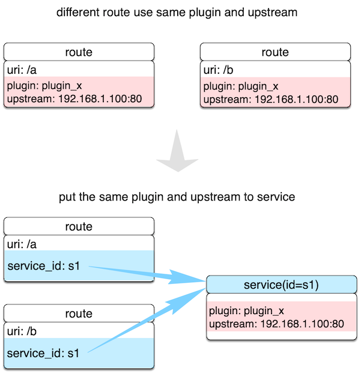

## 目录
- [**APISIX**](#apisix)
- [**APISIX Config**](#apisix-config)
- [**Route**](#route)
- [**Service**](#service)
- [**Plugin**](#plugin)
- [**Upstream**](#upstream)
- [**Router**](#router)
- [**Consumer**](#consumer)
- [**Debug mode**](#Debug-mode)

## APISIX

### 插件加载流程


### 插件内部结构


## APISIX Config

通过修改本地 `conf/config.yaml` 文件完成对 APISIX 服务本身的基本配置。

```yaml
apisix:
  node_listen: 9080             # APISIX listening port

etcd:
  host: "http://127.0.0.1:2379" # etcd address
  prefix: "apisix"              # apisix configurations prefix
  timeout: 60

plugins:                        # plugin name list
  - example-plugin
  - limit-req
  - limit-count
  - ...
```

*注意* 不要手工修改 APISIX 自身的 `conf/nginx.conf` 文件，当服务每次启动时，`apisix`
会根据 `conf/config.yaml` 配置自动生成新的 `conf/nginx.conf` 并自动启动服务。

[返回目录](#目录)

## Route

Route 字面意思就是路由，通过定义一些规则来匹配客户端的请求，然后根据匹配结果加载并执行相应的
插件，并把请求转发给到指定 Upstream。

Route 中主要包含三部分内容：匹配规则(比如 uri、host、remote_addr 等)，插件配置(限流限速等)和上游信息。
请看下图示例，是一些 Route 规则的实例，当某些属性值相同时，图中用相同颜色标识。


我们直接在 Route 中完成所有参数的配置，优点是容易设置，每个 Route 都相对独立自由度比较高。但当我们的 Route 有比较多的重复配置（比如启用相同的插件配置或上游信息），一旦我们要更新这些相同属性时，就需要遍历所有 Route 并进行修改，给后期管理维护增加不少复杂度。

上面提及重复的缺点在 APISIX 中独立抽象了 [Service](#service) 和 [Upstream](#upstream) 两个概念来解决。

下面创建的 Route 示例，是把 uri 为 "/index.html" 的请求代理到地址为 "39.97.63.215:80" 的 Upstream 服务：

```shell
$ curl http://127.0.0.1:9080/apisix/admin/routes/1 -X PUT -i -d '
{
    "uri": "/index.html",
    "upstream": {
        "type": "roundrobin",
        "nodes": {
            "39.97.63.215:80": 1
        }
    }
}'

HTTP/1.1 201 Created
Date: Sat, 31 Aug 2019 01:17:15 GMT
Content-Type: text/plain
Transfer-Encoding: chunked
Connection: keep-alive
Server: APISIX web server

{"node":{"value":{"uri":"\/index.html","upstream":{"nodes":{"39.97.63.215:80":1},"type":"roundrobin"}},"createdIndex":61925,"key":"\/apisix\/routes\/1","modifiedIndex":61925},"action":"create"}
```

当我们接收到成功应答，表示该 Route 已成功创建。

有关 Route 的具体选项，可具体查阅 [Admin API 之 Route](admin-api-cn.md#route)。

[返回目录](#目录)

## Service

`Service` 是某类 API 的抽象（也可以理解为一组 Route 的抽象）。它通常与上游服务抽象是一一对应的，`Route`
与 `Service` 之间，通常是 N:1 的关系，参看下图。



不同 Route 规则同时绑定到一个 Service 上，这些 Route 将具有相同的上游和插件配置，减少冗余配置。

比如下面的例子，创建了一个启用限流插件的 Service，然后把 id 为 `100`、`101` 的 Route 都绑定在这个 Service 上。

```shell
# create new Service
$ curl http://127.0.0.1:9080/apisix/admin/services/200 -X PUT -d '
{
    "plugins": {
        "limit-count": {
            "count": 2,
            "time_window": 60,
            "rejected_code": 503,
            "key": "remote_addr"
        }
    },
    "upstream": {
        "type": "roundrobin",
        "nodes": {
            "39.97.63.215:80": 1
        }
    }
}'

# create new Route and reference the service by id `200`
curl http://127.0.0.1:9080/apisix/admin/routes/100 -X PUT -d '
{
    "methods": ["GET"],
    "uri": "/index.html",
    "service_id": "200"
}'

curl http://127.0.0.1:9080/apisix/admin/routes/101 -X PUT -d '
{
    "methods": ["GET"],
    "uri": "/foo/index.html",
    "service_id": "200"
}'
```

当然我们也可以为 Route 指定不同的插件参数或上游，比如下面这个 Route 设置了不同的限流参数，其他部分（比如上游）则继续使用 Service 中的配置参数。

```shell
curl http://127.0.0.1:9080/apisix/admin/routes/102 -X PUT -d '
{
    "uri": "/bar/index.html",
    "id": "102",
    "service_id": "200",
    "plugins": {
        "limit-count": {
            "count": 2000,
            "time_window": 60,
            "rejected_code": 503,
            "key": "remote_addr"
        }
    }
}'
```

注意：当 Route 和 Service 都开启同一个插件时，Route 参数的优先级是高于 Service 的。

[返回目录](#目录)

## Plugin

`Plugin` 表示将在 `HTTP` 请求/响应生命周期期间执行的插件配置。

`Plugin` 配置可直接绑定在 `Route` 上，也可以被绑定在 `Service` 或 `Consumer`上。而对于同一
个插件的配置，只能有一份是有效的，配置选择优先级总是 `Consumer` > `Route` > `Service`。

在 `conf/config.yaml` 中，可以声明本地 APISIX 节点都支持哪些插件。这是个白名单机制，不在该
白名单的插件配置，都将会被自动忽略。这个特性可用于临时关闭或打开特定插件，应对突发情况非常有效。

插件的配置可以被直接绑定在指定 Route 中，也可以被绑定在 Service 中，不过 Route 中的插件配置
优先级更高。

一个插件在一次请求中只会执行一次，即使被同时绑定到多个不同对象中（比如 Route 或 Service）。
插件运行先后顺序是根据插件自身的优先级来决定的，例如：[example-plugin](../doc/plugins/example-plugin.lua#L16)。

插件配置作为 Route 或 Service 的一部分提交的，放到 `plugins` 下。它内部是使用插件
名字作为哈希的 key 来保存不同插件的配置项。

```json
{
    ...
    "plugins": {
        "limit-count": {
            "count": 2,
            "time_window": 60,
            "rejected_code": 503,
            "key": "remote_addr"
        },
        "prometheus": {}
    }
}
```

并不是所有插件都有具体配置项，比如 `prometheus` 下是没有任何具体配置项，这时候用一个空的对象
标识即可。

[查看 APISIX 已支持插件列表](plugins-cn.md)

[返回目录](#目录)

## Upstream

Upstream 是虚拟主机抽象，对给定的多个服务节点按照配置规则进行负载均衡。Upstream 的地址信息可以直接配置到 `Route`（或 `Service`) 上，当 Upstream 有重复时，就需要用“引用”方式避免重复了。


如上图所示，通过创建 Upstream 对象，在 `Route` 用 ID 方式引用，就可以确保只维护一个对象的值了。

Upstream 的配置可以被直接绑定在指定 `Route` 中，也可以被绑定在 `Service` 中，不过 `Route` 中的配置
优先级更高。这里的优先级行为与 `Plugin` 非常相似

#### 配置参数

APISIX 的 Upstream 除了基本的复杂均衡算法选择外，还支持对上游做主被动健康检查、重试等逻辑，具体看下面表格。

|名字    |可选|说明|
|-------         |-----|------|
|type            |必需|`roundrobin` 支持权重的负载，`chash` 一致性哈希，两者是二选一的|
|nodes           |必需|哈希表，内部元素的 key 是上游机器地址列表，格式为`地址 + Port`，其中地址部分可以是 IP 也可以是域名，比如 `192.168.1.100:80`、`foo.com:80`等。value 则是节点的权重，特别的，当权重值为 `0` 有特殊含义，通常代表该上游节点失效，永远不希望被选中。|
|key             |必需|该选项只有类型是 `chash` 才有效。根据 `key` 来查找对应的 node `id`，相同的 `key` 在同一个对象中，永远返回相同 id|
|checks          |可选|配置健康检查的参数，详细可参考[health-check](health-check.md)|
|retries         |可选|使用底层的 Nginx 重试机制将请求传递给下一个上游，默认不启用重试机制|

创建上游对象用例：

```json
curl http://127.0.0.1:9080/apisix/admin/upstreams/1 -X PUT -d '
{
    "type": "roundrobin",
    "nodes": {
        "127.0.0.1:80": 1,
        "127.0.0.2:80": 2,
        "foo.com:80": 3
    }
}'

curl http://127.0.0.1:9080/apisix/admin/upstreams/2 -X PUT -d '
{
    "type": "chash",
    "key": "remote_addr",
    "nodes": {
        "127.0.0.1:80": 1,
        "foo.com:80": 2
    }
}'
```

上游对象创建后，均可以被具体 `Route` 或 `Service` 引用，例如：

```shell
curl http://127.0.0.1:9080/apisix/admin/routes/1 -X PUT -d '
{
    "uri": "/index.html",
    "upstream_id": 2
}'
```

为了方便使用，也可以直接把上游地址直接绑到某个 `Route` 或 `Service` ，例如：

```shell
curl http://127.0.0.1:9080/apisix/admin/routes/1 -X PUT -d '
{
    "uri": "/index.html",
    "plugins": {
        "limit-count": {
            "count": 2,
            "time_window": 60,
            "rejected_code": 503,
            "key": "remote_addr"
        }
    },
    "upstream": {
        "type": "roundrobin",
        "nodes": {
            "39.97.63.215:80": 1
        }
    }
}'
```

下面是一个配置了健康检查的示例：
```shell
curl http://127.0.0.1:9080/apisix/admin/routes/1 -X PUT -d '
{
    "uri": "/index.html",
    "plugins": {
        "limit-count": {
            "count": 2,
            "time_window": 60,
            "rejected_code": 503,
            "key": "remote_addr"
        }
    },
    "upstream": {
         "nodes": {
            "39.97.63.215:80": 1
        }
        "type": "roundrobin",
        "retries": 2,
        "checks": {
            "active": {
                "http_path": "/status",
                "host": "foo.com",
                "healthy": {
                    "interval": 2,
                    "successes": 1
                },
                "unhealthy": {
                    "interval": 1,
                    "http_failures": 2
                }
            }
        }
    }
}'
```

更多细节可以参考[健康检查的文档](health-check.md)。

[返回目录](#目录)


## Router

APISIX 区别于其他 API 网关的一大特点是允许用户选择不同 Router 来更好匹配自由业务，在性能、自由之间做最适合选择。

在本地配置 `conf/config.yaml` 中设置最符合自身业务需求的路由。

* `apisix.router.http`: HTTP 请求路由。
    * `radixtree_uri`: （默认）只使用 `uri` 作为主索引。基于 `radix tree` 引擎，支持全量和深前缀匹配，更多见 [如何使用 router-radixtree](router-radixtree.md)。
        * `绝对匹配`：完整匹配给定的 `uri` ，比如 `/foo/bar`，`/foo/glo`。
        * `前缀匹配`：末尾使用 `*` 代表给定的 `uri` 是前缀匹配。比如 `/foo*`，则允许匹配 `/foo/`、`/foo/a`和`/foo/b`等。
        * `匹配优先级`：优先尝试绝对匹配，若无法命中绝对匹配，再尝试前缀匹配。
        * `任意过滤属性`：允许指定任何 Ningx 内置变量作为过滤条件，比如 uri 请求参数、请求头、cookie 等。
    * `r3_uri`: 只使用 `uri` 作为主索引（基于 r3 引擎）。基于 `r3` 的 trie tree 是支持正则匹配的，比如 `/foo/{:\w+}/{:\w+}`，更多见 [如何使用 router-r3](router-r3.md)。
    * `r3_host_uri`: 使用 `host + uri` 作为主索引（基于 r3 引擎）,对当前请求会同时匹配 host 和 uri。

* `apisix.router.ssl`: SSL 加载匹配路由。
    * `radixtree_sni`: （默认）使用 `SNI` (Server Name Indication) 作为主索引（基于 radixtree 引擎）。
    * `r3_sni`: 使用 `SNI` (Server Name Indication) 作为主索引（基于 r3 引擎）。

[返回目录](#目录)

## Consumer

对于 API 网关通常可以用请求域名、客户端 IP 地址等字段识别到某类请求方，
然后进行插件过滤并转发请求到指定上游，但有时候这个深度不够。


如上图所示，作为 API 网关，需要知道 API Consumer（消费方）具体是谁，这样就可以对不同 API Consumer 配置不同规则。

|字段|必选|说明|
|---|----|----|
|username|是|Consumer 名称。|
|plugins|否|该 Consumer 对应的插件配置，它的优先级是最高的：Consumer > Route > Service。对于具体插件配置，可以参考 [Plugins](#plugin) 章节。|

在 APISIX 中，识别 Consumer 的过程如下图：


1. 授权认证：比如有 [key-auth](./plugins/key-auth.md)、[JWT](./plugins/jwt-auth-cn.md) 等。
2. 获取 consumer_id：通过授权认证，即可自然获取到对应的 Consumer `id`，它是 Consumer 对象的唯一识别标识。
3. 获取 Consumer 上绑定的 Plugin 或 Upstream 信息：完成对不同 Consumer 做不同配置的效果。

概括一下，Consumer 是某类服务的消费者，需与用户认证体系配合才能使用。
比如不同的 Consumer 请求同一个 API，网关服务根据当前请求用户信息，对应不同的 Plugin 或 Upstream 配置。

此外，大家也可以参考 [key-auth](./plugins/key-auth.md) 认证授权插件的调用逻辑，辅助大家来进一步理解 Consumer 概念和使用。

如何对某个 Consumer 开启指定插件，可以看下面例子：

```shell
# 创建 Consumer ，指定认证插件 key-auth ，并开启特定插件 limit-count
$ curl http://127.0.0.1:9080/apisix/admin/consumers/1 -X PUT -d '
{
    "username": "jack",
    "plugins": {
        "key-auth": {
            "key": "auth-one"
        },
        "limit-count": {
            "count": 2,
            "time_window": 60,
            "rejected_code": 503,
            "key": "remote_addr"
        }
    }
}'

# 创建 Router，设置路由规则和启用插件配置
$ curl http://127.0.0.1:9080/apisix/admin/routes/1 -X PUT -d '
{
    "plugins": {
        "key-auth": {}
    },
    "upstream": {
        "nodes": {
            "127.0.0.1:1980": 1
        },
        "type": "roundrobin"
    },
    "uri": "/hello"
}'

# 发测试请求，前两次返回正常，没达到限速阈值
$ curl http://127.0.0.1:9080/hello -H 'apikey: auth-one' -I
...

$ curl http://127.0.0.1:9080/hello -H 'apikey: auth-one' -I
...

# 第三次测试返回 503，请求被限制
$ curl http://127.0.0.1:9080/hello -H 'apikey: auth-one' -I
HTTP/1.1 503 Service Temporarily Unavailable
...

```

[返回目录](#目录)

## Debug mode

开启调试模式后，会在请求应答时，输出更多的内部信息，比如加载了哪些插件等。

设置 `conf/config.yaml` 中的 `apisix.enable_debug` 为 `true`，即可开启调试模式。

比如对 `/hello` 开启了 `limit-conn`和`limit-count`插件，这时候应答头中会有 `Apisix-Plugins: limit-conn, limit-count` 出现。

```shell
$ curl http://127.0.0.1:1984/hello -i
HTTP/1.1 200 OK
Content-Type: text/plain
Transfer-Encoding: chunked
Connection: keep-alive
Apisix-Plugins: limit-conn, limit-count
X-RateLimit-Limit: 2
X-RateLimit-Remaining: 1
Server: openresty

hello world
```

[返回目录](#目录)
