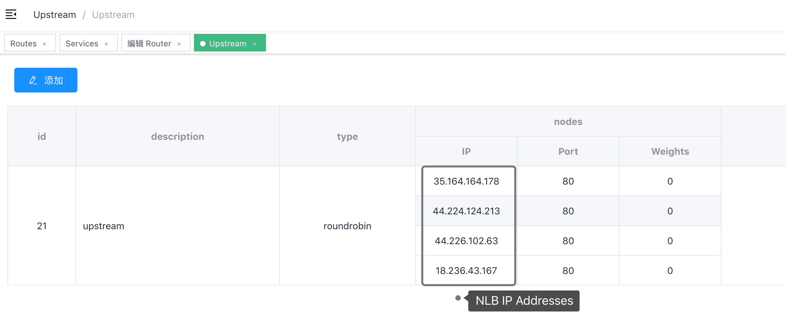
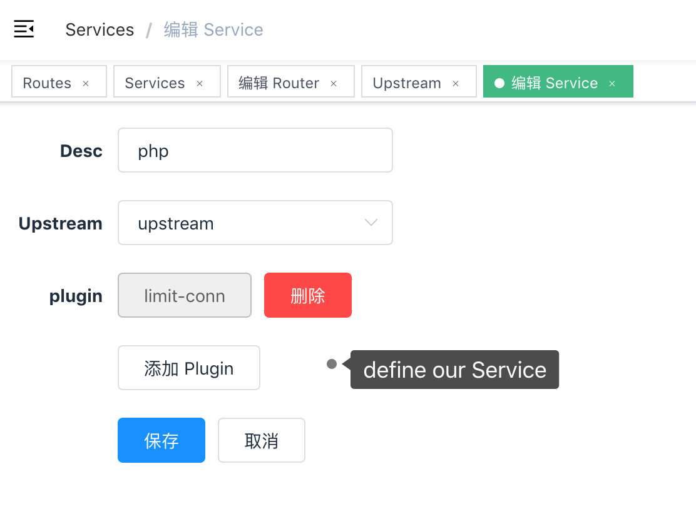

<!--
#
# Licensed to the Apache Software Foundation (ASF) under one or more
# contributor license agreements.  See the NOTICE file distributed with
# this work for additional information regarding copyright ownership.
# The ASF licenses this file to You under the Apache License, Version 2.0
# (the "License"); you may not use this file except in compliance with
# the License.  You may obtain a copy of the License at
#
#     http://www.apache.org/licenses/LICENSE-2.0
#
# Unless required by applicable law or agreed to in writing, software
# distributed under the License is distributed on an "AS IS" BASIS,
# WITHOUT WARRANTIES OR CONDITIONS OF ANY KIND, either express or implied.
# See the License for the specific language governing permissions and
# limitations under the License.
#
-->

# Running APISIX in AWS with AWS CDK

[APISIX](https://github.com/apache/apisix) is a cloud-native microservices API gateway, delivering the ultimate performance, security, open source and scalable platform for all your APIs and microservices.


## Architecture

This reference architecture walks you through building **APISIX** as a serverless container API Gateway on top of AWS Fargate with AWS CDK.


## Generate an AWS CDK project with `projen`

```bash
$ mkdir apisix-aws
$ cd $_
$ npx projen new awscdk-app-ts
```

update the `.projenrc.js` with the following content:

```js
const { AwsCdkTypeScriptApp } = require('projen');

const project = new AwsCdkTypeScriptApp({
  cdkVersion: "1.70.0",
  name: "apisix-aws",
  cdkDependencies: [
    '@aws-cdk/aws-ec2',
    '@aws-cdk/aws-ecs',
    '@aws-cdk/aws-ecs-patterns',
  ]
});

project.synth();
```

update the project:

```ts
$ npx projen
```

## update `src/main.ts`

```ts
import * as cdk from '@aws-cdk/core';
import { Vpc, Port } from '@aws-cdk/aws-ec2';
import { Cluster, ContainerImage, TaskDefinition, Compatibility } from '@aws-cdk/aws-ecs';
import { ApplicationLoadBalancedFargateService, NetworkLoadBalancedFargateService } from '@aws-cdk/aws-ecs-patterns';

export class ApiSixStack extends cdk.Stack {
  constructor(scope: cdk.Construct, id: string, props?: cdk.StackProps) {
    super(scope, id, props);

    const vpc = Vpc.fromLookup(this, 'VPC', {
      isDefault: true
    })

    const cluster = new Cluster(this, 'Cluster', {
      vpc
    })

    /**
     * ApiSix service
     */
    const taskDefinition = new TaskDefinition(this, 'TaskApiSix', {
      compatibility: Compatibility.FARGATE,
      memoryMiB: '512',
      cpu: '256'
    })

    taskDefinition
      .addContainer('apisix', {
        image: ContainerImage.fromRegistry('iresty/apisix'),
      })
      .addPortMappings({
        containerPort: 9080
      })

    taskDefinition
      .addContainer('etcd', {
        image: ContainerImage.fromRegistry('gcr.azk8s.cn/etcd-development/etcd:v3.3.12'),
        // image: ContainerImage.fromRegistry('gcr.io/etcd-development/etcd:v3.3.12'),
      })
      .addPortMappings({
        containerPort: 2379
      })

    const svc = new ApplicationLoadBalancedFargateService(this, 'ApiSixService', {
      cluster,
      taskDefinition,
    })

    svc.targetGroup.setAttribute('deregistration_delay.timeout_seconds', '30')
    svc.targetGroup.configureHealthCheck({
      interval: cdk.Duration.seconds(5),
      healthyHttpCodes: '404',
      healthyThresholdCount: 2,
      unhealthyThresholdCount: 3,
      timeout: cdk.Duration.seconds(4)
    })

    /**
     * PHP service
     */
    const taskDefinitionPHP = new TaskDefinition(this, 'TaskPHP', {
      compatibility: Compatibility.FARGATE,
      memoryMiB: '512',
      cpu: '256'
    })

    taskDefinitionPHP
      .addContainer('php', {
        image: ContainerImage.fromRegistry('abiosoft/caddy:php'),
      })
      .addPortMappings({
        containerPort: 2015
      })

    const svcPHP = new NetworkLoadBalancedFargateService(this, 'PhpService', {
      cluster,
      taskDefinition: taskDefinitionPHP,
      assignPublicIp: true,
    })

    // allow Fargate task behind NLB to accept all traffic
    svcPHP.service.connections.allowFromAnyIpv4(Port.tcp(2015))
    svcPHP.targetGroup.setAttribute('deregistration_delay.timeout_seconds', '30')
    svcPHP.loadBalancer.setAttribute('load_balancing.cross_zone.enabled', 'true')

    new cdk.CfnOutput(this, 'ApiSixDashboardURL', {
      value: `http://${svc.loadBalancer.loadBalancerDnsName}/apisix/dashboard/`
    })
  }
}

const devEnv = {
  account: process.env.CDK_DEFAULT_ACCOUNT,
  region: process.env.CDK_DEFAULT_REGION,
};

const app = new cdk.App();

new ApiSixStack(app, 'apisix-stack-dev', { env: devEnv });

app.synth();
```


## Deploy the APISIX Stack with AWS CDK

```bash
$ cdk diff
$ cdk deploy
```

On deployment complete, some outputs will be returned:

```bash
Outputs:
apiSix.PhpServiceLoadBalancerDNS5E5BAB1B = apiSi-PhpSe-FOL2MM4TW7G8-09029e095ab36fcc.elb.us-west-2.amazonaws.com
apiSix.ApiSixDashboardURL = http://apiSi-ApiSi-1TM103DN35GRY-1477666967.us-west-2.elb.amazonaws.com/apisix/dashboard/
apiSix.ApiSixServiceLoadBalancerDNSD4E5B8CB = apiSi-ApiSi-1TM103DN35GRY-1477666967.us-west-2.elb.amazonaws.com
apiSix.ApiSixServiceServiceURLF6EC7872 = http://apiSi-ApiSi-1TM103DN35GRY-1477666967.us-west-2.elb.amazonaws.com
```

Open the `apiSix.ApiSixDashboardURL` from your browser and you will see the login prompt.

### Configure the upstream nodes

All upstream nodes are running as **AWS Fargate** tasks and registered to the **NLB(Network Load Balancer)** exposing multiple static IP addresses. We can query the IP addresses by **nslookup** the **apiSix.PhpServiceLoadBalancerDNS5E5BAB1B** like this:

```bash
$ nslookup apiSi-PhpSe-FOL2MM4TW7G8-09029e095ab36fcc.elb.us-west-2.amazonaws.com
Server:         192.168.31.1
Address:        192.168.31.1#53

Non-authoritative answer:
Name:   apiSi-PhpSe-FOL2MM4TW7G8-09029e095ab36fcc.elb.us-west-2.amazonaws.com
Address: 44.224.124.213
Name:   apiSi-PhpSe-FOL2MM4TW7G8-09029e095ab36fcc.elb.us-west-2.amazonaws.com
Address: 18.236.43.167
Name:   apiSi-PhpSe-FOL2MM4TW7G8-09029e095ab36fcc.elb.us-west-2.amazonaws.com
Address: 35.164.164.178
Name:   apiSi-PhpSe-FOL2MM4TW7G8-09029e095ab36fcc.elb.us-west-2.amazonaws.com
Address: 44.226.102.63
```

Configure the IP addresses returned as your upstream nodes in your **APISIX** dashboard followed by the **Services** and **Routes** configuration. Let's say we have a `/index.php` as the URI for the first route for our first **Service** from the **Upstream** IP adddresses.






## Validation

OK. Let's test the `/index.php` on `{apiSix.ApiSixServiceServiceURL}/index.php`


Now we have been successfully running **APISIX** in AWS Fargate as serverless container API Gateway service.

## Clean up

```bash
$ cdk destroy
```


## Running APISIX in AWS China Regions

update `src/main.ts`

```js
  taskDefinition
    .addContainer('etcd', {
      image: ContainerImage.fromRegistry('gcr.azk8s.cn/etcd-development/etcd:v3.3.12'),
      // image: ContainerImage.fromRegistry('gcr.io/etcd-development/etcd:v3.3.12'),
    })
    .addPortMappings({
      containerPort: 2379
    })
```
_(read [here](https://github.com/iresty/docker-apisix/blob/9a731f698171f4838e9bc0f1c05d6dda130ca89b/example/docker-compose.yml#L18-L19) for more reference)_


Run `cdk deploy` and specify your preferred AWS region in China.


```bash
# let's say we have another AWS_PROFILE for China regions called 'cn'
# make sure you have aws configure --profile=cn properly.
#
# deploy to NingXia region
$ cdk deploy --profile cn -c region=cn-northwest-1
# deploy to Beijing region
$ cdk deploy --profile cn -c region=cn-north-1
```
In the following case, we got the `Outputs` returned for **AWS Ningxia region(cn-northwest-1)**:

```bash
Outputs:
apiSix.PhpServiceLoadBalancerDNS5E5BAB1B = apiSi-PhpSe-1760FFS3K7TXH-562fa1f7f642ec24.elb.cn-northwest-1.amazonaws.com.cn
apiSix.ApiSixDashboardURL = http://apiSi-ApiSi-123HOROQKWZKA-1268325233.cn-northwest-1.elb.amazonaws.com.cn/apisix/dashboard/
apiSix.ApiSixServiceLoadBalancerDNSD4E5B8CB = apiSi-ApiSi-123HOROQKWZKA-1268325233.cn-northwest-1.elb.amazonaws.com.cn
apiSix.ApiSixServiceServiceURLF6EC7872 = http://apiSi-ApiSi-123HOROQKWZKA-1268325233.cn-northwest-1.elb.amazonaws.com.cn
```

Open the `apiSix.ApiSixDashboardURL` URL and log in to configure your **APISIX** in AWS China region.


_TBD_

## Decouple APISIX and etcd3 on AWS

For high availability and state consistency consideration, you might be interested to decouple the **etcd3** as a separate cluster from **APISIX** not only for performance but also high availability and fault tolerance yet with highly reliable state consistency.

_TBD_
