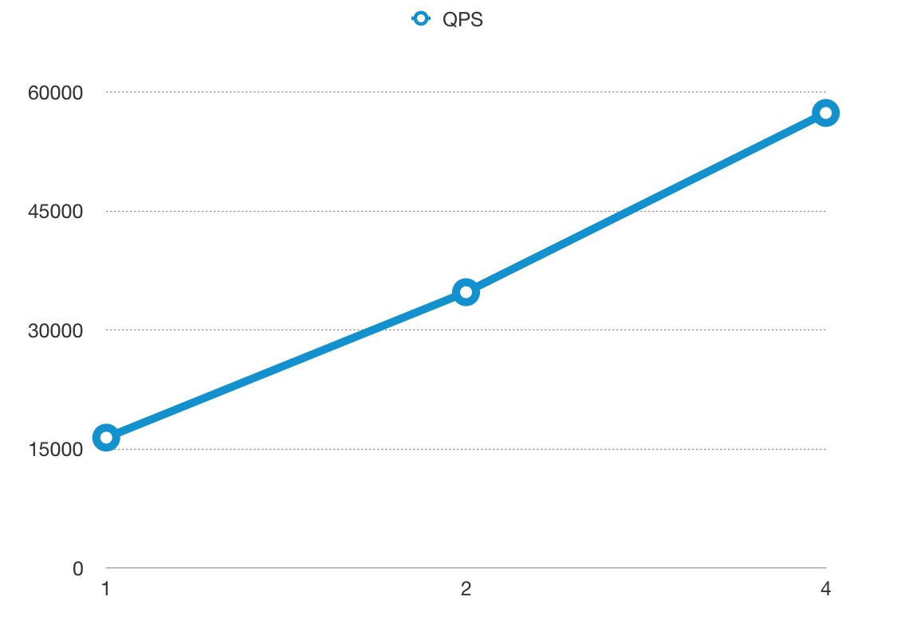

### 测试环境
使用谷歌云的服务器进行测试，型号为 n1-highcpu-8 (8 vCPUs, 7.2 GB memory)

我们最多只使用 4 核去运行 APISIX, 剩下的 4 核用与系统和压力测试工具 [wrk](https://github.com/wg/wrk)。

### 测试反向代理
我们把 APISIX 当做反向代理来使用，不开启任何插件，响应体的大小为 1KB。

#### QPS
下图中 x 轴为 CPU 的使用个数，y 轴为每秒处理的请求数：

#### 延时
请注意 y 轴延时的单位是**微秒(μs)**，而不是毫秒：

#### 火焰图
火焰图的采样结果:

### 测试反向代理，开启 2 个插件
我们把 APISIX 当做反向代理来使用，开启限速和 prometheus 插件，响应体的大小为 1KB。

#### QPS
下图中 x 轴为 CPU 的使用个数，y 轴为每秒处理的请求数：

#### Latency
请注意 y 轴延时的单位是**微秒(μs)**，而不是毫秒：

#### 火焰图
火焰图的采样结果:

