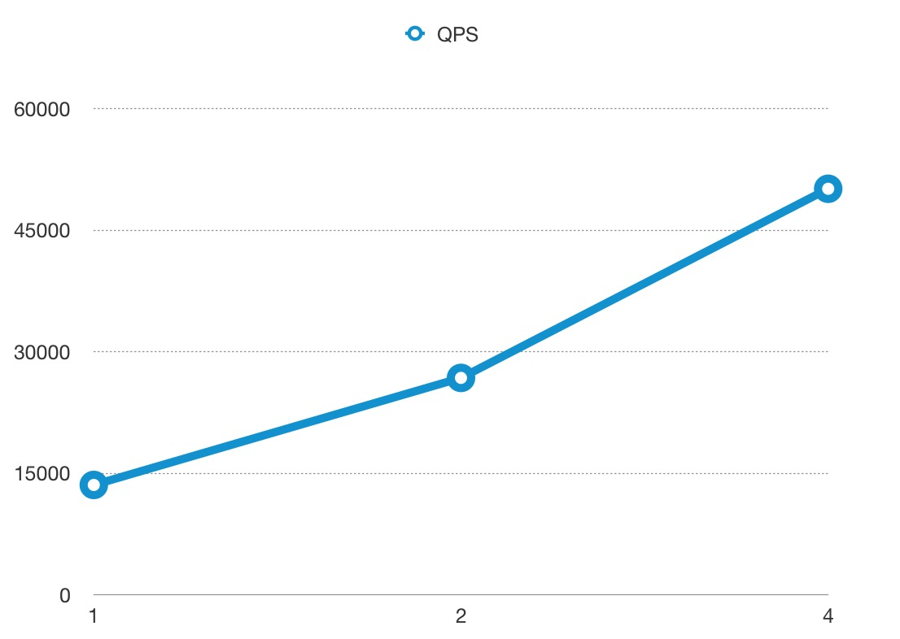
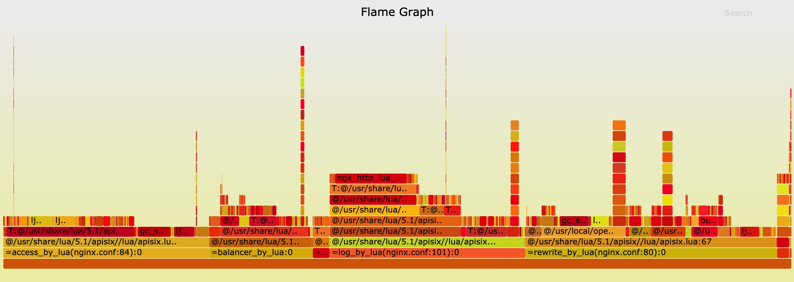

### Benchmark Environments
n1-highcpu-8 (8 vCPUs, 7.2 GB memory) on Google Cloud

But we **only** used 4 cores to run APISIX, and left 4 cores for system and [wrk](https://github.com/wg/wrk),
which is the HTTP benchmarking tool.

### Benchmark Test for reverse proxy
Only used APISIX as the reverse proxy server, with no logging, limit rate, or other plugins enabled,
and the response size was 1KB.

#### QPS
The x-axis means the size of CPU core, and the y-axis is QPS.


#### Latency
Note the y-axis latency in **microsecond(μs)** not millisecond.


#### Flame Graph
The result of Flame Graph:


And if you want to run the benchmark test in your machine, you should run another Nginx to listen 80 port.

```shell
curl http://127.0.0.1:2379/v2/keys/apisix/routes/1 -X PUT -d value='
{
    "methods": ["GET"],
    "uri": "/hello",
    "id": 1,
    "plugin_config": {},
    "upstream": {
        "type": "roundrobin",
        "nodes": {
            "127.0.0.1:80": 1,
            "127.0.0.2:80": 1
        }
    }
}'
```

then run wrk:
```shell
wrk -d 60 --latency http://127.0.0.1:9080/hello
```

### Benchmark Test for reverse proxy, enabled 2 plugins
Only used APISIX as the reverse proxy server, enabled the limit rate and prometheus plugins,
and the response size was 1KB.

#### QPS
The x-axis means the size of CPU core, and the y-axis is QPS.




#### Latency
Note the y-axis latency in **microsecond(μs)** not millisecond.


#### Flame Graph
The result of Flame Graph:


And if you want to run the benchmark test in your machine, you should run another Nginx to listen 80 port.

```shell
curl http://127.0.0.1:2379/v2/keys/apisix/routes/1 -X PUT -d value='
{
    "methods": ["GET"],
    "uri": "/hello",
    "id": 1,
    "plugin_config": {
        "limit-count": {
            "count": 999999999,
            "time_window": 60,
            "rejected_code": 503,
            "key": "remote_addr"
        },
        "prometheus":{}
    },
    "upstream": {
        "type": "roundrobin",
        "nodes": {
            "127.0.0.1:80": 1,
            "127.0.0.2:80": 1
        }
    }
}'
```

then run wrk:
```shell
wrk -d 60 --latency http://127.0.0.1:9080/hello
```
