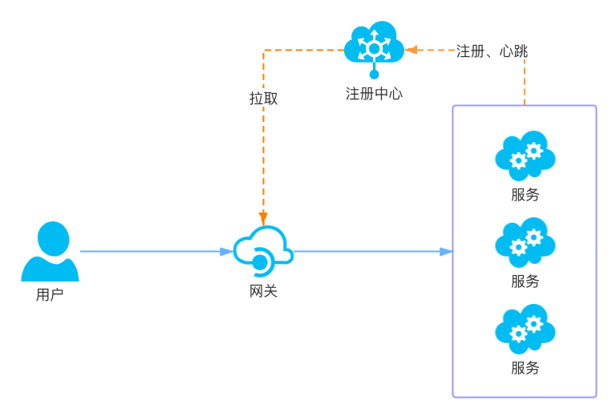

<!--
#
# Licensed to the Apache Software Foundation (ASF) under one or more
# contributor license agreements.  See the NOTICE file distributed with
# this work for additional information regarding copyright ownership.
# The ASF licenses this file to You under the Apache License, Version 2.0
# (the "License"); you may not use this file except in compliance with
# the License.  You may obtain a copy of the License at
#
#     http://www.apache.org/licenses/LICENSE-2.0
#
# Unless required by applicable law or agreed to in writing, software
# distributed under the License is distributed on an "AS IS" BASIS,
# WITHOUT WARRANTIES OR CONDITIONS OF ANY KIND, either express or implied.
# See the License for the specific language governing permissions and
# limitations under the License.
#
-->

# 集成服务发现注册中心

## 摘要

当业务量发生变化时，需要对下游服务进行扩缩容，或者因服务器硬件故障需要更换服务器。如果网关是通过配置来维护下游服务信息，在微服务架构模式下，其带来的维护成本可想而知。再者因不能及时更新这些信息，也会对业务带来一定的影响，还有人为误操作带来的影响也不可忽视，所以网关非常必要通过服务注册中心来获取最新的服务实例列表。架构图如下所示：



1. 服务启动时将自身的一些信息，比如服务名、IP、端口等信息上报到注册中心，并通过心跳等机制告诉注册中心，可以正常提供服务；当服务下线时，会修改注册中心的状态或删除实例信息；
2. 网关会准实时地从注册中心获取服务实例信息；
3. 当用户通过网关请求服务时，网关从注册中心获取的实例列表中选择一台进行代理；

常见的注册中心：Eureka, Etcd, Consul, Zookeeper, Nacos等

## 开启服务发现

首先要在 `conf/config.yaml` 文件中增加如下配置，以选择注册中心的类型：

```yaml
apisix:
  discovery: eureka
```

现已经支持 `Eureka` 注册中心。

## 注册中心配置

### Eureka 的配置

在 `conf/config.yaml` 增加如下格式的配置：

```yaml
eureka:
  host:                            # it's possible to define multiple eureka hosts addresses of the same eureka cluster.
    - "http://${usename}:${passowrd}@${eureka_host1}:${eureka_port1}"
    - "http://${usename}:${passowrd}@${eureka_host2}:${eureka_port2}"
  prefix: "/eureka/"
  timeout:
    connect: 2000
    send: 2000
    read: 5000
```

通过 `eureka.host ` 配置 eureka 的服务器地址。

如果 eureka 的地址是 `http://127.0.0.1:8761/` ，并且不需要用户名和密码验证的话，配置如下：

```yaml
eureka:
  host:
    - "http://127.0.0.1:8761"
  prefix: "/eureka/"
```

**Notice**： 如果能把这些配置移到配置中心管理，那就更好了。

## upstream 配置

APISIX是通过 `upstream.service_name` 与注册中心的服务名进行关联。下面是 uri 为 "/user/*" 的请求路由到注册中心名为 "USER-SERVICE" 的服务上例子：

```shell
$ curl http://127.0.0.1:9080/apisix/admin/routes/1 -H 'X-API-KEY: edd1c9f034335f136f87ad84b625c8f1' -X PUT -i -d '
{
    "uri": "/user/*",
    "upstream": {
        "service_name": "USER-SERVICE",
        "type": "roundrobin"
    }
}'

HTTP/1.1 201 Created
Date: Sat, 31 Aug 2019 01:17:15 GMT
Content-Type: text/plain
Transfer-Encoding: chunked
Connection: keep-alive
Server: APISIX web server

{"node":{"value":{"uri":"\/user\/*","upstream": {"service_name": "USER-SERVICE", "type": "roundrobin"}},"createdIndex":61925,"key":"\/apisix\/routes\/1","modifiedIndex":61925},"action":"create"}
```

**注意**：配置 `upstream.service_name` 后 `upstream.nodes` 将不再生效，而是使用从注册中心获取到的 `nodes` 来替换。

## 如何扩展注册中心？

APISIX 要扩展注册中心其实是件非常容易的事情，我们还是以 eureka 为例：

### 1. 实现 eureka.lua

首先在 `lua/apisix/discovery/` 目录中添加 `eureka.lua`;

然后在 `eureka.lua` 实现用于初始化的 `init_worker` 函数以及用于获取服务实例节点列表的 `nodes` 函数即可：

  ```lua
  local _M = {
      version = 1.0,
  }


  function _M.nodes(service_name)
      ... ...
  end


  function _M.init_worker()
      ... ...
  end


  return _M
  ```
  
### 2. Eureka 与 APISIX 之间数据转换逻辑

APISIX是通过 `upstream.nodes` 来配置下游服务的，所以使用注册中心后，通过注册中心获取服务的所有 node 后，赋值给 `upstream.nodes` 来达到相同的效果。那么 APISIX 是怎么将 Eureka 的数据转成 node 的呢？ 假如从 Eureka 获取如下数据：

```json
{
  "applications": {
      "application": [
          {
              "name": "USER-SERVICE",                 # 服务名称
              "instance": [
                  {
                      "instanceId": "192.168.1.100:8761",
                      "hostName": "192.168.1.100",
                      "app": "USER-SERVICE",          # 服务名称
                      "ipAddr": "192.168.1.100",      # 实例 IP 地址
                      "status": "UP",                 # 状态
                      "overriddenStatus": "UNKNOWN",  # 覆盖状态
                      "port": {
                          "$": 8761,                  # 端口
                          "@enabled": "true"          # 开始端口
                      },
                      "securePort": {
                          "$": 443,
                          "@enabled": "false"
                      },
                      "metadata": {
                          "management.port": "8761",
                          "weight": 100               # 权重，需要在 spring boot 应用中通过 eureka.instance.metadata-map.weight 进行配置
                      },
                      "homePageUrl": "http://192.168.1.100:8761/",
                      "statusPageUrl": "http://192.168.1.100:8761/actuator/info",
                      "healthCheckUrl": "http://192.168.1.100:8761/actuator/health",
                      ... ...
                  }
              ]
          }
      ]
  }
}
```

解析 instance 数据步骤：

1. 首先要选择状态为 “UP” 的实例。 overriddenStatus 值不为 "UNKNOWN" 以 overriddenStatus 为准，否则以 status 的值为准；
2. 以 ipAddr 的值为 IP; 并且是 IPv4 或 IPv6 格式的；
3. 端口取值规则是，如果 port["@enabled"] == "true" 那么使用 port["\$"] 的值；如果 securePort["@enabled"] == "true" 那么使用 securePort["$"] 的值；
4. 权重取值顺序是，先判断 metadata.weight 是否有值，如果没有，则取配置中的 eureka.weight 的值, 如果还没有，则取默认值100；

这个例子转成 APISIX nodes 的结果如下：

```
{
    "192.168.1.100:8761" = 100
}
```

**Notice**： 由于 APISIX 的 `upstream.nodes` 现在这种设计，对于静态配置来说非常简洁，但对于复杂场景就会有扩展性差的问题，比如想通过注册中心服务实例的 metadata (比如：分组等)信息进行特殊处理时，就需要用户自行定制。

