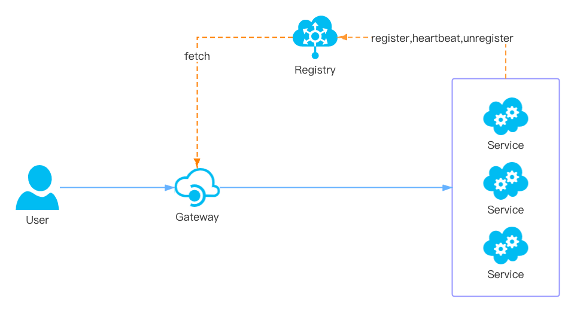

<!--
#
# Licensed to the Apache Software Foundation (ASF) under one or more
# contributor license agreements.  See the NOTICE file distributed with
# this work for additional information regarding copyright ownership.
# The ASF licenses this file to You under the Apache License, Version 2.0
# (the "License"); you may not use this file except in compliance with
# the License.  You may obtain a copy of the License at
#
#     http://www.apache.org/licenses/LICENSE-2.0
#
# Unless required by applicable law or agreed to in writing, software
# distributed under the License is distributed on an "AS IS" BASIS,
# WITHOUT WARRANTIES OR CONDITIONS OF ANY KIND, either express or implied.
# See the License for the specific language governing permissions and
# limitations under the License.
#
-->
[Chinese](zh-cn/discovery.md)

# Integration service discovery registry

* [**Summary**](#Summary)
* [**How extend the discovery client?**](#how-extend-the-discovery-client)
    * [**Basic steps**](#basic-steps)
    * [**the example of Eureka**](#the-example-of-eureka)
        * [**Implementation of eureka.lua**](#implementation-of-eurekalua)
        * [**How convert Eureka's instance data to APISIX's node?**](#how-convert-eurekas-instance-data-to-apisixs-node)
* [**Configuration for discovery client**](#configuration-for-discovery-client)
    * [**Select discovery client**](#select-discovery-client)
    * [**Configuration for Eureka**](#configuration-for-eureka)
* [**Upstream setting**](#upstream-setting)

## Summary

When system traffic changes, the number of servers of the upstream service also increases or decreases, or the server needs to be replaced due to its hardware failure. If the gateway maintains upstream service information through configuration, the maintenance costs in the microservices architecture pattern are unpredictable. Furthermore, due to the untimely update of these information, will also bring a certain impact for the business, and the impact of human error operation can not be ignored. So it is very necessary for the gateway to automatically get the latest list of service instances through the service registry。As shown in the figure below：



1. When the service starts, it will report some of its information, such as the service name, IP, port and other information to the registry. The services communicate with the registry using a mechanism such as a heartbeat, and if the registry and the service are unable to communicate for a long time, the instance will be cancel.When the service goes offline, the registry will delete the instance information.
2. The gateway gets service instance information from the registry in near-real time.
3. When the user requests the service through the gateway, the gateway selects one instance from the registry for proxy.

Common registries: Eureka, Etcd, Consul, Zookeeper, Nacos etc.

## How extend the discovery client?

### Basic steps

It is very easy for APISIX to extend the discovery client. , the basic steps are as follows

1. Add the implementation of registry client in the 'apisix/discovery/' directory;

2. Implement the `_M. init_worker()` function for initialization and the `_M. nodes(service_name)` function for obtaining the list of service instance nodes;

3. Convert the registry data into data in APISIX;


### the example of Eureka

#### Implementation of eureka.lua

First, add [`eureka.lua`](../apisix/discovery/eureka.lua) in the `apisix/discovery/` directory;

Then implement the `_M.init_worker()` function for initialization and the `_M.nodes(service_name)` function for obtaining the list of service instance nodes in ` eureka.lua`:

  ```lua
  local _M = {
      version = 1.0,
  }


  function _M.nodes(service_name)
      ... ...
  end


  function _M.init_worker()
      ... ...
  end


  return _M
  ```

#### How convert Eureka's instance data to APISIX's node?

Here's an example of Eureka's data：

```json
{
  "applications": {
      "application": [
          {
              "name": "USER-SERVICE",                 # service name
              "instance": [
                  {
                      "instanceId": "192.168.1.100:8761",
                      "hostName": "192.168.1.100",
                      "app": "USER-SERVICE",          # service name
                      "ipAddr": "192.168.1.100",      # IP address
                      "status": "UP",
                      "overriddenStatus": "UNKNOWN",
                      "port": {
                          "$": 8761,
                          "@enabled": "true"
                      },
                      "securePort": {
                          "$": 443,
                          "@enabled": "false"
                      },
                      "metadata": {
                          "management.port": "8761",
                          "weight": 100               # Setting by 'eureka.instance.metadata-map.weight' of the spring boot application
                      },
                      "homePageUrl": "http://192.168.1.100:8761/",
                      "statusPageUrl": "http://192.168.1.100:8761/actuator/info",
                      "healthCheckUrl": "http://192.168.1.100:8761/actuator/health",
                      ... ...
                  }
              ]
          }
      ]
  }
}
```

Deal with the Eureka's instance data need the following steps :

1. select the UP instance. When the value of `overriddenStatus` is "UP" or the value of `overriddenStatus` is "UNKNOWN" and the value of `status` is "UP".
2. Host. The `ipAddr` is the IP address of instance; and must be IPv4 or IPv6.
3. Port. If the value of `port["@enabled"]` is equal to "true", using the value of `port["\$"]`, If the value of `securePort["@enabled"]` is equal to "true", using the value of `securePort["\$"]`.
4. Weight. `local weight = metadata.weight or local_conf.eureka.weight or 100`

The result of this example is as follows:

```json
[
  {
    "host" : "192.168.1.100",
    "port" : 8761,
    "weight" : 100,
    "metadata" : {
      "management.port": "8761",
    }
  }
]
```

## Configuration for discovery client

### Select discovery client

Add the following configuration to `conf/config.yaml` and select one discovery client type which you want:

```yaml
apisix:
  discovery: eureka
```

This name should be consistent with the file name of the implementation registry in the `apisix/discovery/` directory.

The supported discovery client: Eureka.

### Configuration for Eureka

Add following configuration in `conf/config.yaml` ：

```yaml
eureka:
  host:                            # it's possible to define multiple eureka hosts addresses of the same eureka cluster.
    - "http://${usename}:${passowrd}@${eureka_host1}:${eureka_port1}"
    - "http://${usename}:${passowrd}@${eureka_host2}:${eureka_port2}"
  prefix: "/eureka/"
  fetch_interval: 30               # 30s
  weight: 100                      # default weight for node
  timeout:
    connect: 2000                  # 2000ms
    send: 2000                     # 2000ms
    read: 5000                     # 5000ms
```


## Upstream setting

Here is an example of routing a request with a URL of "/user/*" to a service which named "user-service"  in the registry :

```shell
$ curl http://127.0.0.1:9080/apisix/admin/routes/1 -H 'X-API-KEY: edd1c9f034335f136f87ad84b625c8f1' -X PUT -i -d '
{
    "uri": "/user/*",
    "upstream": {
        "service_name": "USER-SERVICE",
        "type": "roundrobin"
    }
}'

HTTP/1.1 201 Created
Date: Sat, 31 Aug 2019 01:17:15 GMT
Content-Type: text/plain
Transfer-Encoding: chunked
Connection: keep-alive
Server: APISIX web server

{"node":{"value":{"uri":"\/user\/*","upstream": {"service_name": "USER-SERVICE", "type": "roundrobin"}},"createdIndex":61925,"key":"\/apisix\/routes\/1","modifiedIndex":61925},"action":"create"}
```

Because the upstream interface URL may have conflict, usually in the gateway by prefix to distinguish:

```shell
$ curl http://127.0.0.1:9080/apisix/admin/routes/1 -H 'X-API-KEY: edd1c9f034335f136f87ad84b625c8f1' -X PUT -i -d '
{
    "uri": "/a/*",
    "plugins": {
        "proxy-rewrite" : {
            regex_uri: ["^/a/(.*)", "/${1}"]
        }
    }
    "upstream": {
        "service_name": "A-SERVICE",
        "type": "roundrobin"
    }
}'

$ curl http://127.0.0.1:9080/apisix/admin/routes/2 -H 'X-API-KEY: edd1c9f034335f136f87ad84b625c8f1' -X PUT -i -d '
{
    "uri": "/b/*",
    "plugins": {
        "proxy-rewrite" : {
            regex_uri: ["^/b/(.*)", "/${1}"]
        }
    }
    "upstream": {
        "service_name": "B-SERVICE",
        "type": "roundrobin"
    }
}'
```

Suppose both A-SERVICE and B-SERVICE provide a `/test` API. The above configuration allows access to A-SERVICE's `/test` API through `/a/test` and B-SERVICE's `/test` API through `/b/test`.

**Notice**：When configuring `upstream.service_name`,  `upstream.nodes` will no longer take effect, but will be replaced by 'nodes' obtained from the registry.


