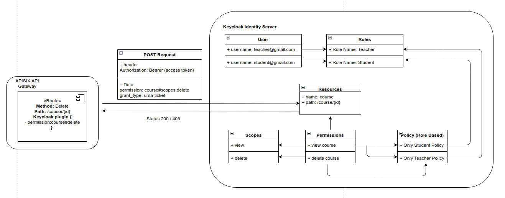

<!--
#
# Licensed to the Apache Software Foundation (ASF) under one or more
# contributor license agreements.  See the NOTICE file distributed with
# this work for additional information regarding copyright ownership.
# The ASF licenses this file to You under the Apache License, Version 2.0
# (the "License"); you may not use this file except in compliance with
# the License.  You may obtain a copy of the License at
#
#     http://www.apache.org/licenses/LICENSE-2.0
#
# Unless required by applicable law or agreed to in writing, software
# distributed under the License is distributed on an "AS IS" BASIS,
# WITHOUT WARRANTIES OR CONDITIONS OF ANY KIND, either express or implied.
# See the License for the specific language governing permissions and
# limitations under the License.
#
-->

[中文](authz-keycloak-cn.md)

# Summary
- [**Name**](#name)
- [**Attributes**](#attributes)
- [**How To Enable**](#how-to-enable)
- [**Test Plugin**](#test-plugin)
- [**Disable Plugin**](#disable-plugin)
- [**Examples**](#examples)


## Name

`authz-keycloak` is an authorization plugin to be used with the Keycloak Identity Server. Keycloak is an OAuth/OIDC and
UMA compliant Ideneity Server. Although, its developed to working in conjunction with Keycloak it should work with any
OAuth/OIDC and UMA compliant identity providers as well.

For more information on Keycloak, refer to [Keycloak Authorization Docs](https://www.keycloak.org/docs/latest/authorization_services) for more information.

## Attributes

|Name           |Requirement    |Description|
|---------      |--------       |-----------|
| token_endpoint|required       |A OAuth2-compliant Token Endpoint that supports the `urn:ietf:params:oauth:grant-type:uma-ticket` grant type.|
| grant_type    |optional       |Default value is `urn:ietf:params:oauth:grant-type:uma-ticket`.|
| audience      |optional       |The client identifier of the resource server to which the client is seeking access. This parameter is mandatory in case the permission parameter is defined.|
| permissions   |optional       |This parameter is optional. A string representing a set of one or more resources and scopes the client is seeking access.  The format of the string must be: `RESOURCE_ID#SCOPE_ID`.|
| timeout       |optional       |Timeout for the http connection with the Identity Server. Default is 3 seconds|
| policy_enforcement_mode|required     |Enforcing or Permissive.|


### Policy Enforcement Mode

Specifies how policies are enforced when processing authorization requests sent to the server.

**Enforcing**

- (default mode) Requests are denied by default even when there is no policy associated with a given resource.

**Permissive**

- Requests are allowed even when there is no policy associated with a given resource.


## How To Enable

Create a `route` and enable the `authz-keycloak` plugin on the route:

```shell
curl http://127.0.0.1:9080/apisix/admin/routes/5 -H 'X-API-KEY: edd1c9f034335f136f87ad84b625c8f1' -X PUT -d '
{
    "uri": "/get",
    "plugins": {
        "authz-keycloak": {
        	"token_endpoint": "http://127.0.0.1:8090/auth/realms/{client_id}/protocol/openid-connect/token",
        	"permissions": ["resource name#scope name"],
            "audience": "Client ID"
        }
    },
    "upstream": {
    	"type": "roundrobin",
    	"nodes": {
        	"127.0.0.1:8080": 1
    	}
    }
}
```


## Test Plugin

```shell
curl http://127.0.0.1:9080/get -H 'Authorization: Bearer {JWT Token}'
```


## Disable Plugin

Remove the corresponding json configuration in the plugin configuration to disable the `authz-keycloak`.
APISIX plugins are hot-reloaded, therefore no need to restart APISIX.

```shell
curl http://127.0.0.1:9080/apisix/admin/routes/5 -H 'X-API-KEY: edd1c9f034335f136f87ad84b625c8f1' -X PUT -d '
{
    "uri": "/get",
    "plugins": {
    },
    "upstream": {
    	"type": "roundrobin",
    	"nodes": {
        	"127.0.0.1:8080": 1
    	}
    }
}
```

## Examples

Checkout the unit test for of the authz-keycloak.t to understand how the authorization policies can be integrated into your
API workflows. Run the following docker image and visit `http://localhost:8090` to view the associated policies for the unit tests.

```bash
docker run -e KEYCLOAK_USER=admin -e KEYCLOAK_PASSWORD=123456 -p 8090:8080 sshniro/keycloak-apisix
```

The following image shows how the policies are configures in the Keycloak server.



## Future Development

- Currently the `authz-plugin` requires to define the resource name and required scopes in order to enforce policies for the routes.
However, Keycloak's official adapters (Java, JS) also provides path matching by querying Keycloak paths dynamically, and
lazy loading the paths to identity resources. Future version on authz-plugin will support this functionality.

- Support to read scope and configurations from the Keycloak JSON File
