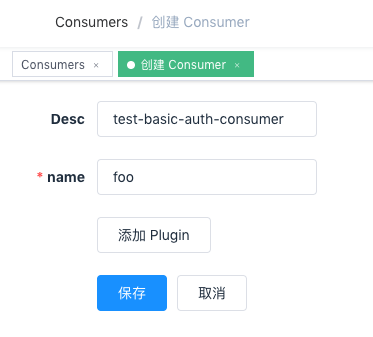
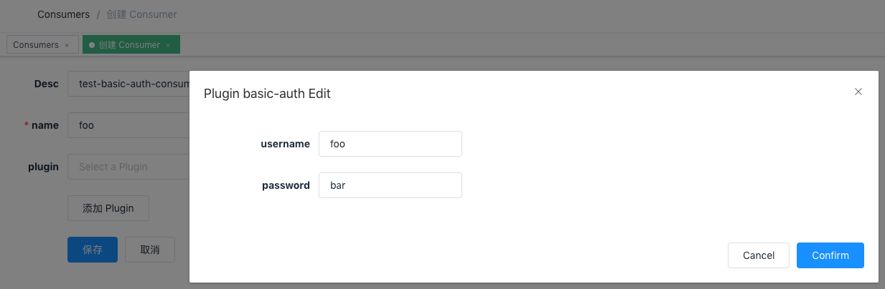

<!--
#
# Licensed to the Apache Software Foundation (ASF) under one or more
# contributor license agreements.  See the NOTICE file distributed with
# this work for additional information regarding copyright ownership.
# The ASF licenses this file to You under the Apache License, Version 2.0
# (the "License"); you may not use this file except in compliance with
# the License.  You may obtain a copy of the License at
#
#     http://www.apache.org/licenses/LICENSE-2.0
#
# Unless required by applicable law or agreed to in writing, software
# distributed under the License is distributed on an "AS IS" BASIS,
# WITHOUT WARRANTIES OR CONDITIONS OF ANY KIND, either express or implied.
# See the License for the specific language governing permissions and
# limitations under the License.
#
-->

- [中文](../zh-cn/plugins/basic-auth.md)

# Summary

- [**Name**](#name)
- [**Attributes**](#attributes)
- [**How To Enable**](#how-to-enable)
- [**Test Plugin**](#test-plugin)
- [**Disable Plugin**](#disable-plugin)

## Name

`basic-auth` is an authentication plugin that need to work with `consumer`. Add Basic Authentication to a `service` or `route`.

The `consumer` then adds its key to the request header to verify its request.

For more information on Basic authentication, refer to [Wiki](https://en.wikipedia.org/wiki/Basic_access_authentication) for more information.

## Attributes

| Name     | Type   | Requirement | Default | Valid | Description                                                                                                                                                      |
| -------- | ------ | ----------- | ------- | ----- | ---------------------------------------------------------------------------------------------------------------------------------------------------------------- |
| username | string | required    |         |       | Different `consumer` should have different value which is unique. When different `consumer` use a same `username`, a request matching exception would be raised. |
| password | string | required    |         |       | the user's password                                                                                                                                              |

## How To Enable

### 1. set a consumer and config the value of the `basic-auth` option

```shell
curl http://127.0.0.1:9180/apisix/admin/consumers -H 'X-API-KEY: edd1c9f034335f136f87ad84b625c8f1' -X PUT -d '
{
    "username": "foo",
    "plugins": {
        "basic-auth": {
            "username": "foo",
            "password": "bar"
        }
    }
}'
```

you can visit Dashboard `http://127.0.0.1:9080/apisix/dashboard/` and add a Consumer through the web console:



then add basic-auth plugin in the Consumer page:



### 2. add a Route or add a Service, and enable the `basic-auth` plugin

```shell
curl http://127.0.0.1:9180/apisix/admin/routes/1 -H 'X-API-KEY: edd1c9f034335f136f87ad84b625c8f1' -X PUT -d '
{
    "methods": ["GET"],
    "uri": "/hello",
    "plugins": {
        "basic-auth": {}
    },
    "upstream": {
        "type": "roundrobin",
        "nodes": {
            "127.0.0.1:1980": 1
        }
    }
}'
```

## Test Plugin

- missing Authorization header

```shell
$ curl -i http://127.0.0.1:9080/hello
HTTP/1.1 401 Unauthorized
...
{"message":"Missing authorization in request"}
```

- user is not exists:

```shell
$ curl -i -ubar:bar http://127.0.0.1:9080/hello
HTTP/1.1 401 Unauthorized
...
{"message":"Invalid user key in authorization"}
```

- password is invalid:

```shell
$ curl -i -ufoo:foo http://127.0.0.1:9080/hello
HTTP/1.1 401 Unauthorized
...
{"message":"Password is error"}
```

- success:

```shell
$ curl -i -ufoo:bar http://127.0.0.1:9080/hello
HTTP/1.1 200 OK
...
hello, world
```

## Disable Plugin

When you want to disable the `basic-auth` plugin, it is very simple,
 you can delete the corresponding json configuration in the plugin configuration,
  no need to restart the service, it will take effect immediately:

```shell
$ curl http://127.0.0.1:2379/apisix/admin/routes/1 -X PUT -d value='
{
    "methods": ["GET"],
    "uri": "/hello",
    "plugins": {},
    "upstream": {
        "type": "roundrobin",
        "nodes": {
            "127.0.0.1:1980": 1
        }
    }
}'
```
