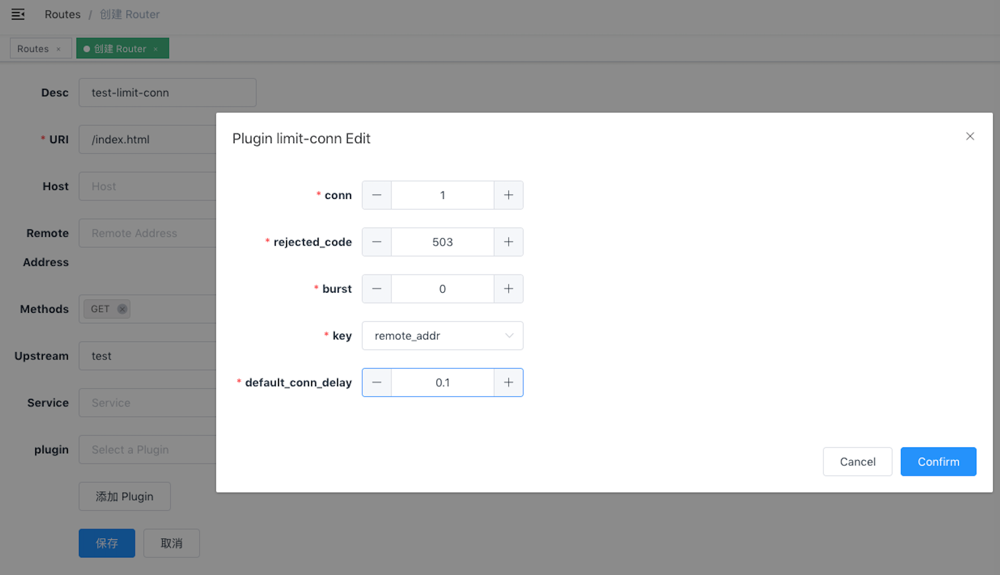

<!--
#
# Licensed to the Apache Software Foundation (ASF) under one or more
# contributor license agreements.  See the NOTICE file distributed with
# this work for additional information regarding copyright ownership.
# The ASF licenses this file to You under the Apache License, Version 2.0
# (the "License"); you may not use this file except in compliance with
# the License.  You may obtain a copy of the License at
#
#     http://www.apache.org/licenses/LICENSE-2.0
#
# Unless required by applicable law or agreed to in writing, software
# distributed under the License is distributed on an "AS IS" BASIS,
# WITHOUT WARRANTIES OR CONDITIONS OF ANY KIND, either express or implied.
# See the License for the specific language governing permissions and
# limitations under the License.
#
-->

- [中文](../zh-cn/plugins/limit-conn.md)

# Summary
- [**Name**](#name)
- [**Attributes**](#attributes)
- [**How To Enable**](#how-to-enable)
- [**Test Plugin**](#test-plugin)
- [**Disable Plugin**](#disable-plugin)

## Name

Limiting request concurrency plugin.

## Attributes

| Name               | Type    | Requirement | Default | Valid                                                                    | Description                                                                                                                                                                                                                                                                                                                                                                                                                                                     |
| ------------------ | ------- | ----------- | ------- | ------------------------------------------------------------------------ | --------------------------------------------------------------------------------------------------------------------------------------------------------------------------------------------------------------------------------------------------------------------------------------------------------------------------------------------------------------------------------------------------------------------------------------------------------------- |
| conn               | integer | required    |         | [0,...]                                                                  | the maximum number of concurrent requests allowed. Requests exceeding this ratio (and below `conn` + `burst`) will get delayed to conform to this threshold.                                                                                                                                                                                                                                                                                                    |
| burst              | integer | required    |         | [0,...]                                                                  | the number of excessive concurrent requests (or connections) allowed to be delayed.                                                                                                                                                                                                                                                                                                                                                                             |
| default_conn_delay | number  | required    |         | [0,...]                                                                  | the default processing latency of a typical connection (or request).                                                                                                                                                                                                                                                                                                                                                                                            |
| key                | object  | required    |         | ["remote_addr", "server_addr", "http_x_real_ip", "http_x_forwarded_for", "consumer_name"] | to limit the concurrency level. <br>For example, one can use the host name (or server zone) as the key so that we limit concurrency per host name. Otherwise, we can also use the client address as the key so that we can avoid a single client from flooding our service with too many parallel connections or requests. <br> Now accept those as key: "remote_addr"(client's IP), "server_addr"(server's IP), "X-Forwarded-For/X-Real-IP" in request header, "consumer_name"(consumer's username). |
| rejected_code      | string  | optional    | 503     | [200,...]                                                                | returned when the request exceeds `conn` + `burst` will be rejected.                                                                                                                                                                                                                                                                                                                                                                                            |

**Key can be customized by the user, only need to modify a line of code of the plug-in to complete. It is a security consideration that is not open in the plugin.**

## How To Enable

Here's an example, enable the limit-conn plugin on the specified route:

```shell
curl http://127.0.0.1:9180/apisix/admin/routes/1 -H 'X-API-KEY: edd1c9f034335f136f87ad84b625c8f1' -X PUT -d '
{
    "methods": ["GET"],
    "uri": "/index.html",
    "plugins": {
        "limit-conn": {
            "conn": 1,
            "burst": 0,
            "default_conn_delay": 0.1,
            "rejected_code": 503,
            "key": "remote_addr"
        }
    },
    "upstream": {
        "type": "roundrobin",
        "nodes": {
            "39.97.63.215:80": 1
        }
    }
}'
```

You can open dashboard with a browser: `http://127.0.0.1:9080/apisix/dashboard/`, to complete the above operation through the web interface, first add a route:


Then add limit-conn plugin:


## Test Plugin

The parameters of the plugin enabled above indicate that only one concurrent request is allowed. When more than one concurrent request is received, will return `503` directly.

```shell
curl -i http://127.0.0.1:9080/index.html?sleep=20 &

curl -i http://127.0.0.1:9080/index.html?sleep=20
<html>
<head><title>503 Service Temporarily Unavailable</title></head>
<body>
<center><h1>503 Service Temporarily Unavailable</h1></center>
<hr><center>openresty</center>
</body>
</html>
```

This means that the limit request concurrency plugin is in effect.

## Disable Plugin

When you want to disable the limit-conn plugin, it is very simple,
 you can delete the corresponding json configuration in the plugin configuration,
  no need to restart the service, it will take effect immediately:

```shell
curl http://127.0.0.1:9180/apisix/admin/routes/1 -H 'X-API-KEY: edd1c9f034335f136f87ad84b625c8f1' -X PUT -d '
{
    "methods": ["GET"],
    "uri": "/index.html",
    "id": 1,
    "plugins": {
    },
    "upstream": {
        "type": "roundrobin",
        "nodes": {
            "39.97.63.215:80": 1
        }
    }
}'
```

The limit-conn plugin has been disabled now. It works for other plugins.
