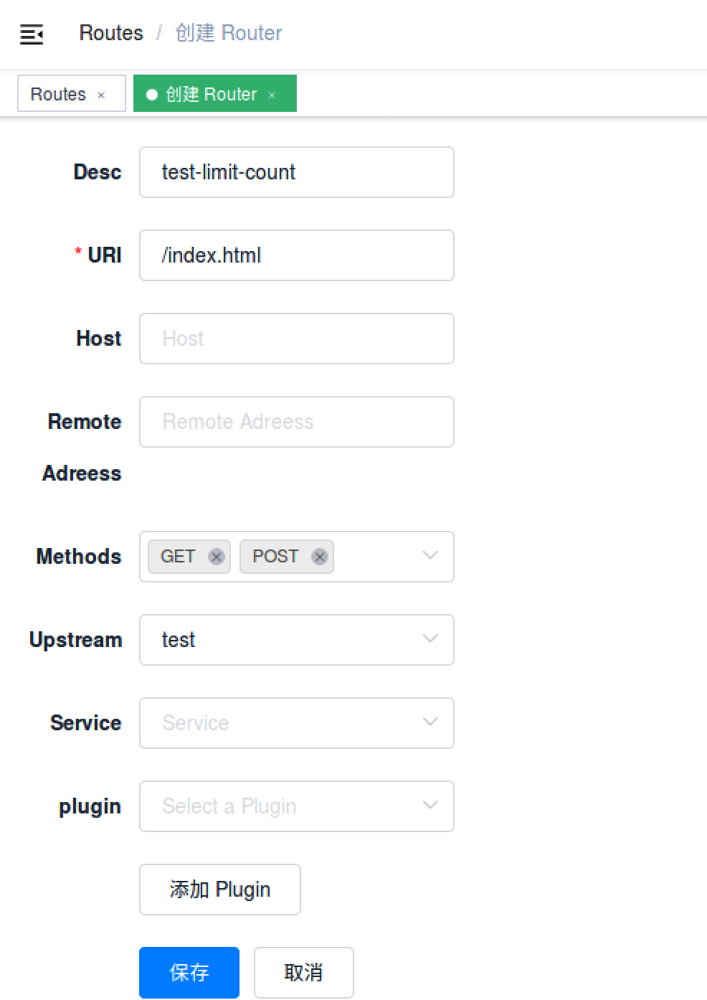

<!--
#
# Licensed to the Apache Software Foundation (ASF) under one or more
# contributor license agreements.  See the NOTICE file distributed with
# this work for additional information regarding copyright ownership.
# The ASF licenses this file to You under the Apache License, Version 2.0
# (the "License"); you may not use this file except in compliance with
# the License.  You may obtain a copy of the License at
#
#     http://www.apache.org/licenses/LICENSE-2.0
#
# Unless required by applicable law or agreed to in writing, software
# distributed under the License is distributed on an "AS IS" BASIS,
# WITHOUT WARRANTIES OR CONDITIONS OF ANY KIND, either express or implied.
# See the License for the specific language governing permissions and
# limitations under the License.
#
-->

[English](limit-count.md)
# limit-count

和 [GitHub API 的限速](https://developer.github.com/v3/#rate-limiting)类似，
在指定的时间范围内，限制总的请求个数。并且在 HTTP 响应头中返回剩余可以请求的个数。

### 参数

|名称           |可选项  |说明|
|---------     |--------|-----------|
|count         |必选     |指定时间窗口内的请求数量阈值|
|time_window   |必选     |时间窗口的大小（以秒为单位），超过这个时间就会重置|
|key           |必选     |是用来做请求计数的依据，当前接受的 key 有: "remote_addr", "server_addr", "http_x_real_ip", "http_x_forwarded_for"。|
|rejected_code |可选     |T当请求超过阈值被拒绝时，返回的 HTTP 状态码，默认是 503|
|policy        |可选     |用于检索和增加限制的速率限制策略。可选的值有：`local`(计数器被以内存方式保存在节点本地，默认选项) 和 `redis`(计数器保存在 Redis 服务节点上，从而可以跨节点共享结果，通常用它来完成全局限速).|
|redis_host    |可选     |当使用 `redis` 限速策略时，该属性是 Redis 服务节点的地址。|
|redis_port    |可选     |当使用 `redis` 限速策略时，该属性是 Redis 服务节点的端口，默认端口 6379。|
|redis_timeout |可选     |当使用 `redis` 限速策略时，该属性是 Redis 服务节点以毫秒为单位的超时时间，默认是 1000 ms（1 秒）。|

### 示例

#### 开启插件
下面是一个示例，在指定的 `route` 上开启了 `limit count` 插件:

```shell
curl -i http://127.0.0.1:9080/apisix/admin/routes/1 -X PUT -d '
{
    "uri": "/index.html",
    "plugins": {
        "limit-count": {
            "count": 2,
            "time_window": 60,
            "rejected_code": 503,
            "key": "remote_addr"
        }
    },
    "upstream": {
        "type": "roundrobin",
        "nodes": {
            "39.97.63.215:80": 1
        }
    }
}'
```

你可以使用浏览器打开 dashboard：`http://127.0.0.1:9080/apisix/dashboard/`，通过 web 界面来完成上面的操作，先增加一个 route：


然后在 route 页面中添加 limit-count 插件：


如果你需要一个集群级别的流量控制，我们可以借助 redis server 来完成。不同的 APISIX 节点之间将共享流量限速结果，实现集群流量限速。

请看下面例子：

```shell
curl -i http://127.0.0.1:9080/apisix/admin/routes/1 -X PUT -d '
{
    "uri": "/index.html",
    "plugins": {
        "limit-count": {
            "count": 2,
            "time_window": 60,
            "rejected_code": 503,
            "key": "remote_addr",
            "policy": "redis",
            "redis_host": "127.0.0.1",
            "redis_port": 6379,
            "redis_timeout": 1001
        }
    },
    "upstream": {
        "type": "roundrobin",
        "nodes": {
            "39.97.63.215:80": 1
        }
    }
}'
```

#### 测试插件
上述配置限制了 60 秒内只能访问 2 次，前两次访问都会正常访问：
```shell
curl -i http://127.0.0.1:9080/index.html
```

响应头里面包含了 `X-RateLimit-Limit` 和 `X-RateLimit-Remaining`，他们的含义分别是限制的总请求数和剩余还可以发送的请求数：
```
HTTP/1.1 200 OK
Content-Type: text/html
Content-Length: 13175
Connection: keep-alive
X-RateLimit-Limit: 2
X-RateLimit-Remaining: 0
Server: APISIX web server
```

当你第三次访问的时候，就会收到包含 503 返回码的响应头：
```
HTTP/1.1 503 Service Temporarily Unavailable
Content-Type: text/html
Content-Length: 194
Connection: keep-alive
Server: APISIX web server

<html>
<head><title>503 Service Temporarily Unavailable</title></head>
<body>
<center><h1>503 Service Temporarily Unavailable</h1></center>
<hr><center>openresty</center>
</body>
</html>
```

这就表示 `limit count` 插件生效了。

#### 移除插件
当你想去掉 `limit count` 插件的时候，很简单，在插件的配置中把对应的 json 配置删除即可，无须重启服务，即刻生效：

```shell
curl http://127.0.0.1:9080/apisix/admin/routes/1 -X PUT -d '
{
    "methods": ["GET"],
    "uri": "/index.html",
    "upstream": {
        "type": "roundrobin",
        "nodes": {
            "39.97.63.215:80": 1
        }
    }
}'
```

现在就已经移除了 `limit count` 插件了。其他插件的开启和移除也是同样的方法。
