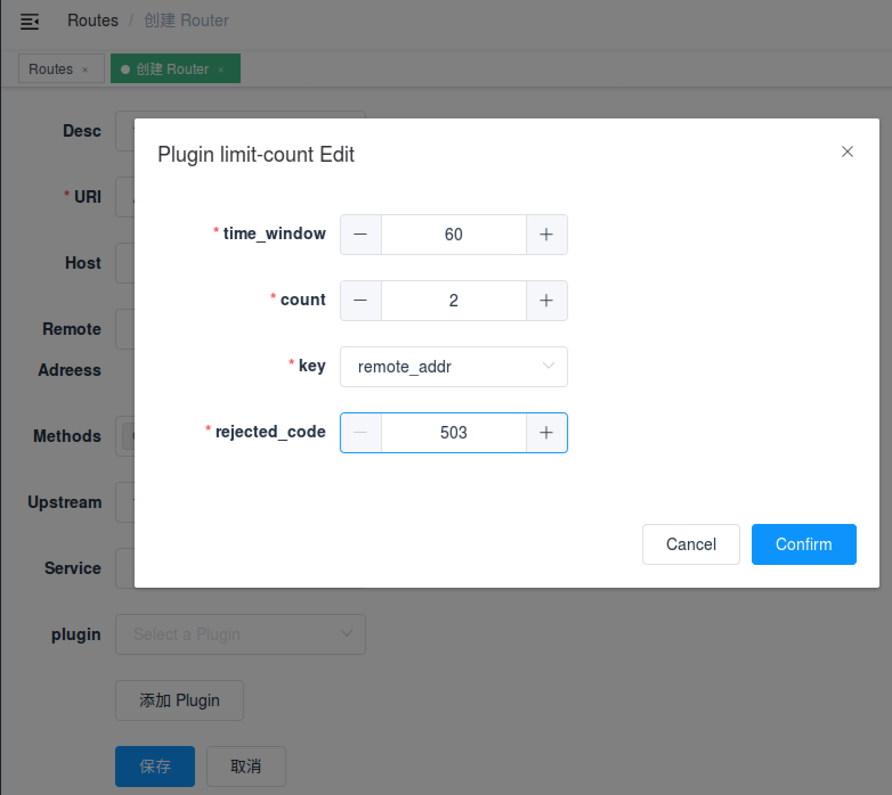

<!--
#
# Licensed to the Apache Software Foundation (ASF) under one or more
# contributor license agreements.  See the NOTICE file distributed with
# this work for additional information regarding copyright ownership.
# The ASF licenses this file to You under the Apache License, Version 2.0
# (the "License"); you may not use this file except in compliance with
# the License.  You may obtain a copy of the License at
#
#     http://www.apache.org/licenses/LICENSE-2.0
#
# Unless required by applicable law or agreed to in writing, software
# distributed under the License is distributed on an "AS IS" BASIS,
# WITHOUT WARRANTIES OR CONDITIONS OF ANY KIND, either express or implied.
# See the License for the specific language governing permissions and
# limitations under the License.
#
-->

- [中文](../zh-cn/plugins/limit-count.md)

# Summary

- [**Name**](#name)
- [**Attributes**](#attributes)
- [**How To Enable**](#how-to-enable)
- [**Test Plugin**](#test-plugin)
- [**Disable Plugin**](#disable-plugin)

## Name

Limit request rate by a fixed number of requests in a given time window.

## Attributes

|Name          |Requirement  |Description|
|---------     |--------|-----------|
|count         |required|the specified number of requests threshold.|
|time_window   |required|the time window in seconds before the request count is reset.|
|key           |required|the user specified key to limit the rate. Here is fully key list: "remote_addr", "server_addr", "http_x_real_ip", "http_x_forwarded_for".|
|rejected_code |optional|The HTTP status code returned when the request exceeds the threshold is rejected, default 503.|
|policy        |optional|The rate-limiting policies to use for retrieving and incrementing the limits. Available values are `local`(the counters will be stored locally in-memory on the node, default value) and `redis`(counters are stored on a Redis server and will be shared across the nodes, usually used it to do the global speed limit).|
|redis_host    |optional|When using the `redis` policy, this property specifies the address of the Redis server.|
|redis_port    |optional|When using the `redis` policy, this property specifies the port of the Redis server. The default port is 6379.|
|redis_password|optional|When using the `redis` policy, this property specifies the password of the Redis server.|
|redis_timeout |optional|When using the `redis` policy, this property specifies the timeout in milliseconds of any command submitted to the Redis server. The default timeout is 1000 ms(1 second).|


**Key can be customized by the user, only need to modify a line of code of the plug-in to complete.  It is a security consideration that is not open in the plugin.**

## How To Enable

Here's an example, enable the `limit count` plugin on the specified route:

```shell
curl -i http://127.0.0.1:9080/apisix/admin/routes/1 -H 'X-API-KEY: edd1c9f034335f136f87ad84b625c8f1' -X PUT -d '
{
    "uri": "/index.html",
    "plugins": {
        "limit-count": {
            "count": 2,
            "time_window": 60,
            "rejected_code": 503,
            "key": "remote_addr"
        }
    },
    "upstream": {
        "type": "roundrobin",
        "nodes": {
            "39.97.63.215:80": 1
        }
    }
}'
```

You can open dashboard with a browser: `http://127.0.0.1:9080/apisix/dashboard/`, to complete the above operation through the web interface, first add a route:


Then add limit-count plugin:


If you need a cluster-level precision traffic limit, then we can do it with the redis server. The rate limit of the traffic will be shared between different APISIX nodes to limit the rate of cluster traffic.

Here is the example:

```shell
curl -i http://127.0.0.1:9080/apisix/admin/routes/1 -H 'X-API-KEY: edd1c9f034335f136f87ad84b625c8f1' -X PUT -d '
{
    "uri": "/index.html",
    "plugins": {
        "limit-count": {
            "count": 2,
            "time_window": 60,
            "rejected_code": 503,
            "key": "remote_addr",
            "policy": "redis",
            "redis_host": "127.0.0.1",
            "redis_port": 6379,
            "redis_password": "password",
            "redis_timeout": 1001
        }
    },
    "upstream": {
        "type": "roundrobin",
        "nodes": {
            "39.97.63.215:80": 1
        }
    }
}'
```

## Test Plugin

The above configuration limits access to only 2 times in 60 seconds. The first two visits will be normally:

```shell
curl -i http://127.0.0.1:9080/index.html
```

The response header contains `X-RateLimit-Limit` and `X-RateLimit-Remaining`,
 which mean the total number of requests and the remaining number of requests that can be sent:

```
HTTP/1.1 200 OK
Content-Type: text/html
Content-Length: 13175
Connection: keep-alive
X-RateLimit-Limit: 2
X-RateLimit-Remaining: 0
Server: APISIX web server
```

When you visit for the third time, you will receive a response with the 503 HTTP code:

```
HTTP/1.1 503 Service Temporarily Unavailable
Content-Type: text/html
Content-Length: 194
Connection: keep-alive
Server: APISIX web server

<html>
<head><title>503 Service Temporarily Unavailable</title></head>
<body>
<center><h1>503 Service Temporarily Unavailable</h1></center>
<hr><center>openresty</center>
</body>
</html>
```

This means that the `limit count` plugin is in effect.

## Disable Plugin

When you want to disable the `limit count` plugin, it is very simple,
 you can delete the corresponding json configuration in the plugin configuration,
  no need to restart the service, it will take effect immediately:

```shell
curl http://127.0.0.1:9080/apisix/admin/routes/1 -H 'X-API-KEY: edd1c9f034335f136f87ad84b625c8f1' -X PUT -d '
{
    "methods": ["GET"],
    "uri": "/index.html",
    "upstream": {
        "type": "roundrobin",
        "nodes": {
            "39.97.63.215:80": 1
        }
    }
}'
```

The `limit count` plugin has been disabled now. It works for other plugins.
