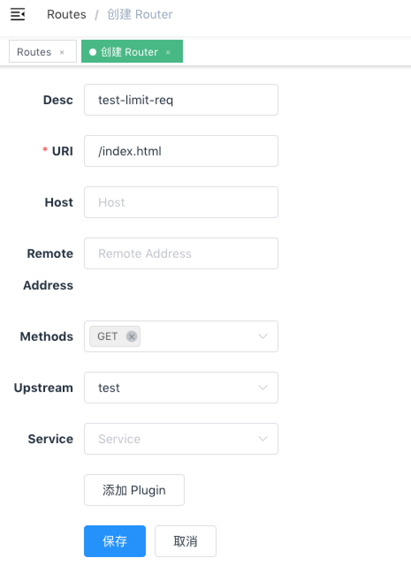
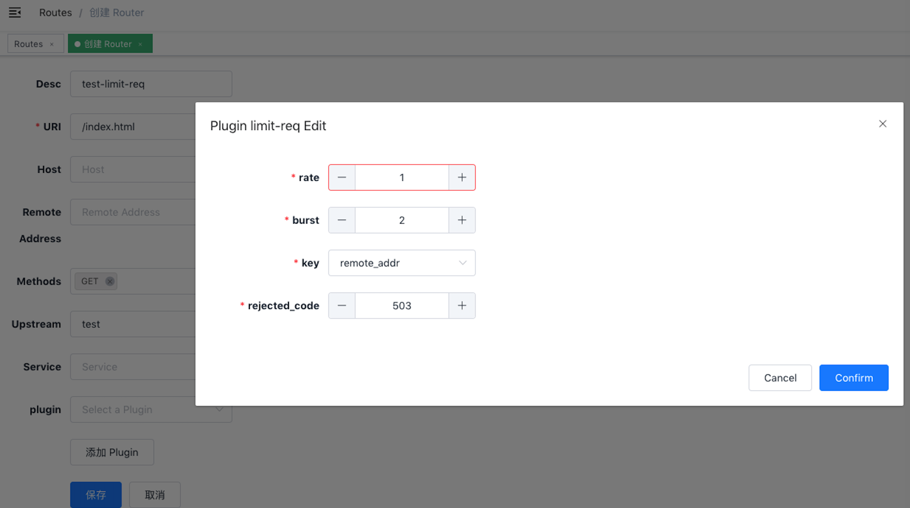

<!--
#
# Licensed to the Apache Software Foundation (ASF) under one or more
# contributor license agreements.  See the NOTICE file distributed with
# this work for additional information regarding copyright ownership.
# The ASF licenses this file to You under the Apache License, Version 2.0
# (the "License"); you may not use this file except in compliance with
# the License.  You may obtain a copy of the License at
#
#     http://www.apache.org/licenses/LICENSE-2.0
#
# Unless required by applicable law or agreed to in writing, software
# distributed under the License is distributed on an "AS IS" BASIS,
# WITHOUT WARRANTIES OR CONDITIONS OF ANY KIND, either express or implied.
# See the License for the specific language governing permissions and
# limitations under the License.
#
-->

[Chinese](limit-req-cn.md)

# Summary
- [**Name**](#name)
- [**Attributes**](#attributes)
- [**How To Enable**](#how-to-enable)
- [**Test Plugin**](#test-plugin)
- [**Disable Plugin**](#disable-plugin)

## Name
limit request rate using the "leaky bucket" method.

## Attributes

|Name          |Requirement  |Description|
|---------     |--------|-----------|
|rate          |required|is the specified request rate (number per second) threshold. Requests exceeding this rate (and below `burst`) will get delayed to conform to the rate.|
|burst         |required|is the number of excessive requests per second allowed to be delayed. Requests exceeding this hard limit will get rejected immediately.|
|rejected_code |required|The HTTP status code returned when the request exceeds the threshold is rejected. The default is 503.|
| key          |required|is the user specified key to limit the rate, now accept those as key: "remote_addr"(client's IP), "server_addr"(server's IP), "X-Forwarded-For/X-Real-IP" in request header.|

## How To Enable

Here's an example, enable the limit req plugin on the specified route:

```shell
curl http://127.0.0.1:9080/apisix/admin/routes/1 -X PUT -d '
{
    "methods": ["GET"],
    "uri": "/index.html",
    "plugins": {
        "limit-req": {
            "rate": 1,
            "burst": 2,
            "rejected_code": 503,
            "key": "remote_addr"
        }
    },
    "upstream": {
        "type": "roundrobin",
        "nodes": {
            "39.97.63.215:80": 1
        }
    }
}'
```

You can open dashboard with a browser: `http://127.0.0.1:9080/apisix/dashboard/`, to complete the above operation through the web interface, first add a route:



Then add limit-req plugin:



## Test Plugin
The above configuration limits the request rate to 1 per second. If it is greater than 1 and less than 3, the delay will be added. If the rate exceeds 3, it will be rejected:
```shell
curl -i http://127.0.0.1:9080/index.html
```

When you exceed, you will receive a response header with a 503 return code:
```
HTTP/1.1 503 Service Temporarily Unavailable
Content-Type: text/html
Content-Length: 194
Connection: keep-alive
Server: APISIX web server

<html>
<head><title>503 Service Temporarily Unavailable</title></head>
<body>
<center><h1>503 Service Temporarily Unavailable</h1></center>
<hr><center>openresty</center>
</body>
</html>
```

This means that the limit req plugin is in effect.

## Disable Plugin
When you want to disable the limit req plugin, it is very simple,
 you can delete the corresponding json configuration in the plugin configuration,
  no need to restart the service, it will take effect immediately:
```shell
curl http://127.0.0.1:9080/apisix/admin/routes/1 -X PUT -d '
{
    "methods": ["GET"],
    "uri": "/index.html",
    "id": 1,
    "plugins": {
    },
    "upstream": {
        "type": "roundrobin",
        "nodes": {
            "39.97.63.215:80": 1
        }
    }
}'
```

The limit req plugin has been disabled now. It works for other plugins.
