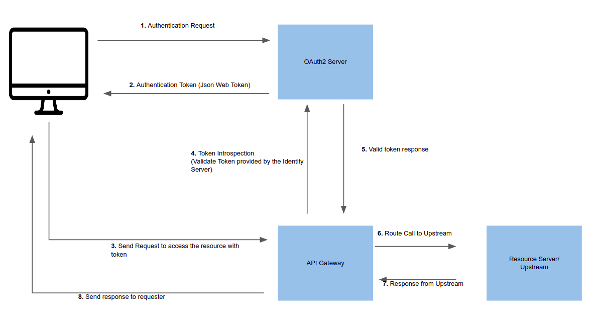

<!--
#
# Licensed to the Apache Software Foundation (ASF) under one or more
# contributor license agreements.  See the NOTICE file distributed with
# this work for additional information regarding copyright ownership.
# The ASF licenses this file to You under the Apache License, Version 2.0
# (the "License"); you may not use this file except in compliance with
# the License.  You may obtain a copy of the License at
#
#     http://www.apache.org/licenses/LICENSE-2.0
#
# Unless required by applicable law or agreed to in writing, software
# distributed under the License is distributed on an "AS IS" BASIS,
# WITHOUT WARRANTIES OR CONDITIONS OF ANY KIND, either express or implied.
# See the License for the specific language governing permissions and
# limitations under the License.
#
-->

# Summary

- [**Name**](#name)
- [**Attributes**](#attributes)
- [**Token Introspection**](#token-introspection)

## Name

The OAuth 2 / Open ID Connect(OIDC) plugin provides authentication and introspection capability to APISIX.

## Attributes

|Name           |Requirement    |Description|
|-------        |-----          |------|
|client_id      |required       |OAuth client ID|
|client_secret  |required       |OAuth client secret|
|discovery      |required       |URL of the discovery endpoint of the identity server|
|realm          |optional       |Realm used for the authentication; default is apisix|
|bearer_only    |optional       |Setting this `true` will check for the authorization header in the request with a bearer token; default is `false`|
|logout_path    |optional       |default is `/logout`|
|redirect_uri   |optional       |default is `ngx.var.request_uri`|
|timeout        |optional       |default is 3 seconds|
|ssl_verify     |optional       |default is `false`|
|introspection_endpoint                 |optional       |URL of the token verification endpoint of the identity server|
|introspection_endpoint_auth_method     |optional       |Authentication method name for token introspection |

### Token Introspection

Token introspection helps to validate a request by verifying the token against an Oauth 2 authorization server.
As prerequisite, you should create a trusted client in the identity server and generate a valid token(JWT) for introspection.
The following image shows an example(successful) flow of the token introspection via the gateway.



The following is the curl command to enable the plugin to an external service.
This route will protect `https://httpbin.org/get`(echo service) by introspecting the token provided in the header of the request.

```bash
curl http://127.0.0.1:9080/apisix/admin/routes/5 -X PUT -d '
{
  "uri": "/get",
  "plugins": {
    "proxy-rewrite": {
      "scheme": "https"
    },
    "openid-connect": {
      "client_id": "api_six_client_id",
      "client_secret": "client_secret_code",
      "discovery": "full_URL_of_the_discovery_endpoint",
      "introspection_endpoint": "full_URL_of_introspection_endpoint",
      "bearer_only": true,
      "realm": "master",
      "introspection_endpoint_auth_method": "client_secret_basic"
    }
  },
  "upstream": {
    "type": "roundrobin",
    "nodes": {
      "httpbin.org:443": 1
    }
  }
}'
```

The following command can be used to access the new route.

```bash
curl -i -X GET http://127.0.0.1:9080/get -H "Host: httpbin.org" -H "Authorization: Bearer {replace_jwt_token}"
```

## Troubleshooting

Check/modify the DNS settings (`conf/config.yml) if APISIX cannot resolve/connect to the identity provider.
