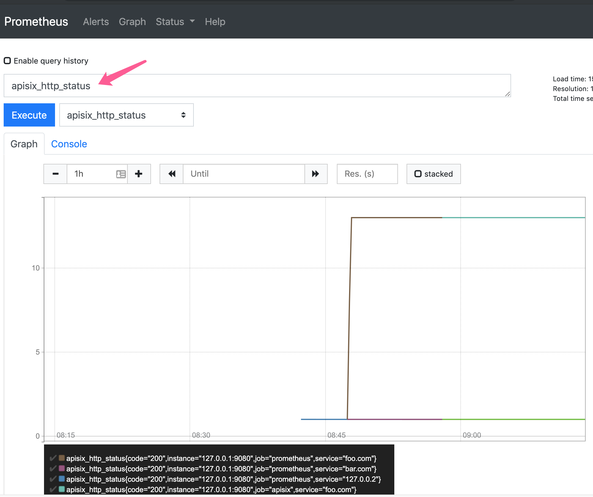

<!--
#
# Licensed to the Apache Software Foundation (ASF) under one or more
# contributor license agreements.  See the NOTICE file distributed with
# this work for additional information regarding copyright ownership.
# The ASF licenses this file to You under the Apache License, Version 2.0
# (the "License"); you may not use this file except in compliance with
# the License.  You may obtain a copy of the License at
#
#     http://www.apache.org/licenses/LICENSE-2.0
#
# Unless required by applicable law or agreed to in writing, software
# distributed under the License is distributed on an "AS IS" BASIS,
# WITHOUT WARRANTIES OR CONDITIONS OF ANY KIND, either express or implied.
# See the License for the specific language governing permissions and
# limitations under the License.
#
-->

[English](prometheus.md)

# prometheus

此插件是提供符合prometheus数据格式的监控指标数据。

## 属性

无

## 如何开启插件

`prometheus` 插件用空{}就可以开启了,他没有任何的选项。

例子如下:

```shell
curl http://127.0.0.1:9080/apisix/admin/routes/1 -X PUT -d '
{
    "uri": "/hello",
    "plugins": {
        "prometheus":{}
    },
    "upstream": {
        "type": "roundrobin",
        "nodes": {
            "127.0.0.1:80": 1
        }
    }
}'
```

你可以使用浏览器打开 dashboard：`http://127.0.0.1:9080/apisix/dashboard/`，通过 web 界面来完成上面的操作，先增加一个 route：


然后在 route 页面中添加 prometheus 插件：


## 如何提取指标数据

我们可以从指定的url中提取指标数据 `/apisix/prometheus/metrics`.

把改uri地址配置到 prometheus 中去,就会自动完成指标数据提取.

例子如下:

```yaml
scrape_configs:
  - job_name: 'apisix'
    metrics_path: '/apisix/prometheus/metrics'
    static_configs:
    - targets: ['127.0.0.1:9080']
```

我们也可以在 prometheus 控制台中去检查状态:





### Grafana 面板

插件导出的指标可以在 Grafana 进行图形化绘制显示。

你可以到 [Grafana meta](https://grafana.com/grafana/dashboards/11719) 下载 `Grafana` 元数据.


### 可有的指标

* `Status codes`: upstream 服务返回的 HTTP 状态码，每个服务返回状态码的次数或者所有服务的状态码次数总和都可以统计到。
* `Bandwidth`: 流经apisix的总带宽(可分出口带宽和入口带宽). 每个服务指标或者是所有服务指标的总和都可以统计到。
* `etcd reachability`: apisix 连接 etcd 的可用性，用 0 和 1来表示。
* `Connections`: 各种的 Nginx 连接指标，如 active（正处理的活动连接数），reading（nginx 读取到客户端的 Header 信息数），writing（nginx 返回给客户端的 Header 信息数），已建立的连接数。.

这里是apisix的原始的指标数据集:

```
$ curl http://127.0.0.2:9080/apisix/prometheus/metrics
# HELP apisix_bandwidth Total bandwidth in bytes consumed per service in Apisix
# TYPE apisix_bandwidth counter
apisix_bandwidth{type="egress",service="127.0.0.2"} 183
apisix_bandwidth{type="egress",service="bar.com"} 183
apisix_bandwidth{type="egress",service="foo.com"} 2379
apisix_bandwidth{type="ingress",service="127.0.0.2"} 83
apisix_bandwidth{type="ingress",service="bar.com"} 76
apisix_bandwidth{type="ingress",service="foo.com"} 988
# HELP apisix_etcd_reachable Config server etcd reachable from Apisix, 0 is unreachable
# TYPE apisix_etcd_reachable gauge
apisix_etcd_reachable 1
# HELP apisix_http_status HTTP status codes per service in Apisix
# TYPE apisix_http_status counter
apisix_http_status{code="200",service="127.0.0.2"} 1
apisix_http_status{code="200",service="bar.com"} 1
apisix_http_status{code="200",service="foo.com"} 13
# HELP apisix_nginx_http_current_connections Number of HTTP connections
# TYPE apisix_nginx_http_current_connections gauge
apisix_nginx_http_current_connections{state="accepted"} 11994
apisix_nginx_http_current_connections{state="active"} 2
apisix_nginx_http_current_connections{state="handled"} 11994
apisix_nginx_http_current_connections{state="reading"} 0
apisix_nginx_http_current_connections{state="total"} 1191780
apisix_nginx_http_current_connections{state="waiting"} 1
apisix_nginx_http_current_connections{state="writing"} 1
# HELP apisix_nginx_metric_errors_total Number of nginx-lua-prometheus errors
# TYPE apisix_nginx_metric_errors_total counter
apisix_nginx_metric_errors_total 0
```
