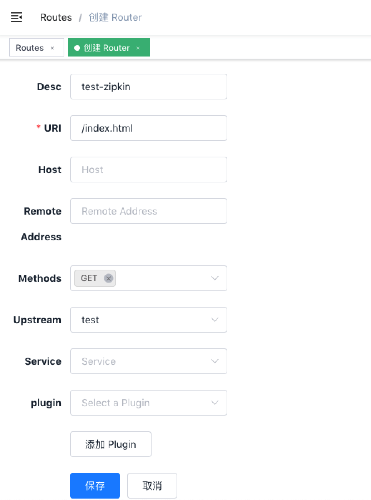
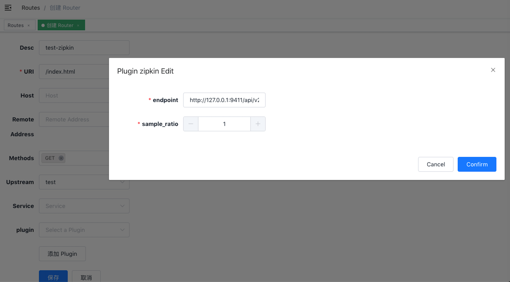

[English](zipkin.md)

# 目录
- [**名字**](#名字)
- [**属性**](#属性)
- [**如何启用**](#如何启用)
- [**测试插件**](#测试插件)
- [**禁用插件**](#禁用插件)

## 名字

`zipkin`(https://github.com/openzipkin/zipkin) 是一个开源的服务跟踪插件。

它还可以在 “Apache SkyWalking” 上运行，支持 Zipkin v1/v2 格式。

## 属性

* `endpoint`: Ziplin 的 http 节点，例如`http://127.0.0.1:9411/api/v2/spans`。
* `sample_ratio`: 监听的比例，最小为0.00001，最大为1。

## 如何启用

下面是一个示例，在指定的 route 上开启了 zipkin 插件:

```shell
curl http://127.0.0.1:9080/apisix/admin/routes/1 -X PUT -d '
{
    "methods": ["GET"],
    "uri": "/index.html",
    "plugins": {
        "zipkin": {
            "endpoint": "http://127.0.0.1:9411/api/v2/spans",
            "sample_ratio": 1
        }
    },
    "upstream": {
        "type": "roundrobin",
        "nodes": {
            "39.97.63.215:80": 1
        }
    }
}'
```

你可以使用浏览器打开 dashboard：`http://127.0.0.1:9080/apisix/dashboard/`，通过 web 界面来完成上面的操作，先增加一个 route：



然后在 route 页面中添加 zipkin 插件：



## 测试插件

### 运行 Zipkin 实例

e.g. 用docker:

```
sudo docker run -d -p 9411:9411 openzipkin/zipkin
```

测试示例:

```shell
$ curl http://127.0.0.1:9080/index.html
HTTP/1.1 200 OK
...
```

打开浏览器，访问 Zipkin 的 web 页面：

```
http://127.0.0.1:9411/zipkin
```


## 禁用插件

当你想去掉插件的时候，很简单，在插件的配置中把对应的 json 配置删除即可，无须重启服务，即刻生效：

```shell
$ curl http://127.0.0.1:2379/v2/keys/apisix/routes/1 -X PUT -d value='
{
    "methods": ["GET"],
    "uri": "/index.html",
    "plugins": {
    },
    "upstream": {
        "type": "roundrobin",
        "nodes": {
            "39.97.63.215:80": 1
        }
    }
}'
```

现在就已经移除了 Zipkin 插件了。其他插件的开启和移除也是同样的方法。
