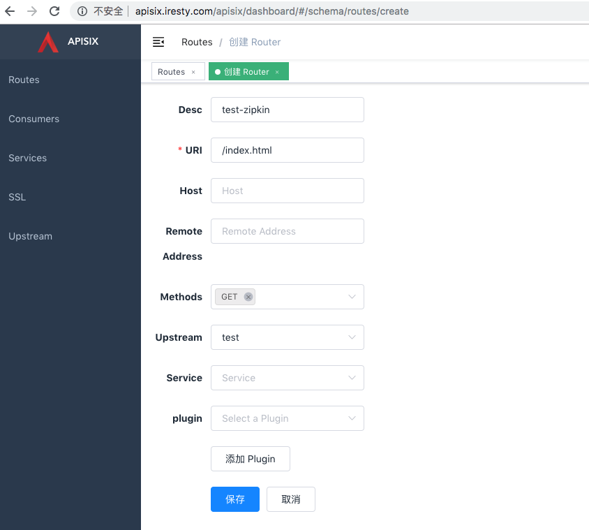
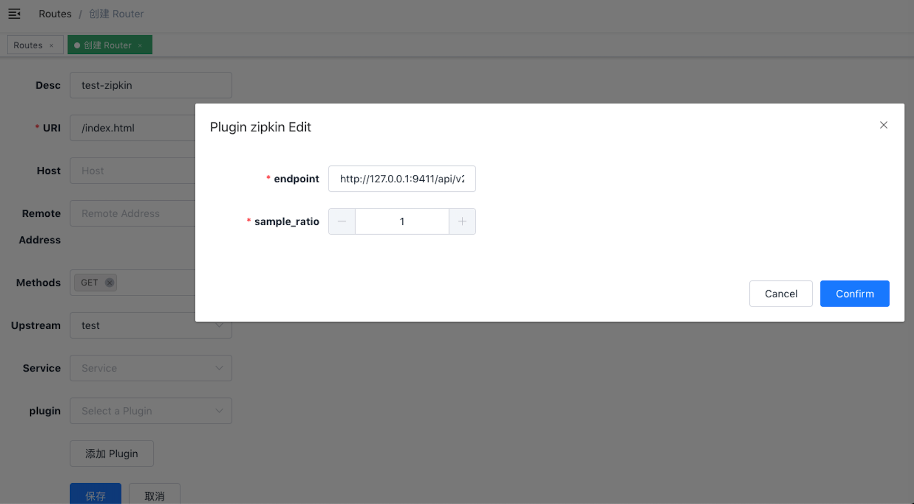
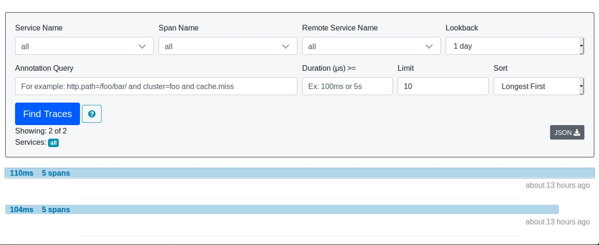
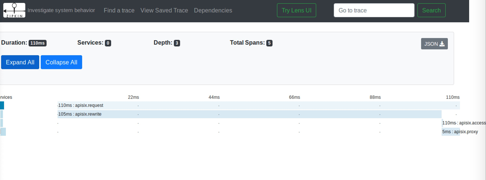

[中文](zipkin-cn.md)

# Summary
- [**Name**](#name)
- [**Attributes**](#attributes)
- [**How To Enable**](#how-to-enable)
- [**Test Plugin**](#test-plugin)
- [**Disable Plugin**](#disable-plugin)


## Name

[Zipkin](https://github.com/openzipkin/zipkin) is a OpenTracing plugin.

It's also works with `Apache SkyWalking`, which is support Zipkin v1/v2 format.

## Attributes

* `endpoint`: the http endpoint of Ziplin, for example: `http://127.0.0.1:9411/api/v2/spans`.

* `sample_ratio`: the ratio of sample, the minimum is 0.00001, the maximum is 1.

## How To Enable

Here's an example, enable the zipkin plugin on the specified route:

```shell
curl http://127.0.0.1:9080/apisix/admin/routes/1 -X PUT -d '
{
    "methods": ["GET"],
    "uri": "/index.html",
    "plugins": {
        "zipkin": {
            "endpoint": "http://127.0.0.1:9411/api/v2/spans",
            "sample_ratio": 1
        }
    },
    "upstream": {
        "type": "roundrobin",
        "nodes": {
            "39.97.63.215:80": 1
        }
    }
}'
```

You can open dashboard with a browser: `http://127.0.0.1:9080/apisix/dashboard/`, to complete the above operation through the web interface, first add a route:



Then add zipkin plugin:



## Test Plugin

### run the Zipkin instance

e.g. using docker:

```
sudo docker run -d -p 9411:9411 openzipkin/zipkin
```

Here is a test example:

```shell
$ curl http://127.0.0.1:9080/index.html
HTTP/1.1 200 OK
...
```

Then you can use a browser to access the webUI of Zipkin:

```
http://127.0.0.1:9411/zipkin
```





## Disable Plugin

When you want to disable the zipkin plugin, it is very simple,
 you can delete the corresponding json configuration in the plugin configuration,
  no need to restart the service, it will take effect immediately:

```shell
$ curl http://127.0.0.1:2379/v2/keys/apisix/routes/1 -X PUT -d value='
{
    "methods": ["GET"],
    "uri": "/index.html",
    "plugins": {
    },
    "upstream": {
        "type": "roundrobin",
        "nodes": {
            "39.97.63.215:80": 1
        }
    }
}'
```

The zipkin plugin has been disabled now. It works for other plugins.
