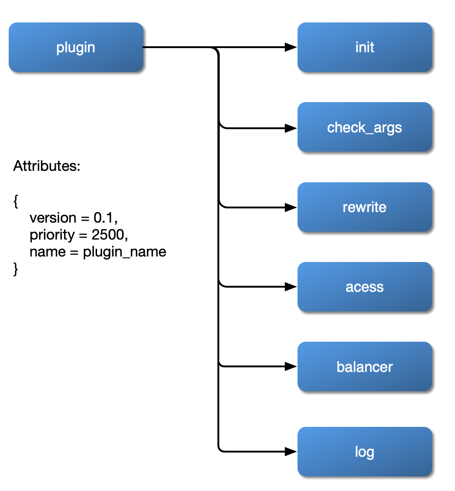
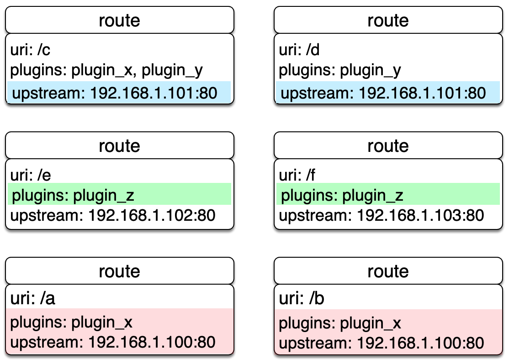
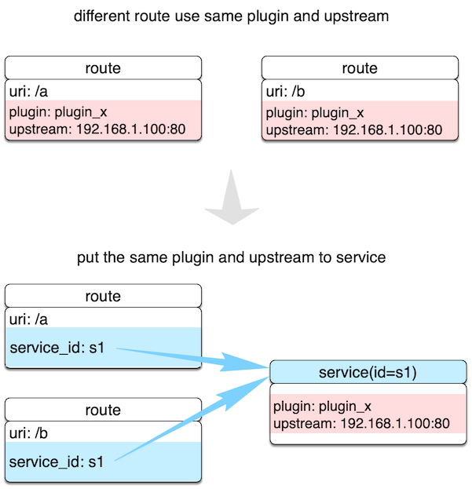
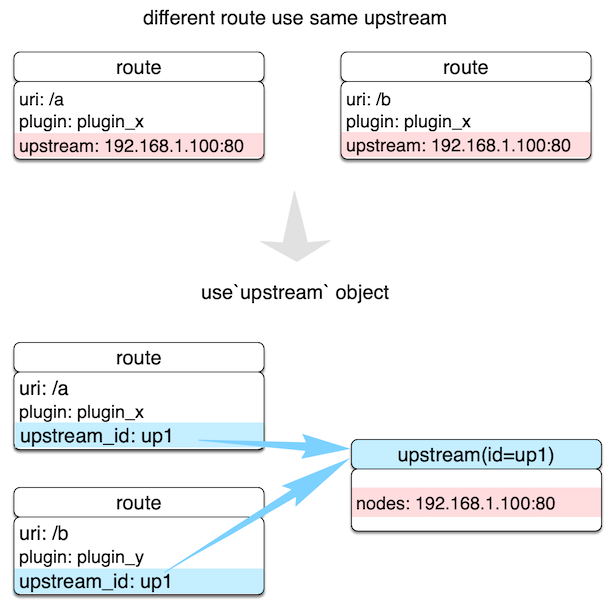
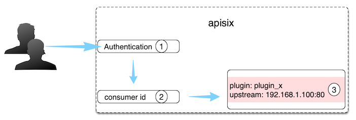

<!--
#
# Licensed to the Apache Software Foundation (ASF) under one or more
# contributor license agreements.  See the NOTICE file distributed with
# this work for additional information regarding copyright ownership.
# The ASF licenses this file to You under the Apache License, Version 2.0
# (the "License"); you may not use this file except in compliance with
# the License.  You may obtain a copy of the License at
#
#     http://www.apache.org/licenses/LICENSE-2.0
#
# Unless required by applicable law or agreed to in writing, software
# distributed under the License is distributed on an "AS IS" BASIS,
# WITHOUT WARRANTIES OR CONDITIONS OF ANY KIND, either express or implied.
# See the License for the specific language governing permissions and
# limitations under the License.
#
-->

# 目录

- [**APISIX**](#apisix)
- [**APISIX Config**](#apisix-config)
- [**Route**](#route)
- [**Service**](#service)
- [**Plugin**](#plugin)
- [**Script**](#script)
- [**Upstream**](#upstream)
- [**Router**](#router)
- [**Consumer**](#consumer)
- [**Global Rule**](#Global-Rule)
- [**Debug mode**](#Debug-mode)

## APISIX

### 插件加载流程


### 插件内部结构



## APISIX Config

通过修改本地 `conf/config.yaml` 文件完成对 APISIX 服务本身的基本配置。

比如修改 APISIX 默认监听端口为 8000，其他配置保持默认，在 `conf/config.yaml` 中只需这样配置：

```yaml
apisix:
  node_listen: 8000             # APISIX listening port
```

比如指定 APISIX 默认监听端口为 8000，并且设置 etcd 地址为 `http://foo:2379`，
其他配置保持默认。在 `conf/config.yaml` 中只需这样配置：

```yaml
apisix:
  node_listen: 8000             # APISIX listening port

etcd:
  host: "http://foo:2379"       # etcd address
```

其他默认配置，可以在 `conf/config-default.yaml` 文件中看到，该文件是与 APISIX 源码强绑定，
**永远不要**手工修改 `conf/config-default.yaml` 文件。如果需要自定义任何配置，都应在 `conf/config.yaml` 文件中完成。

*注意* 不要手工修改 APISIX 自身的 `conf/nginx.conf` 文件，当服务每次启动时，`apisix`
会根据 `conf/config.yaml` 配置自动生成新的 `conf/nginx.conf` 并自动启动服务。

[返回目录](#目录)

## Route

Route 字面意思就是路由，通过定义一些规则来匹配客户端的请求，然后根据匹配结果加载并执行相应的
插件，并把请求转发给到指定 Upstream。

Route 中主要包含三部分内容：匹配规则(比如 uri、host、remote_addr 等)，插件配置(限流限速等)和上游信息。
请看下图示例，是一些 Route 规则的实例，当某些属性值相同时，图中用相同颜色标识。



我们直接在 Route 中完成所有参数的配置，优点是容易设置，每个 Route 都相对独立自由度比较高。但当我们的 Route 有比较多的重复配置（比如启用相同的插件配置或上游信息），一旦我们要更新这些相同属性时，就需要遍历所有 Route 并进行修改，给后期管理维护增加不少复杂度。

上面提及重复的缺点在 APISIX 中独立抽象了 [Service](#service) 和 [Upstream](#upstream) 两个概念来解决。

下面创建的 Route 示例，是把 URL 为 "/index.html" 的请求代理到地址为 "39.97.63.215:80" 的 Upstream 服务：

```shell
$ curl http://127.0.0.1:9080/apisix/admin/routes/1 -H 'X-API-KEY: edd1c9f034335f136f87ad84b625c8f1' -X PUT -i -d '
{
    "uri": "/index.html",
    "upstream": {
        "type": "roundrobin",
        "nodes": {
            "39.97.63.215:80": 1
        }
    }
}'

HTTP/1.1 201 Created
Date: Sat, 31 Aug 2019 01:17:15 GMT
Content-Type: text/plain
Transfer-Encoding: chunked
Connection: keep-alive
Server: APISIX web server

{"node":{"value":{"uri":"\/index.html","upstream":{"nodes":{"39.97.63.215:80":1},"type":"roundrobin"}},"createdIndex":61925,"key":"\/apisix\/routes\/1","modifiedIndex":61925},"action":"create"}
```

当我们接收到成功应答，表示该 Route 已成功创建。

有关 Route 的具体选项，可具体查阅 [Admin API 之 Route](admin-api.md#route)。

[返回目录](#目录)

## Service

`Service` 是某类 API 的抽象（也可以理解为一组 Route 的抽象）。它通常与上游服务抽象是一一对应的，`Route`
与 `Service` 之间，通常是 N:1 的关系，参看下图。



不同 Route 规则同时绑定到一个 Service 上，这些 Route 将具有相同的上游和插件配置，减少冗余配置。

比如下面的例子，创建了一个启用限流插件的 Service，然后把 id 为 `100`、`101` 的 Route 都绑定在这个 Service 上。

```shell
# create new Service
$ curl http://127.0.0.1:9080/apisix/admin/services/200 -H 'X-API-KEY: edd1c9f034335f136f87ad84b625c8f1' -X PUT -d '
{
    "plugins": {
        "limit-count": {
            "count": 2,
            "time_window": 60,
            "rejected_code": 503,
            "key": "remote_addr"
        }
    },
    "upstream": {
        "type": "roundrobin",
        "nodes": {
            "39.97.63.215:80": 1
        }
    }
}'

# create new Route and reference the service by id `200`
curl http://127.0.0.1:9080/apisix/admin/routes/100 -H 'X-API-KEY: edd1c9f034335f136f87ad84b625c8f1' -X PUT -d '
{
    "methods": ["GET"],
    "uri": "/index.html",
    "service_id": "200"
}'

curl http://127.0.0.1:9080/apisix/admin/routes/101 -H 'X-API-KEY: edd1c9f034335f136f87ad84b625c8f1' -X PUT -d '
{
    "methods": ["GET"],
    "uri": "/foo/index.html",
    "service_id": "200"
}'
```

当然我们也可以为 Route 指定不同的插件参数或上游，比如下面这个 Route 设置了不同的限流参数，其他部分（比如上游）则继续使用 Service 中的配置参数。

```shell
curl http://127.0.0.1:9080/apisix/admin/routes/102 -H 'X-API-KEY: edd1c9f034335f136f87ad84b625c8f1' -X PUT -d '
{
    "uri": "/bar/index.html",
    "id": "102",
    "service_id": "200",
    "plugins": {
        "limit-count": {
            "count": 2000,
            "time_window": 60,
            "rejected_code": 503,
            "key": "remote_addr"
        }
    }
}'
```

注意：当 Route 和 Service 都开启同一个插件时，Route 参数的优先级是高于 Service 的。

[返回目录](#目录)

## Plugin

`Plugin` 表示将在 `HTTP` 请求/响应生命周期期间执行的插件配置。

`Plugin` 配置可直接绑定在 `Route` 上，也可以被绑定在 `Service` 或 `Consumer`上。而对于同一
个插件的配置，只能有一份是有效的，配置选择优先级总是 `Consumer` > `Route` > `Service`。

在 `conf/config.yaml` 中，可以声明本地 APISIX 节点都支持哪些插件。这是个白名单机制，不在该
白名单的插件配置，都将会被自动忽略。这个特性可用于临时关闭或打开特定插件，应对突发情况非常有效。

插件的配置可以被直接绑定在指定 Route 中，也可以被绑定在 Service 中，不过 Route 中的插件配置
优先级更高。

一个插件在一次请求中只会执行一次，即使被同时绑定到多个不同对象中（比如 Route 或 Service）。
插件运行先后顺序是根据插件自身的优先级来决定的，例如：

```lua
local _M = {
    version = 0.1,
    priority = 0, -- 这个插件的优先级为 0
    name = plugin_name,
    schema = schema,
    metadata_schema = metadata_schema,
}
```

插件配置作为 Route 或 Service 的一部分提交的，放到 `plugins` 下。它内部是使用插件
名字作为哈希的 key 来保存不同插件的配置项。

```json
{
    ...
    "plugins": {
        "limit-count": {
            "count": 2,
            "time_window": 60,
            "rejected_code": 503,
            "key": "remote_addr"
        },
        "prometheus": {}
    }
}
```

并不是所有插件都有具体配置项，比如 `prometheus` 下是没有任何具体配置项，这时候用一个空的对象
标识即可。

[查看 APISIX 已支持插件列表](plugins.md)

[返回目录](#目录)

## Script

`Script` 表示将在 `HTTP` 请求/响应生命周期期间执行的脚本。

`Script` 配置可直接绑定在 `Route` 上。

`Script` 与 `Plugin` 互斥，且优先执行 `Script` ，这意味着配置 `Script` 后，`Route` 上配置的 `Plugin` 将不被执行。

理论上，在 `Script` 中可以写任意 lua 代码，也可以直接调用已有插件以重用已有的代码。

`Script` 也有执行阶段概念，支持 `access`、`header_filer`、`body_filter` 和 `log` 阶段。系统会在相应阶段中自动执行 `Script` 脚本中对应阶段的代码。

```json
{
    ...
    "script": "local _M = {} \n function _M.access(api_ctx) \n ngx.log(ngx.INFO,\"hit access phase\") \n end \nreturn _M"
}
```

[返回目录](#目录)

## Upstream

Upstream 是虚拟主机抽象，对给定的多个服务节点按照配置规则进行负载均衡。Upstream 的地址信息可以直接配置到 `Route`（或 `Service`) 上，当 Upstream 有重复时，就需要用“引用”方式避免重复了。



如上图所示，通过创建 Upstream 对象，在 `Route` 用 ID 方式引用，就可以确保只维护一个对象的值了。

Upstream 的配置可以被直接绑定在指定 `Route` 中，也可以被绑定在 `Service` 中，不过 `Route` 中的配置
优先级更高。这里的优先级行为与 `Plugin` 非常相似

### 配置参数

APISIX 的 Upstream 除了基本的复杂均衡算法选择外，还支持对上游做主被动健康检查、重试等逻辑，具体看下面表格。

|名字    |可选|说明|
|-------         |-----|------|
|type            |必填|`roundrobin` 支持权重的负载，`chash` 一致性哈希，两者是二选一的|
|nodes           |与 `k8s_deployment_info`、 `service_name` 三选一|哈希表，内部元素的 key 是上游机器地址列表，格式为`地址 + Port`，其中地址部分可以是 IP 也可以是域名，比如 `192.168.1.100:80`、`foo.com:80` 等。value 则是节点的权重。当权重值为 `0` 代表该上游节点失效，不会被选中，可以用于暂时摘除节点的情况。|
|service_name    |与 `nodes`、 `k8s_deployment_info` 三选一 |用于设置上游服务名，并配合注册中心使用，详细可参考[集成服务发现注册中心](discovery.md) |
|k8s_deployment_info|与 `nodes`、 `service_name` 三选一|哈希表|字段包括 `namespace`、`deploy_name`、`service_name`、`port`、`backend_type`，其中 `port` 字段为数值，`backend_type` 为 `pod` 或 `service`，其他为字符串 |
|key             |可选|在 `type` 等于 `chash` 是必选项。 `key` 需要配合 `hash_on` 来使用，通过 `hash_on` 和 `key` 来查找对应的 node `id`|
|hash_on         |可选|`hash_on` 支持的类型有 `vars`（Nginx内置变量），`header`（自定义header），`cookie`，`consumer`，默认值为 `vars`|
|checks          |可选|配置健康检查的参数，详细可参考[health-check](../health-check.md)|
|retries         |可选|使用底层的 Nginx 重试机制将请求传递给下一个上游，默认 APISIX 会启用重试机制，根据配置的后端节点个数设置重试次数，如果此参数显式被设置将会覆盖系统默认设置的重试次数。|
|labels          |可选| 用于标识属性的键值对。 |
|pass_host            |可选|`pass` 透传客户端请求的 host, `node` 不透传客户端请求的 host, 使用 upstream node 配置的 host, `rewrite` 使用 `upstream_host` 配置的值重写 host 。|
|upstream_host    |可选|只在 `pass_host` 配置为 `rewrite` 时有效。|

`hash_on` 比较复杂，这里专门说明下：

1. 设为 `vars` 时，`key` 为必传参数，目前支持的 Nginx 内置变量有 `uri, server_name, server_addr, request_uri, remote_port, remote_addr, query_string, host, hostname, arg_***`，其中 `arg_***` 是来自URL的请求参数，[Nginx 变量列表](http://nginx.org/en/docs/varindex.html)
1. 设为 `header` 时, `key` 为必传参数，其值为自定义的 header name, 即 "http_`key`"
1. 设为 `cookie` 时, `key` 为必传参数，其值为自定义的 cookie name，即 "cookie_`key`"
1. 设为 `consumer` 时，`key` 不需要设置。此时哈希算法采用的 `key` 为认证通过的 `consumer_id`。
1. 如果指定的 `hash_on` 和 `key` 获取不到值时，就是用默认值：`remote_addr`。

创建上游对象用例：

```json
curl http://127.0.0.1:9080/apisix/admin/upstreams/1 -H 'X-API-KEY: edd1c9f034335f136f87ad84b625c8f1' -X PUT -d '
{
    "type": "roundrobin",
    "k8s_deployment_info": {
        "namespace": "test-namespace",
        "deploy_name": "test-deploy-name",
        "service_name": "test-service-name",
        "backend_type": "pod",
        "port": 8080
    }
}'

curl http://127.0.0.1:9080/apisix/admin/upstreams/2 -H 'X-API-KEY: edd1c9f034335f136f87ad84b625c8f1' -X PUT -d '
{
    "type": "chash",
    "key": "remote_addr",
    "nodes": {
        "127.0.0.1:80": 1,
        "foo.com:80": 2
    }
}'
```

上游对象创建后，均可以被具体 `Route` 或 `Service` 引用，例如：

```shell
curl http://127.0.0.1:9080/apisix/admin/routes/1 -H 'X-API-KEY: edd1c9f034335f136f87ad84b625c8f1' -X PUT -d '
{
    "uri": "/index.html",
    "upstream_id": 2
}'
```

为了方便使用，也可以直接把上游地址直接绑到某个 `Route` 或 `Service` ，例如：

```shell
curl http://127.0.0.1:9080/apisix/admin/routes/1 -H 'X-API-KEY: edd1c9f034335f136f87ad84b625c8f1' -X PUT -d '
{
    "uri": "/index.html",
    "plugins": {
        "limit-count": {
            "count": 2,
            "time_window": 60,
            "rejected_code": 503,
            "key": "remote_addr"
        }
    },
    "upstream": {
        "type": "roundrobin",
        "nodes": {
            "39.97.63.215:80": 1
        }
    }
}'
```

下面是一个配置了健康检查的示例：

```shell
curl http://127.0.0.1:9080/apisix/admin/routes/1 -H 'X-API-KEY: edd1c9f034335f136f87ad84b625c8f1' -X PUT -d '
{
    "uri": "/index.html",
    "plugins": {
        "limit-count": {
            "count": 2,
            "time_window": 60,
            "rejected_code": 503,
            "key": "remote_addr"
        }
    },
    "upstream": {
         "nodes": {
            "39.97.63.215:80": 1
        }
        "type": "roundrobin",
        "retries": 2,
        "checks": {
            "active": {
                "http_path": "/status",
                "host": "foo.com",
                "healthy": {
                    "interval": 2,
                    "successes": 1
                },
                "unhealthy": {
                    "interval": 1,
                    "http_failures": 2
                }
            }
        }
    }
}'
```

更多细节可以参考[健康检查的文档](../health-check.md)。

下面是几个使用不同`hash_on`类型的配置示例：

#### Consumer

创建一个consumer对象:

```shell
curl http://127.0.0.1:9080/apisix/admin/consumers -H 'X-API-KEY: edd1c9f034335f136f87ad84b625c8f1' -X PUT -d '
{
    "username": "jack",
    "plugins": {
    "key-auth": {
           "key": "auth-jack"
        }
    }
}'
```

新建路由，打开`key-auth`插件认证，`upstream`的`hash_on`类型为`consumer`：

```shell
curl http://127.0.0.1:9080/apisix/admin/routes/1 -H 'X-API-KEY: edd1c9f034335f136f87ad84b625c8f1' -X PUT -d '
{
    "plugins": {
        "key-auth": {}
    },
    "upstream": {
        "nodes": {
            "127.0.0.1:1980": 1,
            "127.0.0.1:1981": 1
        },
        "type": "chash",
        "hash_on": "consumer"
    },
    "uri": "/server_port"
}'
```

测试请求，认证通过后的`consumer_id`将作为负载均衡哈希算法的哈希值：

```shell
curl http://127.0.0.1:9080/server_port -H "apikey: auth-jack"
```

##### Cookie

新建路由和`Upstream`，`hash_on`类型为`cookie`：

```shell
curl http://127.0.0.1:9080/apisix/admin/routes/1 -H 'X-API-KEY: edd1c9f034335f136f87ad84b625c8f1' -X PUT -d '
{
    "uri": "/hash_on_cookie",
    "upstream": {
        "key": "sid",
        "type ": "chash",
        "hash_on ": "cookie",
        "nodes ": {
            "127.0.0.1:1980": 1,
            "127.0.0.1:1981": 1
        }
    }
}'
```

客户端请求携带`Cookie`：

```shell
 curl http://127.0.0.1:9080/hash_on_cookie -H 'X-API-KEY: edd1c9f034335f136f87ad84b625c8f1' -H "Cookie: sid=3c183a30cffcda1408daf1c61d47b274"
```

##### Header

新建路由和`Upstream`，`hash_on`类型为`header`， `key`为`content-type`：

```shell
curl http://127.0.0.1:9080/apisix/admin/routes/1 -H 'X-API-KEY: edd1c9f034335f136f87ad84b625c8f1' -X PUT -d '
{
    "uri": "/hash_on_header",
    "upstream": {
        "key": "content-type",
        "type ": "chash",
        "hash_on ": "header",
        "nodes ": {
            "127.0.0.1:1980": 1,
            "127.0.0.1:1981": 1
        }
    }
}'
```

客户端请求携带`content-type`的`header`：

```shell
 curl http://127.0.0.1:9080/hash_on_header -H 'X-API-KEY: edd1c9f034335f136f87ad84b625c8f1' -H "Content-Type: application/json"
```

[返回目录](#目录)

## Router

APISIX 区别于其他 API 网关的一大特点是允许用户选择不同 Router 来更好匹配自由业务，在性能、自由之间做最适合选择。

在本地配置 `conf/config.yaml` 中设置最符合自身业务需求的路由。

* `apisix.router.http`: HTTP 请求路由。
    * `radixtree_uri`: （默认）只使用 `uri` 作为主索引。基于 `radixtree` 引擎，支持全量和深前缀匹配，更多见 [如何使用 router-radixtree](../router-radixtree.md)。
        * `绝对匹配`：完整匹配给定的 `uri` ，比如 `/foo/bar`，`/foo/glo`。
        * `前缀匹配`：末尾使用 `*` 代表给定的 `uri` 是前缀匹配。比如 `/foo*`，则允许匹配 `/foo/`、`/foo/a`和`/foo/b`等。
        * `匹配优先级`：优先尝试绝对匹配，若无法命中绝对匹配，再尝试前缀匹配。
        * `任意过滤属性`：允许指定任何 Nginx 内置变量作为过滤条件，比如 URL 请求参数、请求头、cookie 等。
    * `radixtree_host_uri`: 使用 `host + uri` 作为主索引（基于 `radixtree` 引擎），对当前请求会同时匹配 host 和 uri，支持的匹配条件与 `radixtree_uri` 基本一致。

* `apisix.router.ssl`: SSL 加载匹配路由。
    * `radixtree_sni`: （默认）使用 `SNI` (Server Name Indication) 作为主索引（基于 radixtree 引擎）。

[返回目录](#目录)

## Consumer

对于 API 网关通常可以用请求域名、客户端 IP 地址等字段识别到某类请求方，
然后进行插件过滤并转发请求到指定上游，但有时候这个深度不够。


如上图所示，作为 API 网关，需要知道 API Consumer（消费方）具体是谁，这样就可以对不同 API Consumer 配置不同规则。

|字段|必选|说明|
|---|----|----|
|username|是|Consumer 名称。|
|plugins|否|该 Consumer 对应的插件配置，它的优先级是最高的：Consumer > Route > Service。对于具体插件配置，可以参考 [Plugins](#plugin) 章节。|

在 APISIX 中，识别 Consumer 的过程如下图：



1. 授权认证：比如有 [key-auth](../plugins/key-auth.md)、[JWT](plugins/jwt-auth.md) 等。
2. 获取 consumer_id：通过授权认证，即可自然获取到对应的 Consumer `id`，它是 Consumer 对象的唯一识别标识。
3. 获取 Consumer 上绑定的 Plugin 或 Upstream 信息：完成对不同 Consumer 做不同配置的效果。

概括一下，Consumer 是某类服务的消费者，需与用户认证体系配合才能使用。
比如不同的 Consumer 请求同一个 API，网关服务根据当前请求用户信息，对应不同的 Plugin 或 Upstream 配置。

此外，大家也可以参考 [key-auth](../plugins/key-auth.md) 认证授权插件的调用逻辑，辅助大家来进一步理解 Consumer 概念和使用。

如何对某个 Consumer 开启指定插件，可以看下面例子：

```shell
# 创建 Consumer ，指定认证插件 key-auth ，并开启特定插件 limit-count
$ curl http://127.0.0.1:9080/apisix/admin/consumers/1 -H 'X-API-KEY: edd1c9f034335f136f87ad84b625c8f1' -X PUT -d '
{
    "username": "jack",
    "plugins": {
        "key-auth": {
            "key": "auth-one"
        },
        "limit-count": {
            "count": 2,
            "time_window": 60,
            "rejected_code": 503,
            "key": "remote_addr"
        }
    }
}'

# 创建 Router，设置路由规则和启用插件配置
$ curl http://127.0.0.1:9080/apisix/admin/routes/1 -H 'X-API-KEY: edd1c9f034335f136f87ad84b625c8f1' -X PUT -d '
{
    "plugins": {
        "key-auth": {}
    },
    "upstream": {
        "nodes": {
            "127.0.0.1:1980": 1
        },
        "type": "roundrobin"
    },
    "uri": "/hello"
}'

# 发测试请求，前两次返回正常，没达到限速阈值
$ curl http://127.0.0.1:9080/hello -H 'apikey: auth-one' -I
...

$ curl http://127.0.0.1:9080/hello -H 'apikey: auth-one' -I
...

# 第三次测试返回 503，请求被限制
$ curl http://127.0.0.1:9080/hello -H 'apikey: auth-one' -I
HTTP/1.1 503 Service Temporarily Unavailable
...

```

结合 [consumer-restriction](plugins/consumer-restriction.md) 插件，限制jack对该 route 的访问

```shell
# 设置黑名单，禁止jack访问该API

$ curl http://127.0.0.1:9080/apisix/admin/routes/1 -H 'X-API-KEY: edd1c9f034335f136f87ad84b625c8f1' -X PUT -d '
{
    "plugins": {
        "key-auth": {},
        "consumer-restriction": {
            "blacklist": [
                "jack"
            ]
        }
    },
    "upstream": {
        "nodes": {
            "127.0.0.1:1980": 1
        },
        "type": "roundrobin"
    },
    "uri": "/hello"
}'

# 反复测试，均返回 403，jack被禁止访问
$ curl http://127.0.0.1:9080/hello -H 'apikey: auth-one' -I
HTTP/1.1 403
...

```

[返回目录](#目录)

## Global Rule

[Plugin](#Plugin) 只能绑定在 [Service](#Service) 或者 [Route](#Route) 上，如果我们需要一个能作用于所有请求的 [Plugin](#Plugin) 该怎么办呢？
这时候我们可以使用 `GlobalRule` 来注册一个全局的 [Plugin](#Plugin):

```shell
curl -X PUT \
  https://{apisix_listen_address}/apisix/admin/global_rules/1 \
  -H 'Content-Type: application/json' \
  -H 'X-API-KEY: edd1c9f034335f136f87ad84b625c8f1' \
  -d '{
        "plugins": {
            "limit-count": {
                "time_window": 60,
                "policy": "local",
                "count": 2,
                "key": "remote_addr",
                "rejected_code": 503
            }
        }
    }'
```

如上所注册的 `limit-count` 插件将会作用于所有的请求。

我们可以通过以下接口查看所有的 `GlobalRule`:

```shell
curl https://{apisix_listen_address}/apisix/admin/global_rules -H 'X-API-KEY: edd1c9f034335f136f87ad84b625c8f1'
```

[返回目录](#目录)

## Debug mode

### 基本调试模式

设置 `conf/config.yaml` 中的 `apisix.enable_debug` 为 `true`，即可开启基本调试模式。

比如对 `/hello` 开启了 `limit-conn`和`limit-count`插件，这时候应答头中会有 `Apisix-Plugins: limit-conn, limit-count`。

```shell
$ curl http://127.0.0.1:1984/hello -i
HTTP/1.1 200 OK
Content-Type: text/plain
Transfer-Encoding: chunked
Connection: keep-alive
Apisix-Plugins: limit-conn, limit-count
X-RateLimit-Limit: 2
X-RateLimit-Remaining: 1
Server: openresty

hello world
```

### 高级调试模式

设置 `conf/debug.yaml` 中的选项，开启高级调试模式。由于 APISIX 服务启动后是每秒定期检查该文件，
当可以正常读取到 `#END` 结尾时，才认为文件处于写完关闭状态。

根据文件最后修改时间判断文件内容是否有变化，如有变化则重新加载，如没变化则跳过本次检查。
所以高级调试模式的开启、关闭都是热更新方式完成。

|名字|可选项|说明|默认值|
|----|-----|---------|---|
|hook_conf.enable|必选项|是否开启 hook 追踪调试。开启后将打印指定模块方法的请求参数或返回值|false|
|hook_conf.name|必选项|开启 hook 追踪调试的模块列表名称||
|hook_conf.log_level|必选项|打印请求参数和返回值的日志级别|warn|
|hook_conf.is_print_input_args|必选项|是否打印输入参数|true|
|hook_conf.is_print_return_value|必选项|是否打印返回值|true|

请看下面示例：

```yaml
hook_conf:
  enable: false                 # 是否开启 hook 追踪调试
  name: hook_phase              # 开启 hook 追踪调试的模块列表名称
  log_level: warn               # 日志级别
  is_print_input_args: true     # 是否打印输入参数
  is_print_return_value: true   # 是否打印返回值

hook_phase:                     # 模块函数列表，名字：hook_phase
  apisix:                       # 引用的模块名称
    - http_access_phase         # 函数名：数组
    - http_header_filter_phase
    - http_body_filter_phase
    - http_log_phase

#END
```

[返回目录](#目录)
