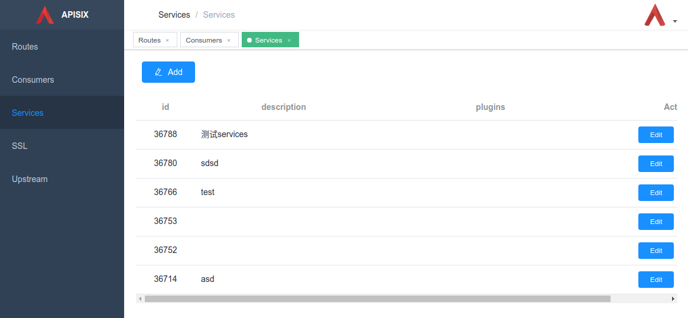

<!--
#
# Licensed to the Apache Software Foundation (ASF) under one or more
# contributor license agreements.  See the NOTICE file distributed with
# this work for additional information regarding copyright ownership.
# The ASF licenses this file to You under the Apache License, Version 2.0
# (the "License"); you may not use this file except in compliance with
# the License.  You may obtain a copy of the License at
#
#     http://www.apache.org/licenses/LICENSE-2.0
#
# Unless required by applicable law or agreed to in writing, software
# distributed under the License is distributed on an "AS IS" BASIS,
# WITHOUT WARRANTIES OR CONDITIONS OF ANY KIND, either express or implied.
# See the License for the specific language governing permissions and
# limitations under the License.
#
-->
[English](../getting-started.md)

# 快速入门指南

本指南的目的是介绍如何使用 APISIX 来配置出一个安全的可以对外提供服务的 API。当您读完本指南，你需要自己安装一下 APISIX 应用，并准备好一个可以对外提供服务的 API，该服务将由 API key 进行访问保护。

本指南会使用到以下 GET 请求，该服务可以回显发送到这个 API 的传参。

```bash
$ curl --location --request GET "https://httpbin.org/get?foo1=bar1&foo2=bar2"
```

让我们来分析一下这个 URL 请求

- Scheme: HTTPS
- Host/Address: httpbin.org
- Port: 443
- URI: /get
- Query Parameters: foo1, foo2

## 前提

- 本指南使用 docker 和 docker compose 来安装 Apache APISIX。 但是， 如果您已经以其他方式安装了 Apache APISIX ，您只需跳到 [第二步](getting-started.md#第二步:-在-APISIX-中设置路由) 。
- Curl：指南使用 Curl 命令进行 API 测试，但是您也可以使用您选择的任何其他工具（ 例如 Postman ）。

## 第一步: 安装 APISIX

Apache APISIX 可以多种操作环境中安装。[如何安装文档](how-to-build.md#installation-via-source-release) 显示了多个平台中的安装步骤。
为了快速入门，让我们基于 docker 容器的安装方式进行安装。启动 Apache APISIX 服务，我们可以参照这个镜像文件[repository](https://github.com/apache/incubator-apisix-docker) 并切换到 example 文件夹下执行如下命令。

如下命令会启动 Apache APISIX 服务并默认在 9080 端口（ https 请求是 9443 端口） 提供 admin API 接口服务

```bash
$ git clone https://github.com/apache/incubator-apisix-docker.git
$ cd example
$ docker-compose -p docker-apisix up -d
```

第一次下载源代码需要一段时间，之后将非常快。在 docker 容器启动后，请访问以下链接，检查您是否获得成功的响应。

```bash
$ curl "http://127.0.0.1:9080/apisix/admin/services/" -H 'X-API-KEY: edd1c9f034335f136f87ad84b625c8f1'
```

下面是 Admin API 的接口响应：

```json
{
    "node": {
        "createdIndex": 6,
        "modifiedIndex": 6,
        "key": "/apisix/services",
        "dir": true
        },
    "action": "get"
}
```

## 第二步: 在 Apache APISIX 中创建 Route

为了配置各种 routes / services / plugins ，APISIX 提供了强大的 Admin API 和一个[ web控制台 ](https://github.com/apache/incubator-apisix-dashboard)。
本指南将会使用到 Admin API 接口。

一个微服务可以通过 APISIX 的路由、服务、上游和插件等多个实体之间的关系进行配置。
Route（路由）与客户端请求匹配，并指定它们到达 APISIX 后如何发送到 Upstream（上游，后端 API 服务）。
Service（服务）为上游服务提供了抽象。因此，您可以创建单个 Service 并在多个 Route 中引用它。
查看架构文档可以获取更多信息。

从技术上讲，所有这些信息（upstream、service、plugins）都可以包含在路由配置中。 Route 路由是由这三个主要部分组成的。

- 路由匹配规则：

    让我们来看看下面的场景
    http://example.com/services/users

    上面的URL托管了系统中所有跟用户有关的（getUser/GetAllUsers）微服务。例如，可以通过URL（ http://example.com/services/users/GetAllUsers ） 访问到 GetAllUsers 服务接口。
    现在要公开 `users` 路径下的所有 `GET` 服务请求（微服务）。以下是匹配此类请求的路由配置。

    ```json
    {
        "methods": ["GET"],
        "host": "example.com",
        "uri": "/services/users/*",
        ... Additional Configurations
    }
    ```

    通过上面的匹配规则你就可以通过如下的命令跟 APISIX 进行交互了

    ```bash
    curl -i -X GET "http://{apisix_server.com}:{port}/services/users/getAllUsers?limit=10" -H "Host: example.com"
    ```

- Upstream 信息：

    Upstream 是一个虚拟主机抽象，它根据配置规则在给定的一组服务节点上执行负载平衡。
    因此，单个上游配置可以由提供相同服务的多个服务器组成。每个节点将包括一个 key（地址/ip:port）和一个 value （节点的权重）。
    服务可以通过轮询或一致哈希（cHash）机制进行负载平衡。

    配置路由时，可以直接设置 Upstream 信息，也可以使用服务抽象来引用 Upstream 信息。

- 各种插件

    插件允许您扩展 APISIX 的功能，并实现可以与 HTTP request / response 生命周期接口的任意逻辑。
    因此，如果您想对 API 进行身份验证，那么您可以使用密钥验证插件来对每个请求强制进行身份验证。

### 设置 Upstream

执行以下命令在 APISIX 中创建 id 为 50 的上游信息，并使用 round-robin 机制进行负载平衡。

```bash
curl "http://127.0.0.1:9080/apisix/admin/upstreams/50" -H 'X-API-KEY: edd1c9f034335f136f87ad84b625c8f1' -X PUT -d '
{
    "type": "roundrobin",
    "nodes": {
        "httpbin.org:443": 1
    }
}'
```

### 为转发 Upstream  添加 Route 信息

默认情况下，Apache APISIX 通过 HTTP 协议代理请求。如果我们的后端托管在 HTTPS 环境中，让我们使用 proxy-rewrite 插件将方案更改为 HTTPS 。

```bash
curl "http://127.0.0.1:9080/apisix/admin/routes/5" -H 'X-API-KEY: edd1c9f034335f136f87ad84b625c8f1' -X PUT -d '
{
    "uri": "/get",
    "host": "httpbin.org",
    "plugins": {
        "proxy-rewrite": {
          "scheme": "https"
        }
    },
    "upstream_id": 50
}'
```

### 访问 Apache APISIX 进行测试

现在让我们调用 Apache APISIX 来测试新配置的路由。

```bash
curl -i -X GET "http://127.0.0.1:9080/get?foo1=bar1&foo2=bar2" -H "Host: httpbin.org"
```

API 也可以通过 HTTPs（9443）端口服务访问。如果您使用的是自签名证书，那么通过 curl 命令使用 `-k` 参数忽略自签名证书错误。

```bash
curl -i -k -X GET "https://127.0.0.1:9443/get?foo1=bar1&foo2=bar2" -H "Host: httpbin.org"
```

## 第三步: 为服务增加鉴权

由于服务对公众开放，我们需要为新创建的 Apache APISIX 服务接口提供适当的保护。执行以下命令来创建一个名为 John 需要 api-key 的用户。

注：Apache APISIX 支持多种认证机制，查看插件文档了解更多。

```shell
curl http://127.0.0.1:9080/apisix/admin/consumers -H 'X-API-KEY: edd1c9f034335f136f87ad84b625c8f1' -X PUT -d '
{
    "username": "john",
    "plugins": {
        "key-auth": {
            "key": "superSecretAPIKey"
        }
    }
}'
```

现在，让我们将服务配置为包含 KEY 验证插件。

```bash
curl http://127.0.0.1:9080/apisix/admin/routes/5 -H 'X-API-KEY: edd1c9f034335f136f87ad84b625c8f1' -X PUT -d '
{
    "uri": "/get",
    "host": "httpbin.org",
    "plugins": {
        "proxy-rewrite": {
          "scheme": "https"
        },
        "key-auth": {}
    },
    "upstream_id": 50
}'
```

由于 route 由密钥验证插件保护，前一个访问 API 的 curl 命令将产生未经授权的访问错误。
现在使用下面的命令安全地访问请求。

```bash
curl -i -X GET http://127.0.0.1:9080/get -H "Host: httpbin.org" -H 'apikey: superSecretAPIKey'
```

## 为 route 添加前缀

现在，假设您要向路由添加前缀（例如：samplePrefix），并且不想使用 `host` 头， 则可以使用代理来完成。

```bash
curl http://127.0.0.1:9080/apisix/admin/routes/5 -H 'X-API-KEY: edd1c9f034335f136f87ad84b625c8f1' -X PUT -d '
{
    "uri": "/samplePrefix/get",
    "plugins": {
        "proxy-rewrite": {
          "scheme": "https",
          "regex_uri": ["^/samplePrefix/get(.*)", "/get$1"]
        },
        "key-auth": {}
    },
    "upstream_id": 50
}'
```

现在可以使用以下命令调用路由：

```bash
curl -i -X GET http://127.0.0.1:9080/samplePrefix/get?param1=foo&param2=bar -H 'apikey: superSecretAPIKey'
```

## Apache APISIX 控制台

到目前为止，已经通过使用 admin API 接口编排对 Apache APISIX 的 API 的调用。然而，Apache APISIX 还提供执行类似操作的一个 web 应用，就是web控制台。
可以在[repository](https://github.com/apache/incubator-apisix)中使用。控制台是直观的，您可以通过它编排同样的路由配置。



### 故障排查

- 确保所需的端口未被其他系统/进程使用（默认端口为：9080、9443、2379）。下面是终止正在侦听特定端口（基于unix的系统）的进程的命令。

    ```bash
    sudo fuser -k 9443/tcp
    ```

- 如果 docker 容器持续重启或者重启失败，请登录容器并观察日志以诊断问题。

    ```bash
    docker logs -f --tail container_id
    ```
