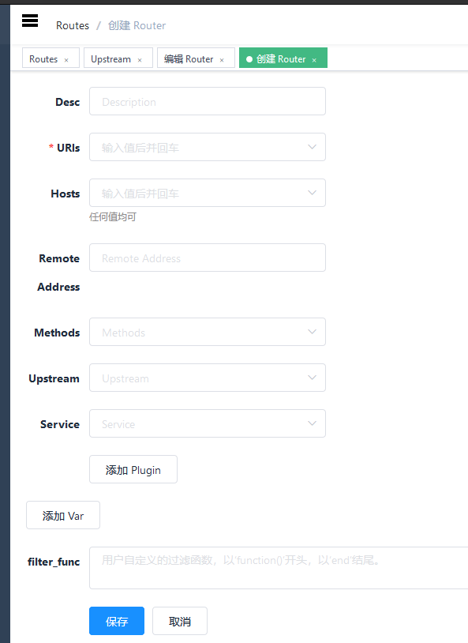
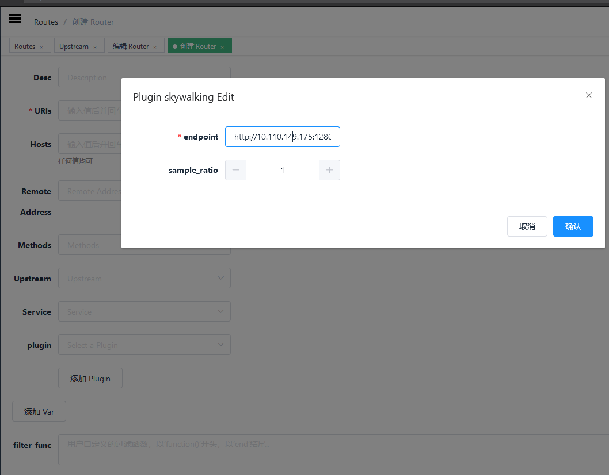
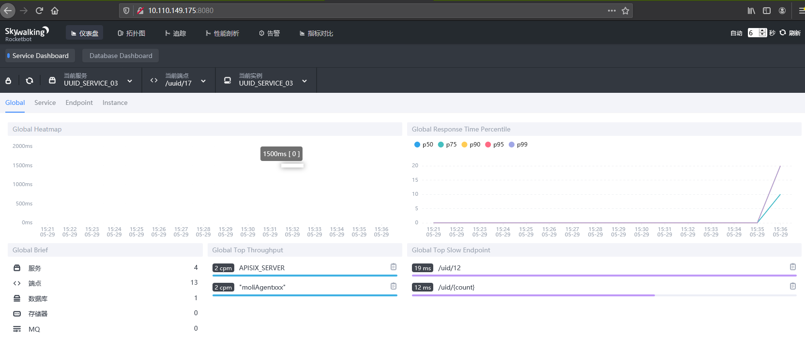
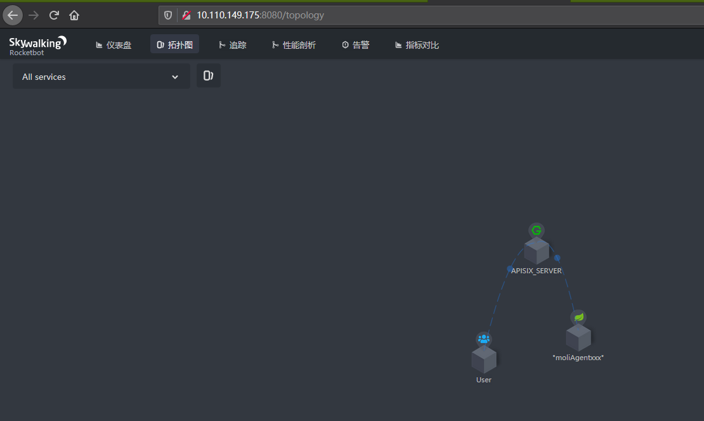
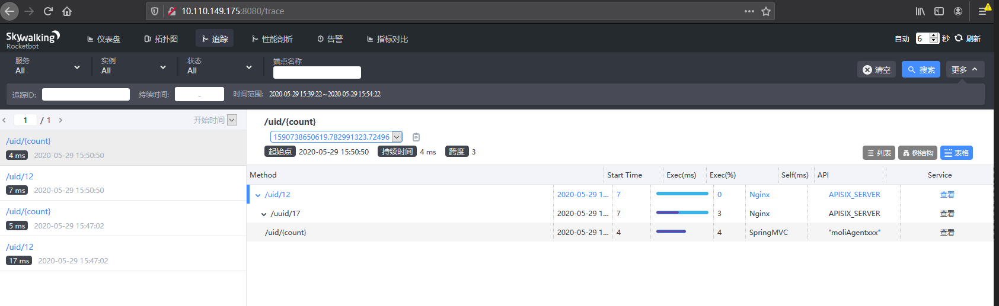

<!--
#
# Licensed to the Apache Software Foundation (ASF) under one or more
# contributor license agreements.  See the NOTICE file distributed with
# this work for additional information regarding copyright ownership.
# The ASF licenses this file to You under the Apache License, Version 2.0
# (the "License"); you may not use this file except in compliance with
# the License.  You may obtain a copy of the License at
#
#     http://www.apache.org/licenses/LICENSE-2.0
#
# Unless required by applicable law or agreed to in writing, software
# distributed under the License is distributed on an "AS IS" BASIS,
# WITHOUT WARRANTIES OR CONDITIONS OF ANY KIND, either express or implied.
# See the License for the specific language governing permissions and
# limitations under the License.
#
-->

- [English](../../plugins/skywalking.md)

# 目录
- [目录](#目录)
  - [名字](#名字)
  - [属性](#属性)
  - [如何启用](#如何启用)
  - [测试插件](#测试插件)
    - [运行 Skywalking 实例](#运行-Skywalking-实例)
  - [禁用插件](#禁用插件)
  - [上游服务是java的SpringBoot示例代码](#上游服务是java的SpringBoot示例代码)

## 名字

`Skywalking`(https://github.com/apache/skywalking) 是一个开源的服务跟踪插件。

服务端目前支持http和grpc两种协议，在apisix中目前只支持http协议

## 属性

* `endpoint`: Skywalking 的 http 节点，例如`http://127.0.0.1:12800`。
* `sample_ratio`: 监听的比例，最小为0.00001，最大为1。
* `service_name`: 可选参数，标记当前服务的名称，默认值是`APISIX`。

## 如何启用

下面是一个示例，在指定的 route 上开启了 skywalking 插件:

```shell
curl http://127.0.0.1:9080/apisix/admin/routes/1  -H 'X-API-KEY: edd1c9f034335f136f87ad84b625c8f1' -X PUT -d '
{
    "methods": ["GET"],
    "uris": [
        "/uid/*"
    ],
    "plugins": {
        "skywalking": {
            "endpoint": "http://10.110.149.175:12800",
            "sample_ratio": 1,
            "service_name": "APISIX_SERVER"
        }
    },
    "upstream": {
        "type": "roundrobin",
        "nodes": {
            "10.110.149.175:8089": 1
        }
    }
}'
```

你可以使用浏览器打开 dashboard：`http://127.0.0.1:9080/apisix/dashboard/`，通过 web 界面来完成上面的操作，先增加一个 route：



然后在 route 页面中添加 skywalking 插件：



## 测试插件

### 运行 Skywalking 实例

#### 例子：
1. 启动Skywalking Server:
    - 默认使用H2存储，直接启动skywalking即可
        ```
        sudo docker run --name skywalking -d -p 1234:1234 -p 11800:11800 -p 12800:12800 --restart always apache/skywalking-oap-server
        ```

    - 如果使用elasticsearch存储
        1. 则需要先安装elasticsearch:
            ```
            sudo docker run -d --name elasticsearch -p 9200:9200 -p 9300:9300 --restart always -e "discovery.type=single-node" elasticsearch:6.7.2

            ```
        2. 安装 ElasticSearch管理界面elasticsearch-hq
            ```
            sudo docker run -d --name elastic-hq -p 5000:5000 --restart always elastichq/elasticsearch-hq
            ```
        3. 启动skywalking：
            ```
            sudo docker run --name skywalking -d -p 1234:1234 -p 11800:11800 -p 12800:12800 --restart always --link elasticsearch:elasticsearch -e SW_STORAGE=elasticsearch -e SW_STORAGE_ES_CLUSTER_NODES=elasticsearch:9200 apache/skywalking-oap-server
            ```
2. Skywalking管理系统：
    1. 启动管理系统：
        ```
        sudo docker run --name skywalking-ui -d -p 8080:8080 --link skywalking:skywalking -e SW_OAP_ADDRESS=skywalking:12800 --restart always apache/skywalking-ui
        ```
    2. 打开管理页面
        在浏览器里面输入http://10.110.149.175:8080,出现了如下界面，则表示安装成功
        

3. 测试示例:
    - 通过访问apisix，访问上游服务

        ```bash
        $ curl -v http://10.110.149.192:9080/uid/12
        HTTP/1.1 200 OK
        OK
        ...
      ```
    - 打开浏览器，访问 Skywalking 的 web 页面：
        ```
        http://10.110.149.175:8080/
        ```
        可以看到访问拓扑图\
        \
        可以看到服务追踪图\
        
## 禁用插件

当你想去掉插件的时候，很简单，在插件的配置中把对应的 json 配置删除即可，无须重启服务，即刻生效：

```shell
$ curl http://127.0.0.1:2379/v2/keys/apisix/routes/1  -H 'X-API-KEY: edd1c9f034335f136f87ad84b625c8f1' -X PUT -d value='
{
    "methods": ["GET"],
    "uris": [
        "/uid/*"
    ],
    "plugins": {
    },
    "upstream": {
        "type": "roundrobin",
        "nodes": {
            "10.110.149.175:8089": 1
        }
    }
}'
```

现在就已经移除了 Skywalking 插件了。其他插件的开启和移除也是同样的方法。


## 上游服务是java的SpringBoot示例代码

```java
package com.lenovo.ai.controller;

import org.springframework.web.bind.annotation.PathVariable;
import org.springframework.web.bind.annotation.RequestMapping;
import org.springframework.web.bind.annotation.RestController;
import javax.servlet.http.HttpServletRequest;

/**
 * @author cyxinda
 * @create 2020-05-29 14:02
 * @desc skywalking测试中央控制层
 **/
@RestController
public class TestController {
    @RequestMapping("/uid/{count}")
    public String getUidList(@PathVariable("count") String countStr, HttpServletRequest request) {
        System.out.println("counter:::::"+countStr);
       return "OK";
    }
}
```
启动服务的时候，需要配置skywalking agent,
修改agent/config/agent.config中的配置
```
agent.service_name=yourservername
collector.backend_service=10.110.149.175:11800
```
启动服务脚本：
```
nohup java -javaagent:/root/skywalking/app/agent/skywalking-agent.jar \
-jar /root/skywalking/app/app.jar \
--server.port=8089 \
2>&1 > /root/skywalking/app/logs/nohup.log &
```

