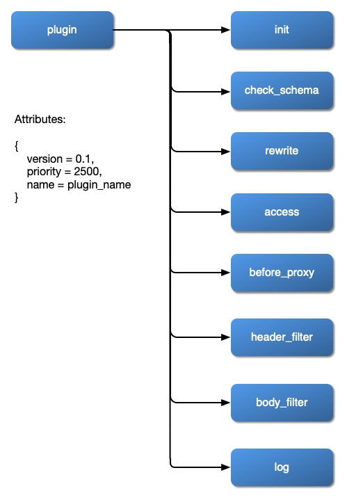

<!--
#
# Licensed to the Apache Software Foundation (ASF) under one or more
# contributor license agreements.  See the NOTICE file distributed with
# this work for additional information regarding copyright ownership.
# The ASF licenses this file to You under the Apache License, Version 2.0
# (the "License"); you may not use this file except in compliance with
# the License.  You may obtain a copy of the License at
#
#     http://www.apache.org/licenses/LICENSE-2.0
#
# Unless required by applicable law or agreed to in writing, software
# distributed under the License is distributed on an "AS IS" BASIS,
# WITHOUT WARRANTIES OR CONDITIONS OF ANY KIND, either express or implied.
# See the License for the specific language governing permissions and
# limitations under the License.
#
-->

## Apache APISIX : Software Architecture


## Plugin Loading Process


## Plugin Hierarchy Structure



## Configuring APISIX

Apache APISIX can be configured in two ways:

1. By directly changing `conf/config.yaml`.
2. Using the `--config` or the `-c` flag to pass in the file path of your config file while starting APISIX (`apisix start -c <path to config file>`).

Configurations can be added to this YAML file and Apache APISIX will fall back to the default configurations for anything that is not configured in this file.

For example, to set the default listening port to 8000 while keeping other configurations as default, your configuration file (`config.yaml`) would look like:

```yaml
apisix:
  node_listen: 8000 # APISIX listening port
```

Similarly, to set the listening port to 8000 and set the etcd address to `http://foo:2379` while keeping other configurations as default, your configuration file would look like:

```yaml
apisix:
  node_listen: 8000 # APISIX listening port

etcd:
  host: "http://foo:2379" # etcd address
```

Default configurations of APISIX can be found in the `conf/config-default.yaml` file.

**Note**: This file is bound to the APISIX source code and should **NOT** be modified. The configuration should only be changed by the methods mentioned above.

**Note**: The `conf/nginx.conf` file is automatically generated by APISIX and should **NOT** be edited.
