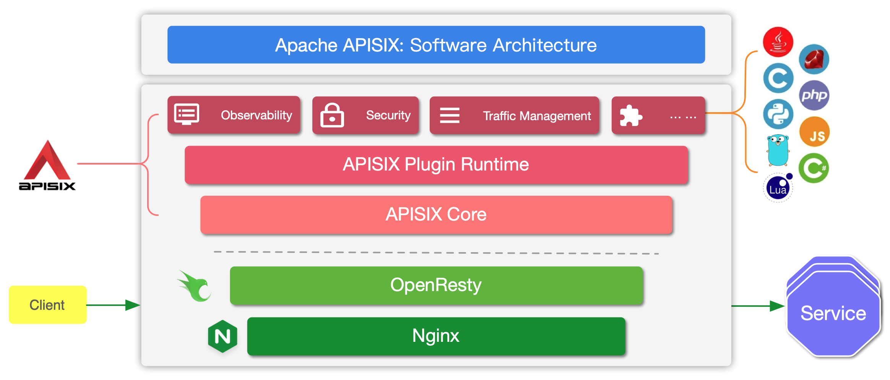

<!--
#
# Licensed to the Apache Software Foundation (ASF) under one or more
# contributor license agreements.  See the NOTICE file distributed with
# this work for additional information regarding copyright ownership.
# The ASF licenses this file to You under the Apache License, Version 2.0
# (the "License"); you may not use this file except in compliance with
# the License.  You may obtain a copy of the License at
#
#     http://www.apache.org/licenses/LICENSE-2.0
#
# Unless required by applicable law or agreed to in writing, software
# distributed under the License is distributed on an "AS IS" BASIS,
# WITHOUT WARRANTIES OR CONDITIONS OF ANY KIND, either express or implied.
# See the License for the specific language governing permissions and
# limitations under the License.
#
-->

## Apache APISIX : Software Architecture

Apache APISIX is a dynamic, real-time, high-performance cloud-native API gateway. It is built on top of NGINX + ngx_lua technology and leverages the power offered by LuaJIT. [Why Apache APISIX chose Nginx and Lua to build API Gateway?](https://apisix.apache.org/blog/2021/08/25/why-apache-apisix-chose-nginx-and-lua/)

APISIX is divided into two main parts:

1. APISIX core, including Lua plugin, multi-language plugin runtime, Wasm plugin runtime, etc.
2. Feature-rich variety of built-in plugins: including observability, security, traffic control, etc.

In the APISIX core, important functions such as route matching, load balancing, service discovery, management API, and basic modules such as configuration management are provided. In addition, APISIX plugin runtime is also included, providing the runtime framework for native Lua plugins and multilingual plugins, as well as the experimental Wasm plugin runtime, etc. APISIX multilingual plugin runtime provides support for various development languages, such as Golang, Java, Python, JS, etc.

APISIX currently has various plugins built in, covering various areas of API gateways, such as authentication and authentication, security, observability, traffic management, multi-protocol access, and so on. The plugins currently built into APISIX are implemented using native Lua. For the introduction and usage of each plugin, please check the [documentation](https://apisix.apache.org/docs/apisix/plugins/batch-requests) of the relevant plugin.

## Plugin Loading Process

## Plugin Hierarchy Structure

