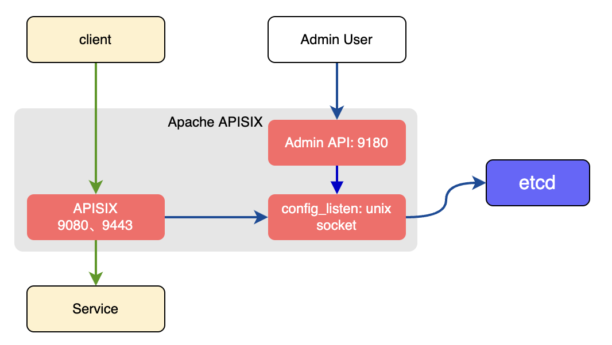
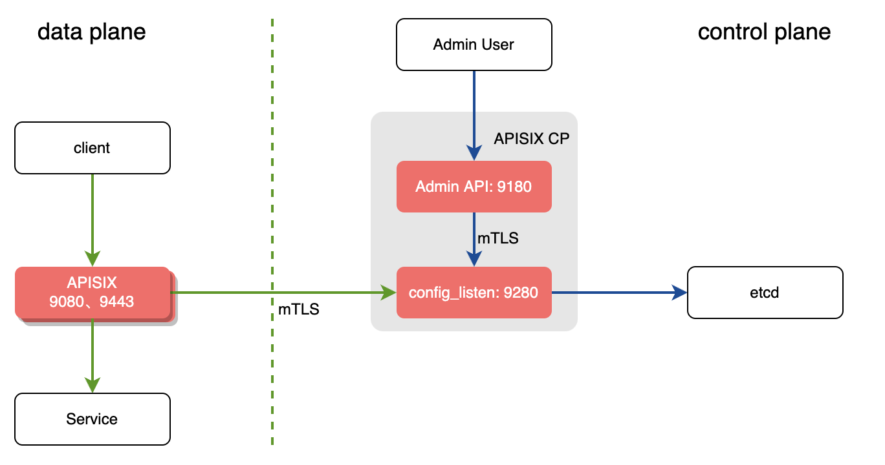

<!--
#
# Licensed to the Apache Software Foundation (ASF) under one or more
# contributor license agreements.  See the NOTICE file distributed with
# this work for additional information regarding copyright ownership.
# The ASF licenses this file to You under the Apache License, Version 2.0
# (the "License"); you may not use this file except in compliance with
# the License.  You may obtain a copy of the License at
#
#     http://www.apache.org/licenses/LICENSE-2.0
#
# Unless required by applicable law or agreed to in writing, software
# distributed under the License is distributed on an "AS IS" BASIS,
# WITHOUT WARRANTIES OR CONDITIONS OF ANY KIND, either express or implied.
# See the License for the specific language governing permissions and
# limitations under the License.
#
-->

## Concept

Previously, the DP (Data Plane) and the CP (Control Plane) are not separate explicitly.

Although we clearly distinguish the different responsibilities of DP and CP in the documentation, not everyone has correctly deployed APISIX in the production environment.

Therefore, we introduce new concepts called deployment modes/roles, to help users deploy APISIX easily and safely.

APISIX under different deployment modes will act differently.

The table below shows the relationship among deployment modes and roles:

| Deployment Modes | Role                       | Description                                                                              |
|------------------|----------------------------|------------------------------------------------------------------------------------------|
| traditional      | traditional                | DP + CP are deployed together by default. People need to disable `enable_admin` manually |
| decoupled        | data_plane / control_plane | DP and CP are deployed independently.                                                    |
| standalone       | data_plane                 | Only DP, load the all configurations from local yaml file                                |

## Deployment Modes

### Traditional



In the traditional deployment mode, one instance can be both DP & CP.

There will be a `conf server` listens on UNIX socket and acts as a proxy between APISIX and etcd.

Both the DP part and CP part of the instance will connect to the `conf server` via HTTP protocol.

Here is the example of configuration:

```yaml title="conf/config.yaml"
deployment:
    role: traditional
    role_traditional:
        config_provider: etcd
    etcd:
       host:
           - http://xxxx
       prefix: /apisix
       timeout: 30
```

### Decoupled



The instance deployed as data_plane will:

1. Fetch configurations from the CP, the default port is 9280
2. Before the DP service starts, it will perform a health check on all CP addresses
    - If all CP addresses are unavailable, the startup fails and an exception message is output to the screen.
    - If at least one CP address is available, print the unhealthy CP check result log, and then start the APISIX service.
    - If all CP addresses are normal, start the APISIX service normally.
3. Handle user requests.

Here is the example of configuration:

```yaml title="conf/config.yaml"
deployment:
    role: data_plane
    role_data_plane:
       config_provider: control_plane
       control_plane:
           host:
               - xxxx:9280
           timeout: 30
    certs:
        cert: /path/to/ca-cert
        cert_key: /path/to/ca-cert
        trusted_ca_cert: /path/to/ca-cert
```

The instance deployed as control_plane will:

1. Listen on 9180 by default, and provide Admin API for Admin user
2. Provide `conf server` which listens on port 9280 by default. Both the DP instances and this CP instance will connect to the `conf server` via HTTPS enforced by mTLS.

Here is the example of configuration:

```yaml title="conf/config.yaml"
deployment:
    role: control_plane
    role_control_plan:
        config_provider: etcd
        conf_server:
            listen: 0.0.0.0:9280
            cert: /path/to/ca-cert
            cert_key: /path/to/ca-cert
            client_ca_cert: /path/to/ca-cert
    etcd:
       host:
           - https://xxxx
       prefix: /apisix
       timeout: 30
    certs:
        cert: /path/to/ca-cert
        cert_key: /path/to/ca-cert
        trusted_ca_cert: /path/to/ca-cert
```

### Standalone

In this mode, APISIX is deployed as DP and reads configurations from yaml file in the local file system.

Here is the example of configuration:

```yaml title="conf/config.yaml"
deployment:
    role: data_plane
    role_data_plane:
       config_provider: yaml
```
