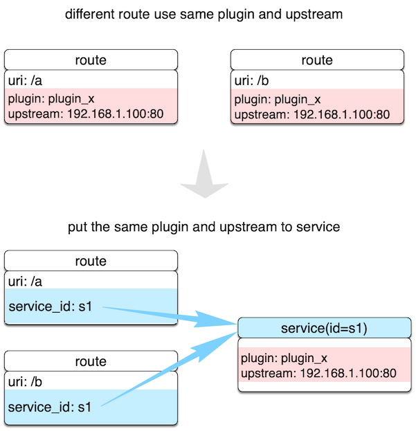

<!--
#
# Licensed to the Apache Software Foundation (ASF) under one or more
# contributor license agreements.  See the NOTICE file distributed with
# this work for additional information regarding copyright ownership.
# The ASF licenses this file to You under the Apache License, Version 2.0
# (the "License"); you may not use this file except in compliance with
# the License.  You may obtain a copy of the License at
#
#     http://www.apache.org/licenses/LICENSE-2.0
#
# Unless required by applicable law or agreed to in writing, software
# distributed under the License is distributed on an "AS IS" BASIS,
# WITHOUT WARRANTIES OR CONDITIONS OF ANY KIND, either express or implied.
# See the License for the specific language governing permissions and
# limitations under the License.
#
-->

A `Service` is an abstraction of an API (which can also be understood as a set of Route abstractions). It usually corresponds to the upstream service abstraction. Between `Route` and `Service`, usually the relationship of N:1, please see the following image.



Different Route rules are bound to a Service at the same time. These Routes will have the same upstream and plugin configuration, reducing redundant configuration.

The following example creates a Service that enables the current-limit plugin, and then binds the Route with the id of `100` and `101` to the Service.

```shell
# create new Service
$ curl http://127.0.0.1:9080/apisix/admin/services/200 -H 'X-API-KEY: edd1c9f034335f136f87ad84b625c8f1' -X PUT -d '
{
    "plugins": {
        "limit-count": {
            "count": 2,
            "time_window": 60,
            "rejected_code": 503,
            "key": "remote_addr"
        }
    },
    "upstream": {
        "type": "roundrobin",
        "nodes": {
            "39.97.63.215:80": 1
        }
    }
}'

# create new Route and reference the service by id `200`
curl http://127.0.0.1:9080/apisix/admin/routes/100 -H 'X-API-KEY: edd1c9f034335f136f87ad84b625c8f1' -X PUT -d '
{
    "methods": ["GET"],
    "uri": "/index.html",
    "service_id": "200"
}'

curl http://127.0.0.1:9080/apisix/admin/routes/101 -H 'X-API-KEY: edd1c9f034335f136f87ad84b625c8f1' -X PUT -d '
{
    "methods": ["GET"],
    "uri": "/foo/index.html",
    "service_id": "200"
}'
```

Of course, we can also specify different plugin parameters or upstream for Route. Some of the following Routes have different current-limit parameters. Other parts (such as upstream) continue to use the configuration parameters in Service.

```shell
curl http://127.0.0.1:9080/apisix/admin/routes/102 -H 'X-API-KEY: edd1c9f034335f136f87ad84b625c8f1' -X PUT -d '
{
    "uri": "/bar/index.html",
    "id": "102",
    "service_id": "200",
    "plugins": {
        "limit-count": {
            "count": 2000,
            "time_window": 60,
            "rejected_code": 503,
            "key": "remote_addr"
        }
    }
}'
```

Note: When both Route and Service enable the same plugin, the Route parameter has a higher priority than Service.
