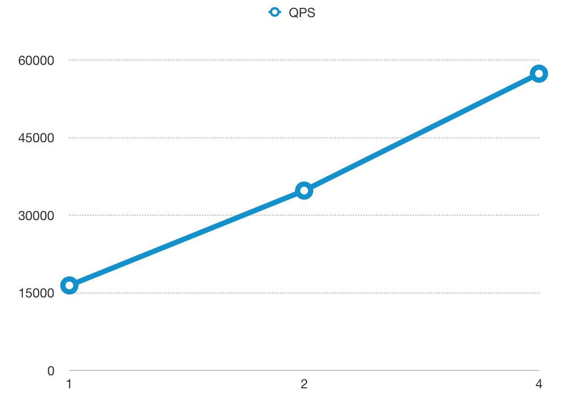
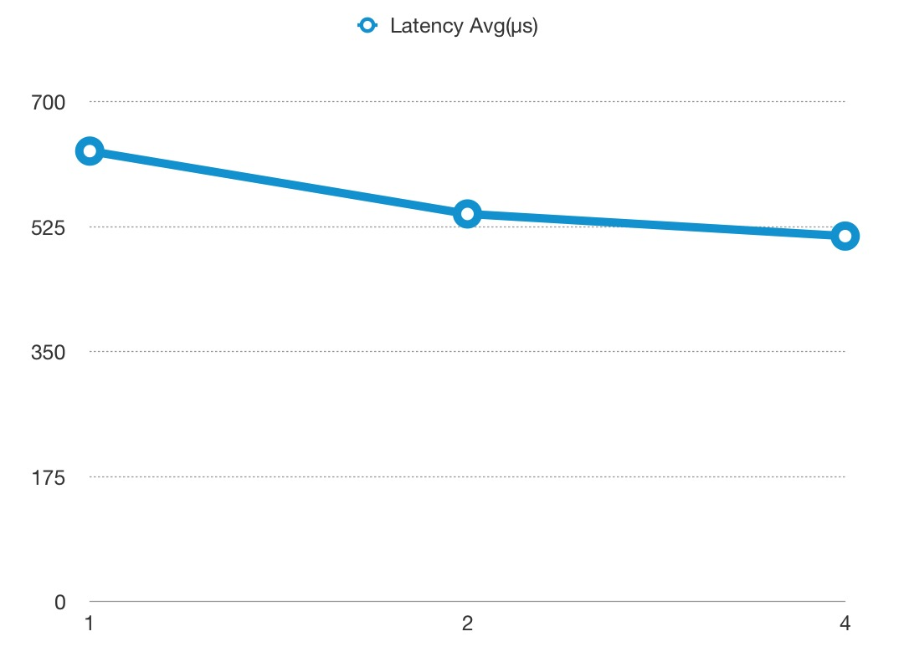
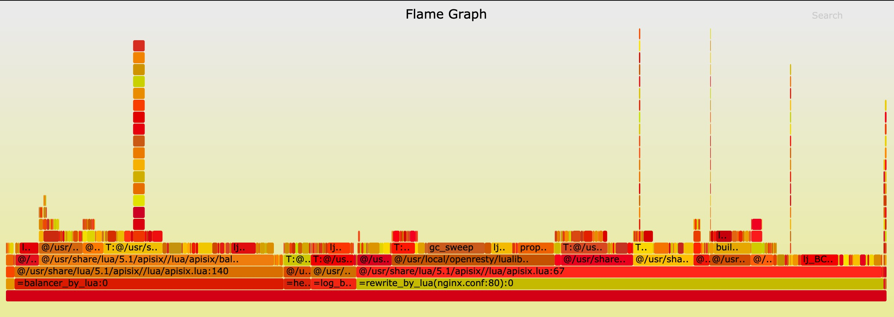
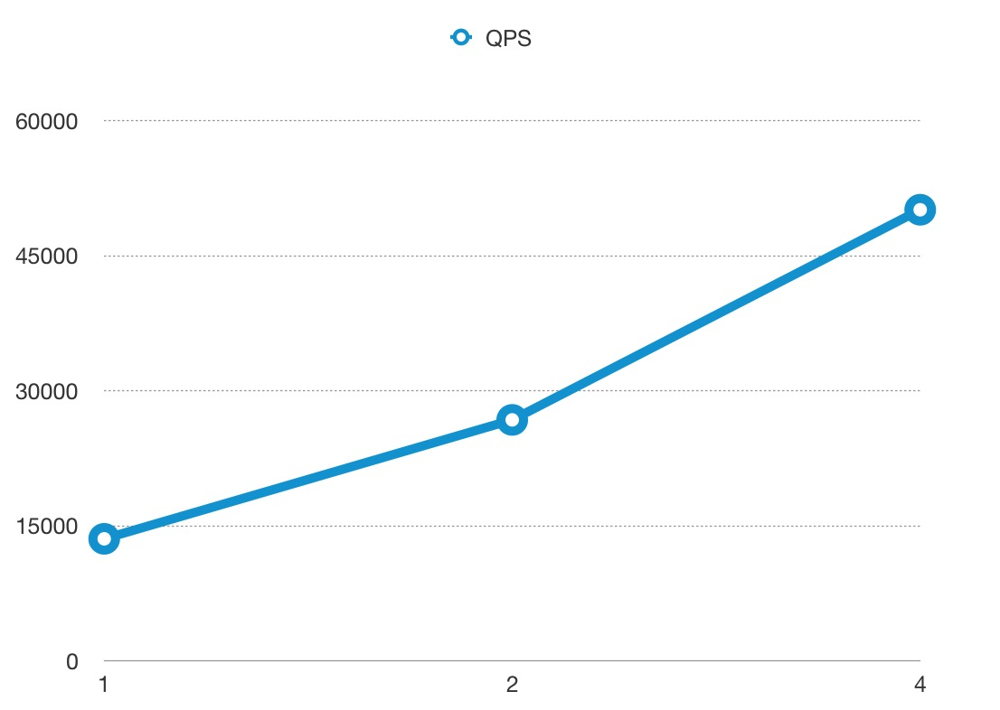
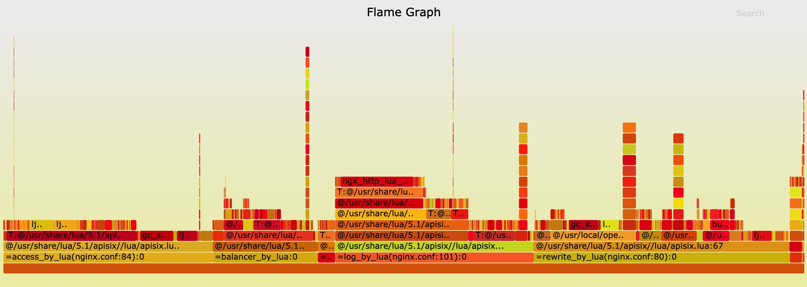

<!--
#
# Licensed to the Apache Software Foundation (ASF) under one or more
# contributor license agreements.  See the NOTICE file distributed with
# this work for additional information regarding copyright ownership.
# The ASF licenses this file to You under the Apache License, Version 2.0
# (the "License"); you may not use this file except in compliance with
# the License.  You may obtain a copy of the License at
#
#     http://www.apache.org/licenses/LICENSE-2.0
#
# Unless required by applicable law or agreed to in writing, software
# distributed under the License is distributed on an "AS IS" BASIS,
# WITHOUT WARRANTIES OR CONDITIONS OF ANY KIND, either express or implied.
# See the License for the specific language governing permissions and
# limitations under the License.
#
-->

### Benchmark Environments

n1-highcpu-8 (8 vCPUs, 7.2 GB memory) on Google Cloud

But we **only** used 4 cores to run APISIX, and left 4 cores for system and [wrk](https://github.com/wg/wrk),
which is the HTTP benchmarking tool.

### Benchmark Test for reverse proxy

Only used APISIX as the reverse proxy server, with no logging, limit rate, or other plugins enabled,
and the response size was 1KB.

#### QPS

The x-axis means the size of CPU core, and the y-axis is QPS.



#### Latency

Note the y-axis latency in **microsecond(μs)** not millisecond.



#### Flame Graph

The result of Flame Graph:


And if you want to run the benchmark test in your machine, you should run another Nginx to listen 80 port.

```shell
curl http://127.0.0.1:9080/apisix/admin/routes/1 -H 'X-API-KEY: edd1c9f034335f136f87ad84b625c8f1' -X PUT -d '
{
    "methods": ["GET"],
    "uri": "/hello",
    "upstream": {
        "type": "roundrobin",
        "nodes": {
            "127.0.0.1:80": 1,
            "127.0.0.2:80": 1
        }
    }
}'
```

then run wrk:

```shell
wrk -d 60 --latency http://127.0.0.1:9080/hello
```

### Benchmark Test for reverse proxy, enabled 2 plugins

Only used APISIX as the reverse proxy server, enabled the limit rate and prometheus plugins,
and the response size was 1KB.

#### QPS

The x-axis means the size of CPU core, and the y-axis is QPS.



#### Latency

Note the y-axis latency in **microsecond(μs)** not millisecond.


#### Flame Graph

The result of Flame Graph:


And if you want to run the benchmark test in your machine, you should run another Nginx to listen 80 port.

```shell
curl http://127.0.0.1:9080/apisix/admin/routes/1 -H 'X-API-KEY: edd1c9f034335f136f87ad84b625c8f1' -X PUT -d '
{
    "methods": ["GET"],
    "uri": "/hello",
    "plugins": {
        "limit-count": {
            "count": 999999999,
            "time_window": 60,
            "rejected_code": 503,
            "key": "remote_addr"
        },
        "prometheus":{}
    },
    "upstream": {
        "type": "roundrobin",
        "nodes": {
            "127.0.0.1:80": 1,
            "127.0.0.2:80": 1
        }
    }
}'
```

then run wrk:

```shell
wrk -d 60 --latency http://127.0.0.1:9080/hello
```
