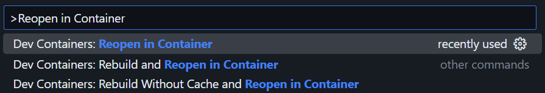
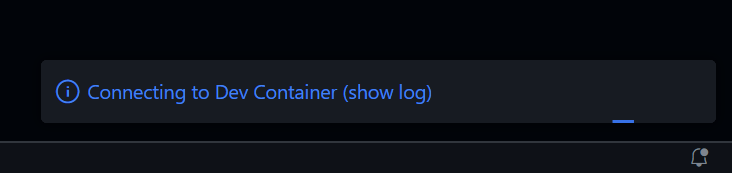

<!--
#
# Licensed to the Apache Software Foundation (ASF) under one or more
# contributor license agreements.  See the NOTICE file distributed with
# this work for additional information regarding copyright ownership.
# The ASF licenses this file to You under the Apache License, Version 2.0
# (the "License"); you may not use this file except in compliance with
# the License.  You may obtain a copy of the License at
#
#     http://www.apache.org/licenses/LICENSE-2.0
#
# Unless required by applicable law or agreed to in writing, software
# distributed under the License is distributed on an "AS IS" BASIS,
# WITHOUT WARRANTIES OR CONDITIONS OF ANY KIND, either express or implied.
# See the License for the specific language governing permissions and
# limitations under the License.
#
-->

Previously, building and developing APISIX on Linux or macOS required developers to install its runtime environment and toolchain themselves, and developers might not be familiar with them.

As it needs to support multiple operating systems and CPU ISAs, the process has inherent complexities in how to find and install dependencies and toolchains.

:::note

The tutorial can be used as an alternative to a [bare-metal environment](building-apisix.md) or a [macOS container development environment](build-apisix-dev-environment-on-mac.md).

It only requires that you have an environment running Docker or a similar alternative (the docker/docker compose command is required), and no other dependent components need to be installed on your host machine.

:::

## Supported systems and CPU ISA

- Linux
  - AMD64
  - ARM64
- Windows (with WSL2 supported)
  - AMD64
- macOS
  - ARM64
  - AMD64

## Quick Setup of Apache APISIX Development Environment

### Implementation Idea

We use Dev Containers to build development environment, and when we open an APISIX project using the IDE, we have access to the container-driven runtime environment.

There the etcd is ready and we can start APISIX directly.

### Steps

:::note

The following uses Visual Studio Code, which has built-in integration with Dev Containers.

In theory you could also use any other editor or IDE that integrates with Dev Containers.

:::

First, clone the APISIX source code, open project in Visual Studio Code.

```shell
git clone https://github.com/apache/apisix.git
cd apisix
code . # VSCode needs to be in the PATH environment variable, you can also open the project directory manually in the UI.
```

Next, switch to Dev Containers. Open the VSCode Command Palette, and execute `Dev Containers: Reopen in Container`.



VSCode will open the Dev Containers project in a new window, where it will build the runtime and install the toolchain according to the Dockerfile before starting the connection and finally installing the APISIX dependencies.

:::note

This process requires a reliable network connection, and it will access Docker Hub, GitHub, and some other sites. You will need to ensure the network connection yourself, otherwise the container build may fail.

:::

Wait some minutes, depending on the internet connection or computer performance, it may take from a few minutes to tens of minutes, you can click on the Progress Bar in the bottom right corner to view a live log where you will be able to check unusual stuck.

If you encounter any problems, you can search or ask questions in [GitHub Issues](https://github.com/apache/apisix/issues) or [GitHub Discussions](https://github.com/apache/apisix/discussions), and community members will respond as promptly as possible.



When the process in the terminal is complete, the development environment is ready, and even etcd is ready.

Start APISIX with the following command:

```shell
make run
```

Now you can start writing code and test cases, and testing tools are available:

```shell
export TEST_NGINX_BINARY=openresty

# run all tests
make test

# or run a specify test case file
FLUSH_ETCD=1 prove -Itest-nginx/lib -I. -r t/admin/api.t
```

## FAQ

### Where's the code? When I delete the container, are the changes lost?

It will be on your host, which is where you cloned the APISIX source code, and the container uses the volume to mount the code into the container. Containers contain only the runtime environment, not the source code, so no changes will be lost whether you close or delete the container.

And, the `git` is already installed in the container, so you can commit a change directly there.
