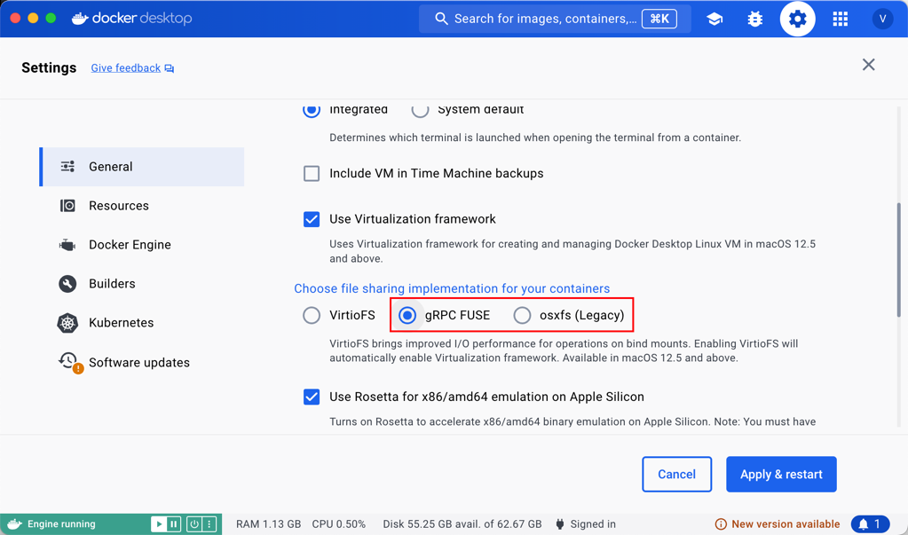

<!--
#
# Licensed to the Apache Software Foundation (ASF) under one or more
# contributor license agreements.  See the NOTICE file distributed with
# this work for additional information regarding copyright ownership.
# The ASF licenses this file to You under the Apache License, Version 2.0
# (the "License"); you may not use this file except in compliance with
# the License.  You may obtain a copy of the License at
#
#     http://www.apache.org/licenses/LICENSE-2.0
#
# Unless required by applicable law or agreed to in writing, software
# distributed under the License is distributed on an "AS IS" BASIS,
# WITHOUT WARRANTIES OR CONDITIONS OF ANY KIND, either express or implied.
# See the License for the specific language governing permissions and
# limitations under the License.
#
-->

If you want to quickly build and develop APISIX on your Mac platform, you can refer to this tutorial.

:::note

This tutorial is suitable for situations where you need to quickly start development on the Mac platform, if you want to go further and have a better development experience, the better choice is the Linux-based virtual machine, or directly use this kind of system as your development environment.

You can see the specific supported systems [here](install-dependencies.md#install).

:::

## Quick Setup of Apache APISIX Development Environment

### Implementation Idea

We use Docker to build the test environment of Apache APISIX. When the container starts, we can mount the source code of Apache APISIX into the container, and then we can build and run test cases in the container.

### Implementation Steps

First, clone the APISIX source code, build an image that can run test cases, and compile the Apache APISIX.

```shell
git clone https://github.com/apache/apisix.git
cd apisix
docker build -t apisix-dev-env -f example/build-dev-image.dockerfile .
```

Next, start Etcd:

```shell
docker run -d --name etcd-apisix --net=host pachyderm/etcd:v3.5.2
```

Mount the APISIX directory and start the development environment container:

```shell
docker run -d --name apisix-dev-env --net=host -v $(pwd):/apisix:rw apisix-dev-env:latest
```

Finally, enter the container, build the Apache APISIX runtime, and configure the test environment:

```shell
docker exec -it apisix-dev-env make deps
docker exec -it apisix-dev-env ln -s /usr/bin/openresty /usr/bin/nginx
```

### Run and Stop APISIX

```shell
docker exec -it apisix-dev-env make run
docker exec -it apisix-dev-env make stop
```

:::note

If you encounter an error message like `nginx: [emerg] bind() to unix:/apisix/logs/worker_events.sock failed (95: Operation not supported)` while running `make run`, please use this solution.

Change the `File Sharing` settings of your Docker-Desktop:



Changing to either `gRPC FUSE` or `osxfs` can resolve this issue.

:::

### Run Specific Test Cases

```shell
docker exec -it apisix-dev-env prove t/admin/routes.t
```
