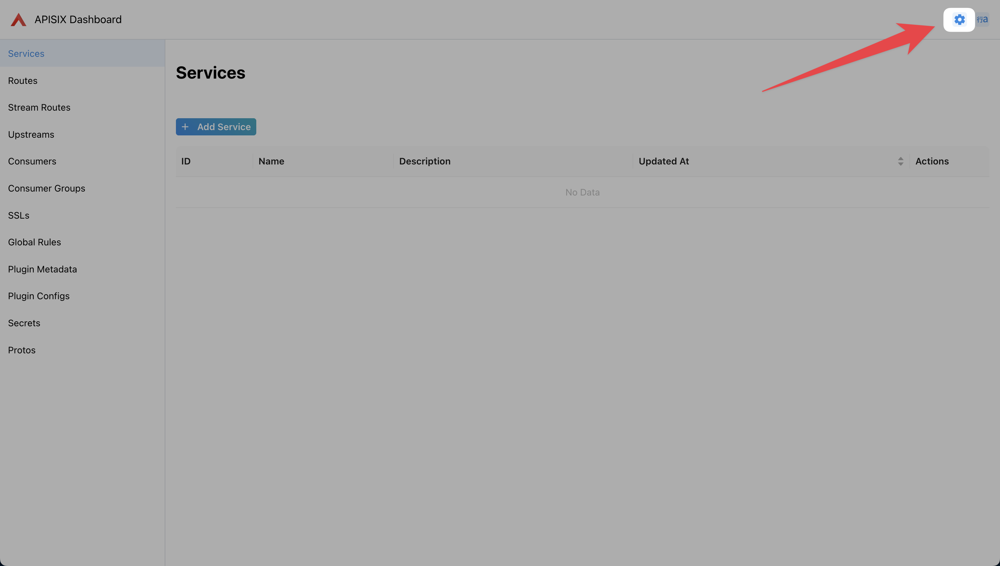
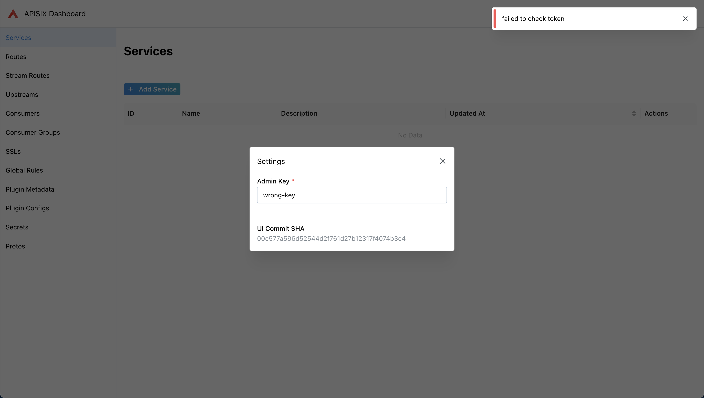

<!--
#
# Licensed to the Apache Software Foundation (ASF) under one or more
# contributor license agreements.  See the NOTICE file distributed with
# this work for additional information regarding copyright ownership.
# The ASF licenses this file to You under the Apache License, Version 2.0
# (the "License"); you may not use this file except in compliance with
# the License.  You may obtain a copy of the License at
#
#     http://www.apache.org/licenses/LICENSE-2.0
#
# Unless required by applicable law or agreed to in writing, software
# distributed under the License is distributed on an "AS IS" BASIS,
# WITHOUT WARRANTIES OR CONDITIONS OF ANY KIND, either express or implied.
# See the License for the specific language governing permissions and
# limitations under the License.
#
-->

## Overview

[Apache APISIX Dashboard](https://github.com/apache/apisix-dashboard) provides users with an intuitive web interface to operate and manage Apache APISIX. APISIX has a built-in Dashboard UI that is enabled by default, allowing users to easily configure routes, plugins, upstream services, and more through a graphical interface.

## Configuring Dashboard

### Enable or Disable Dashboard

Apache APISIX enables the embedded Dashboard by default. To modify this setting, please edit the `conf/config.yaml` file:

```yaml title="./conf/config.yaml"
deployment:
  admin:
    # Enable embedded APISIX Dashboard
    enable_admin_ui: true
```

**Configuration Description:**

- `enable_admin_ui: true` - Enable embedded Dashboard (enabled by default)
- `enable_admin_ui: false` - Disable embedded Dashboard

After modifying the configuration, restart Apache APISIX for changes to take effect.

### Restrict IP Access

Apache APISIX supports setting an IP access whitelist for the Admin API to prevent unauthorized access and attacks on Apache APISIX.

```yaml title="./conf/config.yaml"
deployment:
    admin:
        # http://nginx.org/en/docs/http/ngx_http_access_module.html#allow
        allow_admin:
            - 127.0.0.0/24
```

### Admin API Key

The Dashboard interacts with Apache APISIX through the Admin API and requires a correct Admin API Key for authentication.

#### Configuration

Configure the Admin API Key in `conf/config.yaml`:

```yaml title="./conf/config.yaml"
deployment:
  admin:
    admin_key:
      -
        name: admin
        role: admin
        # Using a simple Admin API Key poses security risks. Please update it when deploying to production
        key: edd1c9f034335f136f87ad84b625c8f1
```

Configuration via environment variables is also supported:

```yaml title="./conf/config.yaml"
deployment:
  admin:
    admin_key:
      - name: admin
        # Read from environment variable
        key: ${{ADMIN_KEY}}
        role: admin
```

Set the environment variable before use:

```bash
export ADMIN_KEY=your-secure-api-key
```

Restart Apache APISIX after modifying the configuration for changes to take effect.

#### Using in Dashboard

Access the Dashboard, for example at `http://127.0.0.1:9180/ui/`.

When the Admin API Key is not configured, the settings modal will pop up:


If you accidentally close the settings modal, you can click the button  on the right side of the navigation bar to reopen it.



Next, enter the Admin API Key configured in the previous section. The Dashboard will automatically make a request. If configured incorrectly, the Dashboard will still display `failed to check token` in the upper right corner:



If configured correctly, the Dashboard will no longer display `failed to check token`. At this point, click `X` or the blank area to close the settings modal and use normally.


## FAQ

### Why was Apache APISIX Dashboard refactored?

Apache APISIX Dashboard has evolved through multiple versions:

- **Version 1.x**: A simple Web UI based on Vue.js that directly called the Admin API
- **Version 2.x**: Adopted React + Ant Design Pro frontend architecture, introducing a Golang backend and database storage

During the development of version 2.x, as community demand for features continued to increase, the project gradually became complex and bloated, while synchronization with the main APISIX version also faced challenges.

After thorough discussion, the community decided to clarify the Dashboard's positioning and functional boundaries, returning to a lightweight design to ensure tight integration and version synchronization with the APISIX core.

Future Apache APISIX Dashboard will focus on:

- **Simplified Architecture**: Remove unnecessary complex components and return to the Dashboard's essential functions
- **Enhanced User Experience**: Provide an intuitive and efficient management interface
- **Version Synchronization**: Maintain synchronized releases with Apache APISIX main versions
- **Production Ready**: Ensure stability and reliability, suitable for production environments

For more planning information, please see: [Dashboard Roadmap](https://github.com/apache/apisix-dashboard/issues/2981)

### Release Cycles

The project no longer releases independently and has deprecated the release and tag versioning approach.

When Apache APISIX is released, the Dashboard will be built directly based on a specified Git commit hash, and the artifacts will be embedded into Apache APISIX.

### Legacy Apache APISIX Dashboard

Apache APISIX Dashboard 3.0.1 is the last version before the refactoring that used the old release model. It should only be used with Apache APISIX 3.0, as any higher or lower versions have not been tested.

If needed, you can read the [Legacy Apache APISIX Dashboard Documentation](https://apache-apisix.netlify.app/docs/dashboard/user_guide/).

If you are a new user of Apache APISIX or Apache APISIX Dashboard, we strongly recommend that you always start with the latest version rather than any historical version.

### Contributing Guide

For details, please read the [Apache APISIX Dashboard README](https://github.com/apache/apisix-dashboard/blob/master/README.md).
