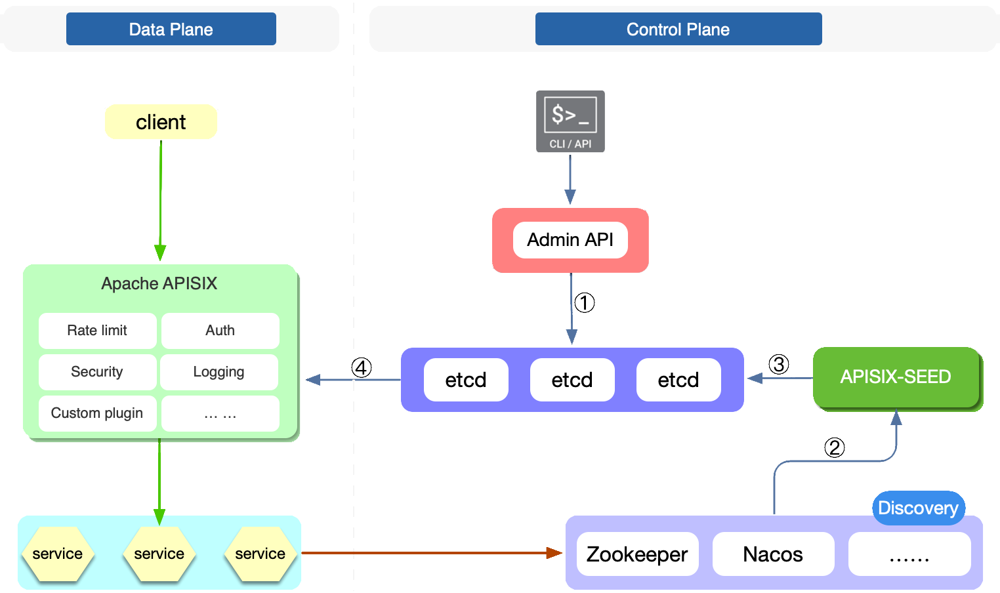

<!--
#
# Licensed to the Apache Software Foundation (ASF) under one or more
# contributor license agreements.  See the NOTICE file distributed with
# this work for additional information regarding copyright ownership.
# The ASF licenses this file to You under the Apache License, Version 2.0
# (the "License"); you may not use this file except in compliance with
# the License.  You may obtain a copy of the License at
#
#     http://www.apache.org/licenses/LICENSE-2.0
#
# Unless required by applicable law or agreed to in writing, software
# distributed under the License is distributed on an "AS IS" BASIS,
# WITHOUT WARRANTIES OR CONDITIONS OF ANY KIND, either express or implied.
# See the License for the specific language governing permissions and
# limitations under the License.
#
-->

This document describes how to implement service discovery with Nacos and Zookeeper on the APISIX Control Plane.

## APISIX-Seed Architecture

Apache APISIX has supported Data Plane service discovery in the early days, and now APISIX also supports Control Plane service discovery through the [APISIX-Seed](https://github.com/api7/apisix-seed) project. The following figure shows the APISIX-Seed architecture diagram.

The specific information represented by the figures in the figure is as follows:

1. Register an upstream with APISIX and specify the service discovery type. APISIX-Seed will watch APISIX resource changes in etcd, filter discovery types, and obtain service names.
2. APISIX-Seed subscribes the specified service name to the service registry to obtain changes to the corresponding service.
3. After the client registers the service with the service registry, APISIX-Seed will obtain the new service information and write the updated service node into etcd;
4. When the corresponding resources in etcd change, APISIX worker will refresh the latest service node information to memory.

:::note

It should be noted that after the introduction of APISIX-Seed, if the service of the registry changes frequently, the data in etcd will also change frequently. So, it is best to set the `--auto-compaction` option when starting etcd to compress the history periodically to avoid etcd eventually exhausting its storage space. Please refer to [revisions](https://etcd.io/docs/v3.5/learning/api/#revisions).

:::

## Why APISIX-Seed

- Network topology becomes simpler

  APISIX does not need to maintain a network connection with each registry, and only needs to pay attention to the configuration information in etcd. This will greatly simplify the network topology.

- Total data volume about upstream service becomes smaller

  Due to the characteristics of the registry, APISIX may store the full amount of registry service data in the worker, such as consul_kv. By introducing APISIX-Seed, each process of APISIX will not need to additionally cache upstream service-related information.

- Easier to manage

  Service discovery configuration needs to be configured once per APISIX instance. By introducing APISIX-Seed, Apache APISIX will be in different to the configuration changes of the service registry.

## Supported service registry

ZooKeeper and Nacos are currently supported, and more service registries will be supported in the future. For more information, please refer to: [APISIX Seed](https://github.com/api7/apisix-seed#apisix-seed-for-apache-apisix).

- If you want to enable control plane ZooKeeper service discovery, please refer to: [ZooKeeper Deployment Tutorial](https://github.com/api7/apisix-seed/blob/main/docs/en/latest/zookeeper.md).

- If you want to enable control plane Nacos service discovery, please refer to: [Nacos Deployment Tutorial](https://github.com/api7/apisix-seed/blob/main/docs/en/latest/nacos.md).
