<!--
#
# Licensed to the Apache Software Foundation (ASF) under one or more
# contributor license agreements.  See the NOTICE file distributed with
# this work for additional information regarding copyright ownership.
# The ASF licenses this file to You under the Apache License, Version 2.0
# (the "License"); you may not use this file except in compliance with
# the License.  You may obtain a copy of the License at
#
#     http://www.apache.org/licenses/LICENSE-2.0
#
# Unless required by applicable law or agreed to in writing, software
# distributed under the License is distributed on an "AS IS" BASIS,
# WITHOUT WARRANTIES OR CONDITIONS OF ANY KIND, either express or implied.
# See the License for the specific language governing permissions and
# limitations under the License.
#
-->

## Service Discovery Via Zookeeper

`Zookeeper` service discovery needs to rely on the [apisix-seed](https://github.com/api7/apisix-seed) project.

### How `apisix-seed` Works



`apisix-seed` completes data exchange by watching the changes of `etcd` and `zookeeper` at the same time.

The process is as follows:

1. `APISIX` registers an upstream and specifies the service discovery type as `zookeeper` to `etcd`.
2. `apisix-seed` watches the resource changes of `APISIX` in `etcd` and filters the discovery type and obtains the service name.
3. `apisix-seed` binds the service to the `etcd` resource and starts watching the service in zookeeper.
4. The client registers the service with `zookeeper`.
5. `apisix-seed` gets the service changes in `zookeeper`.
6. `apisix-seed` queries the bound `etcd` resource information through the service name, and writes the updated service node to `etcd`.
7. The `APISIX` worker watches `etcd` changes and refreshes the service node information to the memory.

### Setting `apisix-seed` and Zookeeper

The configuration steps are as follows:

1. Start the Zookeeper service

```bash
docker run -itd --rm --name=dev-zookeeper -p 2181:2181 zookeeper:3.7.0
```

2. Download and compile the `apisix-seed` project.

```bash
git clone https://github.com/api7/apisix-seed.git
cd apisix-seed
go build
```

3. Modify the `apisix-seed` configuration file, config path `conf/conf.yaml`.

```bash
etcd:                            # APISIX ETCD Configure
  host:
    - "http://127.0.0.1:2379"
  prefix: /apisix
  timeout: 30

discovery:
  zookeeper:                     # Zookeeper Service Discovery
    hosts:
      - "127.0.0.1:2181"         # Zookeeper service address
    prefix: /zookeeper
    weight: 100                  # default weight for node
    timeout: 10                  # default 10s
```

4. Start `apisix-seed` to monitor service changes

```bash
./apisix-seed
```

### Setting `APISIX` Route and Upstream

Set a route, the request path is `/zk/*`, the upstream uses zookeeper as service discovery, and the service name
is `APISIX-ZK`.

```shell
curl http://127.0.0.1:9080/apisix/admin/routes/1 \
-H 'X-API-KEY: edd1c9f034335f136f87ad84b625c8f1' -X PUT -i -d '
{
    "uri": "/zk/*",
    "upstream": {
        "service_name": "APISIX-ZK",
        "type": "roundrobin",
        "discovery_type": "zookeeper"
    }
}'
```

### Register Service and verify Request

1. Service registration using Zookeeper CLI

- Register Service

```bash
# Login Container
docker exec -it ${CONTAINERID} /bin/bash
# Login Zookeeper Client
oot@ae2f093337c1:/apache-zookeeper-3.7.0-bin# ./bin/zkCli.sh
# Register Service
[zk: localhost:2181(CONNECTED) 0] create /zookeeper/APISIX-ZK '{"host":"127.0.0.1:1980","weight":100}'
```

- Successful Response

```bash
Created /zookeeper/APISIX-ZK
```

2. Verify Request

- Request

```bash
curl -i http://127.0.0.1:9080/zk/hello
```

- Response

```bash
HTTP/1.1 200 OK
Connection: keep-alive
Content-Type: text/html; charset=utf-8
Date: Tue, 29 Mar 2022 08:51:28 GMT
Server: APISIX/2.12.0
Transfer-Encoding: chunked

hello
```
