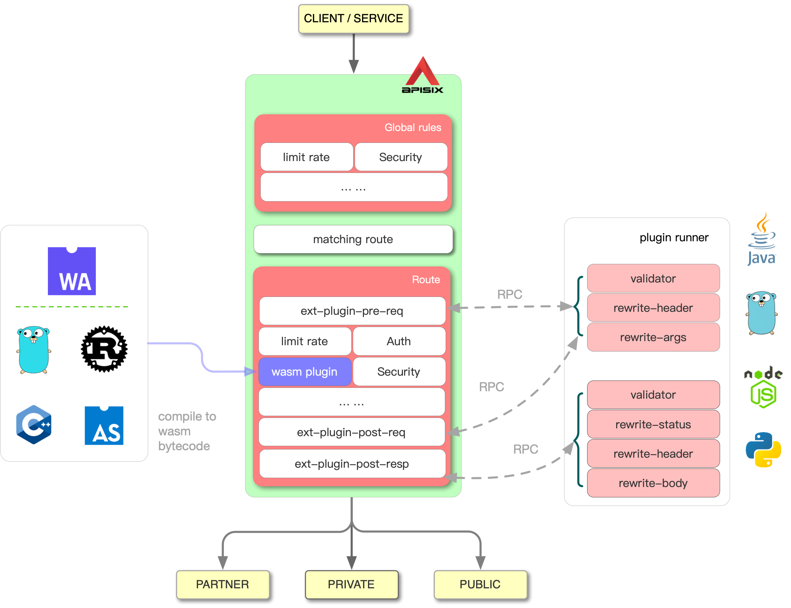

<!--
#
# Licensed to the Apache Software Foundation (ASF) under one or more
# contributor license agreements.  See the NOTICE file distributed with
# this work for additional information regarding copyright ownership.
# The ASF licenses this file to You under the Apache License, Version 2.0
# (the "License"); you may not use this file except in compliance with
# the License.  You may obtain a copy of the License at
#
#     http://www.apache.org/licenses/LICENSE-2.0
#
# Unless required by applicable law or agreed to in writing, software
# distributed under the License is distributed on an "AS IS" BASIS,
# WITHOUT WARRANTIES OR CONDITIONS OF ANY KIND, either express or implied.
# See the License for the specific language governing permissions and
# limitations under the License.
#
-->

## What are external plugin and plugin runner

APISIX supports writing plugins in Lua. This type of plugins will be executed
inside APISIX. Sometimes you want to develop plugin in other languages, so APISIX
provides sidecars that loading your plugins and run them when the requests hit
APISIX. These sidecars are called plugin runners and your plugins are called
external plugins.

## How does it work



When you configure a plugin runner in APISIX, APISIX will run the plugin runner
as a subprocess. The process will belong to the same user of the APISIX
process. When we restart or reload APISIX, the plugin runner will be restarted too.

Once you have configured `ext-plugin-*` plugins for a given route, the requests
which hit the route will trigger RPC call from APISIX to the plugin runner via
unix socket.

The plugin runner will handle the RPC call, create a fake request at its side,
run external plugins and return the result back to APISIX.

The target external plugins and the execution order are configured in the `ext-plugin-*`
plugins. Like other plugins, they can be enabled and reconfigured on the fly.

## Supported plugin runners

Java: https://github.com/apache/apisix-java-plugin-runner
Go: https://github.com/apache/apisix-go-plugin-runner

## Configuration for plugin runner in APISIX

To run plugin runner in the prod, add the section below to `config.yaml`:

```yaml
ext-plugin:
  cmd: ["blah"] # replace it to the real runner executable according to the runner you choice
```

Then APISIX will manage the runner as its subprocess.

Note: APISIX can't manage the runner on the Mac in `v2.6`.

During development, we want to run the runner separately so that we can restart it without
restarting APISIX first.

By specifying the environment variable `APISIX_LISTEN_ADDRESS`, we can force the runner to
listen to a fixed address.
For instance:

```bash
APISIX_LISTEN_ADDRESS=unix:/tmp/x.sock ./the_runner
```

will force the runner to listen to `/tmp/x.sock`.

Then you need to configure APISIX to send RPC to the fixed address:

```yaml
ext-plugin:
  # cmd: ["blah"] # don't configure the executable!
  path_for_test: "/tmp/x.sock" # without 'unix:' prefix
```

In the prod environment, `path_for_test` should not be used and the unix socket
path will be generated dynamically.

## FAQ

### When managing by APISIX, the runner can't access my environment variable

Since `v2.7`, APISIX can pass environment to the runner.

However, Nginx will hide all environment variables by default. So you need to
declare your variable first in the `conf/config.yaml`:

```yaml
nginx_config:
  envs:
    - MY_ENV_VAR
```

### APISIX terminates my runner with SIGKILL but not SIGTERM!

Since `v2.7`, APISIX will stop the runner with SIGTERM when it is running on
OpenResty 1.19+.

However, APISIX needs to wait the runner to quit so that we can ensure the resource
for the process group is freed.

Therefore, we send SIGTERM first. And then after 1 second, if the runner is still
running, we will send SIGKILL.
