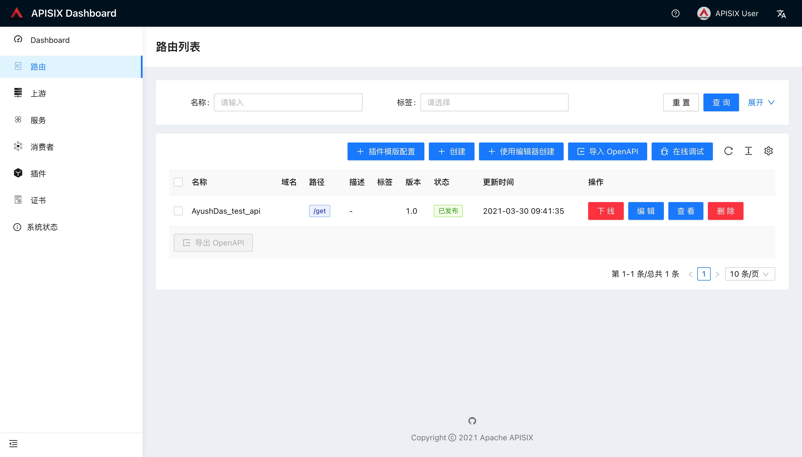

<!--
#
# Licensed to the Apache Software Foundation (ASF) under one or more
# contributor license agreements.  See the NOTICE file distributed with
# this work for additional information regarding copyright ownership.
# The ASF licenses this file to You under the Apache License, Version 2.0
# (the "License"); you may not use this file except in compliance with
# the License.  You may obtain a copy of the License at
#
#     http://www.apache.org/licenses/LICENSE-2.0
#
# Unless required by applicable law or agreed to in writing, software
# distributed under the License is distributed on an "AS IS" BASIS,
# WITHOUT WARRANTIES OR CONDITIONS OF ANY KIND, either express or implied.
# See the License for the specific language governing permissions and
# limitations under the License.
#
-->

## Getting Started

This guide aims to get started with Apache APISIX, we will configure the service that will route to a public API, secured by an API key.

Also, we will take the following `echo` endpoint as an example, it will return parameters we passed.

**Request**

```bash
$ curl --location --request GET "http://httpbin.org/get?foo1=bar1&foo2=bar2"
```

**Response**

```json
{
  "args": {
    "foo1": "bar1",
    "foo2": "bar2"
  },
  "headers": {
    "Accept": "*/*",
    "Host": "httpbin.org",
    "User-Agent": "curl/7.29.0",
    "X-Amzn-Trace-Id": "Root=1-6088fe84-24f39487166cce1f0e41efc9"
  },
  "origin": "58.152.81.42",
  "url": "http://httpbin.org/get?foo1=bar1&foo2=bar2"
}
```

Let's deconstruct the above Request URL.

- Protocol: HTTP
- Port: 80
- Host: `httpbin.org`
- URI/Path: `/get`
- Query Parameters: foo1, foo2

## Prerequisites

> If you have installed the Apache APISIX, feel free and skip to [Step 2](#step-2-create-a-route) please.

- This guide uses [Docker](https://www.docker.com/) and [Docker Compose](https://docs.docker.com/compose/) to setup Apache APISIX.
- `curl`: This guide uses the [curl](https://curl.se/docs/manpage.html) command for API testing, but you can also use any other tools, e.g [Postman](https://www.postman.com/).

I know you're waiting for this moment for a while, let's go!

## Step 1: Install Apache APISIX

Thanks to Docker, we could launch the Apache APISIX and enable the [Admin API](./admin-api.md) by executing the following commands:

```bash
$ git clone https://github.com/apache/apisix-docker.git
$ cd apisix-docker/example
$ docker-compose -p docker-apisix up -d
```

It will take some time to download all needed files, and this depends on your network, please be patient. Once this step gets done, we could `curl` our Admin API to tell if the Apache APISIX launchs successfully.

```bash
# NOTE: Please curl on the machine which you run above Docker commands.
$ curl "http://127.0.0.1:9080/apisix/admin/services/" -H 'X-API-KEY: edd1c9f034335f136f87ad84b625c8f1'
```

We expect the following data to be returned:

```json
{
  "count":1,
  "action":"get",
  "node":{
    "key":"/apisix/services",
    "nodes":{},
    "dir":true
  }
}
```

## Step 2: Create a Route

Congratulations! You have a running Apache APISIX instance now! Let's create a Route next!

### Before we continue

Do you know? Apache APISIX provides the powerful [Admin API](./admin-api.md) and a [Dashboard](https://github.com/apache/apisix-dashboard) for us to use, but we will use Admin API here in this guide. Let's go!

We could create one [Route](./architecture-design/route.md) and target it to our backend services (We call them [Upstream](./architecture-design/upstream.md) usually), when one `Request` reaches Apache APISIX, Apache APISIX will see where this Request should go.

Then how does Apache APISIX know this? That's because we have a list of rules configured with Route. Here is a sample Route data:

```json
{
  "methods": ["GET"],
  "host": "example.com",
  "uri": "/services/users/*",
  "upstream": {
    "type": "roundrobin",
    "nodes": {
      "httpbin.org:80": 1
    }
  }
}
```

This Route means all inbound requests will be forwarded to the `httpbin.org:80` Upstream when they meets **ALL** these rules(matched requests):

- Request's HTTP method is `GET`;
- Request has `Host` Header, and its value is `example.com`;
- Request's path matches `/services/users/*`, `*` means all subpaths, like `/services/users/getAll?limit=10`.

After this Route is created, we could use Apache APISIX's address to access our backend services(Upstream actually):

```bash
$ curl -i -X GET "http://{APISIX_BASE_URL}/services/users/getAll?limit=10" -H "Host: example.com"
```

This will be forward to `http://httpbin.org:80/services/users/getAll?limit=10` by Apache APISIX.

### Create an Upstream

After reading the above section, we know we have to set the `Upstream` for `Route`. Just executing the following command to create one:

```bash
$ curl "http://127.0.0.1:9080/apisix/admin/upstreams/1" -H "X-API-KEY: edd1c9f034335f136f87ad84b625c8f1" -X PUT -d '
{
  "type": "roundrobin",
  "nodes": {
    "httpbin.org:80": 1
  }
}'
```

We use `roundrobin` as our load balancer mechanism, and set `httpbin.org:80` as our Upstream target(backend server), and its ID is `1`. For more fields, please refer to [Admin API](./admin-api.md).

**NOTE:** `Create an Upstream` is not required actually, because we could use [Plugin](./architecture-design/plugin.md) to interceptor requests then response directly, but let's assume we need to set at least one `Upstream` in this guide.

### Bind Route with Upstream

We just created an Upstream(Reference to our backend services), let's bind one Route with it!

```bash
$ curl "http://127.0.0.1:9080/apisix/admin/routes/1" -H "X-API-KEY: edd1c9f034335f136f87ad84b625c8f1" -X PUT -d '
{
  "uri": "/get",
  "host": "httpbin.org",
  "upstream_id": "1"
}'
```

That's it!

### Verification

Congratulations once more! We have created one `Route` and `Upstream`, also we bind them together. Now let's call Apache APISIX to test the `created route`.

```bash
$ curl -i -X GET "http://127.0.0.1:9080/get?foo1=bar1&foo2=bar2" -H "Host: httpbin.org"
```

Wow! It will return data from our `Upstream`(`httpbin.org` actually), it works as expected!

## Advanced

### Authentication

Let's do some interesting things, due to **anyone** could access our public `Route` created in the Step2, we would like only `John` could access it. Let's use [Consumer](./architecture-design/consumer.md) and [Plugin](./architecture-design/plugin.md) to implement this protection.

First, let's create the [consumer](./architecture-design/consumer.md) `John` with [key-auth](./plugins/key-auth.md) plugin, we need to provide a specified secret key:

```bash
$ curl "http://127.0.0.1:9080/apisix/admin/consumers" -H "X-API-KEY: edd1c9f034335f136f87ad84b625c8f1" -X PUT -d '
{
  "username": "john",
  "plugins": {
    "key-auth": {
      "key": "key-of-john"
    }
  }
}'
```

Next, let's bind our `Consumer(John)` to that `Route`, we only need to **Enable** the [key-auth](./plugins/key-auth.md) plugin for that `Route`:

```bash
$ curl "http://127.0.0.1:9080/apisix/admin/routes/1" -H "X-API-KEY: edd1c9f034335f136f87ad84b625c8f1" -X PUT -d '
{
  "uri": "/get",
  "host": "httpbin.org",
  "plugins": {
    "key-auth": {}
  },
  "upstream_id": "1"
}'
```

Ok, when we access the `Route` created in Step2 from now on, an **Unauthorized Error** will occur. Let's see how to access that `Route`:

```bash
$ curl -i -X GET "http://127.0.0.1:9080/get" -H "Host: httpbin.org" -H "apikey: key-of-john"
```

Ya, just added an `Header` called `apikey` with correct key! It's so easy to protect any `Routes`, right?

### Prefix in Route

Now lets say you want to add a prefix (eg: samplePrefix) to the route and do not want to use the `host` header then you can use
the proxy-rewrite plugin to do it.

```bash
$ curl "http://127.0.0.1:9080/apisix/admin/routes/1" -H "X-API-KEY: edd1c9f034335f136f87ad84b625c8f1" -X PUT -d '
{
  "uri": "/samplePrefix/get",
  "plugins": {
    "proxy-rewrite": {
      "regex_uri": ["^/samplePrefix/get(.*)", "/get$1"]
    },
    "key-auth": {}
  },
  "upstream_id": "1"
}'
```

Now you can invoke the route with the following command:

```bash
$ curl -i -X GET "http://127.0.0.1:9080/samplePrefix/get?param1=foo&param2=bar" -H "apikey: key-of-john"
```

### APISIX Dashboard

Apache APISIX provides a [Dashboard](https://github.com/apache/apisix-dashboard) to let us operate Apache APISIX more easier.



### Troubleshooting

- Make sure all required ports (**9080/9443/2379 by default**) are not being used by other systems/processes.

The following command will kill the process which is listening on a specific port (in unix based systems).

```bash
$ sudo fuser -k 9443/tcp
```

- If the docker container is restarting/failing continuously, just access to the container and observe the logs to find out what happened.

```bash
$ docker logs -f --tail container_id
```
