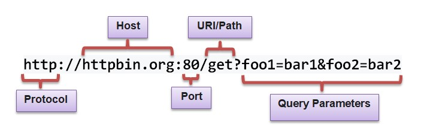
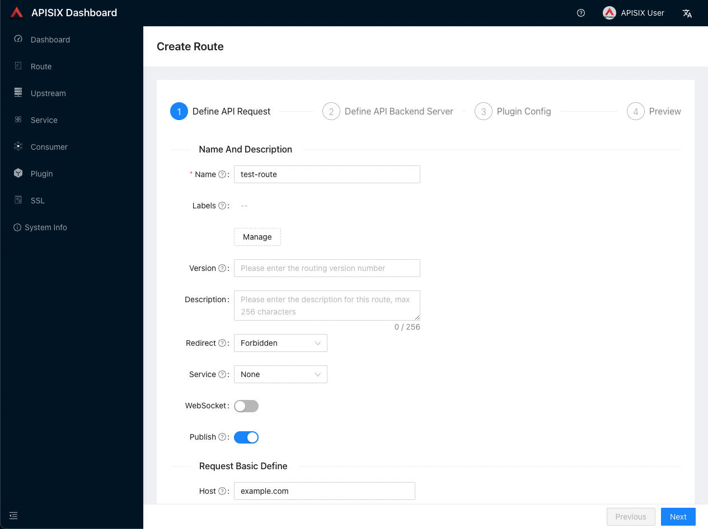
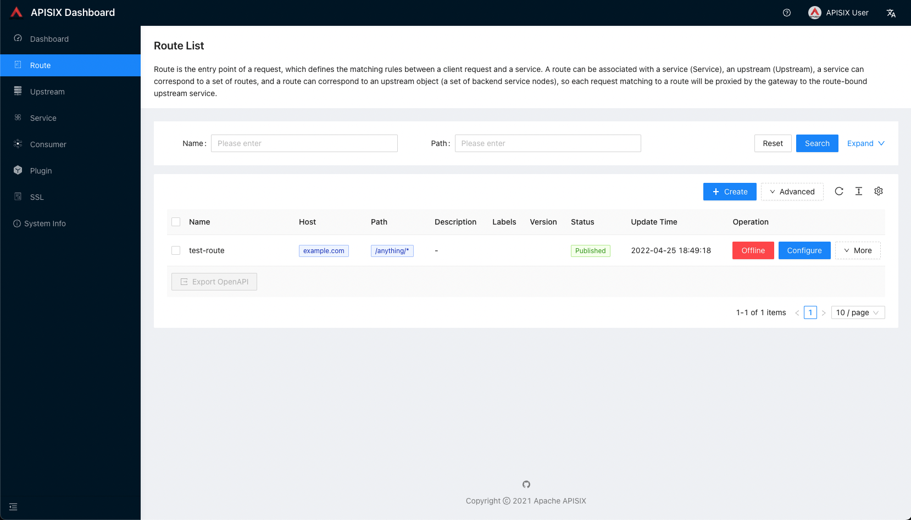

<!--
#
# Licensed to the Apache Software Foundation (ASF) under one or more
# contributor license agreements.  See the NOTICE file distributed with
# this work for additional information regarding copyright ownership.
# The ASF licenses this file to You under the Apache License, Version 2.0
# (the "License"); you may not use this file except in compliance with
# the License.  You may obtain a copy of the License at
#
#     http://www.apache.org/licenses/LICENSE-2.0
#
# Unless required by applicable law or agreed to in writing, software
# distributed under the License is distributed on an "AS IS" BASIS,
# WITHOUT WARRANTIES OR CONDITIONS OF ANY KIND, either express or implied.
# See the License for the specific language governing permissions and
# limitations under the License.
#
-->

import Tabs from '@theme/Tabs';
import TabItem from '@theme/TabItem';

The guide walks you through the concepts, features and how you can get started with Apache APISIX.

You will learn:

- What Apache APISIX is.
- Architecture and key concepts of APISIX.
- How to install and run APISIX in Docker.
- How to create your first Route and configure an Upstream using Admin API.
- How to use APISIX dashboard.
- Where you can reach out for help.

## What is Apache APISIX?

Apache APISIX is an open source, dynamic, scalable, and high-performance cloud native API gateway for all your APIs and microservices.

APISIX facilitates interface traffic handling for websites, mobile and IoT applications by providing services such as load balancing, dynamic upstream, canary release, fine-grained routing, rate limiting, and many more.

### Features

- Multi-platform support: APISIX can run from bare-metal machines to Kubernetes providing a vendor neutral, multi-platform solution. It also provides integration to cloud services like AWS Lambda, Azure Function, Lua functions and Apache OpenWhisk.
- Fully dynamic: APISIX supports hot-reloading, meaning you don't need to restart the service to reflect changes in the configuration.
- Fine-grained routing: APISIX supports using all [built-in NGINX variables](https://nginx.org/en/docs/varindex.html) for routing. You can define custom matching functions to filter requests and match Route.
- Ops-friendly: APISIX is renowned for its ops-friendliness by DevOps teams. It integrates with tools and platforms like [HashiCorp Vault](./terminology/secret.md#use-vault-to-manage-secrets), [Zipkin](./plugins/zipkin.md), [Apache SkyWalking](./plugins/skywalking.md), [Consul](./discovery/consul_kv.md), [Nacos](./discovery/nacos.md) and [Eureka](./discovery.md). With [APISIX Dashboard](https://github.com/apache/apisix-dashboard), operators can configure APISIX through an easy-to-use and intuitive UI.
- Multi-language Plugin support: APISIX supports multiple programming languages for Plugin development. Developers can choose a language-specific SDK to write custom Plugins.

## Key concepts

Here is a high-level overview of APISIX's software architecture:


The table below defines the key concepts and components of APISIX referenced in this guide:

| Concept/Component | Description                                                                                                                                                              |
|-------------------|--------------------------------------------------------------------------------------------------------------------------------------------------------------------------|
| Route             | Routes specify how requests to APISIX are forwarded to the Upstream. They match a client's request based on defined rules and loads and executes the configured Plugins. |
| Upstream          | Upstream is the service to forward your requests to. They can be configured to a Route or abstracted out to an Upstream object.                                          |
| Admin API         | API that lets users control their deployed APISIX instance.                                                                                                       |

## Before you begin

Before you start with APISIX, make sure you have the following tools installed:

- [Docker](https://www.docker.com/) and [Docker Compose](https://docs.docker.com/compose/).
- [curl](https://curl.se/docs/manpage.html) for testing the API. Alternatively, you can use tools like [Hoppscotch](https://hoppscotch.io/).

The example Upstream service used here is [httpbin.org](https://httpbin.org) and you can use it for your testing.

This is an echo service, meaning it will return back the parameters we pass in the request.

**Request**

The components of the request URL are shown and explained below:



- Protocol: The network transport protocol. `HTTP` protocol is used for this example.
- Port: The port. `80` is used for this example.
- Host: The host. `httpbin.org` is used for this example.
- Path: The path. `/get` is used for this example.
- Query Parameters: The query string. Two strings `foo1` and `foo2` are used for this example.

We can use the `curl` command to send the request:

```bash
curl --location --request GET "http://httpbin.org/get?foo1=bar1&foo2=bar2"
```

**Response**

We receive a JSON response when we send the request:

```json
{
  "args": {
    "foo1": "bar1",
    "foo2": "bar2"
  },
  "headers": {
    "Accept": "*/*",
    "Host": "httpbin.org",
    "User-Agent": "curl/7.29.0",
    "X-Amzn-Trace-Id": "Root=1-6088fe84-24f39487166cce1f0e41efc9"
  },
  "origin": "58.152.81.42",
  "url": "http://httpbin.org/get?foo1=bar1&foo2=bar2"
}
```

## Install Apache APISIX

APISIX can be easily installed and started with the quickstart script.

```sh
curl -sL https://run.api7.ai/apisix/quickstart | sh
```

This command runs APISIX and etcd locally with Docker. APISIX uses etcd to save and synchronize configuration. Both etcd and APISIX use the [**host**](https://docs.docker.com/network/host/) Docker network mode. That is, APISIX can be accessed locally.

If everything is ok, you will see the following message.

```text
✔ APISIX is ready!
```

:::note

You can check out [Installing Apache APISIX](./installation-guide.md) for different installation methods.

:::

:::info IMPORTANT

Make sure that all the required ports (default: 9080, 9180, 9443 and 2379) are available and not used by other system processes.

:::

Once APISIX is running, you can use curl to access it. Send a simple HTTP request to validate if APISIX is working properly or not.

```sh
curl "http://127.0.0.1:9080" --head | grep Server
```

If everything is ok, you will get the following response.

```text
Server: APISIX/3.1.0
```

You now have APISIX installed and running successfully!​

## Create a Route

From the previous step, we have a running instance of APISIX in Docker. Now let's create a Route.

APISIX provides a powerful [Admin API](./admin-api.md) and [APISIX Dashboard](https://github.com/apache/apisix-dashboard). Here, we will use the Admin API to create a Route and connect it to an [Upstream](./terminology/upstream.md) service. When a request arrives, APISIX will forward the request to the specified Upstream service.

We will configure the Route so that APISIX can forward the request to the corresponding Upstream service:

```bash
curl "http://127.0.0.1:9180/apisix/admin/routes/1" -X PUT -d '
{
  "methods": ["GET"],
  "host": "example.com",
  "uri": "/anything/*",
  "upstream": {
    "type": "roundrobin",
    "nodes": {
      "httpbin.org:80": 1
    }
  }
}'
```

This configuration means that it will forward all matching inbound requests to the Upstream service (`httpbin.org:80`) if they meet these specified criterion:

- The HTTP method of the request is `GET`.
- The request header contains the `host` field, and its value is `example.com`.
- The request path matches `/anything/*`. `*` means any sub path. For example `/anything/foo?arg=10`.

With the Route has created, we can access the Upstream service from the address exposed by APISIX:

```bash
curl -i -X GET "http://127.0.0.1:9080/anything/foo?arg=10" -H "Host: example.com"
```

This request will be forwarded to `http://httpbin.org:80/anything/foo?arg=10` by APISIX.

## Abstracting to Upstream

Instead of configuring the Upstream directly to the Route, you can create an Upstream object and use it in the Route.

To create an Upstream object:

```bash
curl "http://127.0.0.1:9180/apisix/admin/upstreams/1" -X PUT -d '
{
  "type": "roundrobin",
  "nodes": {
    "httpbin.org:80": 1
  }
}'
```

This is the same as the Upstream service we configured directly into the Route on the previous section.

To bind this Upstream to the Route, we can use the `upstream_id` as `1`:

```bash
curl "http://127.0.0.1:9180/apisix/admin/routes/1" -X PUT -d '
{
  "methods": ["GET"],
  "host": "example.com",
  "uri": "/anything/*",
  "upstream_id": "1"
}'
```

With the Route has created, we can access the Upstream service from the address exposed by APISIX:

```bash
curl -i -X GET "http://127.0.0.1:9080/anything/foo?arg=10" -H "Host: example.com"
```

This request will be forwarded to `http://httpbin.org:80/anything/foo?arg=10` by APISIX.

## Using the APISIX Dashboard

You can also use the APISIX Dashboard to create and configure Routes similar to the Admin API.

If you have followed the steps above, you would be able to access the dashboard at [localhost:9000](http://localhost:9000/).

Click on [Route](http://localhost:9000/routes/list) from the sidebar to view a list of configured Routes. You would be able to see the Routes you created using the Admin API as well.

You can create a new Route through the dashboard by clicking the [Create](http://localhost:9000/routes/create) button and following the instructions:



The newly created Route is added to the list of Routes:



Check out the [APISIX Dashboard documentation](/docs/dashboard/USER_GUIDE) to learn more.

## Where to go next?

If you have followed the steps above, you should have APISIX running and you would have configured a Route.

You can now look into adding Plugins to provide features like authentication, security, traffic control and observability. See the [Plugin Hub](/plugins) to learn more.

If you ever get stuck, you can ask for help in the [APISIX community channels](/docs/general/join) or [open an issue](/docs/general/submit-issue) on GitHub.
