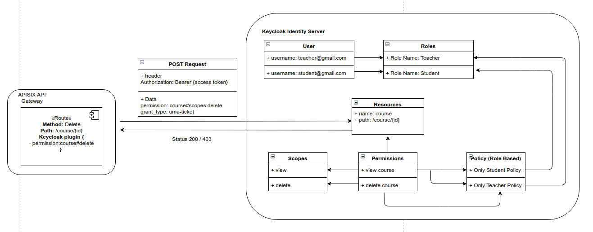

<!--
#
# Licensed to the Apache Software Foundation (ASF) under one or more
# contributor license agreements.  See the NOTICE file distributed with
# this work for additional information regarding copyright ownership.
# The ASF licenses this file to You under the Apache License, Version 2.0
# (the "License"); you may not use this file except in compliance with
# the License.  You may obtain a copy of the License at
#
#     http://www.apache.org/licenses/LICENSE-2.0
#
# Unless required by applicable law or agreed to in writing, software
# distributed under the License is distributed on an "AS IS" BASIS,
# WITHOUT WARRANTIES OR CONDITIONS OF ANY KIND, either express or implied.
# See the License for the specific language governing permissions and
# limitations under the License.
#
-->

## Summary

- [**Name**](#name)
- [**Attributes**](#attributes)
- [**How To Enable**](#how-to-enable)
- [**Test Plugin**](#test-plugin)
- [**Disable Plugin**](#disable-plugin)
- [**Examples**](#examples)

## Name

`authz-keycloak` is an authorization plugin to be used with the Keycloak Identity Server. Keycloak is an OAuth/OIDC and
UMA compliant Identity Server. Although, it's developed working in conjunction with Keycloak it should work with any
OAuth/OIDC and UMA compliant identity providers as well.

For more information on Keycloak, refer to [Keycloak Authorization Docs](https://www.keycloak.org/docs/latest/authorization_services) for more information.

## Attributes

| Name                           | Type          | Requirement | Default                                       | Valid                                                              | Description                                                                                                                                                 |
| ------------------------------ | ------------- | ----------- | --------------------------------------------- | ------------------------------------------------------------------ | ----------------------------------------------------------------------------------------------------------------------------------------------------------- |
| discovery                      | string        | optional    |                                               | https://host.domain/auth/realms/foo/.well-known/uma2-configuration | URL to discovery document for Keycloak Authorization Services.                                                                                              |
| token_endpoint                 | string        | optional    |                                               | https://host.domain/auth/realms/foo/protocol/openid-connect/token  | A OAuth2-compliant Token Endpoint that supports the `urn:ietf:params:oauth:grant-type:uma-ticket` grant type. Overrides value from discovery, if given.     |
| resource_registration_endpoint | string        | optional    |                                               | https://host.domain/auth/realms/foo/authz/protection/resource_set  | A Keycloak Protection API-compliant resource registration endpoint. Overrides value from discovery, if given.                                               |
| client_id                      | string        | optional    |                                               |                                                                    | The client identifier of the resource server to which the client is seeking access. One of `client_id` or `audience` is required.                           |
| audience                       | string        | optional    |                                               |                                                                    | Legacy parameter now replaced by `client_id`. Kept for backwards compatibility. One of `client_id` or `audience` is required.                               |
| client_secret                  | string        | optional    |                                               |                                                                    | The client secret, if required.                                                                                                                             |
| grant_type                     | string        | optional    | "urn:ietf:params:oauth:grant-type:uma-ticket" | ["urn:ietf:params:oauth:grant-type:uma-ticket"]                    |                                                                                                                                                             |
| policy_enforcement_mode        | string        | optional    | "ENFORCING"                                   | ["ENFORCING", "PERMISSIVE"]                                        |                                                                                                                                                             |
| permissions                    | array[string] | optional    |                                               |                                                                    | Static permission to request, an array of strings each representing a resources and optionally one or more scopes the client is seeking access.             |
| lazy_load_paths                | boolean       | optional    | false                                         |                                                                    | Dynamically resolve the request URI to resource(s) using the resource registration endpoint instead of using the static permission.                         |
| http_method_as_scope           | boolean       | optional    | false                                         |                                                                    | Map HTTP request type to scope of same name and add to all permissions requested.                                                                           |
| timeout                        | integer       | optional    | 3000                                          | [1000, ...]                                                        | Timeout(ms) for the http connection with the Identity Server.                                                                                               |
| ssl_verify                     | boolean       | optional    | true                                          |                                                                    | Verify if TLS certificate matches hostname.                                                                                                                 |
| cache_ttl_seconds              | integer       | optional    | 86400 (equivalent to 24h)                     | positive integer >= 1                                              | The maximum period in seconds up to which the plugin caches discovery documents and tokens, used by the plugin to authenticate to Keycloak.                 |
| keepalive                      | boolean       | optional    | true                                          |                                                                    | Enable HTTP keep-alive to keep connections open after use. Set to `true` if you expect a lot of requests to Keycloak.                                       |
| keepalive_timeout              | integer       | optional    | 60000                                         | positive integer >= 1000                                           | Idle timeout after which established HTTP connections will be closed.                                                                                       |
| keepalive_pool                 | integer       | optional    | 5                                             | positive integer >= 1                                              | Maximum number of connections in the connection pool.                                                                                                       |

### Discovery and Endpoints

The plugin can discover Keycloak API endpoints from a URL in the `discovery` attribute that points to
Keycloak's discovery document for Authorization Services for the respective realm. This is the recommended
option and typically most convenient.

If the discovery document is available, the plugin determines the token endpoint URL from it. If present, the
`token_endpoint` attribute overrides the URL.

Analogously, the plugin determines the registration endpoint from the discovery document. The
`resource_registration_endpoint` overrides, if present.

### Client ID and Secret

The plugin needs the `client_id` attribute to identify itself when interacting with Keycloak.
For backwards compatibility, you can still use the `audience` attribute as well instead. The plugin
prefers `client_id` over `audience` if both are configured.

The plugin always needs the `client_id` or `audience` to specify the context in which Keycloak
should evaluate permissions.

If `lazy_load_paths` is `true` then the plugin additionally needs to obtain an access token for
itself from Keycloak. In this case, if the client access to Keycloak is confidential, the plugin
needs the `client_secret` attribute as well.

### Policy Enforcement Mode

Specifies how policies are enforced when processing authorization requests sent to the server.

**Enforcing**

- (default mode) Requests are denied by default even when there is no policy associated with a given resource.

**Permissive**

- Requests are allowed even when there is no policy associated with a given resource.

### Permissions

When handling an incoming request, the plugin can determine the permissions to check with Keycloak either
statically, or dynamically from properties of the request.

If `lazy_load_paths` is `false`, the plugin takes the permissions from the `permissions` attribute. Each entry
needs to be formatted as expected by the token endpoint's `permission` parameter;
see https://www.keycloak.org/docs/latest/authorization_services/index.html#_service_obtaining_permissions.
Note that a valid permission can be a single resource, or a resource paired with one or more scopes.

if `lazy_load_paths` is `true`, the plugin resolves the request URI to one or more resources, as configured
in Keycloak. It uses the resource registration endpoint to do so. The plugin uses the resolved resources
as the permissions to check.

Note that this requires that the plugin can obtain a separate access token for itself from the token endpoint.
Therefore, in the respective client settings in Keycloak, make sure to set the `Service Accounts Enabled`
option. Also make sure that the issued access token contains the `resource_access` claim with the
`uma_protection` role. Otherwise, plugin may be unable to query resources through the Protection API.

### Automatic Mapping of HTTP Method to Scope

This option is often used together with `lazy_load_paths`, but can also be used with a static permission list.

If the `http_method_as_scope` attribute is set to `true`, the plugin maps the request's HTTP method to a scope
of the same name. The scope is then added to every permission to check.

If `lazy_load_paths` is `false`, the plugin adds the mapped scope to any of the static permissions configured
in the `permissions` attribute, even if they contain one or more scopes alreay.

## How To Enable

Create a `route` and enable the `authz-keycloak` plugin on the route:

```shell
curl http://127.0.0.1:9080/apisix/admin/routes/5 -H 'X-API-KEY: edd1c9f034335f136f87ad84b625c8f1' -X PUT -d '
{
    "uri": "/get",
    "plugins": {
        "authz-keycloak": {
            "token_endpoint": "http://127.0.0.1:8090/auth/realms/{client_id}/protocol/openid-connect/token",
            "permissions": ["resource name#scope name"],
            "audience": "Client ID"
        }
    },
    "upstream": {
        "type": "roundrobin",
        "nodes": {
            "127.0.0.1:8080": 1
        }
    }
}'
```

## Test Plugin

```shell
curl http://127.0.0.1:9080/get -H 'Authorization: Bearer {JWT Token}'
```

## Disable Plugin

Remove the corresponding json configuration in the plugin configuration to disable the `authz-keycloak`.
APISIX plugins are hot-reloaded, therefore no need to restart APISIX.

```shell
curl http://127.0.0.1:9080/apisix/admin/routes/5 -H 'X-API-KEY: edd1c9f034335f136f87ad84b625c8f1' -X PUT -d '
{
    "uri": "/get",
    "plugins": {
    },
    "upstream": {
        "type": "roundrobin",
        "nodes": {
            "127.0.0.1:8080": 1
        }
    }
}'
```

## Examples

Checkout the unit test for of the authz-keycloak.t to understand how the authorization policies can be integrated into your
API workflows. Run the following docker image and visit `http://localhost:8090` to view the associated policies for the unit tests.

```bash
docker run -e KEYCLOAK_USER=admin -e KEYCLOAK_PASSWORD=123456 -p 8090:8080 sshniro/keycloak-apisix
```

The following image shows how the policies are configures in the Keycloak server.



## Future Development

- Currently the `authz-plugin` requires to define the resource name and required scopes in order to enforce policies for the routes.
However, Keycloak's official adapters (Java, JS) also provides path matching by querying Keycloak paths dynamically, and
lazy loading the paths to identity resources. Future version on authz-plugin will support this functionality.

- Support to read scope and configurations from the Keycloak JSON File
