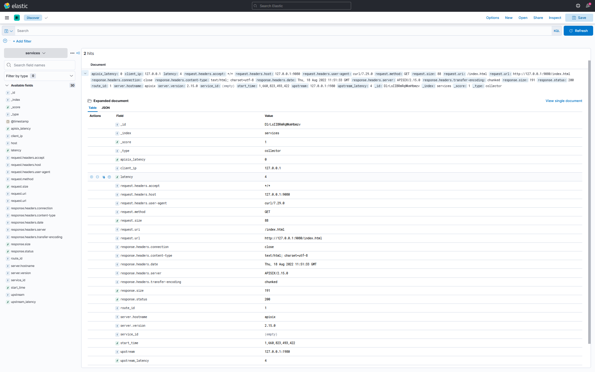

<!--
#
# Licensed to the Apache Software Foundation (ASF) under one or more
# contributor license agreements.  See the NOTICE file distributed with
# this work for additional information regarding copyright ownership.
# The ASF licenses this file to You under the Apache License, Version 2.0
# (the "License"); you may not use this file except in compliance with
# the License.  You may obtain a copy of the License at
#
#     http://www.apache.org/licenses/LICENSE-2.0
#
# Unless required by applicable law or agreed to in writing, software
# distributed under the License is distributed on an "AS IS" BASIS,
# WITHOUT WARRANTIES OR CONDITIONS OF ANY KIND, either express or implied.
# See the License for the specific language governing permissions and
# limitations under the License.
#
-->

## Description

The `elasticsearch-logging` Plugin is used to forward logs to [Elasticsearch](https://www.elastic.co/guide/en/welcome-to-elastic/current/getting-started-general-purpose.html) for analysis and storage.

When the Plugin is enabled, APISIX will serialize the request context information to [Elasticsearch Bulk format](https://www.elastic.co/guide/en/elasticsearch/reference/current/docs-bulk.html#docs-bulk) and submit it to the batch queue. When the maximum batch size is exceeded, the data in the queue is pushed to Elasticsearch. See [batch processor](../batch-processor.md) for more details.

## Attributes

| Name                | Required | Default                     | Description                                                  |
| ------------------- | -------- | --------------------------- | ------------------------------------------------------------ |
| endpoint            | True     |                             | Elasticsearch endpoint configurations.                       |
| endpoint.uri        | True     |                             | Elasticsearch API endpoint.                                  |
| endpoint.index      | True     |                             | Elasticsearch [_index field](https://www.elastic.co/guide/en/elasticsearch/reference/current/mapping-index-field.html#mapping-index-field) |
| endpoint.type       | False    | Elasticsearch default value | Elasticsearch [_type field](https://www.elastic.co/guide/en/elasticsearch/reference/7.17/mapping-type-field.html#mapping-type-field) |
| endpoint.username   | False    |                             | Elasticsearch [authentication](https://www.elastic.co/guide/en/elasticsearch/reference/current/setting-up-authentication.html) username |
| endpoint.password   | False    |                             | Elasticsearch [authentication](https://www.elastic.co/guide/en/elasticsearch/reference/current/setting-up-authentication.html) password |
| endpoint.ssl_verify | False    | true                        | When set to `true` enables SSL verification as per [OpenResty docs](https://github.com/openresty/lua-nginx-module#tcpsocksslhandshake). |
| endpoint.timeout    | False    | 10                          | Elasticsearch send data timeout in seconds.                  |

This Plugin supports using batch processors to aggregate and process entries (logs/data) in a batch. This avoids the need for frequently submitting the data. The batch processor submits data every `5` seconds or when the data in the queue reaches `1000`. See [Batch Processor](../batch-processor.md#configuration) for more information or setting your custom configuration.

## Enabling the Plugin

### Full configuration

The example below shows a complete configuration of the Plugin on a specific Route:

```shell
$ curl http://127.0.0.1:9080/apisix/admin/routes/1 -H 'X-API-KEY: edd1c9f034335f136f87ad84b625c8f1' -X PUT -d '
{
    "plugins":{
        "splunk-hec-logging":{
            "endpoint":{
                "uri": "http://127.0.0.1:9200",
                "index": "services",
                "type": "collector",
                "timeout": 60,
                "username": "elastic",
                "password": "123456",
                "ssl_verify": false
            },
            "buffer_duration":60,
            "max_retry_count":0,
            "retry_delay":1,
            "inactive_timeout":2,
            "batch_max_size":10
        }
    },
    "upstream":{
        "type":"roundrobin",
        "nodes":{
            "127.0.0.1:1980":1
        }
    },
    "uri":"/elasticsearch.do"
}'
```

### Minimal configuration

The example below shows a bare minimum configuration of the Plugin on a Route:

```shell
curl http://127.0.0.1:9080/apisix/admin/routes/1 -H 'X-API-KEY: edd1c9f034335f136f87ad84b625c8f1' -X PUT -d '
{
    "plugins":{
        "splunk-hec-logging":{
            "endpoint":{
                "uri": "http://127.0.0.1:9200",
                "index": "services"
            }
        }
    },
    "upstream":{
        "type":"roundrobin",
        "nodes":{
            "127.0.0.1:1980":1
        }
    },
    "uri":"/elasticsearch.do"
}'
```

## Example usage

Once you have configured the Route to use the Plugin, when you make a request to APISIX, it will be logged in your Elasticsearch server:

```shell
curl -i http://127.0.0.1:9080/elasticsearch.do?q=hello
HTTP/1.1 200 OK
...
hello, world
```

You should be able to login and search these logs from your Kibana discover:



## Disable Plugin

To disable the `elasticsearch-logging` Plugin, you can delete the corresponding JSON configuration from the Plugin configuration. APISIX will automatically reload and you do not have to restart for this to take effect.

```shell
curl http://127.0.0.1:9080/apisix/admin/routes/1 -H 'X-API-KEY: edd1c9f034335f136f87ad84b625c8f1' -X PUT -d '
{
    "plugins":{},
    "upstream":{
        "type":"roundrobin",
        "nodes":{
            "127.0.0.1:1980":1
        }
    },
    "uri":"/elasticsearch.do"
}'
```
