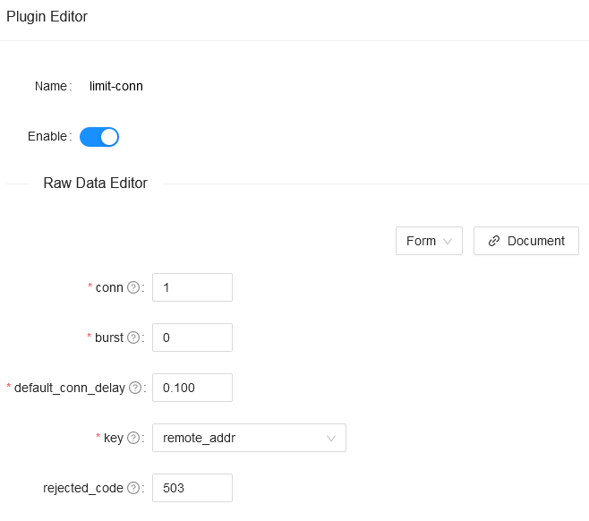

<!--
#
# Licensed to the Apache Software Foundation (ASF) under one or more
# contributor license agreements.  See the NOTICE file distributed with
# this work for additional information regarding copyright ownership.
# The ASF licenses this file to You under the Apache License, Version 2.0
# (the "License"); you may not use this file except in compliance with
# the License.  You may obtain a copy of the License at
#
#     http://www.apache.org/licenses/LICENSE-2.0
#
# Unless required by applicable law or agreed to in writing, software
# distributed under the License is distributed on an "AS IS" BASIS,
# WITHOUT WARRANTIES OR CONDITIONS OF ANY KIND, either express or implied.
# See the License for the specific language governing permissions and
# limitations under the License.
#
-->

## Summary

- [Name](#name)
- [Attributes](#attributes)
- [How To Enable](#how-to-enable)
- [Test Plugin](#test-plugin)
- [Disable Plugin](#disable-plugin)

## Name

Limiting request concurrency plugin.

## Attributes

| Name               | Type    | Requirement | Default | Valid                                                                                     | Description                                                                                                                                                                                                                                                                                                                                                                                                                                                                                               |
| ------------------ | ------- | ----------- | ------- | ----------------------------------------------------------------------------------------- | --------------------------------------------------------------------------------------------------------------------------------------------------------------------------------------------------------------------------------------------------------------------------------------------------------------------------------------------------------------------------------------------------------------------------------------------------------------------------------------------------------- |
| conn               | integer | required    |         | conn > 0                                                                                  | the maximum number of concurrent requests allowed. Requests exceeding this ratio (and below `conn` + `burst`) will get delayed(the latency seconds is configured by `default_conn_delay`) to conform to this threshold.                                                                                                                                                                                                                                                                                                                                              |
| burst              | integer | required    |         | burst >= 0                                                                                | the number of excessive concurrent requests (or connections) allowed to be delayed.                                                                                                                                                                                                                                                                                                                                                                                                                       |
| default_conn_delay | number  | required    |         | default_conn_delay > 0                                                                    | the latency seconds of request when concurrent requests exceeding `conn` but below (`conn` + `burst`).                                                                                                                                                                                                                                                                                                                                                                                                                                   |
| only_use_default_delay  | boolean | optional    | false   | [true,false]                                                                              | enable the strict mode of the latency seconds. If you set this option to `true`, it will run strictly according to the latency seconds you set without additional calculation logic.                                                                                                                                                                                                                                                                                                                      |
| key_type      | string  | optional    |   "var"   | ["var", "var_combination"] | the type of key. |
| key           | string  | required    |         |  | the user specified key to limit the rate. If the `key_type` is "var", the key will be treated as a name of variable, like "remote_addr" or "consumer_name". If the `key_type` is "var_combination", the key will be a combination of variables, like "$remote_addr $consumer_name". If the value of the key is empty, `remote_addr` will be set as the default key.|
| rejected_code      | string  | optional    | 503     | [200,...,599]                                                                             | the HTTP status code returned when the request exceeds `conn` + `burst` will be rejected.                                                                                                                                                                                                                                                                                                                                                                                                                                      |
| rejected_msg       | string | optional                                |            | non-empty                                | the response body returned when the request exceeds `conn` + `burst` will be rejected.                                                                                                                                                                                                            |
| allow_degradation              | boolean  | optional                                | false       |                                                                     | Whether to enable plugin degradation when the limit-conn function is temporarily unavailable. Allow requests to continue when the value is set to true, default false. |

## How To Enable

Here's an example, enable the limit-conn plugin on the specified route when setting `key_type` to `var` :

```shell
curl http://127.0.0.1:9080/apisix/admin/routes/1 -H 'X-API-KEY: edd1c9f034335f136f87ad84b625c8f1' -X PUT -d '
{
    "methods": ["GET"],
    "uri": "/index.html",
    "plugins": {
        "limit-conn": {
            "conn": 1,
            "burst": 0,
            "default_conn_delay": 0.1,
            "rejected_code": 503,
            "key_type": "var",
            "key": "http_a"
        }
    },
    "upstream": {
        "type": "roundrobin",
        "nodes": {
            "127.0.0.1:1980": 1
        }
    }
}'
```

Here's an example, enable the limit-conn plugin on the specified route when setting `key_type` to `var_combination` :

```shell
curl http://127.0.0.1:9080/apisix/admin/routes/1 -H 'X-API-KEY: edd1c9f034335f136f87ad84b625c8f1' -X PUT -d '
{
    "methods": ["GET"],
    "uri": "/index.html",
    "plugins": {
        "limit-conn": {
            "conn": 1,
            "burst": 0,
            "default_conn_delay": 0.1,
            "rejected_code": 503,
            "key_type": "var_combination",
            "key": "$consumer_name $remote_addr"
        }
    },
    "upstream": {
        "type": "roundrobin",
        "nodes": {
            "127.0.0.1:1980": 1
        }
    }
}'
```

You also can complete the above operation through the web interface, first add a route, then add limit-conn plugin:


## Test Plugin

The parameters of the plugin enabled above indicate that only one concurrent request is allowed. When more than one concurrent request is received, will return `503` directly.

```shell
curl -i http://127.0.0.1:9080/index.html?sleep=20 &

curl -i http://127.0.0.1:9080/index.html?sleep=20
<html>
<head><title>503 Service Temporarily Unavailable</title></head>
<body>
<center><h1>503 Service Temporarily Unavailable</h1></center>
<hr><center>openresty</center>
</body>
</html>
```

This means that the limit request concurrency plugin is in effect.

## Disable Plugin

When you want to disable the limit-conn plugin, it is very simple,
you can delete the corresponding json configuration in the plugin configuration,
no need to restart the service, it will take effect immediately:

```shell
curl http://127.0.0.1:9080/apisix/admin/routes/1 -H 'X-API-KEY: edd1c9f034335f136f87ad84b625c8f1' -X PUT -d '
{
    "methods": ["GET"],
    "uri": "/index.html",
    "id": 1,
    "plugins": {
    },
    "upstream": {
        "type": "roundrobin",
        "nodes": {
            "127.0.0.1:1980": 1
        }
    }
}'
```

The limit-conn plugin has been disabled now. It works for other plugins.
