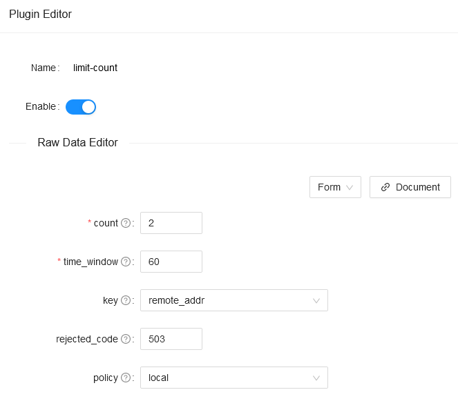

<!--
#
# Licensed to the Apache Software Foundation (ASF) under one or more
# contributor license agreements.  See the NOTICE file distributed with
# this work for additional information regarding copyright ownership.
# The ASF licenses this file to You under the Apache License, Version 2.0
# (the "License"); you may not use this file except in compliance with
# the License.  You may obtain a copy of the License at
#
#     http://www.apache.org/licenses/LICENSE-2.0
#
# Unless required by applicable law or agreed to in writing, software
# distributed under the License is distributed on an "AS IS" BASIS,
# WITHOUT WARRANTIES OR CONDITIONS OF ANY KIND, either express or implied.
# See the License for the specific language governing permissions and
# limitations under the License.
#
-->

## Summary

- [Name](#name)
- [Attributes](#attributes)
- [How To Enable](#how-to-enable)
- [Test Plugin](#test-plugin)
- [Disable Plugin](#disable-plugin)

## Name

Limit request rate by a fixed number of requests in a given time window.

## Attributes

| Name                | Type    | Requirement                             | Default       | Valid                                                                                                   | Description                                                                                                                                                                                                                                                                                                |
| ------------------- | ------- | --------------------------------------- | ------------- | ------------------------------------------------------------------------------------------------------- | ---------------------------------------------------------------------------------------------------------------------------------------------------------------------------------------------------------------------------------------------------------------------------------------------------------- |
| count               | integer | required                                |               | count > 0                                                                                               | the specified number of requests threshold.                                                                                                                                                                                                                                                                |
| time_window         | integer | required                    |               | time_window > 0                                                                                         | the time window in seconds before the request count is reset.                                                                                                                                                                                                                                              |
| key_type      | string  | optional    |   "var"   | ["var", "var_combination", "constant"] | the type of key. |
| key           | string  | optional    |     "remote_addr"    |  | the user specified key to limit the rate. If the `key_type` is "constant", the key will be treated as a constant. If the `key_type` is "var", the key will be treated as a name of variable. If the `key_type` is "var_combination", the key will be a combination of variables. For example, if we use "$remote_addr $consumer_name" as key, plugin will be restricted by two variables which are "remote_addr" and "consumer_name". If the value of the key is empty, `remote_addr` will be set as the default key.|
| rejected_code       | integer | optional                                | 503           | [200,...,599]                                                                                           | The HTTP status code returned when the request exceeds the threshold is rejected, default 503.                                                                                                                                                                                                             |
| rejected_msg       | string | optional                                |            | non-empty                                                                                           | The response body returned when the request exceeds the threshold is rejected.                                                                                                                                                                                                             |
| policy              | string  | optional                                | "local"       | ["local", "redis", "redis-cluster"]                                                                     | The rate-limiting policies to use for retrieving and incrementing the limits. Available values are `local`(the counters will be stored locally in-memory on the node), `redis`(counters are stored on a Redis server and will be shared across the nodes, usually use it to do the global speed limit), and `redis-cluster` which works the same as `redis` but with redis cluster. |
| allow_degradation              | boolean  | optional                                | false       |                                                                     | Whether to enable plugin degradation when the limit-count function is temporarily unavailable(e.g. redis timeout). Allow requests to continue when the value is set to true, default false. |
| show_limit_quota_header              | boolean  | optional                                | true       |                                                                     | Whether show `X-RateLimit-Limit` and `X-RateLimit-Remaining` (which mean the total number of requests and the remaining number of requests that can be sent) in the response header, default true. |
| group               | string | optional                                |            | non-empty                                                                                           | Route configured with the same group will share the same counter |
| redis_host          | string  | required for `redis`                    |               |                                                                                                         | When using the `redis` policy, this property specifies the address of the Redis server.                                                                                                                                                                                                                    |
| redis_port          | integer | optional                                | 6379          | [1,...]                                                                                                 | When using the `redis` policy, this property specifies the port of the Redis server.                                                                                                                                                                                                                       |
| redis_password      | string  | optional                                |               |                                                                                                         | When using the `redis`  or `redis-cluster` policy, this property specifies the password of the Redis server.                                                                                                                                                                                                                   |
| redis_database      | integer | optional                                | 0             | redis_database >= 0                                                                                     | When using the `redis` policy, this property specifies the database you selected of the Redis server, and only for non Redis cluster mode (single instance mode or Redis public cloud service that provides single entry).                                                                               |
| redis_timeout       | integer | optional                                | 1000          | [1,...]                                                                                                 | When using the `redis`  or `redis-cluster` policy, this property specifies the timeout in milliseconds of any command submitted to the Redis server.                                                                                                                                                                           |
| redis_cluster_nodes | array   | required when policy is `redis-cluster` |               |                                                                                                         | When using `redis-cluster` policy，This property is a list of addresses of Redis cluster service nodes (at least two).                                                                                                                                                                                                    |
| redis_cluster_name  | string  | required when policy is `redis-cluster` |               |                                                                                                         | When using `redis-cluster` policy, this property is the name of Redis cluster service nodes.                                                                                                                                                                                                                   |

## How To Enable

Here's an example, enable the `limit count` plugin on the specified route when setting `key_type` to `var` :

```shell
curl -i http://127.0.0.1:9080/apisix/admin/routes/1 -H 'X-API-KEY: edd1c9f034335f136f87ad84b625c8f1' -X PUT -d '
{
    "uri": "/index.html",
    "plugins": {
        "limit-count": {
            "count": 2,
            "time_window": 60,
            "rejected_code": 503,
            "key_type": "var",
            "key": "remote_addr"
        }
    },
    "upstream": {
        "type": "roundrobin",
        "nodes": {
            "127.0.0.1:9001": 1
        }
    }
}'
```

Here's an example, enable the `limit count` plugin on the specified route when setting `key_type` to `var_combination` :

```shell
curl -i http://127.0.0.1:9080/apisix/admin/routes/1 -H 'X-API-KEY: edd1c9f034335f136f87ad84b625c8f1' -X PUT -d '
{
    "uri": "/index.html",
    "plugins": {
        "limit-count": {
            "count": 2,
            "time_window": 60,
            "rejected_code": 503,
            "key_type": "var_combination",
            "key": "$consumer_name $remote_addr"
        }
    },
    "upstream": {
        "type": "roundrobin",
        "nodes": {
            "127.0.0.1:9001": 1
        }
    }
}'
```

You also can complete the above operation through the web interface, first add a route, then add limit-count plugin:


It is possible to share the same limit counter across different routes. For example,

```shell
curl -i http://127.0.0.1:9080/apisix/admin/services/1 -H 'X-API-KEY: edd1c9f034335f136f87ad84b625c8f1' -X PUT -d '
{
    "plugins": {
        "limit-count": {
            "count": 1,
            "time_window": 60,
            "rejected_code": 503,
            "key": "remote_addr",
            "group": "services_1#1640140620"
        }
    },
    "upstream": {
        "type": "roundrobin",
        "nodes": {
            "127.0.0.1:1980": 1
        }
    }
}'
```

Every route which group name is "services_1#1640140620" will share the same count limitation `1` in one minute per remote_addr.

```shell
$ curl -i http://127.0.0.1:9080/apisix/admin/routes/1 -H 'X-API-KEY: edd1c9f034335f136f87ad84b625c8f1' -X PUT -d '
{
    "service_id": "1",
    "uri": "/hello"
}'

$ curl -i http://127.0.0.1:9080/apisix/admin/routes/2 -H 'X-API-KEY: edd1c9f034335f136f87ad84b625c8f1' -X PUT -d '
{
    "service_id": "1",
    "uri": "/hello2"
}'

$ curl -i http://127.0.0.1:9080/hello
HTTP/1.1 200 ...

$ curl -i http://127.0.0.1:9080/hello2
HTTP/1.1 503 ...
```

Note that every limit-count configuration of the same group must be the same.
Therefore, once update the configuration, we also need to update the group name.

It is also possible to share the same limit counter in all requests. For example,

```shell
curl -i http://127.0.0.1:9080/apisix/admin/services/1 -H 'X-API-KEY: edd1c9f034335f136f87ad84b625c8f1' -X PUT -d '
{
    "plugins": {
        "limit-count": {
            "count": 1,
            "time_window": 60,
            "rejected_code": 503,
            "key": "remote_addr",
            "key_type": "constant",
            "group": "services_1#1640140621"
        }
    },
    "upstream": {
        "type": "roundrobin",
        "nodes": {
            "127.0.0.1:1980": 1
        }
    }
}'
```

Compared with the previous configuration, we set the `key_type` to `constant`.
By setting `key_type` to `constant`, we don't evaluate the value of `key` but treat it as a constant.

Now every route which group name is "services_1#1640140621" will share the same count limitation `1` in one minute among all the requests,
even these requests are from different remote_addr.

If you need a cluster-level precision traffic limit, then we can do it with the redis server. The rate limit of the traffic will be shared between different APISIX nodes to limit the rate of cluster traffic.

Here is the example if we use single `redis` policy:

```shell
curl -i http://127.0.0.1:9080/apisix/admin/routes/1 -H 'X-API-KEY: edd1c9f034335f136f87ad84b625c8f1' -X PUT -d '
{
    "uri": "/index.html",
    "plugins": {
        "limit-count": {
            "count": 2,
            "time_window": 60,
            "rejected_code": 503,
            "key": "remote_addr",
            "policy": "redis",
            "redis_host": "127.0.0.1",
            "redis_port": 6379,
            "redis_password": "password",
            "redis_database": 1,
            "redis_timeout": 1001
        }
    },
    "upstream": {
        "type": "roundrobin",
        "nodes": {
            "127.0.0.1:1980": 1
        }
    }
}'
```

If using `redis-cluster` policy:

```shell
curl -i http://127.0.0.1:9080/apisix/admin/routes/1 -H 'X-API-KEY: edd1c9f034335f136f87ad84b625c8f1' -X PUT -d '
{
    "uri": "/index.html",
    "plugins": {
        "limit-count": {
            "count": 2,
            "time_window": 60,
            "rejected_code": 503,
            "key": "remote_addr",
            "policy": "redis-cluster",
            "redis_cluster_nodes": [
              "127.0.0.1:5000",
              "127.0.0.1:5001"
            ],
            "redis_password": "password",
            "redis_cluster_name": "redis-cluster-1"
        }
    },
    "upstream": {
        "type": "roundrobin",
        "nodes": {
            "127.0.0.1:1980": 1
        }
    }
}'
```

## Test Plugin

The above configuration limits access to only 2 times in 60 seconds. The first two visits will be normally:

```shell
curl -i http://127.0.0.1:9080/index.html
```

The response header contains `X-RateLimit-Limit` and `X-RateLimit-Remaining`,
which mean the total number of requests and the remaining number of requests that can be sent:

```shell
HTTP/1.1 200 OK
Content-Type: text/html
Content-Length: 13175
Connection: keep-alive
X-RateLimit-Limit: 2
X-RateLimit-Remaining: 0
Server: APISIX web server
```

When you visit for the third time, you will receive a response with the 503 HTTP code:

```shell
HTTP/1.1 503 Service Temporarily Unavailable
Content-Type: text/html
Content-Length: 194
Connection: keep-alive
Server: APISIX web server

<html>
<head><title>503 Service Temporarily Unavailable</title></head>
<body>
<center><h1>503 Service Temporarily Unavailable</h1></center>
<hr><center>openresty</center>
</body>
</html>
```

At the same time, if you set the property `rejected_msg` to `"Requests are too frequent, please try again later."` , when you visit for the third time, you will receive a response body like below:

```shell
HTTP/1.1 503 Service Temporarily Unavailable
Content-Type: text/html
Content-Length: 194
Connection: keep-alive
Server: APISIX web server

{"error_msg":"Requests are too frequent, please try again later."}
```

This means that the `limit count` plugin is in effect.

## Disable Plugin

When you want to disable the `limit count` plugin, it is very simple,
you can delete the corresponding json configuration in the plugin configuration,
no need to restart the service, it will take effect immediately:

```shell
curl http://127.0.0.1:9080/apisix/admin/routes/1 -H 'X-API-KEY: edd1c9f034335f136f87ad84b625c8f1' -X PUT -d '
{
    "methods": ["GET"],
    "uri": "/index.html",
    "upstream": {
        "type": "roundrobin",
        "nodes": {
            "127.0.0.1:1980": 1
        }
    }
}'
```

The `limit count` plugin has been disabled now. It works for other plugins.
