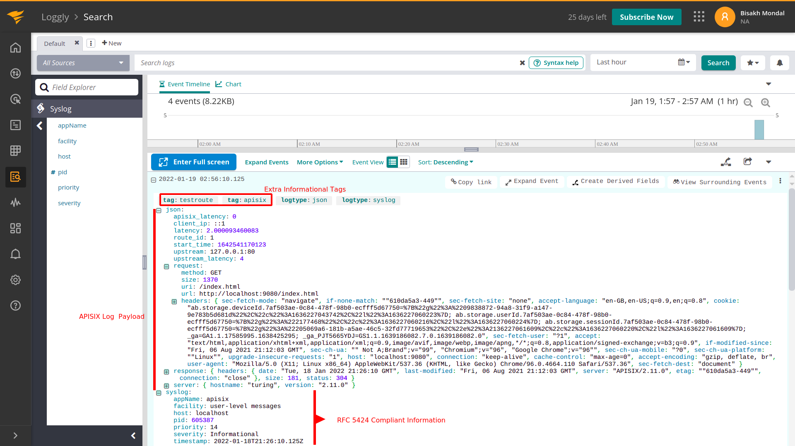

<!--
#
# Licensed to the Apache Software Foundation (ASF) under one or more
# contributor license agreements.  See the NOTICE file distributed with
# this work for additional information regarding copyright ownership.
# The ASF licenses this file to You under the Apache License, Version 2.0
# (the "License"); you may not use this file except in compliance with
# the License.  You may obtain a copy of the License at
#
#     http://www.apache.org/licenses/LICENSE-2.0
#
# Unless required by applicable law or agreed to in writing, software
# distributed under the License is distributed on an "AS IS" BASIS,
# WITHOUT WARRANTIES OR CONDITIONS OF ANY KIND, either express or implied.
# See the License for the specific language governing permissions and
# limitations under the License.
#
-->

## Description

The `loggly` Plugin is used to forward logs to [SolarWinds Loggly](https://www.solarwinds.com/loggly) for analysis and storage.

When the Plugin is enabled, APISIX will serialize the request context information to [Loggly Syslog](https://documentation.solarwinds.com/en/success_center/loggly/content/admin/streaming-syslog-without-using-files.htm?cshid=loggly_streaming-syslog-without-using-files) data format which is Syslog events with [RFC5424](https://datatracker.ietf.org/doc/html/rfc5424) compliant headers.

When the maximum batch size is exceeded, the data in the queue is pushed to Loggly enterprise syslog endpoint. See [batch processor](../batch-processor.md) for more details.

## Attributes

| Name                   | Type          | Required | Default | Description                                                                                                                                                                                                                    |
|------------------------|---------------|----------|---------|--------------------------------------------------------------------------------------------------------------------------------------------------------------------------------------------------------------------------------|
| customer_token         | string        | True     |         | Unique identifier used when sending logs to Loggly to ensure that they are sent to the right organisation account.                                                                                                             |
| severity               | string (enum) | False    | INFO    | Syslog log event severity level. Choose between: `DEBUG`, `INFO`, `NOTICE`, `WARNING`, `ERR`, `CRIT`, `ALERT`, and `EMEGR`.                                                                                                    |
| severity_map           | object        | False    | nil     | A way to map upstream HTTP response codes to Syslog severity. Key-value pairs where keys are the HTTP response codes and the values are the Syslog severity levels. For example `{"410": "CRIT"}`.                             |
| tags                   | array         | False    |         | Metadata to be included with any event log to aid in segmentation and filtering.                                                                                                                                               |
| log_format             | object        | False    | {"host": "$host", "@timestamp": "$time_iso8601", "client_ip": "$remote_addr"} | Log format declared as key-value pairs in JSON. Values support strings and nested objects (up to five levels deep; deeper fields are truncated). Within strings, [APISIX](../apisix-variable.md) or [NGINX](http://nginx.org/en/docs/varindex.html) variables can be referenced by prefixing with `$`. |
| include_req_body       | boolean       | False    | false   | When set to `true` includes the request body in the log. If the request body is too big to be kept in the memory, it can't be logged due to Nginx's limitations.                                                               |
| include_req_body_expr  | array         | False    |         | Filter for when the `include_req_body` attribute is set to `true`. Request body is only logged when the expression set here evaluates to `true`. See [lua-resty-expr](https://github.com/api7/lua-resty-expr) for more.        |
| include_resp_body      | boolean       | False    | false   | When set to `true` includes the response body in the log.                                                                                                                                                                      |
| include_resp_body_expr | array         | False    |         | When the `include_resp_body` attribute is set to `true`, use this to filter based on [lua-resty-expr](https://github.com/api7/lua-resty-expr). If present, only logs the response if the expression evaluates to `true`.       |

This Plugin supports using batch processors to aggregate and process entries (logs/data) in a batch. This avoids the need for frequently submitting the data. The batch processor submits data every `5` seconds or when the data in the queue reaches `1000`. See [Batch Processor](../batch-processor.md#configuration) for more information or setting your custom configuration.

To generate a Customer token, go to `<your assigned subdomain>/loggly.com/tokens` or navigate to Logs > Source setup > Customer tokens.

### Example of default log format

```text
<10>1 2024-01-06T06:50:51.739Z 127.0.0.1 apisix 58525 - [token-1@41058 tag="apisix"] {"service_id":"","server":{"version":"3.7.0","hostname":"localhost"},"apisix_latency":100.99985313416,"request":{"url":"http://127.0.0.1:1984/opentracing","headers":{"content-type":"application/x-www-form-urlencoded","user-agent":"lua-resty-http/0.16.1 (Lua) ngx_lua/10025","host":"127.0.0.1:1984"},"querystring":{},"uri":"/opentracing","size":155,"method":"GET"},"response":{"headers":{"content-type":"text/plain","server":"APISIX/3.7.0","transfer-encoding":"chunked","connection":"close"},"size":141,"status":200},"route_id":"1","latency":103.99985313416,"upstream_latency":3,"client_ip":"127.0.0.1","upstream":"127.0.0.1:1982","start_time":1704523851634}
```

## Metadata

You can also configure the Plugin through Plugin metadata. The following configurations are available:

| Name       | Type    | Required | Default              | Valid values                   | Description                                                                                                                                                                                                                    |
|------------|---------|----------|----------------------|--------------------------------|--------------------------------------------------------------------------------------------------------------------------------------------------------------------------------------------------------------------------------|
| host       | string  | False    | "logs-01.loggly.com" |                                | Endpoint of the host where the logs are being sent.                                                                                                                                                                            |
| port       | integer | False    | 514                  |                                | Loggly port to connect to. Only used for `syslog` protocol.                                                                                                                                                                    |
| timeout    | integer | False    | 5000                 |                                | Loggly send data request timeout in milliseconds.                                                                                                                                                                              |
| protocol   | string  | False    | "syslog"             | [ "syslog" , "http", "https" ] | Protocol in which the logs are sent to Loggly.                                                                                                                                                                                 |
| log_format | object  | False    | nil                  |                                | Log format declared as key-value pairs in JSON. Values support strings and nested objects (up to five levels deep; deeper fields are truncated). Within strings, [APISIX](../apisix-variable.md) or [NGINX](http://nginx.org/en/docs/varindex.html) variables can be referenced by prefixing with `$`. |

We support [Syslog](https://documentation.solarwinds.com/en/success_center/loggly/content/admin/streaming-syslog-without-using-files.htm), [HTTP/S](https://documentation.solarwinds.com/en/success_center/loggly/content/admin/http-bulk-endpoint.htm) (bulk endpoint) protocols to send log events to Loggly. By default, in APISIX side, the protocol is set to "syslog". It lets you send RFC5424 compliant syslog events with some fine-grained control (log severity mapping based on upstream HTTP response code). But HTTP/S bulk endpoint is great to send larger batches of log events with faster transmission speed. If you wish to update it, just update the metadata.

:::note

APISIX supports [Syslog](https://documentation.solarwinds.com/en/success_center/loggly/content/admin/streaming-syslog-without-using-files.htm) and [HTTP/S](https://documentation.solarwinds.com/en/success_center/loggly/content/admin/http-bulk-endpoint.htm) protocols to send data to Loggly. Syslog lets you send RFC5424 compliant syslog events with fine-grained control. But, HTTP/S bulk endpoint is better while sending large batches of logs at a fast transmission speed. You can configure the metadata to update the protocol as shown below:

:::note
You can fetch the `admin_key` from `config.yaml` and save to an environment variable with the following command:

```bash
admin_key=$(yq '.deployment.admin.admin_key[0].key' conf/config.yaml | sed 's/"//g')
```

:::

```shell
curl http://127.0.0.1:9180/apisix/admin/plugin_metadata/loggly -H "X-API-KEY: $admin_key" -X PUT -d '
{
   "protocol": "http"
}'
```

:::

## Enable Plugin

### Full configuration

The example below shows a complete configuration of the Plugin on a specific Route:

```shell
curl http://127.0.0.1:9180/apisix/admin/routes/1 -H "X-API-KEY: $admin_key" -X PUT -d '
{
    "plugins":{
        "loggly":{
            "customer_token":"0e6fe4bf-376e-40f4-b25f-1d55cb29f5a2",
            "tags":["apisix", "testroute"],
            "severity":"info",
            "severity_map":{
                "503": "err",
                "410": "alert"
            },
            "buffer_duration":60,
            "max_retry_count":0,
            "retry_delay":1,
            "inactive_timeout":2,
            "batch_max_size":10
        }
    },
    "upstream":{
        "type":"roundrobin",
        "nodes":{
            "127.0.0.1:80":1
        }
    },
    "uri":"/index.html"
}'
```

### Minimal configuration

The example below shows a bare minimum configuration of the Plugin on a Route:

```shell
curl http://127.0.0.1:9180/apisix/admin/routes/1 -H "X-API-KEY: $admin_key" -X PUT -d '
{
    "plugins":{
        "loggly":{
            "customer_token":"0e6fe4bf-376e-40f4-b25f-1d55cb29f5a2",
        }
    },
    "upstream":{
        "type":"roundrobin",
        "nodes":{
            "127.0.0.1:80":1
        }
    },
    "uri":"/index.html"
}'
```

## Example usage

Now, if you make a request to APISIX, it will be logged in Loggly:

```shell
curl -i http://127.0.0.1:9080/index.html
```

You can then view the logs on your Loggly Dashboard:



## Delete Plugin

To remove the `file-logger` Plugin, you can delete the corresponding JSON configuration from the Plugin configuration. APISIX will automatically reload and you do not have to restart for this to take effect.

```shell
curl http://127.0.0.1:9180/apisix/admin/routes/1 -H "X-API-KEY: $admin_key" -X PUT -d '
{
    "uri": "/index.html",
    "plugins": {},
    "upstream": {
        "type": "roundrobin",
        "nodes": {
            "127.0.0.1:80": 1
        }
    }
}'
```
