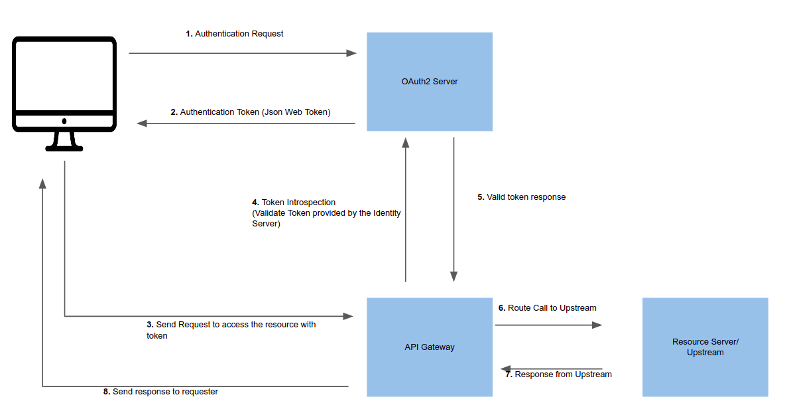

<!--
#
# Licensed to the Apache Software Foundation (ASF) under one or more
# contributor license agreements.  See the NOTICE file distributed with
# this work for additional information regarding copyright ownership.
# The ASF licenses this file to You under the Apache License, Version 2.0
# (the "License"); you may not use this file except in compliance with
# the License.  You may obtain a copy of the License at
#
#     http://www.apache.org/licenses/LICENSE-2.0
#
# Unless required by applicable law or agreed to in writing, software
# distributed under the License is distributed on an "AS IS" BASIS,
# WITHOUT WARRANTIES OR CONDITIONS OF ANY KIND, either express or implied.
# See the License for the specific language governing permissions and
# limitations under the License.
#
-->

# Summary

- [**Name**](#name)
- [**Attributes**](#attributes)
- [**Token Introspection**](#token-introspection)

## Name

The OAuth 2 / Open ID Connect(OIDC) plugin provides authentication and introspection capability to APISIX.

## Attributes

| Name                                 | Type    | Requirement | Default               | Valid   | Description                                                                                                                     |
| ------------------------------------ | ------- | ----------- | --------------------- | ------- | ------------------------------------------------------------------------------------------------------------------------------- |
| client_id                            | string  | required    |                       |         | OAuth client ID                                                                                                                 |
| client_secret                        | string  | required    |                       |         | OAuth client secret                                                                                                             |
| discovery                            | string  | required    |                       |         | URL of the discovery endpoint of the identity server                                                                            |
| scope                                | string  | optional    | "openid"              |         | Scope used for the authentication                                                                                               |
| realm                                | string  | optional    | "apisix"              |         | Realm used for the authentication                                                                                               |
| bearer_only                          | boolean | optional    | false                 |         | Setting this `true` will check for the authorization header in the request with a bearer token                                  |
| logout_path                          | string  | optional    | "/logout"             |         |                                                                                                                                 |
| redirect_uri                         | string  | optional    | "ngx.var.request_uri" |         |                                                                                                                                 |
| timeout                              | integer | optional    | 3                     | [1,...] | Timeout in seconds                                                                                                              |
| ssl_verify                           | boolean | optional    | false                 |         |                                                                                                                                 |
| introspection_endpoint               | string  | optional    |                       |         | URL of the token verification endpoint of the identity server                                                                   |
| introspection_endpoint_auth_method   | string  | optional    | "client_secret_basic" |         | Authentication method name for token introspection                                                                              |
| public_key                           | string  | optional    |                       |         | The public key to verify the token                                                                                              |
| token_signing_alg_values_expected    | string  | optional    |                       |         | Algorithm used to sign the token                                                                                                |
| set_access_token_header              | boolean | optional    | true                  |         | Whether to ensure the access token is set in a request header.                                                                  |
| access_token_in_authorization_header | boolean | optional    | false                 |         | If set to `true`, ensure that the access token is set in the `Authorization` header, otherwise use the `X-Access-Token` header. |
| set_id_token_header                  | boolean | optional    | true                  |         | Whether to ensure the ID token, if available, is set in the `X-ID-Token` request header.                                        |
| set_userinfo_header                  | boolean | optional    | true                  |         | Whether to ensure the UserInfo object, if available, is set in the `X-Userinfo` request header.                                 |

### Modes of operation

The plugin supports different modes of operation.

1) It can be configured to just validate an access token that is expected to be present in a request header.
In this case, requests without a token or where the token is invalid are always rejected. This requires
`bearer_only` be set to `true` and that either an introspection endpoint has been configured through
`introspection_endpoint`, or that a public key has been configured through `public_key`. See the relevant
sections below.

2) Alternatively, the plugin can also be configured to authenticate a request without a valid token against
an identity provider by going through the OIDC Authorization Code flow. The plugin then acts as an OIDC Relying Party.
In this scenario, when the requesting user has authenticated successfully, the plugin will obtain and manage
an access token and further user claims on behalf of the user in a session cookie. Subsequent requests that
contain the cookie will use the access token stored in the cookie. In this case, `bearer_only` must be set to `false`.

The first option is typically appropriate for service-to-service communication where the requesting side can
be reasonably expected to obtain and manage a valid access token by itself. The second option is convenient
to support web browser interaction with endpoints through a human user that may still need to be authenticated
when accessing for the first time.

The plugin can also be configured to support both scenarios by setting `bearer_only` to false, but still configuring
either an introspection endpoint or a public key. In this case, introspection of an existing token from a request
header takes precedence over the Relying Party flow. That is, if a request contains an invalid token, the request
will be rejected without redirecting to the ID provider to obtain a valid token.

The method used to authenticate a request also affects the headers that can be enforced on the request before
sending it to upstream. The headers that can be enforced are mentioned below in each relevant section.

### Token Introspection

Token introspection helps to validate a request by verifying the token against an Oauth 2 authorization server.
As prerequisite, you should create a trusted client in the identity server and generate a valid token(JWT) for introspection.
The following image shows an example(successful) flow of the token introspection via the gateway.



The following is the curl command to enable the plugin to an external service.
This route will protect `https://httpbin.org/get`(echo service) by introspecting the token provided in the header of the request.

```bash
curl http://127.0.0.1:9080/apisix/admin/routes/5 -H 'X-API-KEY: edd1c9f034335f136f87ad84b625c8f1' -X PUT -d '
{
  "uri": "/get",
  "plugins": {
    "proxy-rewrite": {
      "scheme": "https"
    },
    "openid-connect": {
      "client_id": "api_six_client_id",
      "client_secret": "client_secret_code",
      "discovery": "full_URL_of_the_discovery_endpoint",
      "introspection_endpoint": "full_URL_of_introspection_endpoint",
      "bearer_only": true,
      "realm": "master",
      "introspection_endpoint_auth_method": "client_secret_basic"
    }
  },
  "upstream": {
    "type": "roundrobin",
    "nodes": {
      "httpbin.org:443": 1
    }
  }
}'
```

The following command can be used to access the new route.

```bash
curl -i -X GET http://127.0.0.1:9080/get -H "Host: httpbin.org" -H "Authorization: Bearer {replace_jwt_token}"
```

In this case, the plugin can enforce that the access token and the UserInfo object get set in respective configured request headers.

#### Introspecting with public key

You can also provide the public key of the JWT token to verify the token. In case if you have provided a public key and
a token introspection endpoint, the public key workflow will be executed instead of verifying with the identity server.
This method can be used if you want to reduce additional network calls and to speedup the process.

The following configurations shows how to add a public key introspection to a route.

```bash
curl http://127.0.0.1:9080/apisix/admin/routes/5 -H 'X-API-KEY: edd1c9f034335f136f87ad84b625c8f1' -X PUT -d '
{
  "uri": "/get",
  "plugins": {
    "proxy-rewrite": {
      "scheme": "https"
    },
    "openid-connect": {
      "client_id": "api_six_client_id",
      "client_secret": "client_secret_code",
      "discovery": "full_URL_of_the_discovery_endpoint",
      "bearer_only": true,
      "realm": "master",
      "token_signing_alg_values_expected": "RS256",
      "public_key" : "-----BEGIN CERTIFICATE-----
        {public_key}
        -----END CERTIFICATE-----"
}
  },
  "upstream": {
    "type": "roundrobin",
    "nodes": {
      "httpbin.org:443": 1
    }
  }
}'
```

In this case, the plugin can only enforce that the access token gets set in the configured request headers.

#### Authentication through OIDC Relying Party flow

When an incoming request does not contain an access token in a header, nor in an appropriate session cookie,
the plugin can act as an OIDC Relying Party and redirect to the authorization endpoint of the identity provider
to go through the OIDC Authorization Code flow; see https://openid.net/specs/openid-connect-core-1_0.html#CodeFlowAuth.
Once the user has authenticated against the identity provider, the plugin will obtain and manage an access token
and further information from the identity provider on behalf of the user. The information is currently stored
in a session cookie that the user agent can submit on subsequent requests. The plugin will recognize the cookie
and use the information therein to avoid having to go through the flow again.

The following command adds this mode of operation to a route.

```bash
curl http://127.0.0.1:9080/apisix/admin/routes/5 -H 'X-API-KEY: edd1c9f034335f136f87ad84b625c8f1' -X PUT -d '
{
  "uri": "/get",
  "plugins": {
    "proxy-rewrite": {
      "scheme": "https"
    },
    "openid-connect": {
      "client_id": "api_six_client_id",
      "client_secret": "client_secret_code",
      "discovery": "full_URL_of_the_discovery_endpoint",
      "bearer_only": false,
      "realm": "master"
}
  },
  "upstream": {
    "type": "roundrobin",
    "nodes": {
      "httpbin.org:443": 1
    }
  }
}'
```

In this case, the plugin can enforce that the access token, the ID token, and the UserInfo object get set in respective configured request headers.

## Troubleshooting

Check/modify the DNS settings (`conf/config.yaml`) if APISIX cannot resolve/connect to the identity provider.
