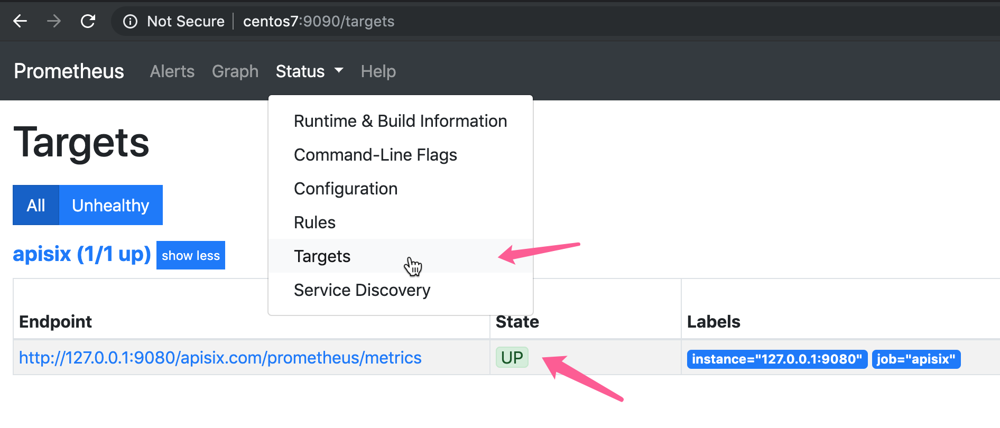

<!--
#
# Licensed to the Apache Software Foundation (ASF) under one or more
# contributor license agreements.  See the NOTICE file distributed with
# this work for additional information regarding copyright ownership.
# The ASF licenses this file to You under the Apache License, Version 2.0
# (the "License"); you may not use this file except in compliance with
# the License.  You may obtain a copy of the License at
#
#     http://www.apache.org/licenses/LICENSE-2.0
#
# Unless required by applicable law or agreed to in writing, software
# distributed under the License is distributed on an "AS IS" BASIS,
# WITHOUT WARRANTIES OR CONDITIONS OF ANY KIND, either express or implied.
# See the License for the specific language governing permissions and
# limitations under the License.
#
-->

This plugin exposes metrics in Prometheus Exposition format.

## Attributes

| Name         | Type      | Requirement | Default  | Valid | Description                                                                                |
| ------------ | --------- | ----------- | -------- | ----- | ------------------------------------------------------------------------------------------ |
| prefer_name  | boolean   | optional    | false    |       | When set to `true`, would print route/service `name` instead of `id` in Prometheus metric. |

## API

This plugin will add `/apisix/prometheus/metrics` to expose the metrics.

The metrics are exposed via a separate Prometheus server address.
By default, the address is `127.0.0.1:9091`. You can change it in the `conf/config.yaml`, for example:

```
plugin_attr:
  prometheus:
    export_addr:
      ip: ${{INTRANET_IP}}
      port: 9092
```

Assume environment variable `INTRANET_IP` is `172.1.1.1`, now APISIX will export the metrics via `172.1.1.1:9092`.

**Before version `2.6`, the metrics are exposed via the data panel port,
you may need to use [interceptors](../plugin-interceptors.md) to protect it.**

If you still want this behavior, you can configure it like this:

```
plugin_attr:
  prometheus:
    enable_export_server: false
```

## How to enable it

`prometheus` plugin could be enable with empty table.
Notice, `name` could be duplicated for multiple routes/services, so when set `prefer_name` to `true`, take care of naming format or it could be misleading.

For example:

```shell
curl http://127.0.0.1:9080/apisix/admin/routes/1  -H 'X-API-KEY: edd1c9f034335f136f87ad84b625c8f1' -X PUT -d '
{
    "uri": "/hello",
    "plugins": {
        "prometheus":{}
    },
    "upstream": {
        "type": "roundrobin",
        "nodes": {
            "127.0.0.1:80": 1
        }
    }
}'
```

You can use [APISIX Dashboard](https://github.com/apache/apisix-dashboard) to complete the above operations through the web console.

First, add a Route:


Then add prometheus plugin:


## How to fetch the metric data

We fetch the metric data from the specified url `/apisix/prometheus/metrics`.

```
curl -i http://127.0.0.1:9091/apisix/prometheus/metrics
```

Puts this URL address into prometheus, and it will automatically fetch
these metric data.

For example like this:

```yaml
scrape_configs:
  - job_name: 'apisix'
    metrics_path: '/apisix/prometheus/metrics'
    static_configs:
    - targets: ['127.0.0.1:9091']
```

And we can check the status at prometheus console:




## How to specify export uri

We can change the default export uri in the `plugin_attr` section of `conf/config.yaml`.

| Name       | Type   | Default                      | Description                       |
| ---------- | ------ | ---------------------------- | --------------------------------- |
| export_uri | string | "/apisix/prometheus/metrics" | uri to get the prometheus metrics |

Here is an example:

```yaml
plugin_attr:
  prometheus:
    export_uri: /apisix/metrics
```

### Grafana dashboard

Metrics exported by the plugin can be graphed in Grafana using a drop in dashboard.

Downloads [Grafana dashboard meta](../../../assets/other/json/apisix-grafana-dashboard.json) and imports it to Grafana。

Or you can goto [Grafana official](https://grafana.com/grafana/dashboards/11719) for `Grafana` meta data.


### Available metrics

* `Status codes`: HTTP status code returned from upstream services. These status code available per service and across all services.

    Attributes：

    | Name         | Description         |
    | -------------| --------------------|
    | code         | The HTTP status code returned by the upstream service. |
    | route        | The `route_id` of the matched route is request. If it does not match, the default value is an empty string. |
    | matched_uri  | The `uri` of the route matching the request, if it does not match, the default value is an empty string. |
    | matched_host | The `host` of the route that matches the request. If it does not match, the default value is an empty string. |
    | service      | The `service_id` of the route matched by the request. When the route lacks service_id, the default is `$host`. |
    | consumer     | The `consumer_name` of the consumer that matches the request. If it does not match, the default value is an empty string. |
    | node         | The `ip` of the upstream node. |

* `Bandwidth`: Total Bandwidth (egress/ingress) flowing through APISIX. The total bandwidth of per service can be counted.

    Attributes：

    | Name         | Description |
    | -------------| ------------- |
    | type         | The type of bandwidth(egress/ingress). |
    | route        | The `route_id` of the matched route is request. If it does not match, the default value is an empty string.. |
    | service      | The `service_id` of the route matched by the request. When the route lacks service_id, the default is `$host`. |
    | consumer     | The `consumer_name` of the consumer that matches the request. If it does not match, the default value is an empty string. |
    | node         | The `ip` of the upstream node. |

* `etcd reachability`: A gauge type with a value of 0 or 1, representing if etcd can be reached by a APISIX or not, where `1` is available, and `0` is unavailable.
* `Connections`: Various Nginx connection metrics like active, reading, writing, and number of accepted connections.
* `Batch process entries`: A gauge type, when we use plugins and the plugin used batch process to send data, such as: sys logger, http logger, sls logger, tcp logger, udp logger and zipkin, then the entries which hasn't been sent in batch process will be counted in the metrics.
* `Latency`: The per service histogram of request time in different dimensions.

    Attributes：

    | Name      | Description |
    | ----------| ------------- |
    | type      | The value can be `apisix`, `upstream` or `request`, which means http latency caused by apisix, upstream, or their sum. |
    | service   | The `service_id` of the route matched by the request. When the route lacks service_id, the default is `$host`. |
    | consumer  | The `consumer_name` of the consumer that matches the request. If it does not match, the default value is an empty string. |
    | node      | The `ip` of the upstream node. |

* `Info`: the information of APISIX node.

Here is the original metric data of APISIX:

```shell
$ curl http://127.0.0.1:9091/apisix/prometheus/metrics
# HELP apisix_bandwidth Total bandwidth in bytes consumed per service in Apisix
# TYPE apisix_bandwidth counter
apisix_bandwidth{type="egress",route="",service="",consumer="",node=""} 8417
apisix_bandwidth{type="egress",route="1",service="",consumer="",node="127.0.0.1"} 1420
apisix_bandwidth{type="egress",route="2",service="",consumer="",node="127.0.0.1"} 1420
apisix_bandwidth{type="ingress",route="",service="",consumer="",node=""} 189
apisix_bandwidth{type="ingress",route="1",service="",consumer="",node="127.0.0.1"} 332
apisix_bandwidth{type="ingress",route="2",service="",consumer="",node="127.0.0.1"} 332
# HELP apisix_etcd_modify_indexes Etcd modify index for APISIX keys
# TYPE apisix_etcd_modify_indexes gauge
apisix_etcd_modify_indexes{key="consumers"} 0
apisix_etcd_modify_indexes{key="global_rules"} 0
apisix_etcd_modify_indexes{key="max_modify_index"} 222
apisix_etcd_modify_indexes{key="prev_index"} 35
apisix_etcd_modify_indexes{key="protos"} 0
apisix_etcd_modify_indexes{key="routes"} 222
apisix_etcd_modify_indexes{key="services"} 0
apisix_etcd_modify_indexes{key="ssls"} 0
apisix_etcd_modify_indexes{key="stream_routes"} 0
apisix_etcd_modify_indexes{key="upstreams"} 0
apisix_etcd_modify_indexes{key="x_etcd_index"} 223
# HELP apisix_batch_process_entries batch process remaining entries
# TYPE apisix_batch_process_entries gauge
apisix_batch_process_entries{name="http-logger",route_id="9",server_addr="127.0.0.1"} 1
apisix_batch_process_entries{name="sls-logger",route_id="9",server_addr="127.0.0.1"} 1
apisix_batch_process_entries{name="tcp-logger",route_id="9",server_addr="127.0.0.1"} 1
apisix_batch_process_entries{name="udp-logger",route_id="9",server_addr="127.0.0.1"} 1
apisix_batch_process_entries{name="sys-logger",route_id="9",server_addr="127.0.0.1"} 1
apisix_batch_process_entries{name="zipkin_report",route_id="9",server_addr="127.0.0.1"} 1
# HELP apisix_etcd_reachable Config server etcd reachable from Apisix, 0 is unreachable
# TYPE apisix_etcd_reachable gauge
apisix_etcd_reachable 1
# HELP apisix_http_status HTTP status codes per service in Apisix
# TYPE apisix_http_status counter
apisix_http_status{code="200",route="1",matched_uri="/hello",matched_host="",service="",consumer="",node="127.0.0.1"} 4
apisix_http_status{code="200",route="2",matched_uri="/world",matched_host="",service="",consumer="",node="127.0.0.1"} 4
apisix_http_status{code="404",route="",matched_uri="",matched_host="",service="",consumer="",node=""} 1
# HELP apisix_nginx_http_current_connections Number of HTTP connections
# TYPE apisix_nginx_http_current_connections gauge
apisix_nginx_http_current_connections{state="accepted"} 11994
apisix_nginx_http_current_connections{state="active"} 2
apisix_nginx_http_current_connections{state="handled"} 11994
apisix_nginx_http_current_connections{state="reading"} 0
apisix_nginx_http_current_connections{state="total"} 1191780
apisix_nginx_http_current_connections{state="waiting"} 1
apisix_nginx_http_current_connections{state="writing"} 1
# HELP apisix_nginx_metric_errors_total Number of nginx-lua-prometheus errors
# TYPE apisix_nginx_metric_errors_total counter
apisix_nginx_metric_errors_total 0
# HELP apisix_http_latency HTTP request latency in milliseconds per service in APISIX
# TYPE apisix_http_latency histogram
apisix_http_latency_bucket{type="apisix",route="1",service="",consumer="",node="127.0.0.1",le="1"} 1
apisix_http_latency_bucket{type="apisix",route="1",service="",consumer="",node="127.0.0.1",le="2"} 1
apisix_http_latency_bucket{type="request",route="1",service="",consumer="",node="127.0.0.1",le="1"} 1
apisix_http_latency_bucket{type="request",route="1",service="",consumer="",node="127.0.0.1",le="2"} 1
apisix_http_latency_bucket{type="upstream",route="1",service="",consumer="",node="127.0.0.1",le="1"} 1
apisix_http_latency_bucket{type="upstream",route="1",service="",consumer="",node="127.0.0.1",le="2"} 1
...
# HELP apisix_node_info Info of APISIX node
# TYPE apisix_node_info gauge
apisix_node_info{hostname="desktop-2022q8f-wsl"} 1
```

## Disable Plugin

Remove the corresponding json configuration in the plugin configuration to disable `prometheus`.
APISIX plugins are hot-reloaded, therefore no need to restart APISIX.

```shell
curl http://127.0.0.1:9080/apisix/admin/routes/1  -H 'X-API-KEY: edd1c9f034335f136f87ad84b625c8f1' -X PUT -d '
{
    "uri": "/hello",
    "plugins": {},
    "upstream": {
        "type": "roundrobin",
        "nodes": {
            "127.0.0.1:80": 1
        }
    }
}'
```
