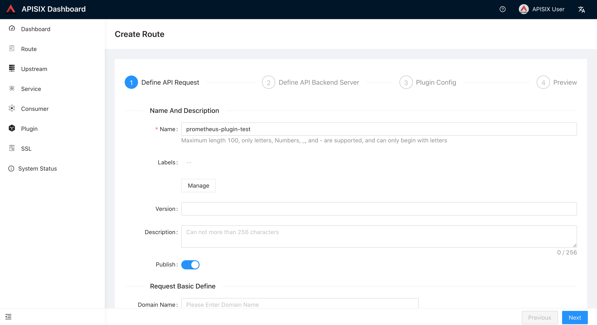
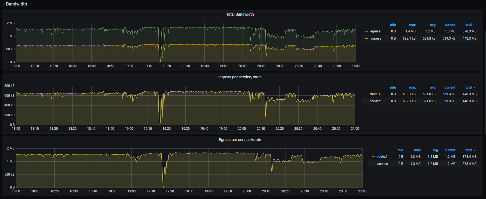
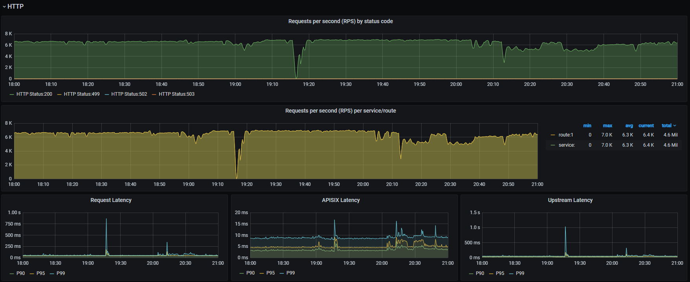

<!--
#
# Licensed to the Apache Software Foundation (ASF) under one or more
# contributor license agreements.  See the NOTICE file distributed with
# this work for additional information regarding copyright ownership.
# The ASF licenses this file to You under the Apache License, Version 2.0
# (the "License"); you may not use this file except in compliance with
# the License.  You may obtain a copy of the License at
#
#     http://www.apache.org/licenses/LICENSE-2.0
#
# Unless required by applicable law or agreed to in writing, software
# distributed under the License is distributed on an "AS IS" BASIS,
# WITHOUT WARRANTIES OR CONDITIONS OF ANY KIND, either express or implied.
# See the License for the specific language governing permissions and
# limitations under the License.
#
-->

## Description

The `prometheus` Plugin exports metrics in [Prometheus exposition format](https://prometheus.io/docs/instrumenting/exposition_formats/#exposition-formats).

## Attributes

| Name        | Type    | Required | Default | Description                                                                       |
| ----------- | ------- | -------- | ------- | --------------------------------------------------------------------------------- |
| prefer_name | boolean | False    | false   | When set to `true`, prints Route/Service name instead of ID in Prometheus metric. |

### Specifying `export_uri`

You can change the default export URI by configuring the `export_uri` attribute under `plugin_attr` in your configuration file (`conf/config.yaml`).

| Name       | Type   | Default                      | Description                           |
| ---------- | ------ | ---------------------------- | ------------------------------------- |
| export_uri | string | "/apisix/prometheus/metrics" | URI to export the Prometheus metrics. |

Here is a configuration example:

```yaml title="conf/config.yaml"
plugin_attr:
  prometheus:
    export_uri: /apisix/metrics
```

### Specifying `metrics`

For http request related metrics, you could specify extra labels, which match the APISIX variables.

If you specify label for nonexist APISIX variable, the label value would be "".

Currently, only below metrics are supported:

* http_status
* http_latency
* bandwidth

Here is a configuration example:

```yaml title="conf/config.yaml"
plugin_attr:
  prometheus:
    metrics:
        http_status:
            extra_labels:
                - upstream_addr: $upstream_addr
                - upstream_status: $upstream_status
```

### Specifying `default_buckets`

`DEFAULT_BUCKETS` is the default value for bucket array in `http_latency` metrics.

You can change the `DEFAULT_BUCKETS` by configuring `default_buckets` attribute in you configuration file.

Here is a configuration example:

```yaml title="conf/config.yaml"
plugin_attr:
  prometheus:
    default_buckets:
      - 15
      - 55
      - 105
      - 205
      - 505
```

## API

This Plugin will add the API endpoint `/apisix/prometheus/metrics` or your custom export URI for exposing the metrics.

These metrics are exposed by a separate Prometheus server address. By default, the address is `127.0.0.1:9091`. You can change it in your configuration file (`conf/config.yaml`):

```yaml title="conf/config.yaml"
plugin_attr:
  prometheus:
    export_addr:
      ip: ${{INTRANET_IP}}
      port: 9092
```

Now, if the environment variable `INTRANET_IP` is `172.1.1.1`, APISIX will export the metrics via `172.1.1.1:9092`.

If you still want to expose the metrics via the data plane port (default: `9080`), you can configure it as shown below:

```yaml title="conf/config.yaml"
plugin_attr:
  prometheus:
    enable_export_server: false
```

You can then expose it by using the [public-api](public-api.md) Plugin.

:::info IMPORTANT

If the Prometheus plugin collects too many metrics, it will take CPU resources to calculate the metric data when getting the metrics via URI, which may affect APISIX to process normal requests. To solve this problem, APISIX exposes the URI and calculates the metrics in the [privileged agent](https://github.com/openresty/lua-resty-core/blob/master/lib/ngx/process.md#enable_privileged_agent).
If the URI is exposed using the public-api plugin, then APISIX will calculate the metric data in a normal worker process, which may still affect APISIX processing of normal requests.

This feature requires APISIX to run on [APISIX-Runtime](../FAQ.md#how-do-i-build-the-apisix-runtime-environment).

:::

## Enable Plugin

The `prometheus` Plugin can be enabled with an empty table.

The example below shows how you can configure the Plugin on a specific Route:

:::note
You can fetch the `admin_key` from `config.yaml` and save to an environment variable with the following command:

```bash
admin_key=$(yq '.deployment.admin.admin_key[0].key' conf/config.yaml | sed 's/"//g')
```

:::

```shell
curl http://127.0.0.1:9180/apisix/admin/routes/1  -H "X-API-KEY: $admin_key" -X PUT -d '
{
    "uri": "/hello",
    "plugins": {
        "prometheus":{}
    },
    "upstream": {
        "type": "roundrobin",
        "nodes": {
            "127.0.0.1:80": 1
        }
    }
}'
```

:::note

When `prefer_name` is set to `true` make sure to not duplicate names for multiple Routes/Services or it could be misleading.

:::

<!-- You can use [APISIX Dashboard](https://github.com/apache/apisix-dashboard) to complete the above operations through the web console.

First, add a Route:



Then add prometheus plugin:

 -->

## Fetching metrics

You can fetch the metrics from the specified export URI (default: `/apisix/prometheus/metrics`):

```shell
curl -i http://127.0.0.1:9091/apisix/prometheus/metrics
```

You can add this address to Prometheus to fetch the data:

```yaml
scrape_configs:
  - job_name: "apisix"
    scrape_interval: 15s # This value will be related to the time range of the rate function in Prometheus QL. The time range in the rate function should be at least twice this value.
    metrics_path: "/apisix/prometheus/metrics"
    static_configs:
      - targets: ["127.0.0.1:9091"]
```

Now, you will be able to check the status in your Prometheus console:


## Using Grafana to graph the metrics

Metrics exported by the `prometheus` Plugin can be graphed in Grafana using a drop in dashboard.

To set it up, download [Grafana dashboard meta](https://github.com/apache/apisix/blob/master/docs/assets/other/json/apisix-grafana-dashboard.json) and import it in Grafana. Or, you can go to [Grafana official](https://grafana.com/grafana/dashboards/11719) for Grafana metadata.







## Available HTTP metrics

The following metrics are exported by the `prometheus` Plugin:

- Status code: HTTP status code returned from Upstream services. They are available for a single service and across all services.

  The available attributes are:

  | Name         | Description                                                                                                                   |
  |--------------|-------------------------------------------------------------------------------------------------------------------------------|
  | code         | HTTP status code returned by the upstream service.                                                                            |
  | route        | `route_id` of the matched Route with request. Defaults to an empty string if the Routes don't match.                          |
  | matched_uri  | `uri` of the Route matching the request. Defaults to an empty string if the Routes don't match.                               |
  | matched_host | `host` of the Route matching the request. Defaults to an empty string if the Routes don't match.                              |
  | service      | `service_id` of the Route matching the request. If the Route does not have a `service_id` configured, it defaults to `$host`. |
  | consumer     | `consumer_name` of the Consumer matching the request. Defaults to an empty string if it does not match.                       |
  | node         | IP address of the Upstream node.                                                                                              |

- Bandwidth: Total amount of traffic (ingress and egress) flowing through APISIX. Total bandwidth of a service can also be obtained.

  The available attributes are:

  | Name     | Description                                                                                                                   |
  |----------|-------------------------------------------------------------------------------------------------------------------------------|
  | type     | Type of traffic (egress/ingress).                                                                                             |
  | route    | `route_id` of the matched Route with request. Defaults to an empty string if the Routes don't match.                          |
  | service  | `service_id` of the Route matching the request. If the Route does not have a `service_id` configured, it defaults to `$host`. |
  | consumer | `consumer_name` of the Consumer matching the request. Defaults to an empty string if it does not match.                       |
  | node     | IP address of the Upstream node.                                                                                              |

- etcd reachability: A gauge type representing whether etcd can be reached by APISIX. A value of `1` represents reachable and `0` represents unreachable.
- Connections: Nginx connection metrics like active, reading, writing, and number of accepted connections.
- Batch process entries: A gauge type useful when Plugins like [syslog](./syslog.md), [http-logger](./http-logger.md), [tcp-logger](./tcp-logger.md), [udp-logger](./udp-logger.md), and [zipkin](./zipkin.md) use batch process to send data. Entries that hasn't been sent in batch process will be counted in the metrics.
- Latency: Histogram of the request time per service in different dimensions.

  The available attributes are:

  | Name     | Description                                                                                                                         |
  |----------|-------------------------------------------------------------------------------------------------------------------------------------|
  | type     | Value can be one of `apisix`, `upstream`, or `request`. This translates to latency caused by APISIX, Upstream, or both (their sum). |
  | service  | `service_id` of the Route matching the request. If the Route does not have a `service_id` configured, it defaults to `$host`.       |
  | consumer | `consumer_name` of the Consumer matching the request. Defaults to an empty string if it does not match.                             |
  | node     | IP address of the Upstream node.                                                                                                    |

- Info: Information about the APISIX node.
- Shared dict: The capacity and free space of all nginx.shared.DICT in APISIX.

- `apisix_upstream_status`: Health check result status of upstream nodes. A value of `1` represents healthy and `0` represents unhealthy.

  The available attributes are:

  | Name         | Description                                                                                                                   |
  |--------------|-------------------------------------------------------------------------------------------------------------------------------|
  | name         | resource id where the upstream node is attached to, e.g. `/apisix/routes/1`, `/apisix/upstreams/1`.                                                                            |
  | ip        | ip address of the node.                          |
  | port  | port number of the node.                               |

Here are the original metrics from APISIX:

```shell
curl http://127.0.0.1:9091/apisix/prometheus/metrics
```

```shell
# HELP apisix_bandwidth Total bandwidth in bytes consumed per service in Apisix
# TYPE apisix_bandwidth counter
apisix_bandwidth{type="egress",route="",service="",consumer="",node=""} 8417
apisix_bandwidth{type="egress",route="1",service="",consumer="",node="127.0.0.1"} 1420
apisix_bandwidth{type="egress",route="2",service="",consumer="",node="127.0.0.1"} 1420
apisix_bandwidth{type="ingress",route="",service="",consumer="",node=""} 189
apisix_bandwidth{type="ingress",route="1",service="",consumer="",node="127.0.0.1"} 332
apisix_bandwidth{type="ingress",route="2",service="",consumer="",node="127.0.0.1"} 332
# HELP apisix_etcd_modify_indexes Etcd modify index for APISIX keys
# TYPE apisix_etcd_modify_indexes gauge
apisix_etcd_modify_indexes{key="consumers"} 0
apisix_etcd_modify_indexes{key="global_rules"} 0
apisix_etcd_modify_indexes{key="max_modify_index"} 222
apisix_etcd_modify_indexes{key="prev_index"} 35
apisix_etcd_modify_indexes{key="protos"} 0
apisix_etcd_modify_indexes{key="routes"} 222
apisix_etcd_modify_indexes{key="services"} 0
apisix_etcd_modify_indexes{key="ssls"} 0
apisix_etcd_modify_indexes{key="stream_routes"} 0
apisix_etcd_modify_indexes{key="upstreams"} 0
apisix_etcd_modify_indexes{key="x_etcd_index"} 223
# HELP apisix_batch_process_entries batch process remaining entries
# TYPE apisix_batch_process_entries gauge
apisix_batch_process_entries{name="http-logger",route_id="9",server_addr="127.0.0.1"} 1
apisix_batch_process_entries{name="sls-logger",route_id="9",server_addr="127.0.0.1"} 1
apisix_batch_process_entries{name="tcp-logger",route_id="9",server_addr="127.0.0.1"} 1
apisix_batch_process_entries{name="udp-logger",route_id="9",server_addr="127.0.0.1"} 1
apisix_batch_process_entries{name="sys-logger",route_id="9",server_addr="127.0.0.1"} 1
apisix_batch_process_entries{name="zipkin_report",route_id="9",server_addr="127.0.0.1"} 1
# HELP apisix_etcd_reachable Config server etcd reachable from Apisix, 0 is unreachable
# TYPE apisix_etcd_reachable gauge
apisix_etcd_reachable 1
# HELP apisix_http_status HTTP status codes per service in Apisix
# TYPE apisix_http_status counter
apisix_http_status{code="200",route="1",matched_uri="/hello",matched_host="",service="",consumer="",node="127.0.0.1"} 4
apisix_http_status{code="200",route="2",matched_uri="/world",matched_host="",service="",consumer="",node="127.0.0.1"} 4
apisix_http_status{code="404",route="",matched_uri="",matched_host="",service="",consumer="",node=""} 1
# HELP apisix_http_requests_total The total number of client requests
# TYPE apisix_http_requests_total gauge
apisix_http_requests_total 1191780
# HELP apisix_nginx_http_current_connections Number of HTTP connections
# TYPE apisix_nginx_http_current_connections gauge
apisix_nginx_http_current_connections{state="accepted"} 11994
apisix_nginx_http_current_connections{state="active"} 2
apisix_nginx_http_current_connections{state="handled"} 11994
apisix_nginx_http_current_connections{state="reading"} 0
apisix_nginx_http_current_connections{state="waiting"} 1
apisix_nginx_http_current_connections{state="writing"} 1
# HELP apisix_nginx_metric_errors_total Number of nginx-lua-prometheus errors
# TYPE apisix_nginx_metric_errors_total counter
apisix_nginx_metric_errors_total 0
# HELP apisix_http_latency HTTP request latency in milliseconds per service in APISIX
# TYPE apisix_http_latency histogram
apisix_http_latency_bucket{type="apisix",route="1",service="",consumer="",node="127.0.0.1",le="1"} 1
apisix_http_latency_bucket{type="apisix",route="1",service="",consumer="",node="127.0.0.1",le="2"} 1
apisix_http_latency_bucket{type="request",route="1",service="",consumer="",node="127.0.0.1",le="1"} 1
apisix_http_latency_bucket{type="request",route="1",service="",consumer="",node="127.0.0.1",le="2"} 1
apisix_http_latency_bucket{type="upstream",route="1",service="",consumer="",node="127.0.0.1",le="1"} 1
apisix_http_latency_bucket{type="upstream",route="1",service="",consumer="",node="127.0.0.1",le="2"} 1
...
# HELP apisix_node_info Info of APISIX node
# TYPE apisix_node_info gauge
apisix_node_info{hostname="desktop-2022q8f-wsl"} 1
# HELP apisix_shared_dict_capacity_bytes The capacity of each nginx shared DICT since APISIX start
# TYPE apisix_shared_dict_capacity_bytes gauge
apisix_shared_dict_capacity_bytes{name="access-tokens"} 1048576
apisix_shared_dict_capacity_bytes{name="balancer-ewma"} 10485760
apisix_shared_dict_capacity_bytes{name="balancer-ewma-last-touched-at"} 10485760
apisix_shared_dict_capacity_bytes{name="balancer-ewma-locks"} 10485760
apisix_shared_dict_capacity_bytes{name="discovery"} 1048576
apisix_shared_dict_capacity_bytes{name="etcd-cluster-health-check"} 10485760
...
# HELP apisix_shared_dict_free_space_bytes The free space of each nginx shared DICT since APISIX start
# TYPE apisix_shared_dict_free_space_bytes gauge
apisix_shared_dict_free_space_bytes{name="access-tokens"} 1032192
apisix_shared_dict_free_space_bytes{name="balancer-ewma"} 10412032
apisix_shared_dict_free_space_bytes{name="balancer-ewma-last-touched-at"} 10412032
apisix_shared_dict_free_space_bytes{name="balancer-ewma-locks"} 10412032
apisix_shared_dict_free_space_bytes{name="discovery"} 1032192
apisix_shared_dict_free_space_bytes{name="etcd-cluster-health-check"} 10412032
...
# HELP apisix_upstream_status Upstream status from health check
# TYPE apisix_upstream_status gauge
apisix_upstream_status{name="/apisix/routes/1",ip="100.24.156.8",port="80"} 0
apisix_upstream_status{name="/apisix/routes/1",ip="52.86.68.46",port="80"} 1
```

## Delete Plugin

To remove the `prometheus` Plugin, you can delete the corresponding JSON configuration from the Plugin configuration. APISIX will automatically reload and you do not have to restart for this to take effect.

```shell
curl http://127.0.0.1:9180/apisix/admin/routes/1  -H "X-API-KEY: $admin_key" -X PUT -d '
{
    "uri": "/hello",
    "plugins": {},
    "upstream": {
        "type": "roundrobin",
        "nodes": {
            "127.0.0.1:80": 1
        }
    }
}'
```

## How to enable it for TCP/UDP

:::info IMPORTANT

This feature requires APISIX to run on [APISIX-Runtime](../FAQ.md#how-do-i-build-the-apisix-runtime-environment?).

:::

We can also enable `prometheus` to collect metrics for TCP/UDP.

First of all, ensure `prometheus` plugin is in your configuration file (`conf/config.yaml`):

```yaml title="conf/config.yaml"
stream_plugins:
  - ...
  - prometheus
```

Then you need to configure the `prometheus` plugin on the stream route:

```shell
curl http://127.0.0.1:9180/apisix/admin/stream_routes/1 -H "X-API-KEY: $admin_key" -X PUT -d '
{
    "plugins": {
        "prometheus":{}
    },
    "upstream": {
        "type": "roundrobin",
        "nodes": {
            "127.0.0.1:80": 1
        }
    }
}'
```

## Available TCP/UDP metrics

The following metrics are available when using APISIX as an L4 proxy.

* `Stream Connections`: The number of processed connections at the route level.

    Attributes:

    | Name          | Description             |
    | ------------- | --------------------    |
    | route         | matched stream route ID |
* `Connections`: Various Nginx connection metrics like active, reading, writing, and number of accepted connections.
* `Info`: Information about the current APISIX node.

Here are examples of APISIX metrics:

```shell
$ curl http://127.0.0.1:9091/apisix/prometheus/metrics
```

```
...
# HELP apisix_node_info Info of APISIX node
# TYPE apisix_node_info gauge
apisix_node_info{hostname="desktop-2022q8f-wsl"} 1
# HELP apisix_stream_connection_total Total number of connections handled per stream route in APISIX
# TYPE apisix_stream_connection_total counter
apisix_stream_connection_total{route="1"} 1
```
