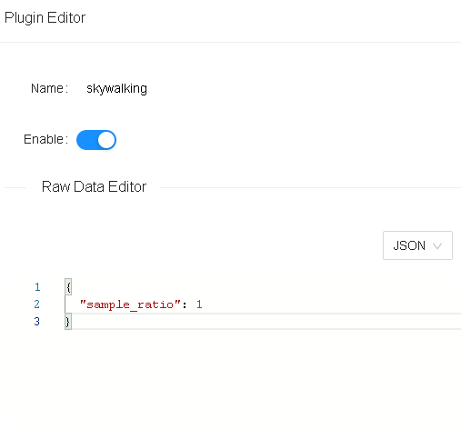

<!--
#
# Licensed to the Apache Software Foundation (ASF) under one or more
# contributor license agreements.  See the NOTICE file distributed with
# this work for additional information regarding copyright ownership.
# The ASF licenses this file to You under the Apache License, Version 2.0
# (the "License"); you may not use this file except in compliance with
# the License.  You may obtain a copy of the License at
#
#     http://www.apache.org/licenses/LICENSE-2.0
#
# Unless required by applicable law or agreed to in writing, software
# distributed under the License is distributed on an "AS IS" BASIS,
# WITHOUT WARRANTIES OR CONDITIONS OF ANY KIND, either express or implied.
# See the License for the specific language governing permissions and
# limitations under the License.
#
-->

## Description

The `skywalking` Plugin is used to integrate with [Apache SkyWalking](https://github.com/apache/skywalking).

SkyWalking uses its native Nginx Lua tracer to provide tracing, topology analysis, and metrics from both service and URI perspectives.

APISIX supports HTTP protocol to interact with the SkyWalking server.

## Attributes

| Name         | Type   | Required | Default | Valid values | Description                                                                |
|--------------|--------|----------|---------|--------------|----------------------------------------------------------------------------|
| sample_ratio | number | True     | 1       | [0.00001, 1] | How often to sample the requests. Setting to `1` will sample all requests. |

### Configuring the endpoint

You can configure these attributes on your configuration file (`conf/config.yaml`):

| Name                  | Type    | Default                                | Description                                                                                  |
|-----------------------|---------|----------------------------------------|----------------------------------------------------------------------------------------------|
| service_name          | string  | "APISIX"                               | Service name for SkyWalking reporter.                                                        |
| service_instance_name | string  | "APISIX Instance Name"                 | Service instance name for SkyWalking reporter. Set to `$hostname` to get the local hostname. |
| endpoint_addr         | string  | "http://127.0.0.1:12800"               | SkyWalking HTTP endpoint. For example, `http://127.0.0.1:12800`.                             |
| report_interval       | integer | Value in the SkyWalking client library | Reporting interval time in seconds.                                                          |

You can configure these as shown below:

```yaml title="conf/config.yaml"
plugin_attr:
  skywalking:
    service_name: APISIX
    service_instance_name: "APISIX Instance Name"
    endpoint_addr: http://127.0.0.1:12800
```

### Sample code for upstream configuration

```java title="Java with Spring Boot"
import org.springframework.web.bind.annotation.PathVariable;
import org.springframework.web.bind.annotation.RequestMapping;
import org.springframework.web.bind.annotation.RestController;
import javax.servlet.http.HttpServletRequest;

@RestController
public class TestController {
    @RequestMapping("/uid/{count}")
    public String getUidList(@PathVariable("count") String countStr, HttpServletRequest request) {
       return "OK";
    }
}
```

You can configure the SkyWalking agent while starting your service:

```shell title="agent/config/agent.config"
agent.service_name=yourservername
collector.backend_service=10.110.149.175:11800
```

Then, run the script:

```shell
nohup java -javaagent:/root/skywalking/app/agent/skywalking-agent.jar \
-jar /root/skywalking/app/app.jar \
--server.port=8089 \
2>&1 > /root/skywalking/app/logs/nohup.log &
```

## Enable Plugin

To enable the Plugin, you have to add it to your configuration file (`conf/config.yaml`):

```yaml title="conf/config.yaml"
plugins:
  - ...
  - skywalking
```

Once you do this, a background timer will be created to report data to the SkyWalking OAP server.

Now, you can enable the Plugin on a specific Route:

```shell
curl http://127.0.0.1:9180/apisix/admin/routes/1  -H "X-API-KEY: $admin_key" -X PUT -d '
{
    "methods": ["GET"],
    "uris": [
        "/uid/*"
    ],
    "plugins": {
        "skywalking": {
            "sample_ratio": 1
        }
    },
    "upstream": {
        "type": "roundrobin",
        "nodes": {
            "10.110.149.175:8089": 1
        }
    }
}'
```

<!-- You also can complete the above operation through the web interface, first add a route, then add SkyWalking plugin:

 -->

## Example usage

First, you need to have your SkyWalking server running.

You can run it on Docker by:

```shell
sudo docker run --name skywalking -d -p 1234:1234 -p 12800:12800 --restart always apache/skywalking-oap-server:8.7.0-es6
```

:::tip

By default, SkyWalking uses H2 storage. You can also use Elasticsearch storage instead.

First, install Elasticsearch. You can do it on Docker by running:

```shell
sudo docker run -d --name elasticsearch -p 9200:9200 -p 9300:9300 --restart always -e "discovery.type=single-node" elasticsearch:6.7.2
```

Optionally, you can install Elasticsearch management page, elasticsearch-hq:

```shell
sudo docker run -d --name elastic-hq -p 5000:5000 --restart always elastichq/elasticsearch-hq
```

Once you have Elasticsearch installed, you can start a SkyWalking server by running:

```shell
sudo docker run --name skywalking -d -p 1234:1234 -p 12800:12800 --restart always --link elasticsearch:elasticsearch -e SW_STORAGE=elasticsearch -e SW_STORAGE_ES_CLUSTER_NODES=elasticsearch:9200 apache/skywalking-oap-server:8.7.0-es6
```

:::

You can also install SkyWalking UI to view the data. To run it on Docker:

```shell
sudo docker run --name skywalking-ui -d -p 8080:8080 --link skywalking:skywalking -e SW_OAP_ADDRESS=skywalking:12800 --restart always apache/skywalking-ui
```

You should be able to access the UI from your browser:

<!--  -->

Now if you make requests to APISIX:

```shell
curl -v http://10.110.149.192:9080/uid/12
```

```shell
HTTP/1.1 200 OK
OK
...
```

You should be able to see the topology of all services in your SkyWalking UI:


You should also be able to see traces from all services:


## Delete Plugin

To remove the `skywalking` Plugin, you can delete the corresponding JSON configuration from the Plugin configuration. APISIX will automatically reload and you do not have to restart for this to take effect.

```shell
curl http://127.0.0.1:9180/apisix/admin/routes/1  -H "X-API-KEY: $admin_key" -X PUT -d '
{
    "methods": ["GET"],
    "uris": [
        "/uid/*"
    ],
    "plugins": {
    },
    "upstream": {
        "type": "roundrobin",
        "nodes": {
            "10.110.149.175:8089": 1
        }
    }
}'
```

To completely disable the `skywalking` Plugin, i.e to stop the background report timer, you need to remove the Plugin from your configuration file (`conf/config.yaml`):

```yaml
plugins:
  - ...
  # - skywalking
```
