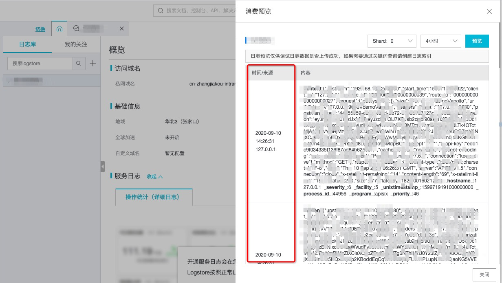

<!--
#
# Licensed to the Apache Software Foundation (ASF) under one or more
# contributor license agreements.  See the NOTICE file distributed with
# this work for additional information regarding copyright ownership.
# The ASF licenses this file to You under the Apache License, Version 2.0
# (the "License"); you may not use this file except in compliance with
# the License.  You may obtain a copy of the License at
#
#     http://www.apache.org/licenses/LICENSE-2.0
#
# Unless required by applicable law or agreed to in writing, software
# distributed under the License is distributed on an "AS IS" BASIS,
# WITHOUT WARRANTIES OR CONDITIONS OF ANY KIND, either express or implied.
# See the License for the specific language governing permissions and
# limitations under the License.
#
-->

## Summary

- [**Name**](#name)
- [**Attributes**](#attributes)
- [**How To Enable**](#how-to-enable)
- [**Test Plugin**](#test-plugin)
- [**Disable Plugin**](#disable-plugin)

## Name

`sls-logger` is a plugin which push Log data requests to ali cloud [Log Server](https://help.aliyun.com/document_detail/112903.html?spm=a2c4g.11186623.6.763.21321b47wcwt1u) with  [RF5424](https://tools.ietf.org/html/rfc5424).

This plugin provides the ability to push Log data as a batch to ali cloud log service. In case if you did not receive the log data don't worry give it some time it will automatically send the logs after the timer function expires in our Batch Processor.

For more info on Batch-Processor in Apache APISIX please refer
[Batch-Processor](../batch-processor.md)

## Attributes

|Name           |Requirement    |Description|
|---------      |--------       |-----------|
|host           |required       | IP address or the Hostname of the TCP server, please reference ali cloud log [Serve List](https://help.aliyun.com/document_detail/29008.html?spm=a2c4g.11186623.2.14.49301b4793uX0z#reference-wgx-pwq-zdb), use IP address instead of domain.|
|port           |required       |Target upstream port, default 10009.|
|timeout        |optional       |Timeout for the upstream to send data.|
| project |required|Ali cloud log service project name，please create in sls before us this plugin.|
| logstore | required |Ali cloud log service  logstore name，please create in sls before us this plugin.|
| access_key_id | required | Ali cloud AccessKey ID, reference [Authorization](https://help.aliyun.com/document_detail/47664.html?spm=a2c4g.11186623.2.15.49301b47lfvxXP#task-xsk-ttc-ry).|
| access_key_secret | required |Ali cloud AccessKey Secret, reference [Authorization](https://help.aliyun.com/document_detail/47664.html?spm=a2c4g.11186623.2.15.49301b47lfvxXP#task-xsk-ttc-ry).|
| include_req_body | required| Boolean value. |
|name           |optional       |A unique identifier to identity the batch processor.|
|batch_max_size |optional       |Max size of each batch.|
|inactive_timeout|optional      |maximum age in seconds when the buffer will be flushed if inactive.|
|buffer_duration|optional       |Maximum age in seconds of the oldest entry in a batch before the batch must be processed.|
|max_retry_count|optional       |Maximum number of retries before removing from the processing pipe line; default is zero.|
|retry_delay    |optional       |Number of seconds the process execution should be delayed if the execution fails; default is 1.|

## How To Enable

The following is an example on how to enable the sls-logger for a specific route.

```shell
curl http://127.0.0.1:9080/apisix/admin/routes/5 -H 'X-API-KEY: edd1c9f034335f136f87ad84b625c8f1' -X PUT -d '
{
    "plugins": {
        "sls-logger": {
            "host": "100.100.99.135",
            "port": 10009,
            "project": "your_project",
            "logstore": "your_logstore",
            "access_key_id": "your_access_key_id",
            "access_key_secret": "your_access_key_secret",
            "timeout": 30000
        }
    },
    "upstream": {
        "type": "roundrobin",
        "nodes": {
            "127.0.0.1:1980": 1
        }
    },
    "uri": "/hello"
}'

```

## Test Plugin

* success:

```shell
$ curl -i http://127.0.0.1:9080/hello
HTTP/1.1 200 OK
...
hello, world
```

* check log in ali cloud log service



## Disable Plugin

Remove the corresponding json configuration in the plugin configuration to disable the `sls-logger`.
APISIX plugins are hot-reloaded, therefore no need to restart APISIX.

```shell
$ curl http://127.0.0.1:9080/apisix/admin/routes/1 -H 'X-API-KEY: edd1c9f034335f136f87ad84b625c8f1' -X PUT -d '
{
    "uri": "/hello",
    "plugins": {},
    "upstream": {
        "type": "roundrobin",
        "nodes": {
            "127.0.0.1:1980": 1
        }
    }
}'
```
