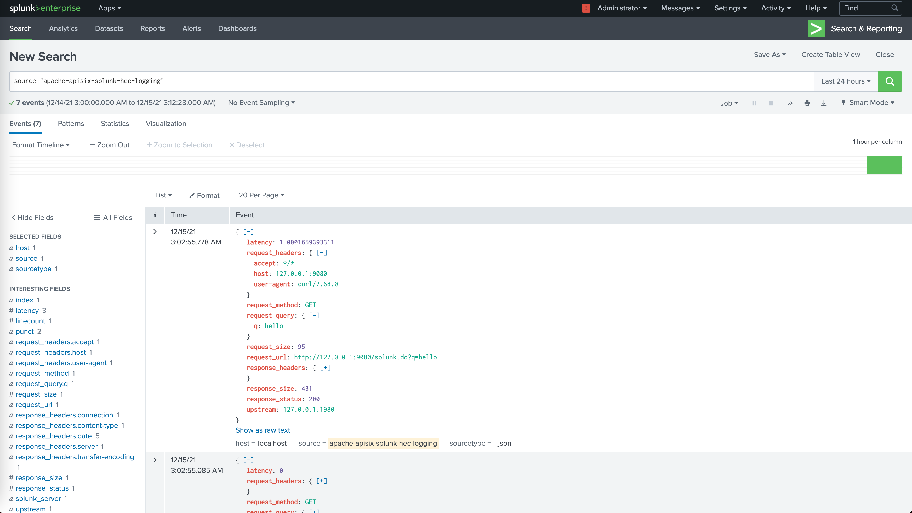

<!--
#
# Licensed to the Apache Software Foundation (ASF) under one or more
# contributor license agreements.  See the NOTICE file distributed with
# this work for additional information regarding copyright ownership.
# The ASF licenses this file to You under the Apache License, Version 2.0
# (the "License"); you may not use this file except in compliance with
# the License.  You may obtain a copy of the License at
#
#     http://www.apache.org/licenses/LICENSE-2.0
#
# Unless required by applicable law or agreed to in writing, software
# distributed under the License is distributed on an "AS IS" BASIS,
# WITHOUT WARRANTIES OR CONDITIONS OF ANY KIND, either express or implied.
# See the License for the specific language governing permissions and
# limitations under the License.
#
-->

## Description

The `splunk-hec-logging` Plugin is used to forward logs to [Splunk HTTP Event Collector (HEC)](https://docs.splunk.com/Documentation/Splunk/8.2.6/Data/UsetheHTTPEventCollector) for analysis and storage.

When the Plugin is enabled, APISIX will serialize the request context information to [Splunk Event Data format](https://docs.splunk.com/Documentation/Splunk/latest/Data/FormateventsforHTTPEventCollector#Event_metadata) and submit it to the batch queue. When the maximum batch size is exceeded, the data in the queue is pushed to Splunk HEC. See [batch processor](../batch-processor.md) for more details.

## Attributes

| Name             | Required | Default | Description                                                                                                                                                                      |
|------------------|----------|---------|----------------------------------------------------------------------------------------------------------------------------------------------------------------------------------|
| endpoint         | True     |         | Splunk HEC endpoint configurations.                                                                                                                                              |
| endpoint.uri     | True     |         | Splunk HEC event collector API endpoint.                                                                                                                                         |
| endpoint.token   | True     |         | Splunk HEC authentication token.                                                                                                                                                 |
| endpoint.channel | False    |         | Splunk HEC send data channel identifier. Read more: [About HTTP Event Collector Indexer Acknowledgment](https://docs.splunk.com/Documentation/Splunk/8.2.3/Data/AboutHECIDXAck). |
| endpoint.timeout | False    | 10      | Splunk HEC send data timeout in seconds.                                                                                                                                         |
| endpoint.keepalive_timeout | False    | 60000      | Keepalive timeout in milliseconds.                                                                                                                                  |
| ssl_verify       | False    | true    | When set to `true` enables SSL verification as per [OpenResty docs](https://github.com/openresty/lua-nginx-module#tcpsocksslhandshake).                                          |
| log_format       | False    |  | Log format declared as key-value pairs in JSON. Values support strings and nested objects (up to five levels deep; deeper fields are truncated). Within strings, [APISIX](../apisix-variable.md) or [NGINX](http://nginx.org/en/docs/varindex.html) variables can be referenced by prefixing with `$`. |

This Plugin supports using batch processors to aggregate and process entries (logs/data) in a batch. This avoids the need for frequently submitting the data. The batch processor submits data every `5` seconds or when the data in the queue reaches `1000`. See [Batch Processor](../batch-processor.md#configuration) for more information or setting your custom configuration.

### Example of default log format

```json
{
    "sourcetype": "_json",
    "time": 1704513555.392,
    "event": {
        "upstream": "127.0.0.1:1980",
        "request_url": "http://localhost:1984/hello",
        "request_query": {},
        "request_size": 59,
        "response_headers": {
            "content-length": "12",
            "server": "APISIX/3.7.0",
            "content-type": "text/plain",
            "connection": "close"
        },
        "response_status": 200,
        "response_size": 118,
        "latency": 108.00004005432,
        "request_method": "GET",
        "request_headers": {
            "connection": "close",
            "host": "localhost"
        }
    },
    "source": "apache-apisix-splunk-hec-logging",
    "host": "localhost"
}
```

## Metadata

You can also set the format of the logs by configuring the Plugin metadata. The following configurations are available:

| Name       | Type   | Required | Default                                                                       | Description                                                                                                                                                                                                                                             |
| ---------- | ------ | -------- | ----------------------------------------------------------------------------- | ------------------------------------------------------------------------------------------------------------------------------------------------------------------------------------------------------------------------------------------------------- |
| log_format | object | False    |  | Log format declared as key-value pairs in JSON. Values support strings and nested objects (up to five levels deep; deeper fields are truncated). Within strings, [APISIX](../apisix-variable.md) or [NGINX](http://nginx.org/en/docs/varindex.html) variables can be referenced by prefixing with `$`. |
| max_pending_entries | integer | False | | Maximum number of pending entries that can be buffered in batch processor before it starts dropping them. |

:::info IMPORTANT

Configuring the Plugin metadata is global in scope. This means that it will take effect on all Routes and Services which use the `splunk-hec-logging` Plugin.

:::

The example below shows how you can configure through the Admin API:

:::note
You can fetch the `admin_key` from `config.yaml` and save to an environment variable with the following command:

```bash
admin_key=$(yq '.deployment.admin.admin_key[0].key' conf/config.yaml | sed 's/"//g')
```

:::

```shell
curl http://127.0.0.1:9180/apisix/admin/plugin_metadata/splunk-hec-logging -H "X-API-KEY: $admin_key" -X PUT -d '
{
    "log_format": {
        "host": "$host",
        "@timestamp": "$time_iso8601",
        "client_ip": "$remote_addr",
        "request": { "method": "$request_method", "uri": "$request_uri" },
        "response": { "status": "$status" }
    }
}'
```

With this configuration, your logs would be formatted as shown below:

```json
[{"time":1673976669.269,"source":"apache-apisix-splunk-hec-logging","event":{"host":"localhost","client_ip":"127.0.0.1","@timestamp":"2023-01-09T14:47:25+08:00","request":{"method":"GET","uri":"/splunk.do"},"response":{"status":200},"route_id":"1"},"host":"DESKTOP-2022Q8F-wsl","sourcetype":"_json"}]
```

## Enable Plugin

### Full configuration

The example below shows a complete configuration of the Plugin on a specific Route:

```shell
curl http://127.0.0.1:9180/apisix/admin/routes/1 -H "X-API-KEY: $admin_key" -X PUT -d '
{
    "plugins":{
        "splunk-hec-logging":{
            "endpoint":{
                "uri":"http://127.0.0.1:8088/services/collector",
                "token":"BD274822-96AA-4DA6-90EC-18940FB2414C",
                "channel":"FE0ECFAD-13D5-401B-847D-77833BD77131",
                "timeout":60
            },
            "buffer_duration":60,
            "max_retry_count":0,
            "retry_delay":1,
            "inactive_timeout":2,
            "batch_max_size":10
        }
    },
    "upstream":{
        "type":"roundrobin",
        "nodes":{
            "127.0.0.1:1980":1
        }
    },
    "uri":"/splunk.do"
}'
```

### Minimal configuration

The example below shows a bare minimum configuration of the Plugin on a Route:

```shell
curl http://127.0.0.1:9180/apisix/admin/routes/1 -H "X-API-KEY: $admin_key" -X PUT -d '
{
    "plugins":{
        "splunk-hec-logging":{
            "endpoint":{
                "uri":"http://127.0.0.1:8088/services/collector",
                "token":"BD274822-96AA-4DA6-90EC-18940FB2414C"
            }
        }
    },
    "upstream":{
        "type":"roundrobin",
        "nodes":{
            "127.0.0.1:1980":1
        }
    },
    "uri":"/splunk.do"
}'
```

## Example usage

Once you have configured the Route to use the Plugin, when you make a request to APISIX, it will be logged in your Splunk server:

```shell
curl -i http://127.0.0.1:9080/splunk.do?q=hello
```

You should be able to login and search these logs from your Splunk dashboard:



## Delete Plugin

To remove the `splunk-hec-logging` Plugin, you can delete the corresponding JSON configuration from the Plugin configuration. APISIX will automatically reload and you do not have to restart for this to take effect.

```shell
curl http://127.0.0.1:9180/apisix/admin/routes/1 -H "X-API-KEY: $admin_key" -X PUT -d '
{
    "uri": "/hello",
    "plugins": {},
    "upstream": {
        "type": "roundrobin",
        "nodes": {
            "127.0.0.1:1980": 1
        }
    }
}'
```
