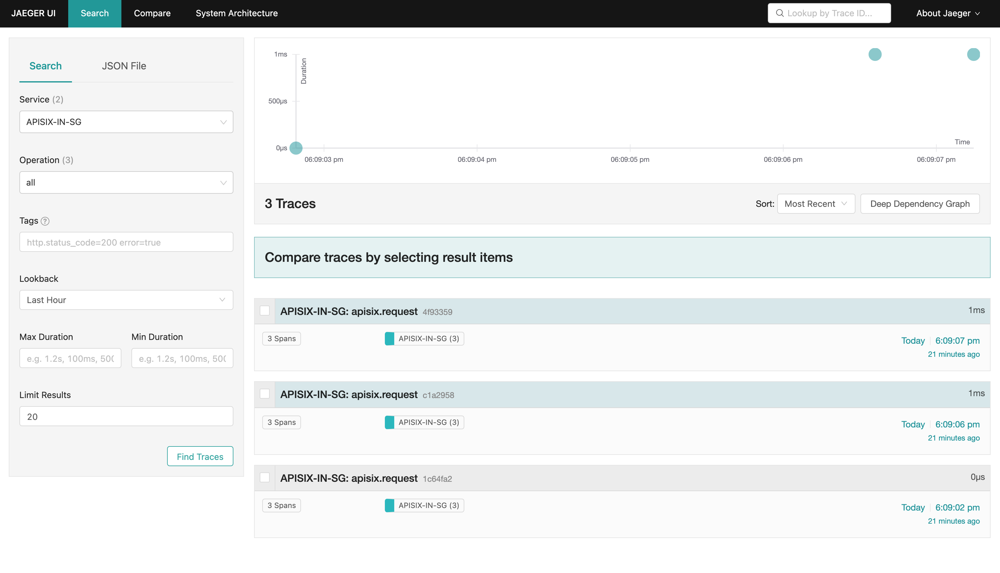

<!--
#
# Licensed to the Apache Software Foundation (ASF) under one or more
# contributor license agreements.  See the NOTICE file distributed with
# this work for additional information regarding copyright ownership.
# The ASF licenses this file to You under the Apache License, Version 2.0
# (the "License"); you may not use this file except in compliance with
# the License.  You may obtain a copy of the License at
#
#     http://www.apache.org/licenses/LICENSE-2.0
#
# Unless required by applicable law or agreed to in writing, software
# distributed under the License is distributed on an "AS IS" BASIS,
# WITHOUT WARRANTIES OR CONDITIONS OF ANY KIND, either express or implied.
# See the License for the specific language governing permissions and
# limitations under the License.
#
-->

## Description

[Zipkin](https://github.com/openzipkin/zipkin) is an open source distributed tracing system. The `zipkin` Plugin supports collecting and reporting traces to Zipkin collector based on the [Zipkin API specification](https://zipkin.io/pages/instrumenting.html).

It also works with [Apache SkyWalking](https://skywalking.apache.org/docs/main/latest/en/setup/backend/zipkin-trace/#zipkin-receiver) and [Jaeger](https://www.jaegertracing.io/docs/1.31/getting-started/#migrating-from-zipkin), both of which support Zipkin [v1](https://zipkin.io/zipkin-api/zipkin-api.yaml) and [v2](https://zipkin.io/zipkin-api/zipkin2-api.yaml) APIs. It can also work with other tracing systems adapted to Zipkin v1/v2 API format.

## Attributes

| Name         | Type    | Required | Default        | Valid values | Description                                                                     |
|--------------|---------|----------|----------------|--------------|---------------------------------------------------------------------------------|
| endpoint     | string  | True     |                |              | Zipkin HTTP endpoint. For example, `http://127.0.0.1:9411/api/v2/spans`.        |
| sample_ratio | number  | True     |                | [0.00001, 1] | How often to sample the requests. Setting to `1` will sample all requests.      |
| service_name | string  | False    | "APISIX"       |              | Service name for the Zipkin reporter to be displayed in Zipkin.                 |
| server_addr  | string  | False    | `$server_addr` |              | IPv4 address for the Zipkin reporter. You can specify your external IP address. |
| span_version | integer | False    | 2              | [1, 2]       | Version of the span type.                                                       |

Each traced request will create the spans shown below:

```
request
├── proxy: from the beginning of the request to the beginning of header filter
└── response: from the beginning of header filter to the beginning of log
```

For older versions (set `span_version` attribute to `1`), these spans are created:

```
request
├── rewrite
├── access
└── proxy
    └── body_filter
```

:::note

The span name doesn't represent the corresponding Nginx phase.

:::

### Sample code for upstream configuration

```go title="Go with Gin"
func GetTracer(serviceName string, port int, enpoitUrl string, rate float64) *zipkin.Tracer {
    // create a reporter to be used by the tracer
    reporter := httpreporter.NewReporter(enpoitUrl)
    // set-up the local endpoint for our service host is ip:host

    thisip, _ := GetLocalIP()

    host := fmt.Sprintf("%s:%d", thisip, port)
    endpoint, _ := zipkin.NewEndpoint(serviceName, host)
    // set-up our sampling strategy
    sampler, _ := zipkin.NewCountingSampler(rate)
    // initialize the tracer
    tracer, _ := zipkin.NewTracer(
        reporter,
        zipkin.WithLocalEndpoint(endpoint),
        zipkin.WithSampler(sampler),
    )
    return tracer
}

func main(){
    r := gin.Default()

    tracer := GetTracer(...)

    // use middleware to extract parentID from http header that injected by APISIX
    r.Use(func(c *gin.Context) {
        span := this.Tracer.Extract(b3.ExtractHTTP(c.Request))
        childSpan := this.Tracer.StartSpan(spanName, zipkin.Parent(span))
        defer childSpan.Finish()
        c.Next()
    })

}
```

## Enable Plugin

The example below enables the Plugin on a specific Route:

:::note
You can fetch the `admin_key` from `config.yaml` and save to an environment variable with the following command:

```bash
 admin_key=$(yq '.deployment.admin.admin_key[0].key' conf/config.yaml | sed 's/"//g')
```

:::

```shell
curl http://127.0.0.1:9180/apisix/admin/routes/1  -H "X-API-KEY: $admin_key" -X PUT -d '
{
    "methods": ["GET"],
    "uri": "/index.html",
    "plugins": {
        "zipkin": {
            "endpoint": "http://127.0.0.1:9411/api/v2/spans",
            "sample_ratio": 1,
            "service_name": "APISIX-IN-SG",
            "server_addr": "192.168.3.50"
        }
    },
    "upstream": {
        "type": "roundrobin",
        "nodes": {
            "127.0.0.1:1980": 1
        }
    }
}'
```

<!-- You also can complete the above operation through the web interface, first add a route, then add zipkin plugin:

 -->

## Example usage

You need to have your Zipkin instance running. You can run Zipkin on Docker by running:

```shell
docker run -d -p 9411:9411 openzipkin/zipkin
```

Now, when you make requests, it will be updated in Zipkin:

```shell
curl http://127.0.0.1:9080/index.html
```

```shell
HTTP/1.1 200 OK
...
```

You can then open up the Zipkin UI on your browser at [http://127.0.0.1:9411/zipkin](http://127.0.0.1:9411/zipkin):


### Reporting traces to Jaeger

The Plugin also supports reporting traces to Jaeger. First, you have to have Jaeger running.

To run it on Docker:

```shell
docker run -d --name jaeger \
  -e COLLECTOR_ZIPKIN_HOST_PORT=:9411 \
  -p 16686:16686 \
  -p 9411:9411 \
  jaegertracing/all-in-one:1.31
```

Similar to configuring for Zipkin, create a Route and enable the Plugin:

```
curl http://127.0.0.1:9180/apisix/admin/routes/1  -H "X-API-KEY: $admin_key" -X PUT -d '
{
    "methods": ["GET"],
    "uri": "/index.html",
    "plugins": {
        "zipkin": {
            "endpoint": "http://127.0.0.1:9411/api/v2/spans",
            "sample_ratio": 1,
            "service_name": "APISIX-IN-SG",
            "server_addr": "192.168.3.50"
        }
    },
    "upstream": {
        "type": "roundrobin",
        "nodes": {
            "127.0.0.1:1980": 1
        }
    }
}'
```

Now, when you make requests, it will be updated on Jaeger:

```shell
curl http://127.0.0.1:9080/index.html
```

```shell
HTTP/1.1 200 OK
...
```

You can access the Jaeger UI to view the traces in endpoint [http://127.0.0.1:16686](http://127.0.0.1:16686):




## Delete Plugin

To remove the `zipkin` Plugin, you can delete the corresponding JSON configuration from the Plugin configuration. APISIX will automatically reload and you do not have to restart for this to take effect.

```shell
curl http://127.0.0.1:9180/apisix/admin/routes/1 -H "X-API-KEY: $admin_key" -X PUT -d '
{
    "methods": ["GET"],
    "uri": "/index.html",
    "plugins": {
    },
    "upstream": {
        "type": "roundrobin",
        "nodes": {
            "127.0.0.1:1980": 1
        }
    }
}'
```

## Variables

The following nginx variables are set by zipkin:

- `zipkin_context_traceparent` -  [W3C trace context](https://www.w3.org/TR/trace-context/#trace-context-http-headers-format), e.g.: `00-0af7651916cd43dd8448eb211c80319c-b9c7c989f97918e1-01`
- `zipkin_trace_id` - Trace Id of the current span
- `zipkin_span_id` -  Span Id of the current span

How to use variables? you have to add it to your configuration file (`conf/config.yaml`):

```yaml title="./conf/config.yaml"
http:
    enable_access_log: true
    access_log: "/dev/stdout"
    access_log_format: '{"time": "$time_iso8601","zipkin_context_traceparent": "$zipkin_context_traceparent","zipkin_trace_id": "$zipkin_trace_id","zipkin_span_id": "$zipkin_span_id","remote_addr": "$remote_addr","uri": "$uri"}'
    access_log_format_escape: json
plugins:
  - zipkin
plugin_attr:
  zipkin:
    set_ngx_var: true
```

You can also include a trace_id when printing logs

```print error log
log.error(ngx.ERR,ngx_var.zipkin_trace_id,"error message")
```
